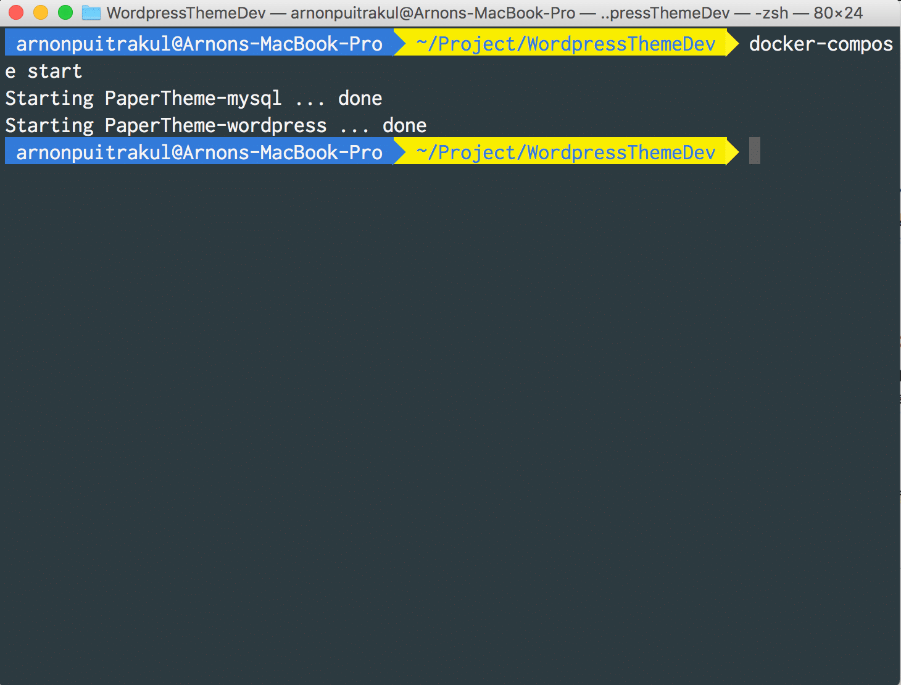
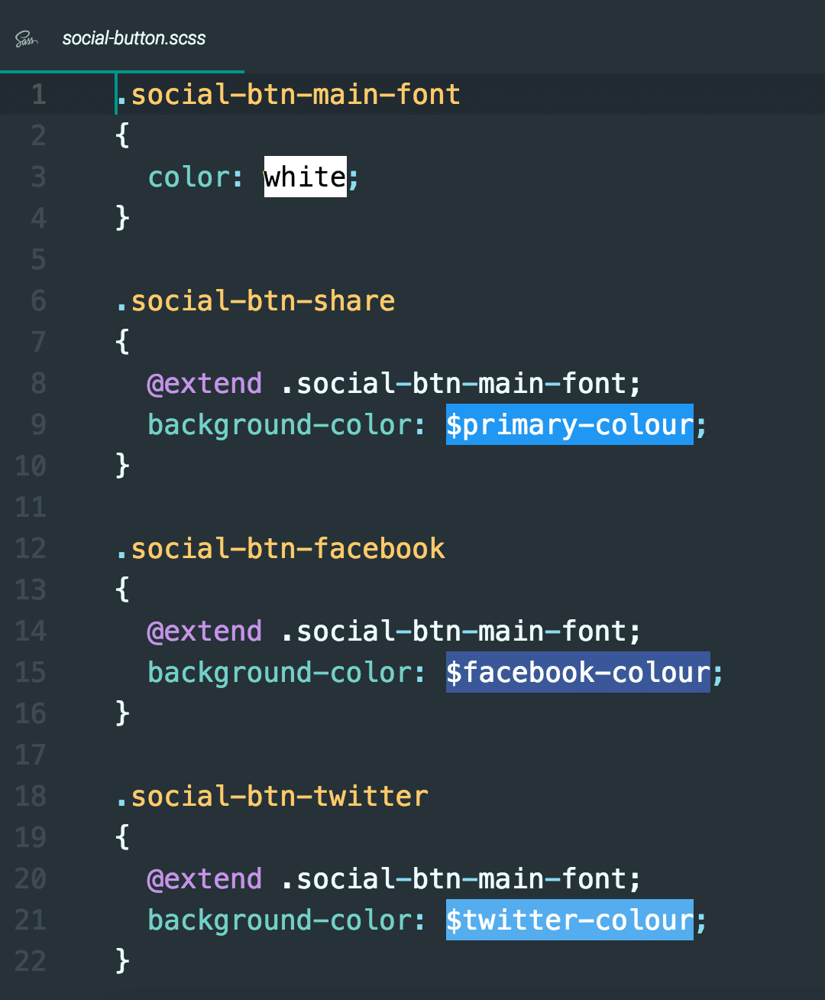
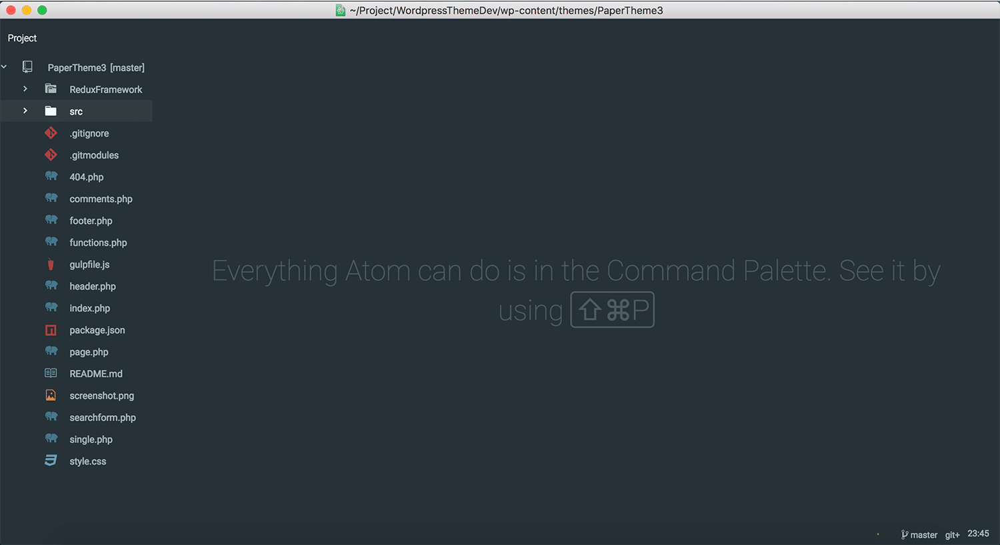

จากตอนที่แล้ว ก็ได้เล่าไปแล้วว่า กว่าจะมาเป็น Design ของ PaperTheme ที่ทุกคนเห็นกัน มันมาจากไหน และมีหลักการอะไรอยู่เบื้องหลังบ้าง มาในวันนี้ เราจะมาดูอีกขั้นตอนที่สำคัญในการทำกันบ้าง นั่นคือ การเขียนมันออกมานั่นเอง

## ส่วนประกอบของ Wordpress Theme
เหนือสิ่งอื่นใด การเขียน Wordpress Theme มันต่างจากการเขียนเว็บแบบปกติตรงที่ Wordpress นั้นมีกฏในการสร้าง Theme มันไม่ใช่ว่าเราต้องมานั่งเขียนหน้า index แล้วไปหน้าโน้นหน้านี้เอง มันมีข้อกำหนดอยู่ ซึ่งมันเรียกว่า **Wordpress Theme Hierarchy** ลองดูตามรูปภาพด้านล่างนี้

เราจะเห็นว่า วิธีที่ Wordpress อ่านไฟล์มันไม่ได้อ่านมั่ว ๆ มันมีรูปแบบอยู่ โดยมันจะเริ่มอ่านจากไฟล์ **index.php** ก่อน แล้วค่อยวิ่งไปหาหน้าอื่น ๆ (ถ้ามี) ฉะนั้น Theme ของเราสามารถมีแค่ Stylesheet ที่บอกรายละเอียดของ Theme และ index.php ก็ได้ แต่ถ้าอยาก Custom ให้มากกว่านั้นเราก็ต้องเขียนหน้าอื่น ๆ ลงไปด้วย

ซึ่ง PaperTheme นี้ก็ไม่ได้เขียนอะไรมากมายขนาดนั้นหรอกอยู่กันแค่ในระดับสีน้ำเงินเท่านั้นเอง ส่วนที่เหลือมันน่าจะอยู่ในลักษณะของ Child Theme ที่แต่ละเว็บไซต์เมื่อเอาไปใช้แล้วอยากจะ Custom หน้าก็สามารถเพิ่มไฟล์เหล่านั้นลงไปใน Child Theme ได้

## เริ่มวางระบบ

เนื่องจาก เราจะเขียน Wordpress Theme กัน เราก็ต้องเตรียมสภาพแวดล้อมของเครื่องเราให้พร้อมก่อน บางคนอาจจะใช้พวก Xampp แล้วลง Wordpress อะไรก็ว่ากันไป หรือบางคนอาจจะหักดิบ ลงมันลงไปในเครื่องตรง ๆ เลยก็แล้วแต่ แต่ Xampp และการลงไปตรง ๆ เลยมันก็จะยุ่งเวลาผมต้องเปลี่ยนสภาพแวดล้อมไปทำงานอื่น

**Docker** เลยเป็น Hero ที่เข้ามาจัดการในเรื่องนี้ ก็จริง ๆ มันไม่ยากเลยนะ เพราะ Docker มี **Wordpress Image** สำเร็จรูปให้เราใช้แล้ว เราแค่ต่อ **Wordpress Container** เข้ากับ **Database Container** ก็เรียบร้อยแล้ว ซึ่งผมเลือกใช้ **MySQL** เพราะว่า มันเบสิกดี เลยเอามาใช้ แต่ถ้าจะให้สั่ง Start ทีละกันก็ไม่ใช่เรื่องเหมือนกัน ไม่ได้ว่างขนาดนั้น

**docker-compose** เลยเข้ามาช่วยเหลือเราในรอบนี้ เราก็แค่เขียนสิ่งที่เราต้องการลงไปใน docker-compose.yml แล้วเรียก **docker-compose up** ทุกอย่างก็เรียบร้อยแล้ว

ด้านบนนี้เป็น docker-compose สำหรับการเตรียม Environment ของบนเครื่องผมเอง เพื่อน ๆ สามารถเอาไปใช้ได้ตามสะดวก

ถ้าใครได้เข้าไปดูใน Source Code จะเห็นว่า Stylesheet เราไม่ได้ใช้ CSS ตรง ๆ เลย ผมมาใช้ SCSS ที่เป็น Pre-Compiled Stylesheet แทนเพราะด้วย ความซับซ้อนของ Style ที่เขียนด้วย ทำให้ใช้ SCSS เวลาอ่านหรือแก้ไขน่าจะสะดวกกว่า

เพื่อให้อ่านได้ง่ายยิ่งขึ้น ผมได้แบ่งมันออกมาเป็นส่วน ๆ ด้วยกัน เช่น Font ก็จะจัดการเรื่องของ Global Font ของ Theme เลยว่าใช้ Font-Family อะไรขนาดยังไงบ้าง และอีกหลาย ๆ ส่วนก็คล้าย ๆ กัน และทั้งหมดจะถูก Link โดยไฟล์ที่ชื่อว่า **style.scss **อีกทีนึง

และสุดท้ายเพื่อให้ SCSS แปลงร่างเป็น CSS ที่ Web Browser อ่านรู้เรื่องผมก็เลือกใช้ Gulp ที่เป็น Task Runner กับ Plugin ที่ช่วย Compile SCSS และจัดการให้ออกมาเป็น Stylesheet ที่พร้อมใช้ ถ้าสงสัยว่ามันทำอะไรบ้างให้เข้าไปดูที่ไฟล์ **gulpfile.js** ในนั้นจะเป็น Script ที่บอกว่ามันทำอะไรไปบ้าง

หลัก ๆ มันก็จะมีประมาณนี้ในการเตรียมความพร้อมของเครื่องมือที่ใช้ในการพัฒนา อ่อลืมไป ผมใช้ **Atom** เป็น **Text Editor ในการทำงานนะ** กับ Plugin นิด ๆ หน่อยเพื่อให้เราเขียนได้ง่ายขึ้น เผื่อใครสงสัย

## มาเริ่มเขียนกัน

ขั้นตอนนี้เป็นขั้นตอนที่เรียกได้ว่า กินเวลาน้อยที่สุดแล้ว เพราะทุกอย่างมันถูกวางแผนออกมาล่วงหน้าแล้วว่าจะเขียนหน้าไหนยังไงบ้าง ก็หลัก ๆ ก็ไม่มีอะไรจะเล่า

ถ้าสมมุติว่าใครที่ไม่เคยเขียน Wordpress Theme มาก่อน เวลาเขียนเราจะต้องเริ่มเขียนจากด้านขวาของ **Theme Hierarchy**

เวลาเขียนผมก็จะสั่ง **gulp watch** ทิ้งเอาไว้ เวลาเราแก้ไขพวกไฟล์ที่เรากำหนดไว้ (ในที่นี้จะเป็นไฟล์ .scss ทั้งหมด) ตัว gulp มันจะไปสั่งรัน Task ที่เรากำหนดไว้ทันที ซึ่งก็คือ Compile Stylesheet นั่นเอง ก็จะช่วยลดเวลาในการทำงานของเราได้เยอะมาก ๆ

กับอีกอย่างที่ยังเซ็งกับความฉลาดน้อยของตัวเองไม่หาย นั่นคือเรื่องของ Cache เวลาเราเทสหน้าเว็บ แล้วเราแก้ Stylesheet ไปแล้วมันก็จะออกมาเป็นชื่อไฟล์เดิม เวลา Web Browser ไปเรียก มันก็จะนึกว่ามันคือไฟล์เดิม แล้วเอาหน้าของเก่ามาแสดงผล ก็ว่าละแก้เท่าไหร่มันก็ไม่ไปสักที วิธีแก้คือเรา **Force Reload** มันซะเลยโดยการกด **CMD+Shift+R** ใน Google Chrome ซะก็จบ

## AMP is supported out of the box

**AMP** หรือ **Accelerated Mobile Page** ที่จะเข้ามาช่วยทำให้หน้าเว็บของเราโหลดเร็วขึ้นเยอะมาก ๆ ซึ่งจริง ๆ แล้วเว็บ arnondora.in.th ก็ได้ใช้ AMP มานานเกือบ ๆ ปีได้แล้ว แต่ไม่ได้พูดถึงบ่อยนัก มาในรอบนี้ผมทำหน้าให้มันเป็น AMP แต่แรกเลย ก็จะช่วยได้ในเรื่อของ Performance ที่โหลดได้เร็วขึ้นไปอีก และช่วยเรื่อง **SEO** **(Search Engine Optimisation)** แต่ตอนนี้ (ในเวอร์ชั่น 1.0) PaperTheme ยังไม่ได้ Support AMP แบบสมบูรณ์ เต็ม 100% แต่จะปรับปรุงในเวอร์ชั่นต่อ ๆ ไปนะ

## Optimisation

หลังจากที่ผมเขียนเสร็จ และอัพขึ้นไปบน Production ผมก็นั่งรอดู Traffic และ Performance Indicator ต่าง ๆ ดูปรากฏว่ามันแย่กว่า Theme อันเก่าเยอะมากเลย โดยเฉพาะเรื่องของ **Bandwidth** และ **Performance** ที่กินเยอะมากขึ้น จะจำทำยังไงดี

เลยนึกขึ้นมาได้อีกวิธี แต่มันก็ไม่ใช่วิธีที่แก้ปัญหาที่ต้นเหตุเท่าไหร่หรอก นั่นคือการทำ Cache ก็ทำให้ Bandwidth กินน้อยลงอยู่นะ ซึ่งตอนนี้ผมก็ย้ายเว็บของผมขึ้นไปบน Cloudflare เรียบร้อยแล้ว ซึ่งผลจากที่ดูมาสักพักคือ จำนวน Bandwidth ที่กินจาก Server น้อยลงพอสมควร เพราะ Cloudflare มัน Cache ให้หมดเลย

แผนในระยะยาวคือ จะทำการ Optimise ตัว Code ให้มีความซับซ้อนที่น้อยลงไปอีก เพื่อลดเวลาในการวาดหน้าของ Web Browser ซึ่งจะเห็นผลมากตอนที่เราเปิดหน้าเว็บไซต์ผ่านอุปกรณ์ที่มีพลังในการประมวลผลต่ำ เรื่องนี้เขียนไปเดี๋ยวจะยาวเกิน ไว้แยกออกมาเป็นอีกตอน ตอนที่เขียนเสร็จแล้วละกัน

เอาเป็นว่า มันจะไปเกี่ยวกับ การวาง Tag ต่าง ๆ เพราะเวลา Web Browser ได้ไฟล์หน้า html มาแล้วมันจะต้องทำการ Parse ให้เป็นภาษาที่มันเข้าใจก่อน เอาไปลง DOM ที่เป็น Tree แล้วค่อยเอาไปวาดออกมา ฉะนั้น ถ้าเราสามารถลดตรงนี้ได้ หน้าของเราก็จะโหลดได้เร็วขึ้นอีก ประกอบกับ การแยก Content ออกจากตัวหน้า ทำให้ Cache ทำงานได้ดีขึ้น และ ทำให้ User เห็น Content  ได้ไวขึ้น (ทั้งที่ ส่วนที่เหลือของหน้าจะยังโหลดไม่เสร็จก็ตาม)

**แต่เวลาจะแก้หน้าเว็บนี่เข้าไป Purge Cache แทบไม่ทัน ฮ่า ๆ ตอนแรกเปิดมาก็ งง ว่าทำไมหน้ามันไม่เปลี่ยนหว่า อ่อ Cache Cloudflare มันดุมาก**

## That's PaperTheme Redux!
และนี้ก็คือทั้งหมดของ **Part Programming และซีรีส์เบื้องหลัง ในการเขียน Theme รอบนี้** จริง ๆ แล้วมันไม่มีอะไรเลย แค่เขียนตามที่ Wordpress บอกไว้ แล้วเอา Design ที่เราทำมาเติมลงไป

และถ้าอยากใส่อะไรเพิ่ม ก็แค่เติมลงไป เท่านั้นเอง ฉะนั้นการสร้าง Wordpress Theme เราสามารถใส่จินตนาการของเราได้แบบไม่สิ้นสุด และมันก็ไม่ได้ยากเลย ถ้าใครอยากจะลองแนะนำให้ลองเลย

**งานขาย !** ตอนนี้ PaperTheme Redux ก็ถูก Public ขึ้น [Github][9] แล้วลองเข้ามาดูกันได้ ถ้าพบปัญหาก็แจ้ง Issue ได้เลยนะครับ

[9]: https://github.com/arnondora/wordpress-paper-theme-redux
