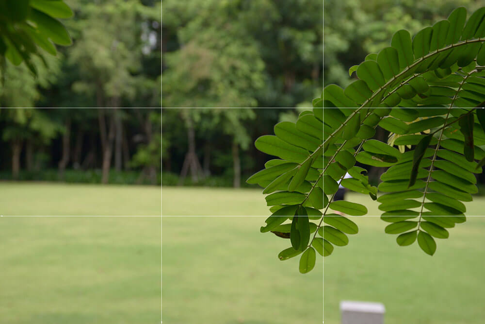
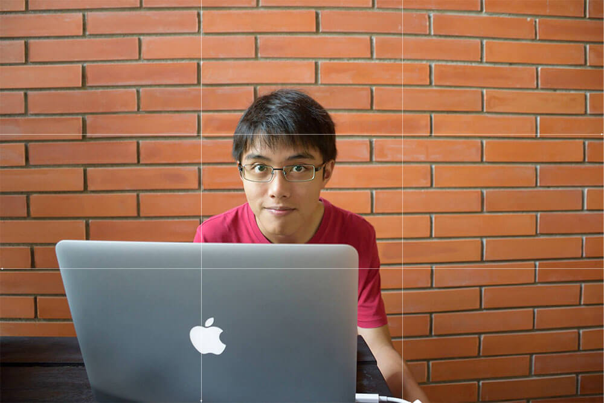

หลังจากเมื่อตอนที่แล้ว เราได้รู้จักกับ การตั้งค่าแสง และการโฟกัสไปแล้ว วันนี้เราจะมาต่อกันในเรื่องใหม่แต่ก็ไม่ใหม่มากนั่นคือ การวัดค่าแสง

## การวัดแสง คืออะไร ?
ตอนที่ผมเล่นกล้องใหม่ๆ ก็ลองปรับอะไรเล่นๆ แล้วลองถ่ายไปเรื่อย ตามขีดที่บอกว่า ภาพสว่างหรือมืด นั่นเลย แต่เคยกันมั้ยว่า ถ่ายมาแล้ว เฮ้ย! ทำไมมันสว่าง ไม่ก็มืดจังเลย นั่นเพราะว่า เราเซ็ตจุดวัดแสงยังไม่ถูกต้อง
ในการปรับจุดวัดแสง เอากล้องส่วนใหญ่เลยจะมี 3 แบบ

* **Matrix Metering** แบบแรกคือ เราจะให้กล้องวัด เฉลี่ยทั้งภาพ ว่าทั้งภาพเลยมีแสงมากแค่ไหน จะเหมาะกับการถ่ายสิ่งที่มีความเปรียบต่างของแสงค่อนข้างต่ำ เช่น ภาพวิว เป็นต้น
* **Centre Weighted Metering** ด้วยโหมดนี้ เราจะให้กล้องวัด ทั้งภาพเช่นกัน แต่จะให้ความสำคัญของตรงกลางภาพมากกว่า โดยปกติ เราจะใช้โหมดนี้ตอนที่เราอยากให้ Content ตรงกลางของภาพมันเป็นจุดสนใจ
* **Spot Metering** โหมดนี้จะต่างจากชาวบ้านเขาเลย เพราะว่า มันจะสนใจแค่จุดที่เราตั้งเท่านั้น เพราะฉะนั้นมันจะเป็นโหมดที่ ถ้า 2 โหมดข้างบนเมื่อกี้มันวัดไม่ได้ เราก็จะใช้โหมดนี้แหละในการวัดแทน เพราะเราสามารถกำหนดจุดได้อย่างอิสระนั่นเอง
สรุปแล้ว ถ้าเราอยู่ในสถานการณ์จริง ให้เราดูว่า วัตถุที่เราจะถ่ายนั้นมีความเปรียบต่างของแสงมากแค่ไหน ถ้าไม่มากก็ให้ใช้ Matrix Metering ในการวัด แต่ถ้าวัตถุกับฉากมีความเปรียบต่างกับแสงเยอะ แล้ววัตถุอยู่ตรงกลางก็ให้เราใช้ Centre Weighted Metering วัดแทน และสุดท้าย ถ้าเกิดมีความเปรียบต่างแสงมาก และวัตถุ ไม่ได้อยู่ตรงกลางก็ให้เราใช้ Spot Metering วัดแสง

เรามาลองเปรียบเทียบกัน ภาพแรก ผมเลือกใช้เป็น Centre Weighted Matering ในการวัดแสง ถ้าเราลองดูในภาพ จะเห็นว่าข้างหน้านั้นจะมีความสว่างมากกว่า เพราะมีหลอดไฟอยู่ ทำให้ตัวแบบ (คือเราเองแหละ) ดูมืดอย่างที่เห็นในภาพ

ผมเลยเปลี่ยนโหมด เป็น Spot Metering จะเห็นได้ว่า ตัวผมดูสว่างขึ้นและ แต่ดูที่ข้างหน้าตัวผม จะเห็นเลยว่า มันสว่างเกินไป นี่ก็เป็นตัวอย่างนึงของการเลือกโหมดวัดแสงให้เหมาะกับภาพเรา จริงๆ แล้วภาพที่ผมต้องการนั่นคือภาพแรกนะ ถึงแม้มันจะมืด แต่สิ่งที่เราจะเน้นจริงๆ นั้นไม่ใช่ตัวผม แต่เป็นสิ่งที่อยู่ข้างหน้าผมนั่นเอง เพราะฉะนั้น Centre Weighted Metering ก็เป็นทางเลือกที่ดีตัวนึงในการเลือก จริงๆ แล้วในสถานการณ์นี้ เรายังสามารถใช้ Spot Metering ในการวัดได้เหมือนกัน แต่ตอนนั้นไม่ได้ถ่ายมาเหมือนกัน เลยไม่มีให้ดู

## White Balance
ถ้าเราแปลเป็นภาษาไทยมันก็น่าจะแปลว่า สมดุลสีขาว ซึ่งนั่นแหละ มันคือความหมายของ White Balance มันคือการตั้งค่าแสงสีขาว ถ้านึกภาพไม่ออก ลองหยิบกล้องโทรศัพท์ของเราขึ้นมา แล้วลองเอาไปส่องกับ เสื้อสีขาวของเราดูก็ได้ จะเห็นได้ว่า เสื้อที่เรามองเห็นว่าขาว แต่กล้องอาจจะมองเห็นไปเป็นอีกสีนึง
ถ้ายังนึกภาพไม่ออกอีก ให้ลองเดินไปหาห้องที่มีไฟสีแปลกๆ เช่นสีฟ้า สีเหลือง ดู กล้องมันจะเห็นว่า เสื้อของเรามันเป็นสีเหลืองไม่ใช่สีขาวเหมือนที่เรามองเห็น
สรุปๆ เลยว่าการปรับ White Balance เป็นการปรับโทนสีของภาพให้ตรงกับความเป็นจริงที่เรามองเห็น หรือไม่ก็ตามความต้องการของตัวคนถ่ายภาพเอง จริงๆ แล้วเราสามารถที่จะปรับ White Balance ได้ในโปรแกรมคอมพิวเตอร์หลังจากถ่ายก็ได้เหมือนกัน แต่จงพึงระลึกไว้ว่า ถ้าเราเลือกสิ่งที่เหมือนจะออกเหลืองเช่น Sunny ตัวกล้องมันจะปรับให้ออกน้ำเงิน เพราะว่า กล้องมันจะเอาน้ำเงินมาตัดกับเหลืองให้พอดี ง่ายๆ มันคือสลับกันอะ

## องค์ประกอบภาพ
เรื่องนี้ก็เป็นเรื่องที่สำคัญอีกเรื่องของการถ่ายภาพเลยทีเดียว แค่มุมเปลี่ยนไปก็ทำให้ความหมายของภาพเปลี่ยนได้แล้ว และการจัดองค์ประกอบภาพมีหลายหลักการมากมาย แต่วันนี้ขอยกมาแค่แบบเดียวล่ะกัน นั่นคือ **กฏสามส่วน**
กฏสามส่วนคืออะไร ? มันคือกฏที่บอกว่า ไม่ว่าภาพจะเป็นแนวตั้งหรือแนวนอน ให้เราตีเส้นให้แบ่งด้านล่ะ 3 ส่วนเท่าๆ กัน หลังจากตีเส้นแล้ว จะเกิดจุดตัดขึ้นมา 4 จุด เจ้า 4 จุดนั้นแหละ ที่เป็นจุดที่เหมาะสำหรับการวางวัตถุ หรือตัวแบบที่เราต้องการให้ความสำคัญกับมัน พูดแบบนี้อาจจะ งง ลองมาดูตัวอย่างกัน

มาที่ภาพแรกกันก่อนเลย ภาพนี้จุดที่ต้องการจะเน้นคือ ใบไม้ทางด้านขวา ผมเลยเลือกจุดโฟกัสไปที่ใบไม้ และเล็งให้ใบไม้มันอยู่ริมๆ ไว้ ลองคิดดูถ้าเราถ่ายมามีแต่ใบไม้ มันก็จบที่ใบไม้ บอกอะไรไม่ได้มาก แต่ที่ผมเลือกถ่ายแบบนี้ เพราะว่า ผมอยากให้มันไม่ได้จบที่ใบไม้ แต่มันยังมีอย่างอื่นอยู่ข้างหลังด้วย ภาพนี้ก็ยังไม่ดีจริงๆ เพราะว่า จะเห็นว่า เราเว้นที่ว่างทางด้านขวามากเกินไป ในการถ่ายตามกฏนี้ ให้เราพยามกะน้ำหนักให้มันอยู่ตรงกลางด้วย อย่าเว้นที่ว่างมากเกินไป

มาที่รูปนี้กัน ผมชอบมาก ดูเหมือนแมวนั่งคิดเลย ลองมาดูกันที่องค์ประกอบกันก่อน ผมจัดให้แมวมันอยู่ที่ตรงจุดตัดพอดีเลย (จริงๆ มันก็ไม่เป๊ะหรอก แต่เราสามารถมา Crop ได้) แต่ภาพนี้ถึงแม้ว่า ผมจะเว้นทางด้านขวามากไปหน่อย แต่ว่าผมต้องการสื่อว่า แมวกำลังมองออกไปข้างนอกเลยจัดมาเป็นแบนี้พอดี รูปนี้เสียอย่างเดียวนั่นคือ เจ้าป้ายนี่แหละ มันทำให้ดึงความสนใจจากแมวไปได้เยอะมาก มากเกินไป

มาดูกันที่ภาพนี้กันบ้าง มันเป็นภาพจาก EP ที่แล้วนั่นเอง รอบนี้เราจะมาดูมันในเรื่องขององค์ประกอบกันบ้าง ในการถ่ายภาพวิว แบบนี้ คำแนะนำคือให้ใช้เจ้ากฏสามส่วนนี่แหละ แต่ไม่ได้ให้ดูที่จุดตัด แต่ให้เราดูที่สัดส่วนของพื้น และท้องฟ้า ถ้าเราต้องการเน้นท้องฟ้าให้เรากดไปเลย ฟ้า 2 ส่วน ดิน 1 ส่วน แต่กลับกัน ถ้าเราต้องการที่จะเน้นพื้นดิน ก็ให้เรากด ฟ้า 1 ส่วนและพื้น 2 ส่วน ลองมาดูที่รูปนี้กันบ้าง การแบ่งส่วน ผมเน้นไปที่ตัวอาคาร แต่ทำไมท้องฟ้าดันเยอะกว่าพื้นอีกล่ะ นั่นเพราะว่า บางครั้งเราก็สามารถแหกกฏได้ เช่นรูปนี้เป็นต้น ถ้าผมถ่ายฟ้า 1 พื้น 2 ก็จะทำให้อาคารอันนี้ดูเหมือนกับโดนดึงออกข้างมากเกินไป ผมเลยให้พื้นที่ของฟ้ามากขึ้นหน่อย เพราะว่าจะได้ทำให้อาคารไม่ได้ดูใหญ่เกินไปนั่นเอง

ภาพนี้ก็เช่นกัน ตัวผมไม่ได้อยู่ในจุดตัดเลย แต่กลายเป็นคอมซะงั้น ทั้งที่จริงๆ แล้วผมต้องการเน้นที่ตัวเอง ทำให้ภาพนี้ก็ไม่ได้เป็นตามกฏสามส่วน แต่ก็ยังดูโอเคได้อยู่ เพราะฉะนั้นอย่างที่บอก เราแหกกฏได้ แต่ต้องมีเหตุผลว่า ทำไมเราถึงทำแบบนั้น และอีกเรื่องนึง การใช้กฏที่ว่ามาไม่ได้แปลว่า เราจะได้ภาพที่สวยทุกภาพ บางครั้งการทำตามกฏก็ทำให้ได้ภาพที่สวย แต่ในบางครั้ง เราก็ต้องเลือกที่จะแหกกฏและทำตามใจเราบ้าง เพราะการถ่ายรูปเป็นศิลปะ ไม่ใช่คณิตศาสตร์ที่จะมีคำตอบตายตัวของมัน
และแล้วก็จบแล้วกับเรื่องของ หลังกล้อง รอบหน้าเราจะมาดูกันว่า หลังจากที่เราถ่ายรูปมาแล้ว เราจะมาทำอะไรกับรูปในคอมต่อกัน ค่าต่างๆ ที่เราปรับมันคืออะไร Histogram คืออะไร ? ครั้งหน้าเราจะมาดูกัน สำหรับวันนี้ ขอให้สนุกกับการถ่ายภาพนะครับ และสวัสดีครับ
