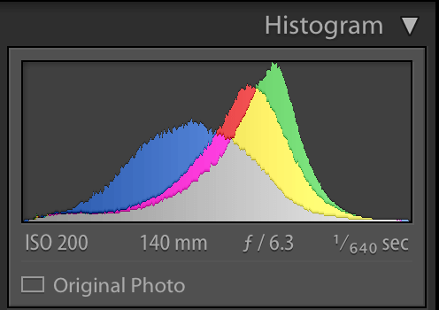
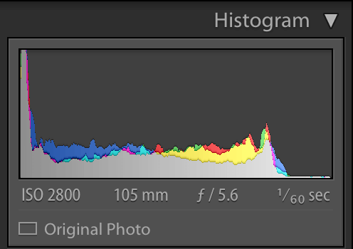

หลังจากที่ 2 ตอนที่ผ่านมา เราก็จบการทำงานกันหลังเลนส์แล้ว ในตอนนี้เราจะมาต่อกันว่า หลังจากที่เราถ่ายรูปมาเสร็จแล้ว เราจะเอารูปมาทำอะไรในคอมพิวเตอร์ต่อ เราจะมาเรียนรู้กันว่า ค่าที่เราปรับ ๆ กันอยู่มันคืออะไร บางคนบอกว่า
"อื้ม ปรับ ๆ ไปเถอะ มันสวยก็เอาอันนั้นแหละ"
อันนี้ผมไม่เถียงครับ เพราะงานถ่ายรูปมันก็เป็นงานศิลปะเนอะ ไม่มีใครปิดใครถูกทั้งนั้นแหละ แต่ที่จะมาสอนนั่นเพราะว่า รู้ไว้ก็ไม่เสียหาย และสำหรับใครที่กำลังเรียนเรื่อง Image Processing ก็น่าจะเข้ามาอ่านกันนะครับ อาจจะมีแนม ๆ เรื่องพวกนี้เข้ามาบ้าง เข้าเรื่องกันเลยดีกว่า

#### มากันที่เรื่องแรกกันก่อน กับ Workflow
ถ้าเราถ่ายรูปสัก 2-3 รูป มันก็ไม่จำเป็นต้องมี Workflow ก็ได้ แต่ลองมาถ่ายเยอะ ๆ ดูสิครับ แล้วจะรู้เลยว่า ถ้าไม่จัด Workflow ดี ๆ เราจะเสียเวลาไปกับการแต่งรูปไปเยอะเลย ซึ่งผมเองก็เป็นหนึ่งในนั้น เสียเวลาให้มันเยอะมาก ๆ ดังนั้นเราเลยต้องมาจัดกันหน่อย Workflow ของผมก็จะเป็นดังนี้

* **Import รูปลงคอมก่อน เป็น Raw** - ขั้นตอนนี้ก็ไม่มีอะไร ง่าย ๆ แค่เอารูปเข้าคอม
* **เลือกรูป ที่เสียทิ้ง** - วิธีที่ใช้เลือกคือ มันดูไม่โอเค เช่น หลุดโฟกัส อะไรพวกนี้ก็เลือกทิ้งไปเลย
* เอาไปเข้าโปรแกรมของตัวกล้อง - ถ้าเราใช้ Nikon มันก็จะมีโปรแกรม Capture NX-D อะไรพวกนี้ ทำให้เราปรับพวก Picture Control ได้เลยชอบ แต่ก็ต้องมาจบที่ Export เป็น JPG
* **Import เข้า Lightroom** - หลังจากที่เราได้ JPG จาก Capture-NX มาแล้ว เราก็เอามาเข้า Lightroom เพื่อเก็บไฟล์ก่อน
* **แต่งให้ดูเหมือนจริง** - ใน Step แรกของการแต่งของผมก็คือ พยายามปรับ WB และ Exposure ก่อน เพื่อให้มันดูเป็นธรรมชาติและเหมือนจริงที่สุด เหตุผลจะบอกในข้อถัดไป
* **แต่งตามใจฉัน** - อันนี้มันจะอยู่ในเวลาที่เราต้องการจะใช้รูป เพราะว่า เวลาเราใช้รูปแต่ล่ะครั้ง อารมณ์ที่เราได้จากรูปมันไม่เหมือนกัน เพราะฉะนั้นจากข้อที่แล้ว เราเลยต้องทำให้รูปมันดูเป็นธรรมชาติที่สุดก่อน และพอเวลาจะใช้ก็เอาไปแต่งให้มันเข้ากับงานที่เราจะเอาไปใช้
ทั้งหมดที่ว่ามานั่นคือ Workflow ในการทำรูปของผม ซี่งบางคนก็อาจจะทำเหมือนผม แต่บางคนก็ไม่ ก็ขึ้นกับเราเองว่า จะทำยังไง

#### About Histogram
หลังจากที่เกริ่นไปยาว เข้าเรื่องกันสักที ประเด็นหลัก ๆ ของวันนี้เลยนั่นคือเรื่อง Histogram ซึ่งมันเป็นเรื่งอที่ค่อนข้างจะพื้นฐานเลยในการแต่งภาพ เพราะว่า Histogram มันจะบอกถึงปริมาณแสงโดยรวมของภาพ ว่าภาพเราสว่างเกินไป หรือมืดเกินไป เราก็สามารถใช้ Histogram ในการดูได้ เราลองมาดูนิยามของมันจริง ๆ กันเลยดีกว่า

**Histogram คือกราฟที่แสดงความถี่ของ Pixel ที่แสดงแสงในช่วงต่าง ๆ ตั้งแต่ 0-255 **

เจ้า Histogram มันก็บอกอะไรเราได้หลาย ๆ อย่างมาก ๆ เช่นสามารถบอกได้ว่า ภาพเราสว่างไปหรือมืดไป มีสัดส่วนของสีนั้นนี่โน้นมากแค่ไหน ทำให้เราตัดสินใจอะไรได้ง่ายขึ้นเยอะเลย เพราะว่า เราเชื่อในสิ่งที่เราเห็นในจอไม่ได้โดยเฉพาะเรื่องสี จอนี้แต่งออกมาอาจจะดูดี แต่พอเอาไปเปิดอีกจอเท่านั้นแหละ สีนี่ซีดไปเลยก็มี เพราะฉะนั้นเชื่อ Histogram นี่แหละ ดีที่สุดแล้ว ต่อไปเราจะมาดู Histogram แต่ล่ะแบบ แล้วลองมาวิเคราะห์กัน

แบบแรก น่าจะเป็นแบบที่ใครหลาย ๆ คนชอบเลย เพราะว่า มันอยู่ตรงกลางพอดี แต่ถ้าจะให้เจ๋งจริง มันต้องเป็นเหมือนภูเขาเลยสูงพอดี มีการกระจายตัวของเม็ดแสงที่สม่ำเสมอ คำว่าแต่งให้ธรรมชาติของผมก็คือให้ Histogram มันใกล้เคียงกับแบบนี้แหละ ไม่มืดไป ไม่สว่างไป (แต่ในความเป็นจริงแล้ว มันอาจจะไม่ได้เป็นตามนี้หรอก ถ้าเราไปถ่ายภาพในที่ที่มันมืดหรือสว่างมากเกินไป ก็ต้องปรับตามความเหมาะสม)

แบบถัดมานั้นคือ มันเบ้ไปทางซ้าย จากในรูปเบ้หนักเลย ทำให้รายละเอียดบางส่วนของภาพหายไป เพราะว่า มันมืดไปหมดนั่นเอง วิธีแก้ปัญหานั่นคือการดัน Exposure ขึ้น แต่บางทีมันก็มืดไป เกินกว่าจะดันได้ก็ ต้องขอแสดงความเสียใจด้วย... แต่ถ้ามันเป็นแบบนี้แล้วก็ออกมาสวยก็มีเยอะแยะ เช่นพวกภาพพลุ หรือพระอาทิตย์ตกอะไรแบบนี้ อย่างที่บอกคือ การถ่ายภาพไม่มีถูกไม่มีผิด มันเป็นงานศิลปะ

และแบบสุดท้าย ก็จะตรงกันข้ามกับแบบที่แล้ว นั่นคือมันสว่างมากเกินไป ถ้าเกิดภาพมันดูไม่โอ จริง ๆ วิธีแก้คือการปรับ Exposure ลง แต่ในที่นี้มันเบ้นิดเดียว และส่วนใหญ่มันก็ดูโอเคอยู่แล้ว จริง ๆ ภาพนี้ไม่น่าเอามาเป็นตัวอย่างเลย ฮ่า ๆ เพราะว่ามันยังแย่ไม่พอ แต่หาให้ไม่ได้จริง ๆ ไม่ได้เก็บพวกแบบนั้นไว้ ถ้านึกว่าภาพแบบไหนควรจะเบ้ขวาไม่ออกให้นึกถึงภาพที่สว่างแบบขาวเลย นั่นแหละ เป็นตัวอย่างที่ดีเลยแหละ
สรุปแล้ว วันนี้เราก็ได้เรียนรู้คร่าว ๆ เกี่ยวกับการทำงานหลังจากที่เราได้ภาพมาแบบพื้น ๆ และได้รู้เกี่ยวกับ Histogram แบบพื้น ๆ นิด ๆ หน่อย ๆ พอหอมปาก หอมคอ ในตอนหน้าเราจะมาดูกันว่า มีการปรับค่าอะไรบ้างท่ีจะส่งผลกับ Histogram ของเราบ้าง และการปรับแก้ WB สำหรับวันนี้ก็ เจอกันใหม่ตอนหน้า สวัสดีครับ
