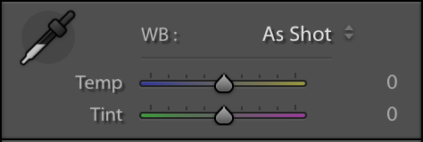

หลังจากตอนที่แล้วก็หายไปนานเลย สารภาพบาปว่า ตอนนั้นงานยุ่งมาก จนลืมไปเลย ตอนนี้ปิดเทอมแล้ว จะมาไล่เขียน Tutorial ที่ค้างไว้ให้จบกันเลย คราวที่แล้ว เราได้เรียนรู้ **การดู Histogram** กันไป วันนี้ เราจะมาดูอีกหนึ่งเรื่องที่สำคัญของการ Process ภาพนั่นคือ **White Balance**

## White Balance คืออะไร
White Balance (WB) หรือภาษาไทยเราเรียกว่า **สมดุลแสงขาว** (อ่านแล้วแปลก ๆ มาก !) แต่ก่อนที่จะไปดูความหมาย เราต้องเข้าใจก่อนว่า แสงที่เรามองเห็นนั้นมี **อุณหภูมิ** ที่แตกต่างกัน สังเกตไม่ยาก เราลองดูมองออกไปนอกหน้าต่างตอนกลางวัน และเทียบกับ แสงจาก Flash จากโทรศัพท์ของเราดู เราจะเห็นว่า แต่ละแหล่งกำเนิดแสงให้แสงที่มี อุณหภูมิ หรือสีที่แตกต่างกันออกไป
อุณหภูมิของแสง เราจะวัดกันในหน่วย **เคลวิน** ยิ่งมาก แสงจะออกสีไปทาง **ส้ม** มากขึ้น กลับกัน ถ้าน้อยจะออกไปทาง **ฟ้า** จนถึง **ดำ**

## ทำไมถึงต้องปรับ White Balance
หลัก ๆ แล้วเหตุผลที่เราปรับ WB น่าจะมีอยู่แค่ 2 เหตุผลดังนี้

* **ปรับให้ตรง** - เป็นการปรับภาพเพื่อให้ตรงกับ สภาพ ตอนที่เราถ่าย เช่น เราถ่ายสิ่งของที่มี สีขาว ออกมา แต่ภาพออกมามันหลายเป็น สีส้ม ซะงั้น เราสามารถปรับ WB เพื่อให้ อุณหภูมิ หรือ สีมันตรงนั่นเอง
* **ปรับ เสริมอารมณ์** - เป็นการปรับภาพเพื่อ **เสริมอารมณ์** ให้กับภาพ ภาพบางภาพถ้าเราปรับ WB ให้ตรง ภาพจะดูจืดชืด และไร้อารมณ์ แต่เมื่อเราเติม WB ให้มันติดเหลือง ๆ นิดหน่อย ก็อาจจะทำให้ภาพดูมี อารมณ์ ขึ้นมาก็ได้เช่นกัน อันนี้ก็ขึ้นอยู่กับคน Process ภาพเลย

## การปรับ White Balance
ถ้าเข้ามาใน Lightroom ให้เรากด **D** เพื่อเข้า Develop Mode จากนั้นเข้าไปดูที่แถบทางด้านขวา จะเห็นอยู่ Section นึงเขียนว่า **WB** ในนั้นจะมีค่าให้เราปรับอยู่ 2 ตัวนั่นคือ **Temp** และ **Tint**

Temp คือการปรับอุณหภูมิสีในภาพ ดังที่อธิบายไปตอนแรก ส่วน Tint จะเป็นการปรับแก้ สีเขียว และ สีชมพู ในบางกรณี เวลาเราถ่ายออกมา มันจะไม่ติดเหลือง ติดฟ้า แต่มันกลายเป็น ติดเขียว แทน ซึ่งการปรับ Tint จะช่วยแก้ปัญหานี้ได้ ภาพด้านล่างเป็นการเปรียบเทียบระหว่างต้นฉบับและภาพที่ผ่านการปรับ WB แล้ว

## สรุป
การปรับ WB จะช่วยให้ภาพของเราสามารถสร้างอารมณ์ และเรื่องราวของภาพได้มากขึ้น หรืออาจจะทำให้ภาพของเรามีสีที่ถูกต้อง**คล้าย**กับตอนที่เราถ่ายได้ สำหรับตอนนี้ก็ไม่น่าจะมีอะไรมาก มีเพียงเท่านี้แหละ แล้วพบกันใหม่ตอนหน้า สวัสดีนาจา
