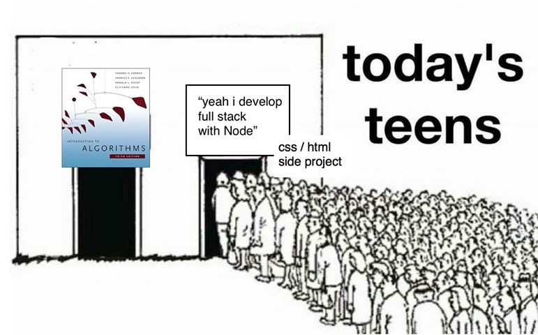

เรื่องของเทคโนโลยีจัดว่าเป็นเรื่องที่มาไวและไปไวกว่า มาเร็วเคลมเร็วของประกันซะอีก ดูอย่างเรื่องของ Framework ที่ปัจจุบันผุดขึ้นยังกะดอกเห็ด

ทำให้ผมนึกถึงประโยคหนึ่งจากหนังเรื่องเก่ามากเรื่องหนึ่งนั่นคือ The Matrix กับประโยคที่ผมก็จำไม่ค่อยได้แล้ว ที่ The Oracle พูดว่า โปรแกรมมันจะถูกลบเมื่อมีโปรแกรมที่ดีกว่ามาแทนที่มัน จากที่เราเห็นในปัจจุบัน ที่เทคโนโลยีเดินหน้าไปเร็วมาก ก็มีเทคโนโลยีถูกเปลี่ยนผ่านไปมาเช่นกัน ดังนั้นการเรียนรู้อยู่ตลอดเวลาถือเป็นเรื่องที่ทุกคนควรกระทำ และ Skill การเรียนรู้ด้วยตัวเองก็เป็นหนึ่งใน Skill Set ที่ผมมองว่าคนสมัยนี้ควรจะมี วันนี้ผมจะพาไปดูว่า เวลาผมจะเรียนรู้เทคโนโลยีใหม่ ๆ ผมคิดอะไรบ้าง (เอาไปปรับใช้กับอย่างอื่นก็ได้นะ นอกจากเทคโนโลยี)

## Start with WHY

<iframe src="//giphy.com/embed/EdW1pjRlyMTCM" width="480" height="348" frameborder="0"></iframe>เวลาผมจะคิดอะไร ผมจะเริ่มจากคำว่า **"ทำไม"** ก่อน เพราะผมเชื่อว่าทุกอย่างที่เกิดขึ้นมา มันล้วนมีเหตุผลของมัน เทคโนโลยีก็เช่นกัน การที่มันจะถูกสร้างขึ้นมา โอเคแหละมี Programmer เขียนมันขึ้นมา แต่คำถามที่พวกเราไม่ค่อยจะถามกันคือ

> ทำไมเขาถึงเขียนขึ้นมา ?

ผมมองว่านี่น่าจะเป็นจุดบอดจุดหนึ่งของคนไทยเลยก็ว่าได้ ที่จะแค่เรียนว่ามันทำงานยังไงแล้วจบ แต่ไม่เคยสนใจว่า **ทำไมมันถึงเกิดขึ้นมา ?** อ่านมาถึงจุดนี้ อาจจะเริ่ม งง แล้วใช่มั้ยว่า ทำไมเราต้องรู้ด้วยว่าของพวกนั้นมัน ทำไมมันถึงเกิดขึ้นมา ที่ผมคิดแบบนี้มันเป็นเรื่องว่า ของทุกอย่างนอกจากมันจะมีเหตุผลในการถูกสร้างแล้ว มันยังถูกสร้างให้เหมาะสมกับการตอบโจทย์ หรือเหตุผลของมันนั่นเอง นั่นทำให้เรารู้ต่อไปว่า เจ้าสิ่ง ๆ นั้นมันเหมาะกับงานแบบไหน ผมขอยกตัวอย่างใกล้ ๆ ตัวผมละกัน เป็นเรื่องของ **Laravel** กับ **Laravel Lumen** ที่จริง ๆ แล้วมันก็เป็น Framework เหมือนกัน แต่มันก็มีส่วนที่ต่างกันอยู่ ถ้าเราเรียนแค่ว่า มันทำอะไรได้ เราก็จะจบแค่ว่ามันเป็น Framework เหมือนกัน แต่ถ้าเราเริ่มที่จะเข้าใจว่าทำไมมันถูกสร้างมา เราก็จะเข้าใจว่า อ๋อ Laravel มันใหญ่เกินไปสำหรับการสร้าง API Server นะ เลยเอา Laravel มาย่อส่วนกลายเป็น Lumen นะอะไรทำนองนั้น

## การลงมือทำคือวิธีที่ดีที่สุด

<iframe src="//giphy.com/embed/ZvLUtG6BZkBi0" width="480" height="366" frameborder="0"></iframe>

ผมเห็นบางคนเวลาเริ่มเรียนอะไรใหม่ ๆ เขามักจะหาอะไรมาอ่าน มาดู แล้วก็จบ ไม่ได้ลงมือทำตาม หลังจากวันนั้นเมื่อต้องเอามาใช้จริงกลับทำออกมาไม่ได้ซะงั้น หรือบางเคสใช้ Boilerplate จนชิน แล้วพอเวลาต้องเข้าไปปรับแก้ลึก ๆ ก็กลายเป็นว่าง่อยไปเลยก็มี การลงมือทำจริงถือเป็นวิธีการเรียนรู้ที่ดีวิธีหนึ่ง แน่นอนว่าดีกว่า แค่นั่งดูแน่ ๆ

เชื่อว่าใครที่เขียน React ทุกคนต้องรู้จักสิ่งที่เรียกว่า **create-react-app** แน่นอน สำหรับใครที่ไม่รู้จัก มันคือ Boilerplate สำหรับการสร้าง Web App ผ่าน React แรก ๆ ที่ผมหัดใช้ก็ใช้ผ่านเจ้า Boilerplate นี่แหละ แต่พอเขียน ๆ ไปกลับรู้สึกว่าตัวเองไม่เข้าใจเลยว่า ทำไมมันถึงต้องเขียนแบบนั้น ทำไมต้องทำแบบนี้ จนวันนึงก็ตัดสินใจลองเริ่มตั้งแต่ต้นเลย เริ่มตั้งแต่ Webpack ไปยัน React เองทั้งหมดเลย มันช่วยอยู่นะ จากที่เป็นนกแก้วนกขุนทองเขียนตาม Document ไป กลับเข้าใจเลยว่า แต่ละบรรทัดมันมายังไง และมันทำอะไร

## พื้นฐานต้องมา !

แต่การที่จะเข้าใจเทคโนโลยีใหม่ ๆ หลาย ๆ อย่างมันมาจากรากฐานเดียวกัน เหมือนกับเวลาตอนแรก ๆ ที่เราชอบพูดกันว่า Java เนี่ยก็มี Data Structure หลาย ๆ อย่างมาให้เราพร้อมใช้แล้ว แล้วเราจะเรียนไปทำไม ? แต่พอเวลาเราเริ่มเรียนรูปเทคโนโลยีใหม่ ๆ มากขึ้นแล้ว เราจะเห็นเลยว่า ทั้งหมดมันก็มาจากรากฐานเดียวกัน ฉะนั้นการที่จะเข้าใจเทคโนโลยีใหม่ ๆ อย่างแจ่มแล้วละก็ เรื่องของพื้นฐานก็สำคัญ มีคนเคยบอกผมว่า **ถ้ารากมันมั่นคง เราจะต่ออะไรลงไปรากมันก็ไม่ทำให้ล้มแน่นอน**

## คุณเข้าใจมันจริง ๆ รึเปล่า

<iframe src="//giphy.com/embed/sM4ALgO3D7F8k" width="480" height="251" frameborder="0"></iframe>

เรื่องต่อไปนี้เกิดจากข้อสังเกตของผม และประสบการณ์ที่เจอนะ คือเวลาหลาย ๆ คนเรียนเทคโนโลยีใหม่ ๆ ยังไม่ทันคล่องเลย ก็หยิบมันมาใช้กับ Production แล้ว ทำให้เกิดปัญหานานับประการที่ทั้งแก้ได้และไม่ได้ ส่งผลให้ปัญหาที่แก้ไม่ได้สักทีมันเรื้อรังขึ้นไปเรื่อย ๆ ไม่รู้สิผมมักจะเรียกว่า **"เห่อห_อย"** อะ ฉะนั้นสิ่งที่สำคัญมาก ๆ คือ ใจเย็น ๆ ค่อย ๆ ศึกษาเรียนรู้ข้อดี ข้อเสียของมันไปเรื่อย ๆ เหมือนเวลาเราจะคบใครอะ ไม่ใช่ว่าเจอกันคืนนี้ __ กันคืนเดียวก็แต่งงานกันเลย เลือกพลาดคือพลาด เลือกดีก็ถือว่าโชคดี แต่อย่าให้ชีวิตเราขึ้นกับโชคเลย เราเลือกได้ ผมเคยได้ยินคำพูดนึงนานมาละเขาบอกว่า การเขียนโปรแกรมสักตัวขึ้นมา มันก็เหมือนกับการแต่งงาน เลือกพลาดก็ชิบหาย เลือกดีก็ดีไป จริง ๆ ตัวอย่างด้านบนก็เอามาจากคำพูดนี้แหละ ถ้าใครอ่านแล้วนึกออกไปใครเป็นคนพูดไว้ก็มา Comment หน่อยอยากรู้ ลืมไปแล้วเหมือนกัน

## สรุป

ก่อนจะไปไกลกว่านี้ผมขอสรุปก่อนเลยละกัน ในการที่เราจะเรียนรู้อะไรสักอย่างให้เร็ว ไม่ใช่แค่เทคโนโลยีนะอะไรก็ได้เลยแหละ มันเริ่มจากเราตั้งคำถามกับมันก่อนว่า ทำไม? แล้วอย่าแค่อ่านกับดู ให้เราลงมือทำมันด้วย และอย่าลืมพื้นฐาน เพราะมันจะเป็นรากฐานที่สำคัญที่ทำให้เราเข้าใจอะไรใหม่ ๆ ใน Field นั้นได้ง่ายขึ้น และที่สำคัญ ขอให้มั่นใจว่า เราเข้าใจมันจริง ๆ ค่อย ๆ เรียนรู้ไป แล้วค่อยเอามาใช้จริง ๆ จัง ๆ กับงานของเรา และนี่ก็คือทั้งหมดที่ผมใช้ในการเรียนรู้อะไรใหม่ ๆ เพราะทุกอย่างเดี๋ยวนี้มันมาเร็วไปเร็ว เราก็ต้องปรับตัวตามให้ทัน เพราะมีคนเคยบอกผมไว้ว่า การเรียนรู้มีไม่สิ้นสุด ตอนนี้ผมเชื่อแล้ว มันมีอะไรออกมาให้เราติดตามและค้นหาทุกวัน แต่สิ่งหนึ่งที่ผมอยากให้ทุกคนเป็นกันคือ คนที่สร้างสรรค์อะไรใหม่ ๆ อย่ามัวที่เสพสิ่งที่คนอื่นสร้างให้มาก แล้วหันมาสร้างสิ่งใหม่ ๆ ตอบแทนกลับไปด้วย โดยใช้สิ่งที่คนอื่นสร้างมาให้นี่แหละ มันก็เหมือนกับการส่งต่อ การพัฒนาองค์ความรู้ของพวกเราให้ก้าวไกลขึ้นไปอีก นี่แหละหมดละ บรัยเจอกันในบทความหน้าเน้อ **PS.** ถ้ามีเรื่องอะไรอยากรู้เกี่ยวกับ Tip ของการเขียนโปรแกรมถามมาได้นะ จะได้เอามาเขียนเป็นตอนต่อไป
