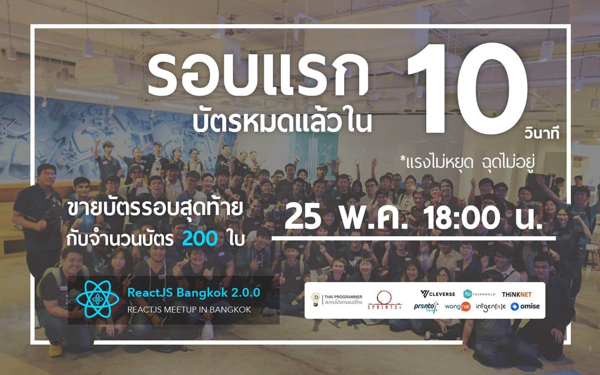
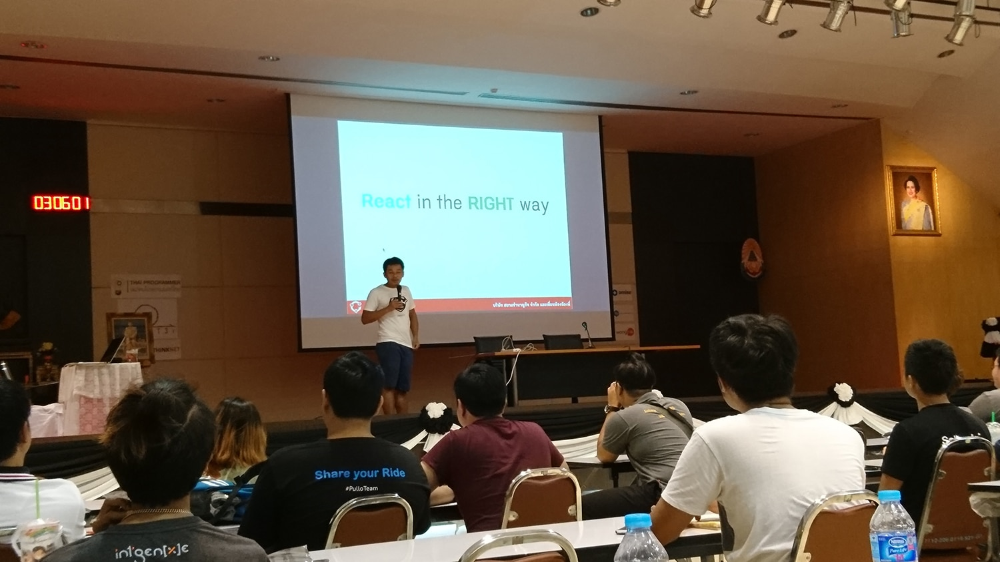
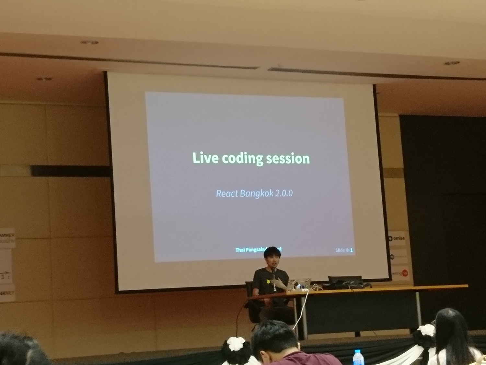
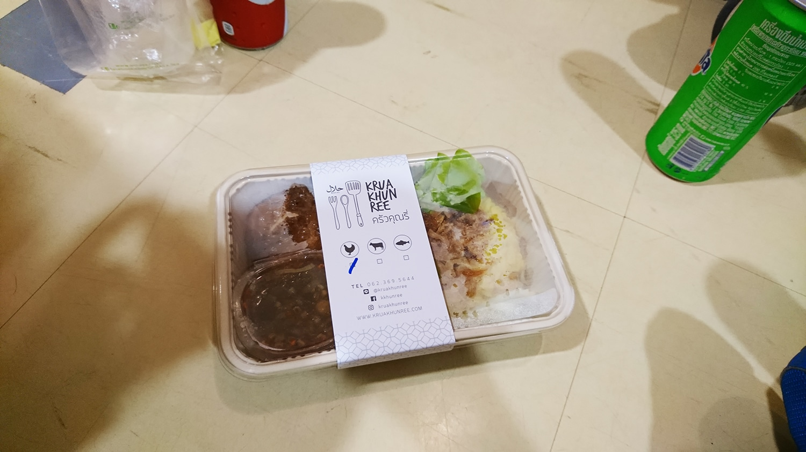
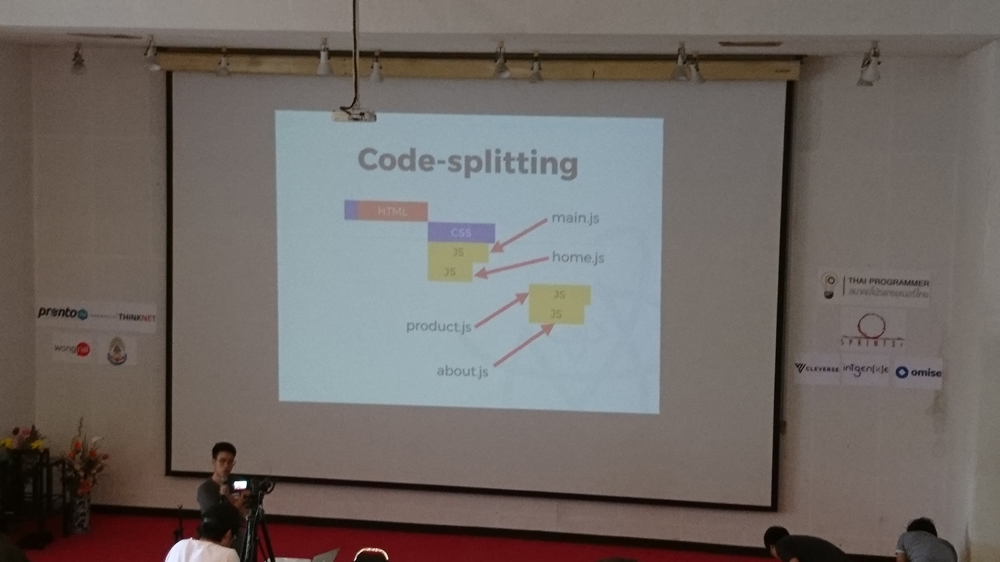
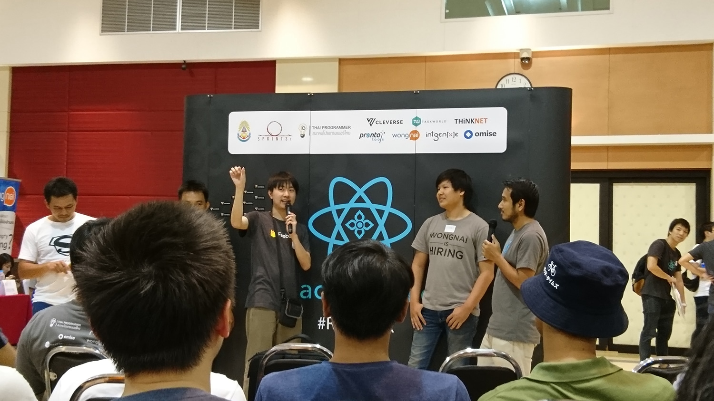
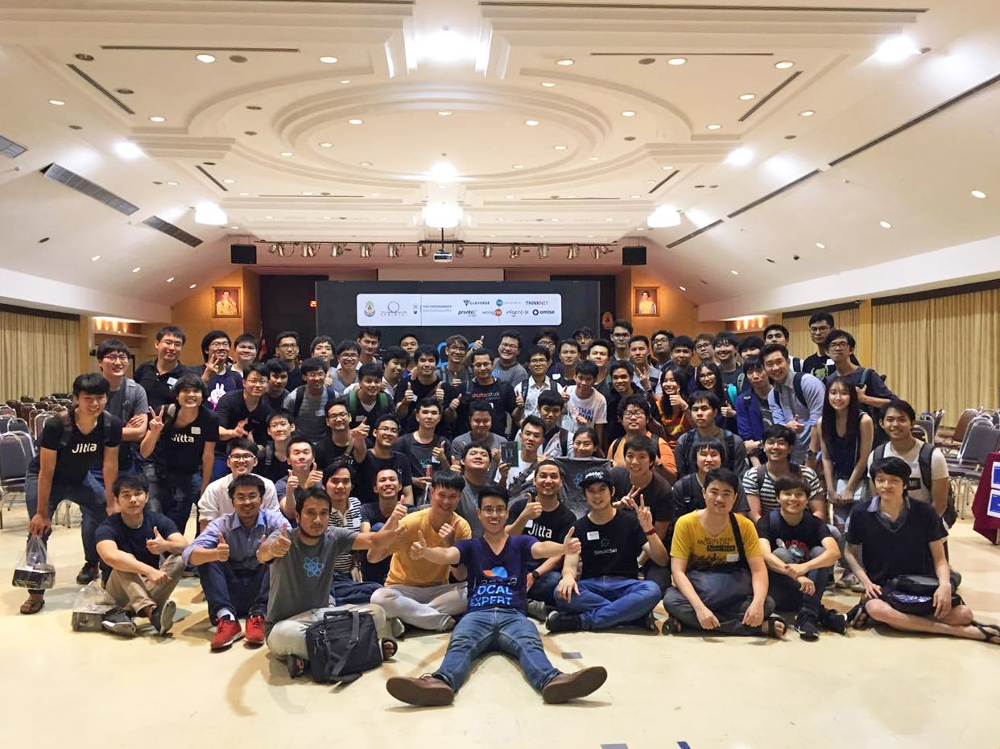

หลังจากงาน React Bangkok รอบก่อนที่เล็กมาก ๆ มาในรอบนี้ React Bangkok 2.0.0 เล่นใหญ่มาก จัดมันทั้งวัน การกดบัตรก็นรกสุดใจเช่นกัน แย่งกันแทบจะกินหัวกัน

บัตร React Bangkok 2.0.0 รอบแรกหมดใน 10 วินาที (เฮ้ย งานบ้าอะไร บัตรหมดได้เร็วขนาดนั้น !!!) แต่เราก็ได้มา ~ \#คนกดบัตรทัน2017 และในการซื้อบัตร มันจะมีบัตรสำหรับนักศึกษาอยู่ที่ **ฟรี ~~~ **ที่จะได้จองก่อนคนทั่วไปประมาณ 1 ชั่วโมงด้วยกัน แต่ก็ต้องยืนยันก่อนเช่นกัน ซึ่งในงานนี้จะแบ่งออกเป็น 2 ห้องคือ Beginner Track และ Intermediate Track

## Let's start with React in the right way

เริ่มที่ Session แรกผมอยู่ในห้อง Beginner Track เพราะพึ่งจะเขียน ไปนั่งห้องโน้นน่าจะฟังไม่รู้เรื่อง TT เปิดมาด้วยเรื่อง **Let's start React in the right way **กับ**พี่ Somkiat จาก somkiat.cc **ที่มาพูดในเรื่องของการเริ่มต้นการใช้ React ที่ไปอ่านแต่ละที่ มันก็เริ่มไม่เหมือนกันสักคน

และอีกอย่าง React ไม่ใช่ของที่เหมาะสำหรับผู้เริ่มต้นสักเท่าไหร่ **มันเหมาะกับ Expert ซะมากกว่า **พี่แนะนำว่าให้เข้าไปอ่าน Doc ตรง ๆ ไปเลย อย่าพึ่งไปใช้ Tool ช่วยมาก **ต้องลำบากก่อนแล้วถึงจะรู้ว่า มันทำงานยังไง** แต่แน่นอนว่า ีผู้ใหญ่ใจดีทำเครื่องมือมาช่วยเราให้นั่นคือ [create-react-appที่หลาย ๆ คนน่าจะเคยผ่านมือกันมาแล้ว

หลังจากที่ได้เรียนพื้นฐานไปพอสมควรแล้ว เรื่องต่อไปก็จะเป็นในเรื่องของ **Routing** และเรื่อง **Redux** แต่สิ่งสำคัญคือ **เราจำเป็นต้องใช้มันจริง ๆ รึเปล่า** ปัญหาที่เราจะเจอคือ ปกติเราจะส่ง Props จากบนลงล่าง แต่ในปัญหาจริง ๆ มันก็อาจจะทำแบบนั้นไม่ได้ทั้งหมด เลยมีไอเดียที่จะเอา Store กลางมาใช้ และนั่นก็ทำให้ Redux เกิดขึ้นมา

ยังอีกยัง !! ยังมีเรื่องของ **Server Side Rendering (SSR)** ตอนแรกก็ทำ SPA ออกมา SEO ก็ตกฮวบ ทำให้เรื่องนี้โผล่ขึ้นมา และอีกครั้ง ต้องถามตัวเองเสมอว่า **ทำไมเราต้องเอามาใช้ ?** เพราะ Search Engine ไม่สามารถอ่าน Client Script ได้ SSR จะเข้ามาช่วยในเรื่องนี้ได้

## Live Coding Session

มาใน Session ถัดไปก็ยังอยู่ในห้อง Beginner Track ต่อเช่นเดิมกับ Session **Live Coding จากพี่ไทย** ซึ่งจะมา Code App ที่แสดง Twitter Feed \#ReactBKK ขึ้นมาบนจอกัน ก็จะได้มาดูว่าจะทำยังไงบ้าง ก็ไปรอดู Live เอานะ (ถ้ามี ฮ่า ๆ)

หลังจากนั้นก็พักกินข้าว ก็จะเป็นข้าว จะเป็นข้าวจากครัวคุณรี่ เย้ ๆ จากนั้นก็เป็น Lighting Talk ที่จะพลัดกันมาพูดคนละ 8 นาที ที่ตอนนั้นพึ่งกินข้าวเสร็จก็หนังท้องตึง หนังตาหย่อนกันไป

## Styled Components: Change your CSS styling mindset

และช่วงบ่ายก็เปิดมาที่เรื่อง**Styled Components** จากพี่เข้ม Jitta ึ่งพี่เขาก็ทำ Slide ด้วย **Styled Components** ด้วย ฮ่า ๆ เด็ด ๆ ที่ [Linkนี้ มันเริ่มจากปัญหาที่ว่า เมื่อมาเขียนตัวงานออกมา เวลาจะเรียกใช้ของต่าง ๆ กลับมีปัญหาว่า เราต้องใช้ **Styling Class** ไหนหรือยังไงดีกว่า

ถ้าเรามาเขียนใน Styled Component เราจะเขียน Style กันใน Components กันไปเลย เขาเรียกกันวา **Tagged template Literals** มันก็เหมือนกับว่าเราสร้าง Component มาพร้อมกับ Style และมันก็คล้าย ๆ กับเราใช้ UI Framework ต่าง ๆ เลย

ที่เจ๋งคือ เราสามารถใส่ Style อะไรก็ได้ของ CSS ลงได้ไปหมด และยังสามารถรับ Props เข้ามาได้เช็ค หรือทำอะไรเพิ่มได้อีกด้วย และนอกจากนั้นในเวอร์ชั่น 2 เรายังสามารถ Extend Style ได้เหมือนกับที่ SCSS, SASS extend Style ได้เหมือนกันเลย แต่ว่าจะมีข้อจำกัดอยู่ที่ว่า เราไม่สามารถที่จะ Extend Style ที่ไม่ได้มาจาก Styled Component ได้เลย

## Testable React: Patterns and comparison

ถัดไปเป็นเรื่องของ Testing ใน React โดยพี่ Chakrit ก็มาเล่าในเรื่องของการทำ Testing ใน React กันว่า ถ้าเราจะเริ่มทำ Testing ใน React เราจะทำมันได้อย่างไรบ้าง คนบางคนที่พึ่งเข้ามาเขียนใหม่ ๆ

เราอาจจะมองไม่เห็นประโยชน์ของการทำ Test แต่การสร้างโปรแกรมมันก็เหมือนกับการหา **เมีย** ฉะนั้นจะถ้าทำโปรแกรมสักตัวก็ทำ Test สักหน่อยก็จะทำให้ชีวิตเรายั่งยืนมากขึ้น

แต่ในโลกแห่งความเป็นจริง การที่เราทำ Test ทุกขั้นตอนของการทำงาน มันทำให้เสียเวลา และเงินเป็นจำนวนมาก มันจึงนำไปสู่คำถามใหม่ที่ว่า เราจะทำ Test ยังไงให้น้อยที่สุด ถึงราจะมั่นใจว่า โปรแกรมของเราไม่หน้าโง่ !

ในการทำ Test ใน React ก็มี Tool อยู่มากมายหลายอย่างเช่น Storybook ที่ใช้ Concept เรื่องของ Stateless function  สำหรับทุก State ของการ Test และ Testing อีกด้วยคือ Enzyme

## Lessons Learned from using Next.js in Production

และ Session สุดท้ายเป็นประสบการณ์การใช้ Next.js  บน Production Server จากพี่ปันเจ เจ เจ แต่ก่อนอื่นต้องเข้าใจธรรมชาติของ SPA ที่จะทำให้ JS มันโหลดได้ช้ามาก เพราะเราเขียนทุกอย่างลงไปใน JS ฉะนั้น User จะเจอหน้าขาวเพื่อรอให้ JS โหลดให้เสร็จก่อน

สิ่งที่ SSR เจ๋งคือ Server ทำการรันหน้าทุกอย่างให้เราเอง หน้าทั้งหน้าไม่ต้องวิ่งผ่าน Network ที่จะมี RTT (Round-Trip-Time) ที่สูงและ Overhead ต่าง ๆ อีก เราแค่ให้ Server Render หน้าแล้วส่งหน้าไปเลยทำให้เร็วขึ้นไปอีก

ทำให้ Web Browser สามารถวาดหน้าได้เลย ในขณะที่มันกำลังโหลด JS ลงมา ซึ่งทำให้ User เห็นหน้าได้เร็วขึ้น แต่ยังไม่สามารถกดอะไรที่เป็น JS ได้เพราะมันกำลังถูกโหลดอยู่

อีกวิธีนึงคือ การทำ Code Splitting หรือคือการแยก Code ออกมาเพื่อให้สิ่งที่มันต้องโหลดเพื่อให้ User เห็นในครั้งแรกมันเล็กลง ทำให้ User Interact กับเว็บของเราได้เร็วขึ้น

แต่ส่วนที่เหลือของ JS ก็จะถูกโหลดตามมาทีหลัง และตอน Implement จริงนี่ก็ทำเอาปวดหัวได้เหมือนกัน เพราะเราต้องคำนึงถึงทั้งเรื่อง Code Splitting, Critical CSS และอื่น ๆ อีกมากมาย

เลยทำให้ Next.js โผล่ขึ้นมาเป็นพระเอกขี่ม้าขาวมาช่วยในเรื่องนี้ ที่ Support การทำ Code Splitting, Prefetch, Build-in routing และอื่น ๆ อีกมากมาย ที่พร้อมแล้วสำหรับการไปใช้ใน Production แล้วในเวอร์ชั่น 2

## Firetalk Session

หลังจากนั้นก็เป็น Firetalk Session ที่จะเอาพี่ ๆ มาตีกันว่าฝั่งไหนดีกว่า กับปัญหาโลกแตกอย่าง ภาษาโปรแกรมมิ่งที่มี Type หรือไม่มี Type บนตัวแปร ก็ดุเด็ดเผ็ดช์มันส์ดี อันนี้จัดว่าเด็ดเลยยย คือชอบมาก

และระหว่างนั้นก็จะเป็นการแข่ง Code in the dark ป่ะ ? จำไม่ได้ ที่จะให้หน้าเว็บมาให้เขียน แล้วเวลาเขียนคือห้ามเปิดดูเด็ดขาด แล้วมาดูกันว่า เว็บของใครเขียนออกมาแล้วเหมือนกับตัวอย่างมากที่สุด (ไม่ได้ถ่ายมา)

## จบแล้วกับงาน React Bangkok 2.0.0

ถือว่าเป็นงานที่สนุกและเผ็ดช์มันส์มาก ทั้งก่อนงานที่กดบัตรกันอย่างดุเดือดกว่าจะได้บัตรมา และในงานเอง ที่ได้ทั้งความสนุก และความรู้ใหม่ ๆ เยอะมาก ๆ (เพราะนี่พึ่งเขียน React มาได้อาทิตย์กว่า ๆ เท่านั้นเอง) ที่สำคัญกว่านั้น เรายังได้ออกมาเจอคนอื่น ๆ ที่อยู่ใน Community ในประเทศไทย

มันเป็นเรื่องที่สำคัญมากที่จะต้องทำให้ Community ของนักพัฒนาในประเทศไทยมีความ**เข้มแข็ง**และงานนี้ก็เป็นอีกส่วนที่จะก่อให้เกิดสิ่งนั้น ขอบคุณผู้จัดงานทุกท่านมากที่ทำให้มันเกิดขึ้นมา เย้ ~

ขอบคุณรูปบางส่วนจาก Panjamapong Sermsawatsri (พี่ปันเจ) และรูปส่วนใหญ่จากโทรศัพท์เราเองที่ Zoom สุดใจมากตอนถ่าย มือก็สั่น ฮ่า ๆ

[7]: https://yanawaro.github.io/reactbkk2.0.0
