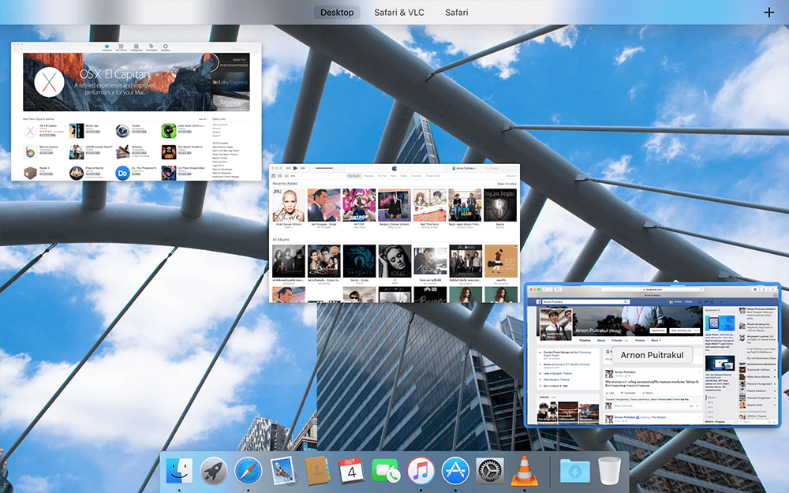

เมื่อวันที่ 1 ตุลาที่ผ่านมา Apple ก็ได้ปล่อย OSX Version ใหม่ชื่อ El Capitan แน่นอนว่า วันนั้นผมก็อัพโดยพลัน เรามาดูกันว่าใน Version นี้มีอะไรใหม่ๆ ให้เราลองเล่นกันบ้าง

## New Mission Control

หลังจากที่ใน OSX มี Mission Control มาเนินนาน ใช้จนรากงอก ชินกันไปตาม ๆ กันแล้ว ตอนนี้ก็ถึงเวลาแล้วที่ Apple จะเปลี่ยนหน้าของ Mission Control สักที โดยใน Version นี้ก็มีการเปลี่ยนไปเยอะอยู่พอสมควรเลย สำหรับใครที่ไม่เคยรู้ว่า Mission Control คืออะไร มันก็คือเป็น Bird Eye View ของหน้าต่างที่เราเปิดอยู่เลย เหมือนกับเรากด Windows + Tab ใน Windows เราเลย แต่ Mission Control ใน OSX นั้นฉลาดกว่านั้นเยอะมากเลยล่ะ ถ้าอยากรู้ว่าฉลาดว่ายังไง แนะนำให้ลองมาใช้ดู

## Split View

Split Views เป็นอีกหนึ่ง Feature ที่เรียกเสียงฮื่อฮามากในงาน WWDC มันเป็นการแบ่งพื้นที่การทำงาน โดยย่อขนาดของหน้าต่างลงครึ่งนึงจะได้เปิดอีกโปรแกรมอีกตัวไว้อีกครึ่งได้ แต่เอาเข้าจริงๆ จากการใช้พบว่า มันลำบากมากเพราะว่า การจะแบ่งที เราเลื่อนเมาส์เราไปกดปุ่มเปลี่ยนไป Full Screen (ปุ่มสีเขียว) ค้างไว้ ซึ่งมันลำบากมาก และในบาง App เช่น VLC ถ้าเราทำ Split View กับมันแล้วล่ะก็ ภาพจาก VLC มันก็จะเป็นสีขาว ซึ่ง งง มาก สงสัยต้องรอ VLC จัดการกับปัญหานี้

## Spotlight ระบบ Search ที่ฉลาดขึ้น เหรอ ?

ในเวอร์ชั่นนี้ Apple บอกว่าเราจะสามารถใช้ Spotlight ที่เป็นระบบค้นหาไฟล์ของ OSX ได้อย่างชาญฉลาดมากขึ้น เราสามารถใช้ภาษาของเราในการค้นหาได้เช่น "Document I worked Yesterday" มันก็จะเอาไฟล์เอกสารที่เราเปิดหรือสร้างเมื่อวานขึ้นมาให้เรา หรือจะพิมพ์ว่า "Weather" มันก็จะแสดงพยากรณ์อาการของที่ที่เราอยู่มาให้ แต่จากที่ใช้ "ไหนว่ะ ?" ลองพิมพ์ตามก็แล้ว ไม่เห็นได้แบบในเว็บ Apple เลย

## Safari

ทางด้าน Safari ก็มีกาอัพเดทเช่นกัน แต่ Feature ที่ผมค่อนข้างจะใช้บ่อยอย่างแรกคือ Pin Tab เป็น Feature ที่ Web Browser เจ้าอื่นเขามีมานานแล้ว แต่ของ Safari ผมชอบจริงๆ เพราะว่า มันง่ายมั่ง ส่วนใหญ่ผมใช้ Trackpad ด้วย แค่เลื่อน 3 นิ้วก็ได้แล้ว ในขณะที่เจ้าอื่น ต้องคลิกขวาแล้วกด Pin Tab
ส่วนอีก Feature คือ Mute เสียง ผมเป็นคนนึงที่เวลาทำงาน หรือหาข้อมูลอะไร ก็จะเปิด Tab ใน Safari เยอะๆ ผลก็คือเวลาดันไปเปิดหน้าที่มันมีเสียงเพลง งานงอกเลยล่ะครับ หากันเพลินเลย แต่ใน Safari เวอร์ชั่นนี้ ถ้า Tab ไหนมีเสียงมันจะขึ้นรูปลำโพงไว้ข้างๆ Address และ เราก็สามารถที่จะ Mute ได้ หรือถ้ามีหลาย Tab ที่มีเสียงก็สามารถกด Mute ที่เดียวผ่านเมนูเลยก็ได้

## Mail Apps

ทางด้านของ Mail ก็มีการปรับปรุงเช่นกัน ทั้งเรื่องของ User Experience และ Performance
ในเรื่องของ User Experience ก็ได้มีการปรับปรุงที่น่าตื่นเต้น นั่นก็คือ ถ้าเราใช้ Trackpad ปาดไปทางด้านขวาก็จะมีปุ่มเพื่อ Delete Message ออกมาทำให้เราลบข้อความได้ง่ายขึ้น อันนี้จากการใช้มา พบว่าทำให้สะดวกขึ้นเยอะมากเวลาไม่มีเมาส์ เกือบลืม ในหน้า Compose Mail เราสามารถเปิดหลายๆ Tab ได้พร้อมกันแล้วนะเออ
ทางด้านของ Performance ก็เช่นกันได้มีการปรับปรุงใหม่ทำให้เราเปิดเมล์ได้เร็วขึ้น มากๆ (Apple บอกไว้แบบนั้นนะ) แต่เอาเข้าจริง ๆ มันก็ไม่ได้มากขนาดที่เห็นได้ชัดเท่าไหร่ เลยไม่ค่อย Impress เท่าไหร่

## Metal For OSX

Metal เป็นเทคโนโลยีจากทาง Apple ที่จะพยายามลดความซับซ้อนของโปรแกรมเรากับ GPU ของเราทำให้โปรแกรมหรือเกมเราทำงานในด้าน Graphic ได้เร็วขึ้นนั่นเอง (จากที่ Apple ได้เคลมไว้ บอกว่าจะเร็วขึ้นถึง 50% กันเลยทีเดียว) ซึ่งหลังจากที่ได้ไป Effect ที่เราใช้เช่นการเข้า Mission Control หรือกดซ่อนหน้าหน้าก็ดูลื่นขึ้นอย่างเห็นได้ชัดมาก แม้กระทั่งในรุ่นเก่าๆ ที่ผมใช้อย่างรุ่น Early 2011 ที่อายุย่าง 5 ปีแล้วก็ยังลื่นขึ้นเยอะเลย
ทางฝั่งของเกม ผมก็ยังไม่ได้ลองเพราะว่า ไม่รู้ว่าเกมไหนมันรองรับบ้าง แต่จากที่ Apple ได้กล่าวไว้ในงาน WWDC ที่ผ่านมา บอกว่าตอนนี้กำลังมีบริษัทเกมหลายๆ เจ้าพร้อมใช้ Metal มารันบน OSX อยู่ เพราะฉะนั้นอาจจะต้องรอสักหน่อย[][5]

## Performance ที่ดีขึ้น และ กินเนื้อที่น้อยลง

เรื่องของ Performance นี่ต้องยกให้ Matel เลยที่ทำให้ดีขึ้น แต่จริงๆ แล้ว Apple ก็ได้ทำการ Optimize ระบบ OSX ในมันมีความลื่นไหลมากขึ้น จากการลองใช้จริง มันลื่นขึ้นอย่างเช่นได้ชัดเลย ไม่ว่าจะเป็น Effect ต่างๆ หรือความเร็วในการเปิดโปรแกรมก็ตาม
ส่วนในเรื่องของ HDD ก็รู้กันดีว่าพื้นที่ใน Macbook รุ่นใหม่ๆ นี่มีค่ายิ่งกว่าทองซะอีกเพราะว่ามัน Upgrade ไม่ได้ เพราะฉะนั้น OSX ตัวใหม่นี้มันจะกินเนื้อที่น้อยลง จากที่ผมดูก่อน Upgrade HDD เหลือพื้นที่อยู่ 34.11 GB แต่หลังจาก Upgrade มา มันงอกออกมาเป็น 56.19 GB ซึ่งอันนี้ไม่รู้ว่าผมดูผิดรึเปล่า เพราะมันเพิ่มออกมาเยอะมาก !  มากจนแปลก เลยล่ะ

## ระบบจัดการไฟล์ใหม่ Rootless
ใน OSX เวอร์ชั่นเก่า ๆ ถ้าเราอยากจะแก้ไฟล์ตัวระบบ เราก็แค่ใช้ Root เราก็สามารถแก้ได้ทุกอย่างแล้ว แต่ใน El Capitan ทำไมได้แล้ว เพราะว่า Apple ได้เพิ่มระบบที่ชื่อว่า System Integrity Protection เพื่อป้องกันตัวระบบจากการการแก้ไขโดยตั้งใจ และไม่ได้ตั้งใจ นั่นคือถึงจะ Root ไม่สามารถทำอะไรมันได้ แต่ทีนี้มันก็มีวิธีอยู่เหมือนกัน นั่นคือแก้ไขผ่าน Terminal ใน Recovery Mode

## และอื่นๆ อีกมากมาย
นอกจากที่ได้เล่าไปแล้วยังมีฟีเจอร์อย่างอื่นอีกเยอะแยะมากมายที่ได้เพิ่มเข้ามาในเวอร์ชั่นนี้ แต่ก็ขอหยิบยกมาเฉพาะสิ่งที่ผมใช้บ่อยๆ ล่ะกัน ฟีเจอร์ที่เหลือก็เช่น ถ้าเราหา Cursor เมาส์เราไม่เจอ เราก็แค่เขย่ามันก็จะขยาย เพื่อให้เราหาเจอ หรือจะเป็น System Font ใหม่เป็นต้น ถ้าอยากได้ข้อมูลเพิ่มเติมลองเข้าไปในเว็บไซต์ของ Apple [หน้านี้][7] ได้เลย

## บทสรุป
จากการใช้งานมาเกือบๆ 1 อาทิตย์ ก็พบว่า การใช้งานมันลื่นขึ้นเยอะกว่าเดิมมากอยู่เยอะมากๆ รู้สึกได้เลยว่า มันลื่นกว่าจริงๆ ในส่วนของ User Experience ก็เช่นกัน ถึงแม้ว่ามันจะไม่ได้มีอะไรใหม่ แต่ก็ทำให้การใช้งานมันลื่นไหล มากขึ้นกว่าในเวอร์ชั่นก่อนๆ เยอะเลย แต่ก็ยังพบบัคหรือไม่ก็บาง App ก็ไม่ได้ทำมาเพื่อ Split เลยอาจจะทำให้โปรแกรมมันดู งง ๆ ไปหน่อย แต่ก็นั่นแหละ พึ่งใช้ไปยังไม่ถึงอาทิตย์ก็ยังไม่สามารถบอกอะไรมากไม่ได้เหมือนกัน ก็รีวิวนี้ก็เป็นเพียงการรีวิวจากคนคนหนึ่งเท่านั้น ยังไม่สามารถตัดสินได้ ให้ลองไปอ่านรีวิวคนอื่นด้วยนะครับ เพื่อความถูกต้อง

[7]: http://www.apple.com/osx/all-features/
