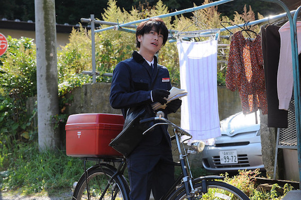
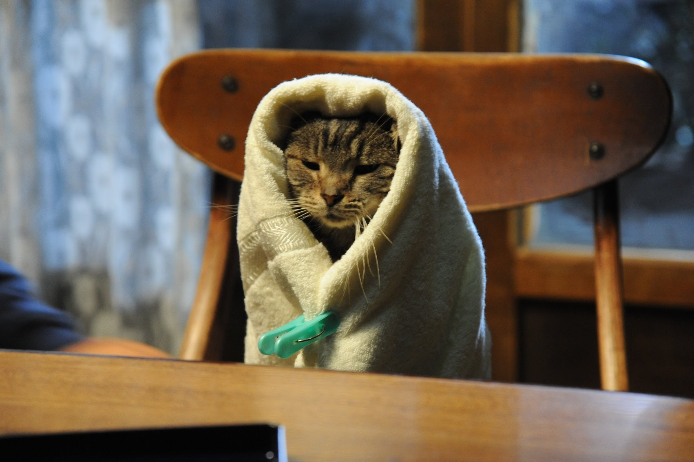

วันนี้ก็เป็นโอกาสอันดีที่เราได้ โดดงาน ไปดูหนัง ซึ่งเป็นเรื่องที่อยากดูมานานแล้ว แต่ไม่มีโอกาสได้ไปดูสักที วันนี้ก็ได้ไปดูมาแล้ว กับเรื่อง If Cats Disappeared From The World หรือชื่อภาษาไทย มิ้ง ๆ ว่า ถ้าแมวตัวนั้นหายไปจากโลกนี้ เป็นหนังที่ดัดแปลงมาจากนิยายขายดีของ Genki Kawamura แน่นอนว่า หนังมาขนาดนี้ ต้องมีหนังสือแปลมาด้วยแน่นอน ซึ่งผมยังไม่ได้ซื้อมาอ่านเลย ไว้เดี๋ยวจะซื้อมาอ่านแน่นอน !!

กับรีวิวเรื่องนี้ ไม่รู้จะเขียนยังไงดีเลย ไม่รู้จะอธิบาย อารมณ์ และ ความรู้สึกที่ค้างจากหนังยังไงดีเลย ตอนนั่งดู จู่ ๆ น้ำตาก็เอ่อออกมาเอง แบบไม่รู้ตัวเลย (นี่คือขั้นกว่า ของการร้องไห้ธรรมดาอีกนะ) ไม่คิดว่าหนังตะวันออกจะทำ Damage กับอารมณ์ได้ขนาดนี้ ตอนนี้กำลังเขียนด้วยน้ำตาเลยนะ ! (มันซึ้งขนาดนั้นอะ)

## เรื่องย่อ ย่อสุด ๆ ไม่สปอยล์

If Cats Disappeared From The World เป็นหนังที่เล่าถึงชีวิตของบุรุษไปรษณีย์กับแมวของเขาที่มีชีวิตอยู่อย่างสงบสุข อยู่ดี ๆ ก็ป่วยเป็นโรคเนื้องอกในสมองซะงั้น และเขาเหลือเวลาอีกไม่นานที่จะมีชีวิตอยู่ แต่จู่ ๆ ก็ดันมียมทูตโพล่ออกมาและบอกว่า "เราจะให้ชีวิตเพิ่มอีก 1 วันแลกกับของ 1 อย่างที่จะหายไปจากโลกนี้ โดยที่เราเป็นคนกำหนดของที่จะหายไป" จุดที่ผมว่า มันสุดยอดมากคือ เมื่อของมันค่อย ๆ หายไปทีละสิ่งเพื่อแลกกับลมหายใจ สิ่งของเหล่านั้นไม่ได้หายไปเปล่า ๆ แต่มันมีความเกี่ยวข้องความทรงจำกับพระเอกทั้งนั้น ทำให้มันค่อย ๆ สอนให้พระเอกค่อย ๆ เข้าใจคุณค่าของสิ่งของนั้น ๆ จนสุดท้ายเขาก็เข้าใจคุณค่าของของสิ่งหนึ่งที่สำคัญมาก ๆ นั่นคือ **คุณค่าชีวิต** ของเขา

จริง ๆ ถ้าเราสังเกตดี ๆ นะ ว่าเนื้อเรื่องมันโคตรญี่ปุ่นเลย ที่มักเล่นกับอะไรที่เราเห็นในชีวิตประจำมันของเรา บิดนิดหน่อย ผสมแฟนตาซีลงไปนิด และชอบเล่นแง่ สอนเราหลาย ๆ เรื่อง นี่ใช่เลย ! ซึ่งเรื่องนี้ก็เช่นกัน (ก็นี่มันหนังญี่ปุ่นป่ะวะ !?) เขาใช้เรื่องของการใช้ชีวิตของบุรุษไปรณีย์คนหนึ่งที่กำลังจะตาย มาผสมกับ ยมทูตที่จะให้ชีวิตอีก 1 วันโดยแลกกับการหายไปของ ของ 1 ชิ้น และ จิตนาการเมื่อของชิ้นนั้นมันได้หายไป มันเกี่ยวข้องอะไรความคนรอบข้างของเรา และสถานที่ต่าง ๆ ชอบอยู่ฉากนึงที่ ทำให้หนังหายไป และร้านเช่าหนัง กลายเป็นร้านขายหนังสือ เพื่อนที่เรารู้จักเพราะหนังก็กลับกลายเป็นคนไม่รู้จักไป

## บทวิเคราะห์ + ความรู้สึก

ผมนั่งดูตั้งแต่วินาทีแรกที่หนังฉาย จนจบเครดิตเลย ความเศร้า ความเหงา ความสุข ความรัก และความหวัง (อะไรมันจะเยอะขนาดนั้น !) มันวนเวียนอยู่ในหัวตลอดตอนที่ขึ้น BTS กลับ จะบอกว่าตอนนั่งดูคือ นั่งร้องไห้หนักมาก เท่าที่จำความได้มีหนังอยู่ 2 เรื่อง (รวมเรื่องนี้แล้วนะ) แต่นั่งดูแล้วร้องไห้โฮ่ในโรงหนังขนาดนี้นั่นคือ Doraemon Stand By Me กับเรื่องนี้แหละ การเล่าเรื่อง และปมต่าง ๆ ของตัวพระเอก ที่เมื่อเผยออกมาก็ทำให้เห็น ไม่สิ รู้สึกถึงความรู้สึกทั้งของ พระเอก และของแม่ของเขาด้วย นอกจากการเล่าเรื่องและพล๊อตเรื่องที่ดีแล้ว ยังมีการพูดถึงหนังเก่า ๆ ด้วย

If Cats Disappeared From The World เป็นหนังแมวจริง ๆ แต่แต่ไม่ใช่ทั้งหมด จริง ๆ แล้วเป็นหนังที่สอนเรื่องของ **"คุณค่าของชีวิต"** ได้ดีมาก ๆ ตอนแรกพระเอกอาจจะไม่เข้าใจ และบอกว่า วัน ๆ เราก็ทำเหมือนเดิมไปเรื่อย ๆ แต่เมื่อวันหนึ่งสิ่งเหล่านั้นได้หายไป ทำให้เขาเข้าใจว่า

**"มันไม่เกี่ยวว่าเวลามีน้อยมีมาก สุดท้ายมันก็ต้องหายไปตามกาลเวลา แต่มันอยู่ที่เราใช้ชีวิตได้พอใจกับมันหรือยัง"**
ผ่านการเล่าเรื่องถึงปมความสัมพันธ์ต่าง ๆ ทั้งความสัมพันธ์ในครอบครัว, ความรักในแบบหนุ่มสาว และแมวของเขา ถือว่าทำได้ดีมาก ๆ และของที่ค่อย ๆ หายไปทีละอย่าง ทำให้กระชากอารมณ์ และความรู้สึกของเราได้หนักมาก ๆ

เป็นหนังที่อยากให้ไปดูกันมาก ๆ ถึงแม้ว่ามันจะเข้าอยู่ไม่กี่โรงเท่านั้นก็เถอะ ถ้าใครชอบเรื่องนี้ก็ไปหาดูกันนะครับ ผมว่ามันสอนอะไรหลาย ๆ อย่างให้เรา ทำให้เราเต็มที่กับชีวิต และใช้ชีวิตอย่างมีเป้าหมาย เพื่อให้เราจะได้ไม่ต้องเสียใจทีหลังเมื่อมันต้องหายไป รวมแล้วหนังเรื่องนี้ผมให้ 9.9/10 เลย ตัดไป 0.1 เพราะการดำเนินเรื่องตอนแรก ๆ สุดเลย ที่ค่อยข้างเนิบไปหน่อยแต่มันก็ทำให้เราเห็นว่าพระเอกของเราใช้ชีวิตไปเรื่อย ๆ อย่างไร้จุดหมาย และสุดท้ายขอจบด้วยประโยคนึงจากในหนัง ที่ยังตรึงใจผมมาก ๆ

> จริง ๆ แล้ว เราไม่ได้เลี้ยงแมวหรอก แต่แมวอนุญาตให้เราเลี้ยงตะหาก

สิ่งที่ต้องการจะสื่อจากประโยคนี้คือ จริง ๆ แล้ว เราก็ไม่ได้เลี้ยงแมว และแมวก็ไม่ได้เลี้ยงเรา แต่เป็นการที่ต่างฝ่าย ต่างเติมเต็มซึ่งกันและกัน ไม่ใช่แค่ แมว เท่านั้น แต่เป็นทุกชีวิต และทุกสิ่งที่เข้ามาในชีวิตของเรา
