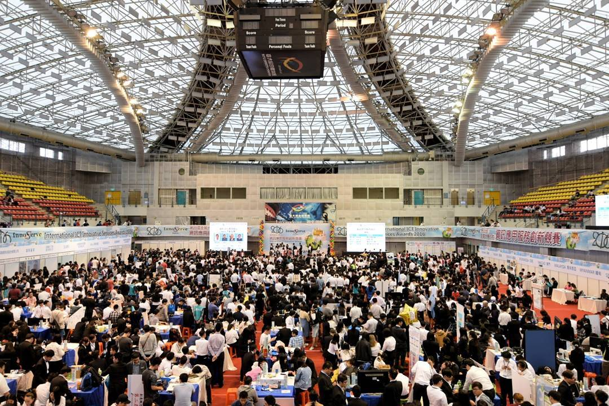
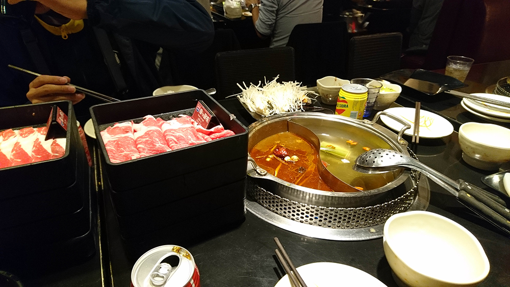
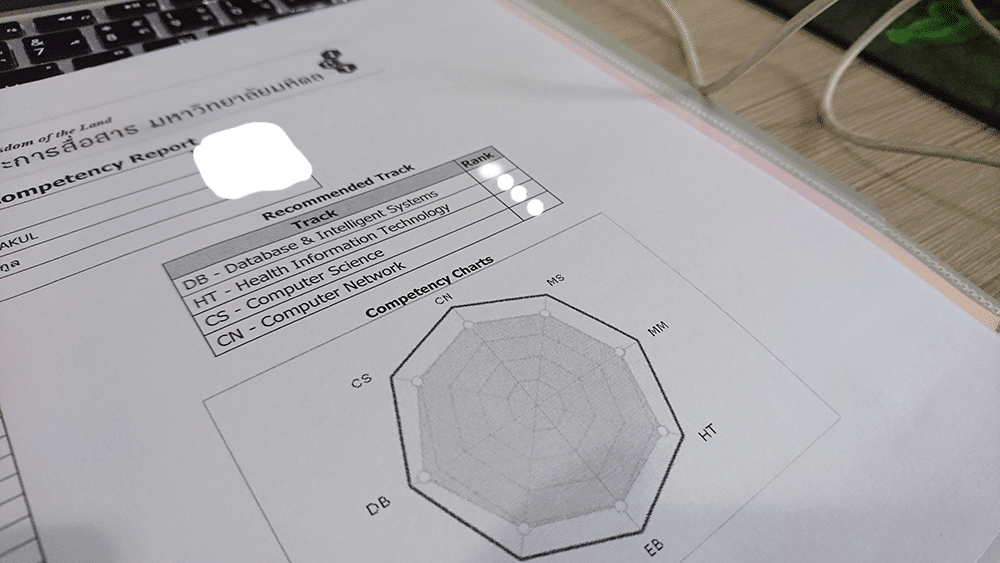

และแล้ว 1 ปี ก็เวียนมาบรรจบอย่างรวดเร็วเหมือนเราพึ่งขึ้นปี 3 เมื่อวาน วันที่กำลังนั่งเขียนอยู่ตอนนี้เป็นวันสอบวันสุดท้ายของปี 3 พอดี ก็เลยอยากจะมาเล่าว่าในหนึ่งปี ก็คือในช่วงปี 3 ที่ผ่านมามีอะไรเกิดขึ้นบ้าง ทั้งสนุก และชิบหาย ปน ๆ มั่ว ๆ กันไป

ปีที่แล้วว่ามั่วซั่วแล้ว ปี 3 นี่หนักกว่าเดิมเยอะ (มันใช่เรื่องที่ควรจะดีใจมั้ยฮ่ะ !!) เมื่อตอนปี 2 ถึงคณะ 9.45 ใช่มั้ย ปีนี้ด้วยอะไรก็ไม่รู้ พยายามอาบน้ำให้เร็วขึ้น จะได้ออกเร็วขึ้น สุดท้ายก็ออกสายเหมือนเดิม บางวิชาคือเข้าสายไปครึ่งชั่วโมง โดยที่เจ้าตัวยัง งง อยู่ว่า ทำไมเราตื่นเช้ากว่าเดิม แต่ทำไมตรูไปสายกว่าเดิมฟร๊ะ

และปีนี้ก็เป็นอีกปีที่พยายามจัดสรรเวลา และดูแลสุขภาพของตัวเองในมากขึ้น เช่นตอนเย็นจะไปปั่นจักก้าอย่างน้อยสัก 1-2 ชั่วโมง บางทีวันอาทิตย์ก็จะโผล่ไปพุทธมณฑลบ่อย ๆ กับลดขนมและน้ำอัดลม แต่ความพยายามนั่นหาได้ผลไม่ มันดันกินมากกว่าเดิมอีก ตรงกันข้าม ออกกำลังกายก็น้อยลงกว่าปีก่อนอีก ทำให้รู้สึกว่า ตัวเองตอนนี้มันอ้วนชิบ !!

เวลาที่หายไปนั้น มันก็ไม่ได้หายไปไหน ไปตกอยู่กับ Project และการบ้านกองท่วมหัว ปี 2 ว่าบรรลัยแล้ว ปี 3 จะทำให้คุณสามารถหา**ขั้นกว่าของคำว่า บรรลัย** ได้ ตั้งแต่เรียนมา ไม่เคยเจอว่ามี Project มันทุกวิชา กับสั่งการบ้านยังกะไม่เคยสั่งมาก่อนในชีวิต และแต่ละวิชามันไม่ได้สั่ง Project ตัวเดียว ผลก็คือ นั่งทำ Project และการบ้าน จนตัวบวมโค้ก ฮ่า ๆ เหมือนที่พี่ ๆ บอกกันมาว่าปี 3 นี่แหละเด็ดสุดแล้ว เออครับ เชื่อ !!! แต่ยังเชื่ออีกว่า ปี 4 มันต้องพีคกว่าแน่เลย !!!!

ทางฝั่งกิจกรรมก็ไม่แพ้กัน ปีที่แล้วเป็นรองของรองฝ่ายในงาน Open House ที่คณะ ปีนี้กลายร่างมาเป็น Head ฝ่าย Project โดยที่ฝ่ายอื่นเป็นปี 4 ทั้งหมด ซึ่งเวลามันก็จะไม่ค่อยจะตรงกันสักเท่าไหร่ ก็เหนื่อยมากกว่าปีที่แล้วมาก และกอยากจะขอบคุณ พี่ ๆ เพื่อน ๆ ในงานนั้นที่ทำให้งานนั้นสำเร็จออกมาได้ (แต่ก็ไม่ได้อยู่ในงานเลย...)

งาน Open House เพิ่งเริ่มวันแรก ก็ต้องบินไปแข่ง Innoserve 2016 ที่ ไทเป, ไต้หวัน ก็เป็นครั้งแรกในชีวิตที่ได้ไปไต้หวัน และได้ไปแข่งในระดับที่หลากหลายประเทศร่วมกันขนาดนี้ ไปที่นั่นคือได้รับการต้อนรับที่ดีมาก ๆ จากเจ้าบ้าน ประทับใจมาก ๆ กลับมาอาทิตย์หน่อย ๆ ก็ได้ไปไทเปอีกครั้ง ในอีกการแข่งขันหนึ่งชื่อ APICTA 2016

Innoserve 2016 ก็ทำเอามันส์แล้ว APICTA 2016 พีคกว่า เพราะเป็นการแข่งขันที่ใหญ่กว่าเยอะมาก ๆ ซึ่งแน่นอนว่าเจ้าบ้านก็ค่อยข้างโอเคเลย เพราะจัดใน The Grand Hotel ที่จัดว่าเป็นโรงแรมที่เจ๋งมาก ๆ ให้อารมณ์เหมือนพระราชวัง แล้วไปงานคือ เขาแจก Wifi Pocket จาก jetfi มานึกว่าจะกลับก็ให้คืนคือ เปล่าเขาให้เลย อ้าวเฮ้ยจริงเดะะะ รอบนี้ไปญี่ปุ่นเลยสบายเลย ไปซื้อซิมมาใส่แล้วก็ได้ Wifi Pocket เลย

นอกจากไปแข่งแล้ว ได้มีโอกาสบินไปทั้งทีมันก็ต้องเที่ยว และกิน !!! กลับมานี่คือคิดถึง หมาล่า มาก ที่ไทเปคือ ใครไป ไปกินหมาล่าซะนะ มันเป็นของเทพมาก ๆ กลับมากินที่ไทยคือมัน อ่อนมาก เมื่อเทียบกับไทเป !!!!!

ช่วงหลัง ๆ ของปี นอกจากความบรรลัยของฝั่งการเรียนแล้ว ก็ยังมาเป็นประธานค่าย JWC 9 อีกทำให้งานกองกันจนบวมเต่ง ระเบิดดังตูมคาหัวกันเลยทีเดียว

ไปโน้นไปนี่ ปีนี้ก็ได้มีโอกาสมาทำสิ่งที่ตัวเองอยากจะทำมานานแล้วนั่นคือ การเปิดคอร์สสักอัน ผลตอบรับก็ค่อนข้างดี ตอนแรก ๆ ก็แอบกลัว สอนไปก็เกร็งไปหมด พอหลัง ๆ ก็เริ่มดีขึ้น สนุกมากขึ้น ถือว่าเป็นประสบการณ์หนึ่งที่ดีมาก ๆ ผมได้เขียนเล่าประสบการณ์ไปใน Blog แล้วล่ะ ลองเข้าไปอ่านกันได้ที่ ลิงค์นี้ ได้เลย

และแน่นอนว่าสนุกขนาดนี้ มีหรือที่จะไม่เปิดอีกคอร์ส แต่รอกันหน่อยนะ ช่วงนี้มันช่วงที่ยุ่งมาก ๆ ของชีวิตเลยฮ่า ๆ สัญญาว่าจะรีบกลับมาสอนให้เร็วที่สุด

เด็ดกว่านั้นคือ ปี 3 เทอม 2 เป็นช่วงที่เราจะต้องเลือก Track ในการเรียน ซึ่งก็เป็นสิ่งที่คิด และคิดมาเป็นเทอมแล้วละ และตอนเลือกคณะจะมีเหมือน Suggestion มาให้ว่าเราน่าจะเลือกอะไร โดยดูตามเกรดจากวิชาที่เกี่ยวข้อง ซึ่งแน่นอนว่า Database นำโด่งขึ้นมา แต่คิดว่าเราจะเลือกใช่มั้ย ฮ่า ๆ ไม่ !! ไปเลือก Computer Science แทน เพราะไม่อยากจะเสียเงินไปเรียนในสิ่งที่ถนัดอยู่แล้ว สุดท้ายก็หนีไม่พ้น ดันบังคับเรียนกับ Database Track ซะนี่ (ร้องไห้ไป !)

ยอมรับเลยนะว่า ตอนปี 1,2 ไม่ค่อยได้อ่านหนังสือก่อนสอบเลย เพราะว่ามีเพื่อนติว หรือไม่ก็อ่านมันพร้อมเพื่อนเลย แต่พอมาปี 3 มันก็จะมีวิชา Track เข้ามา ซึ่งไม่ใช่เพื่อนทุกคนในกลุ่มที่จะเรียน Track เดียวกัน ทำให้เรียนด้วยกันน้อยลง จากเมื่อก่อนที่พึ่งเพื่อน ช่วยอ่านหนังสือ ตอนนี้กลับกลายเป็นว่า ต้องอ่านเอง TT เลยทำให้ต้องอ่านหนังสือเองมากขึ้น

และแล้วก็จบแล้วปี 3 เย้ ๆๆ ปาดเลือด ปาดน้ำตา รัว ๆ แต่รวม ๆ แล้วมันก็สนุกดีนะ เปิดประสบการณ์ใหม่ให้กับตัวเอง ได้ทำอะไรที่ไม่เคยทำ สนุก ๆ ขอบคุณเพื่อน ๆ ที่ช่วย ๆ กันมาถึงตอนนี้ และเราก็เบลอหน้า !!!!!! ขำแบบสะใจมาก !! แล้วเจอกันใหม่ปี 4 ปีสุดท้าย หวังว่าจะมีความหรรษามากขึ้นไปอีก ปีหน้าก็ได้เปลี่ยนสี Strap เป็นสีฟ้า ที่อยากได้มาตั้งแต่ปี 1 แล้วฮ่า ๆ

**ปล. 1 อ่านแล้วไม่ต้อง งง MUICT จะมีการเปลี่ยน Strap (หรือที่ห้อยบัตรนั่นแหละ) กันทุกปี ก็จะเรียงสีตามปี ตั้งแต่ สีเหลือง สีชมพู สีเขียว และสีฟ้าผู้แก่สุด**

**ปล. 2 อ่านรีวิวชีวิตความบรรลัยใน [ปี 1][6] และ [ปี 2][7] ได้ตามลิงค์เลย**

[6]: https://www.arnondora.in.th/review-freshman/
[7]: https://www.arnondora.in.th/review_sophomore/
