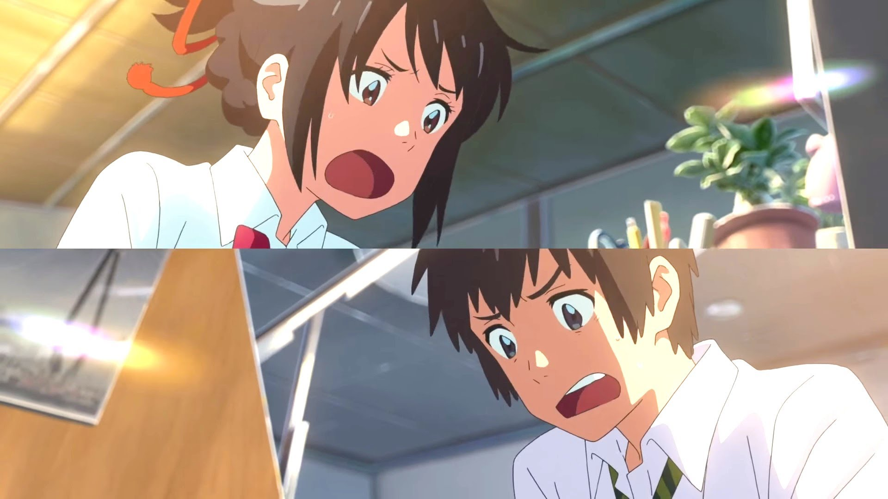
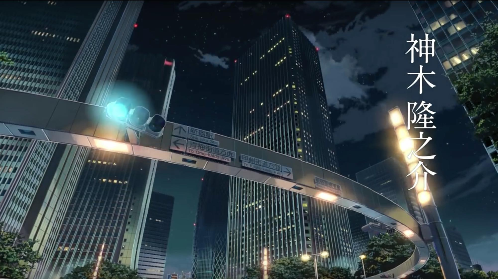
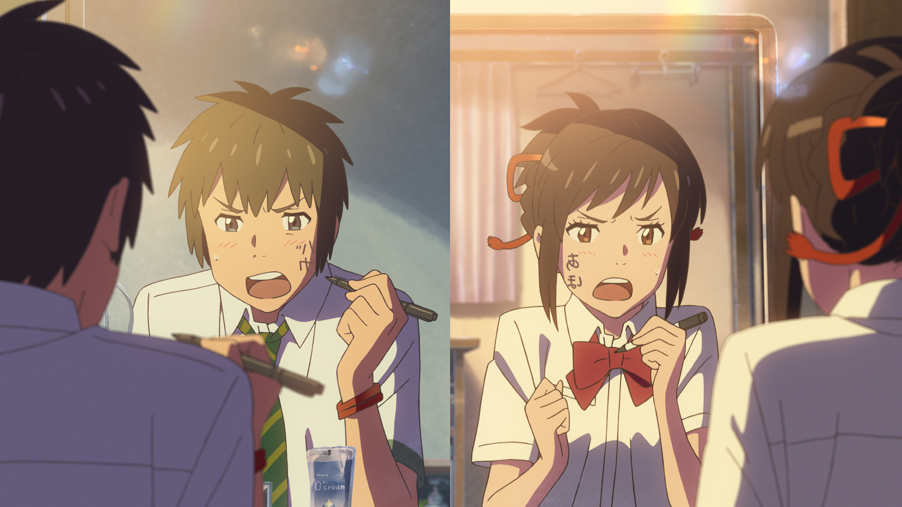

**Kimi no na wa** เป็นอีกผลงานจากผู้กำกับ Makoto Shinkai อันเลื่องลือจากผลงานชื่อดังอย่าง 5 centimeters per second และ Garden of Word ที่สร้าง Impact ให้กับพวกเราไปไม่ใช่น้อย กลับมาคราวนี้ จั๋งหนับกว่าเดิมด้วยเรื่อง **Kimi no na wa** หรือ **Your Name** ที่กวาดรายได้ไปกว่า 16,000 ล้านเยนไปแล้ว และติดอันดับ Anime ที่ทำรายได้สูงสุดในญี่ปุ่นเลยทีเดียว

เป็นเรื่องราวของ **ทากิ** (Taki) เด็กหนุ่มโตเกียว และ **มิทสึฮะ** (Mitsuha) ที่อาศัยอยู่ในเมืองในชนบท ที่ทั้ง 2 เกิดอยากใช้ชีวิตที่สลับกัน คนนึงอยากใช้ชีวิตในเมือง กับอีกคนอยากออกจากเมือง จนกระทั่งคืนนึงที่มีดาวตกในรอบพันปี ทั้ง 2 ต่างฝันว่า ตนนั้นกลายเป็นอีกคนนึง แต่มันก็ไม่ใช่ฝัน แต่มันคือ เรื่องจริงเฉย

## ภาพและลายเส้น

ก่อนจะไปที่เรื่องอื่น ๆ ขอเปิดด้วยเรื่องของ **ภาพ** กันก่อน ตอนเปิดเรื่องมานี่คือนั่งขนลุก กับภาพเลย คือมันดูสวยมาก ๆ ควรค่าแก่การไปดูในโรงเป็นที่สุด ถ้าเราสังเกตุ หรือติดตามผลงานของ Makoto Shinkai แล้วจะเห็นได้ว่า ภาพของแต่ละเรื่องมีการพัฒนาขึ้นเรื่อย ๆ

เรื่องนี้ก็เช่นกัน เมื่อเทียบกับเรื่องก่อนหน้านี้อย่างเรื่อง Garden of Word จะเห็นว่า เรื่องนี้สวยกว่าเดิมพอสมควร มันคือ Anime สมัยใหม่มาก ๆ ทุกอย่างมันดูเหมือนของจริงมาก ๆ ท้องฟ้า และสิ่งของต่าง ๆ ได้รับการใส่ใจในรายละเอียดมาก ๆ ขนาดแค่ท้องฟ้า ยังมีรายละเอียดเลย สุดยอดจริง ๆ ประกอบกับ อาจารย์ Makoto เองก็ชอบเอาสถานที่จริง ๆ มาจับ ทำให้เราเหมือนได้เห็นมึมมองใหม่ ๆ ได้ดีเลย

จุดเด่นที่เราน่าจะได้เห็นคือ **แสง** ถ้าเราดู Anime เรื่องอื่น ๆ แล้วพอมาดูเรื่องนี้ เราจะเห็นเลยว่า มันแตกต่างกันมาก ๆ นอกจากคุณภาพของภาพแล้ว เรื่องของ **การวางแสง** ก็ไม่แพ้กัน จากเรื่องนี้คือ มันทำให้เราเห็นมิติของมันมากขึ้น ดูจริงมากขึ้น เหมือนกับเราเข้าไปอยู่จริง ๆ เลย

อีกจุดที่ผมค่อนข้างชอบมาก ๆ ในผลงานของ อาจารย์ Makoto Shinkai เลยคือ **การเลือกใช้มุมกล้อง** ที่ผมไม่สามารถหาได้จากอาจารย์คนไหน ๆ เลย ที่ชอบทำฉาก Pan ออกมาสูง ๆ เพื่อเล่าเรื่อง ซึ่งเรื่องที่ผมว่ามัน Impact ที่สุดคือในเรื่องของ 5 Centimeter Per Second ที่ทำให้ติดตาผมมาจนถึงวันนี้ มาถึงเรื่องนี้เอง ก็ทำให้ผมตื่นเต้น และเกิด Impact พอสมควรกับเรื่องนี้

## เพลง
นอกจากจะได้ภาพที่โคตรสุดยอดจากอาจารย์ Makoto Shinkai มาแล้ว ยังได้เพลงประกอบจากวง Radwimps ที่เป็นวงชื่อดังจากฝั่งญี่ปุ่นมาเติมอารมณ์ให้กับเรื่องนี้ได้อย่างลงตัว นั่นคือเพลง 前前前世 (Zenzenzense) ที่ผมฟังครั้งแรกก็ติดหูมาก และเพลงอื่น ๆ ที่ใช้ประกอบฉากก็ช่วยสร้างอารมณ์ให้อินกับตัวเรื่องได้แบบไม่น่าเชื่อเลย

## เนื้อเรื่อง และการเล่าเรื่อง

Anime ความยาวกว่าชั่วโมงครึ่ง ที่ตอนแรกเปิดมาด้วยอารมณ์ Love Comedy และตัดมาเป็น Drama เหมือนสับ Switch เฉยเลย จุดนี้ผมว่า อาจจะเป็นจุดที่ไม่ค่อยชอบสำหรับผมกับเรื่องนี้เท่าไหร่ แต่จุดที่ชอบการเล่าเรื่องของเรื่องนี้คือ การเล่าเรื่องสลับตัวละครกันไปมาได้อย่างราบลื่น และสนุกไปกับมันได้อย่างไม่น่าเชื่อ

ทั้งเรื่องจะเต็มไปด้วยกลิ่นอายเรื่องราวของเด็กหนุ่มสาววัยรุ่นที่เปลี่ยนไป เพราะสลับร่างกัน และยังสามารถสอดแทรกอารมณ์ต่าง ๆ ได้หลากหลาย ทั้ง ดีใจ เสียใจ ลุ้น และ **อบอุ่น** ได้อย่างกลมกล่อม เหมือนกับส่วนผสมที่ลงตัวของเรื่องนี้ ดึงให้เราติดตามและดูไปด้วยตั้งแต่ต้นจนจบได้อย่างราบลื่น

สิ่งนึงที่อาจารย์ Makoto Shinkai ยังขาดในเรื่องก่อน ๆ คือ การตีกรอบให้กับบท ในเรื่องก่อน ๆ มักจะปล่อยให้คนดูจิตนาการไปเรื่อย แต่ในเรื่องนี้ มีการตีบทที่เพิ่มมากขึ้น แต่การตีบทของแกนั้นไม่ธรรมดาแน่นอน ดูแล้ว มันเหมือนการเลี้ยงอารมณ์ของเราไปเรื่อย ๆ ในตอนแรก จะทำให้เรารู้สึกสนุกไปกับมัน แต่ในขณะเดียวกัน ก็ทิ้งอะไรให้เราสงสัยไปเรื่อย ๆ เหมือนกับทิ้งชิ้นส่วนจิ๊กซอว์ไปตามเรื่องเรื่อย ๆ และเอามาประกอบเป็นภาพที่งดงามในตอนสุดท้าย ที่เมื่อเราเห็นภาพแล้วอารมณ์ต่าง ๆ ที่ถูกซ่อนไว้ก็ทะลักออกมาเหมือนซาลาเปาลาวา (อยากกิน ฮ่า ๆ)

นอกจากนี้ยังมีการสอดแทรก เรื่องของความเชื่อต่าง ๆ ทั้งเรื่อง โลกหลังความตาย ด้ายแดง โลกคู่ขนาน ดาวหาง ลงไปในเรื่อง จุดที่ชอบคือ การสอนเรื่องความผูกพันธ์ผ่านการร้อยเชือก ของคุณยายของมิทสึฮะว่า "เวลาที่ใช้ไปในการร้อยเชื่อก ล้วนแต่เป็นการนำจิตวิญญาณของตัวเองใส่ลงไปในสิ่งของ ของทุกอย่างที่ผ่านเข้ามาในชีวิต คือความผูกพันธ์" และเรื่องของสาเกที่เป็นภูมิปัญญาท้องถิ่นที่บอกว่า มันมีค่ากับจิตใจของคน และช่วงเวลาต่าง ๆ ที่จะท้อนถึงความความของชีวิตเราในแต่ละวัน ที่สร้างความเจ๋งให้กับเรื่องนี้ได้เป็นอย่างดี

## สรุป

Kimi no na wa ก็เป็นอีกเรื่องที่ทำให้ผมค่อนข้างอินอยู่พอสมควร อาจจะไม่เท่า 5 centimeter per second ที่ทำให้หง๋อยหนัก ๆ ไปสัปดาห์นึง แต่ก็สามารถทำให้ผมได้แง่คิดอะไรหลาย ๆ อย่างจากเรื่องนี้ รวมกับ**ภาพ และแสงที่โคตรสวยสไตล์ Makoto Shinkai สวยวัวตายควายล้มมาก เนื้อเรื่องและการเล่าเรื่องที่ดี ดูได้เรื่อย ๆ และสอดแทรกเรื่องราวต่าง ๆ ได้อย่างลงตัว และเพลงประกอบที่ทำให้บิ๊วอารมณ์ได้ดีขึ้น ให้ไปเลย 100/10** ขึ้นหิ้งเลย แนะนำว่า ให้ไปดู เด็ดจริง ดูแล้วร้องไห้กลางโรงมาแล้ว (ดีนะ แต่ไม่มีคนเห็น) แต่ไม่ใช่เพราะเศร้า แต่มันเป็นเพราะเรารู้สึกดีกับมันมากกว่า ดูแล้วรู้สึกดีมาก เป็น Anime Romantic ที่ไม่มีคำหวานเลย ถ้าเราสังเกตกันอะนะ

และสุดท้าย อยากจะบอกว่า เราอาจจะได้พบเจอผู้คนมากมาย ผมเชื่อว่าการได้เจอใครจะคนนั้นไม่ใช่เรื่องบังเอิญ แต่เมื่อมีวันเจอ ก็ย่อมมีวันจากลา ฉะนั้นใช้ทุกวินาที เก็บความทรงจำให้ได้มากที่สุดตอนที่ยังมีโอกาส
