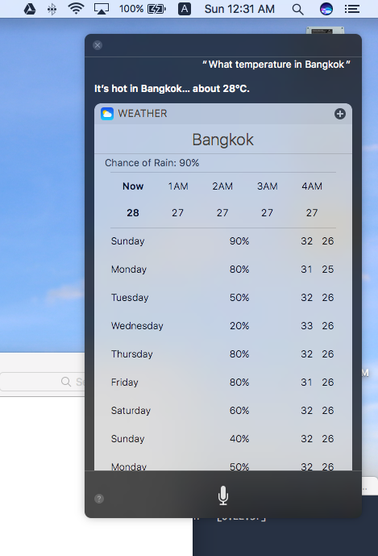
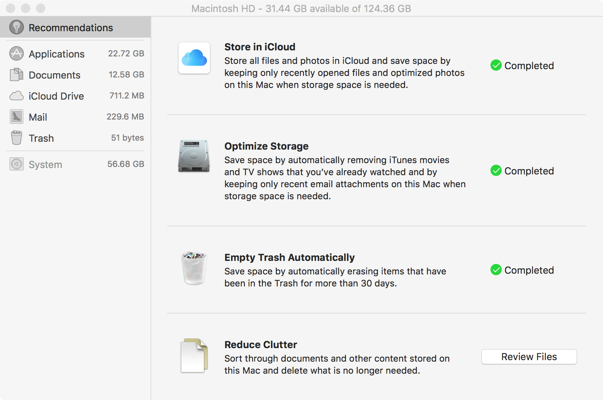
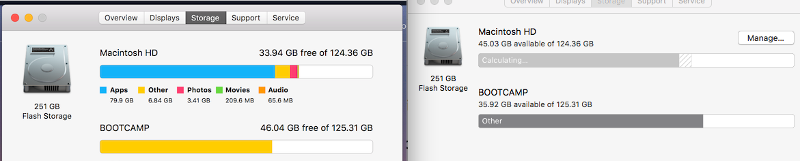
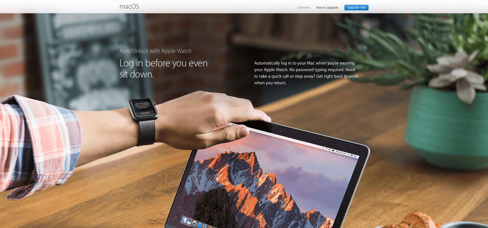

และนี่ก็ครบรอบอีก 1 ปีที่ Apple จะเปิดตัวระบบปฏิบัติการใหม่ออกมาให้เราได้ใช้กัน ซึงปีนี้แค่ชื่อก็มาแปลกแล้ว จาก Mac OSX แล้วก็ชื่อ แต่ปีนี้เปลี่ยนเป็น **macOS Sierra** เพื่อให้มันเข้ากับ OS อื่น ๆ ของ Apple เช่น iOS หรือ watchOS ที่อยู่ใน iPhone, iPad และอุปกรณ์ต่าง ๆ ของ Apple เอง

หลังจากที่ผมได้ใช้มาสักพักใหญ่ ๆ แล้วจะมาแชร์กันว่า มันมีอะไรใหม่บ้าง หรือข้อคิดเห็นเป็นอย่างไร เราลองไปอ่านกันเลย

## Siri บน macOS Sierra

ฟีเจอร์นี้เป็นอีก 1 ฟีเจอร์ที่ทุกคนดู แตกตื่น ตกใจ อย่างแรงที่ เราสามารถใช้ Siri เราใช้ในพวก iPhone และ iPad มาใช้บน macOS Sierra แล้ว
สิ่งที่มันทำได้ ก็ไม่ต่างกับบนตระกูล iDevice เท่าไหร่ เช่นการ หาข้อมูล เรื่องของ สภาพอากาศ หรือ Contact ต่าง ๆ ที่อยู่ในเครื่องของเรา

แต่สิ่งที่มันเจ๋งคือ เราสามารถสั่งให้มันเข้าไปหารูปภาพ หรือไฟล์ต่าง ๆ ในเครื่องของเราแล้ว นำมาใช้งานต่อได้อย่างง่ายดายมาก ๆ เช่น ผมทำงานอยู่บน Page และต้องการภาพที่ถ่ายเมื่อวานมา ผมก็แค่สั่งให้มันวิ่งเข้าไปหาภาพที่ถ่ายเมื่อวานมา และลากมันลงมาใน Page และทำงานต่อได้เลย โดยที่เราไม่ต้องไปไล่หาใน Finder

## iCloud Drive
สิ่งนี้เราอาจจะเคยเห็นมันใน MacOS ในเวอร์ชั่นก่อน ๆ หรือรู้อยู่แล้วว่า Apple มี Cloud Storage ในชื่อของ iCloud Drive เพื่อให้เราสามารถเก็บข้อมูลและ Sync ข้อมูลไปมาระหว่าง Apple Devices ได้อย่างง่ายดาย และรวดเร็ว
แต่เดิมเราจะมี Folder iCloud Drive อยู่ในเครื่องของเรา โดยจะเป็น Folder ที่คอย Sync กับทางฝั่ง iCloud ตลอดเวลา แต่ปัญหาก็เกิด เพราะคนไม่ชอบเข้าไปเก็บไฟล์บนนั้นกัน ในเวอร์ชั่นนี้ทาง Apple เล่นเอา Desktop และ Documents Folder มาเป็น Folder ที่จะ Sync ขึ้น iCloud ไปเลย
ซึ่งมันก็สะดวกดีสำหรับคนที่ใช้ Apple Device อยู่เหมือนกัน เพราะคนส่วนใหญ่ติดนิสัยในการเซฟไฟล์ไว้บน Desktop เพราะมันง่ายดี เราจะได้ไม่ต้องย้ายไปใน Folder ที่ Sync อีก แค่เซฟมันก็ Sync อัตโนมัติตอนที่เราต่อเน็ตเลย

## Optimised Storage

สำหรับฟีเจอร์นี้ผู้ใช้ทั่วไปไม่น่าจะได้เห็นอะไรมากนัก เพราะมันทำงานอยู่เบื้องหลังซะส่วนใหญ่ ๆ มันคือการที่ระบบมันจะคิดให้เราว่า ไฟล์ไหนที่เราไม่ได้ใช้นาน ๆ มันจะขนขึ้นไปบน iCloud Drive ให้เราโดยอัตโนมัติ เพื่อให้เรามีพื้นที่ในเครื่องเพิ่มมากขึ้น พอจะใช้มันก็จะโหลดลงมาให้เราโดยอัตโนมัติ โดยที่เราไม่รู้ตัวเลย

ซึ่งผลคือผมได้พื้นที่เพิ่มาเป็นจำนวนพอสมควรจริง ๆ คือเชื่อเลยว่ามันได้ผลแบบเห็นได้ชัดมาก ๆ จากภาพด้านซ้ายคืออันที่ผมแคปจอไว้ก่อนจะ Upgrade และภาพขวาเป็นหลัง Upgrade แล้ว จะเห็นได้ว่า พื้นที่เหลือจาก 33.94 GB กลายเป็น 45.03 GB หายเป็น 11 GB กว่า ๆ เลยทีเดียว น่าตกใจมาก ซึ่งมันดีกับ Mac หลาย ๆ เครื่องที่ตอนนี้ Disk Space มีค่าดั่งทอง

## Picture in Picture
หลาย ๆ คนน่าจะเคยเห็นฟีเจอร์นี้มาจากที่อื่นแน่ ๆ เลย เพราะมันคือ การที่เราสามารถดูวีดีโอจาก Safari และ iTunes ได้จากทุกหน้าจอที่เราเปิดทำงานอยู่ได้เลย เช่น ผมอยากจะดู Youtube ไปใช้ Page ไปก็สามารถทำได้ดั่งภาพด้านล่าง
วิธีเปิดก็ไม่ยาก สมมุติว่า ผมอยากเปิดเหมือนที่เปิดขึ้นมาเราก็แค่ Double Click ที่วีดีโอ แล้วมันก็จะกลายเป็นหน้าต่างเล็ก ๆ ให้เราใช้งานได้เลย เราสามารถย่อขยาย หรือย้ายที่ได้ตามที่เราต้องการเลย

## ทุกอย่างมี Tab

หลาย ๆ คนน่าจะชอบความที่มี Tab อยู่ใน Web Browser ของเรา แต่มันใช้กับโปรแกรมอื่นไม่ได้เลย ตอนนี้เจ้าสิ่งนี้ได้มาถึงโปรแกรมอื่นๆ แล้ว มันทำให้เราทำงานค่อนข้างง่ายขึ้นเยอะมาก เช่นตัวอย่างในภาพจะเป็น App Map ที่ติดมากับ macOS เองก็มี Tab มาให้เช่นกัน ส่วน Third-Party App ก็กำลังทยอยทำกันเข้ามาเช่นกัน
เพราะอย่างที่เรารู้ว่า เวลาเรากด Command + Tab มันจะสลับโปรแกรม และถ้าเกิดโปรแกรมนึงมีหลายหน้าต่าง เราก็จะใช้ Command + Tab เพื่อเลื่อนไปหาได้ แต่ถ้าเราทำเป็นหน้าต่างเดียวและกดเป็นหลาย Tab ก็จะช่วยทำให้เราสามารถเข้าถึงหน้าต่างที่เราต้องการได้ง่ายขึ้น

## เข้ากันกับ Apple Device อื่น ๆ

นอกจากฟีเจอร์ที่ได้กล่าวไปแล้ว ก็ยังมีการทำให้ Apple Devices อื่น ๆ เข้ามาใกล้กับ macOS มาขึ้น เช่นการ Unlock เครื่องโดยการใช้ Apple Watch หรือเป็นการจ่ายเงินผ่าน Apple Pay โดยใช้ Touch ID จาก iPhone หรือ iPad  และยังมี Universal Cilpboard ที่เราสามารถก๊อปปี้ข้อความหรือรูปภาพ และสามารถนำมาใช้ต่อใน Apple Devices อื่น ๆ ได้ด้วย ซึ่งผมจะไม่เขียนเรื่องตรงพวกนี้ เพราะว่า ผมไม่มี Apple Devices อื่นเลยนอกจาก Macbook Pro นี่แหละ

## สรุป
macOS Sierra เป็น OS เวอร์ชั่นล่าสุดจาก Apple ในปีนี้ที่ดูเน้นไปทางทำให้ Apple Devices ต่าง ๆ เข้าหากันมากขึ้น ซึ่งกับผมเองที่ใช้แค่ Macbook ก็น่าจะเป็น macOS เวอร์ชั่นที่ค่อนข้างจะเฉย ๆ สำหรับผมไปหน่อย ไม่ได้ตื่นเต้นมากเท่ากับปีก่อน ๆ เลยจริง ๆ
เราสามารถอัพเกรดเครื่องของเราเป็น macOS Sirra ได้ใน App Store ได้เลย และเครื่องที่อัพได้จะเป็นเครื่องตั้งแต่รุ่นปี 2009 ขึ้นไปนะฮ้าา
และสุดท้ายรีวิวนี้ก็เป็นเพียงการรีวิวจากคนคนหนึ่งเท่านั้น ยังไม่สามารถตัดสินได้ ให้ลองไปอ่านรีวิวคนอื่นด้วยนะครับ เพื่อความถูกต้อง ถ้ามีตรงไหนผิดพลาดหรือคำถามสามารถ Comment มาได้เลยครับ สวัสดีครับ
