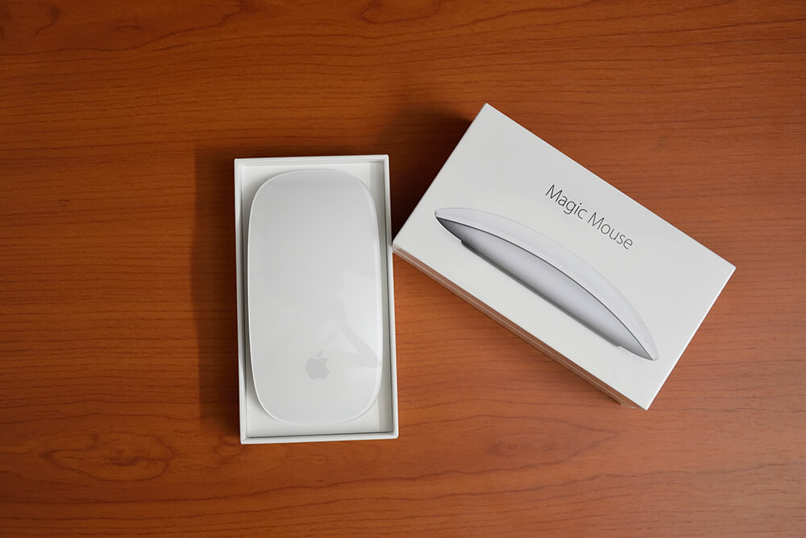
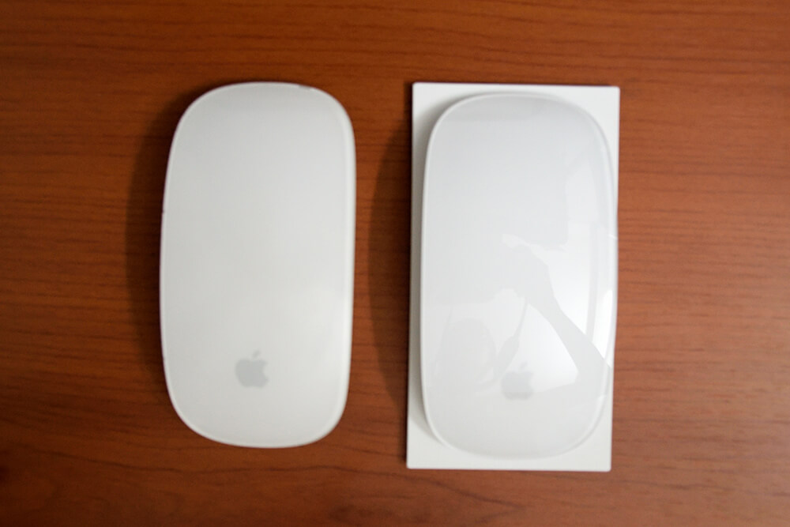
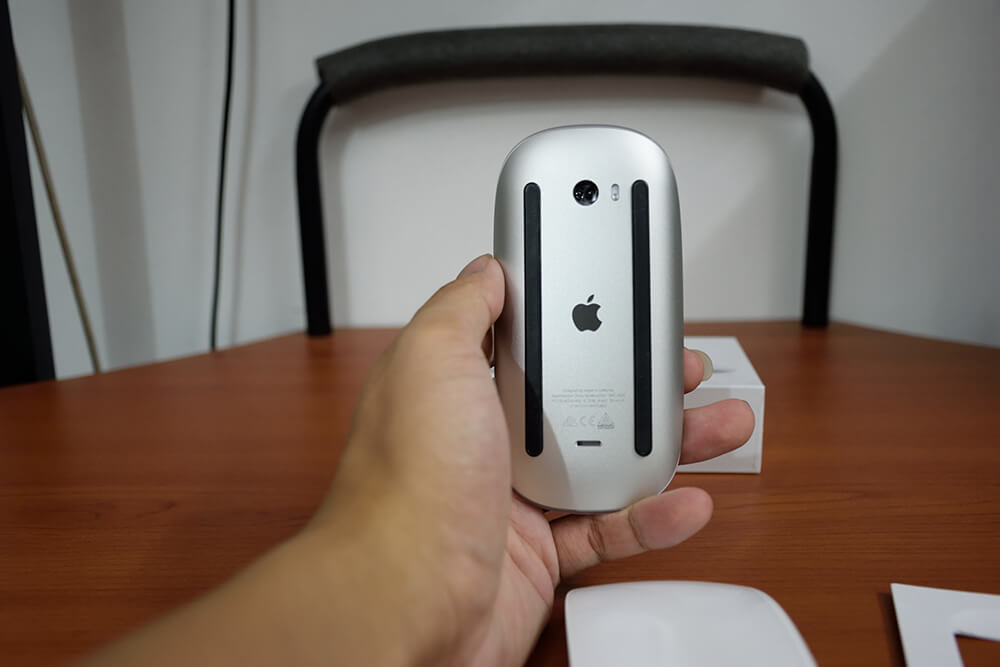
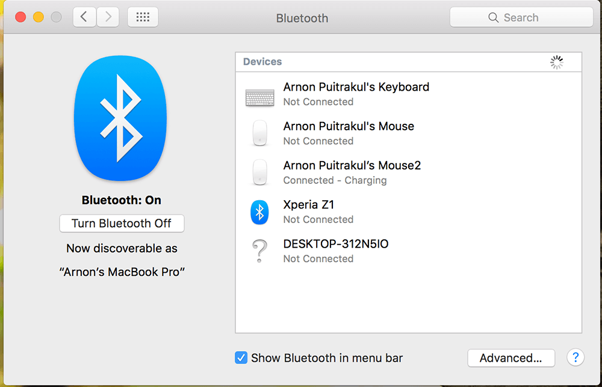

หลังจากใช้ Magic Mouse ครั้งแรกเมื่อ 5 ปีมาแล้ว ตอนที่ซื้อ Macbook Pro 2011 มาใช้ ตอนนี้มันก็เริ่มอาการไม่ดีเท่าไหร่ บางทีมันก็คลิกไม่ได้ หรือบางทีคลิกไปครั้งเดียวมันกลายเป็น คลิก 2 ครั้งเฉยเลย หลัง ๆ มันเป็นหนักขึ้นเรื่อย ๆ เลยต้องหาเมาส์ใหม่ ตอนแรกเลย ก็จะซื้อ Magic Mouse นี่แหละ แต่เห็นราคาแล้ว โอ้ !!! น่ากลัว ! เลยทำให้ต้องใช้ Razer Deadadder ที่มีอยู่แล้วไปก่อน แต่มันก็ไม่สามารถตอบโจทย์ได้เท่าไหร่ เลย ตัดสินใจและ ยอม ! เอาก็ได้ฟร๊ะ
ครั้งแรกที่ผมเห็นมัน ก็จำไม่ได้เหมือนกันว่าเมื่อไหร่ แต่จำได้ว่าครั้งแรกที่เห็น มันก็มีคำถามขึ้นมาในหัวว่า **"ต่างจากเติมยังไงฟร๊ะ !!"** พอมาอ่านดูก็อืม... มันชาร์จได้เฟ้ย ! มันช่างเป็นนวัตกรรมจริง ๆ สุดยอดไปเลยจอร์จ น้ำตาจะไหล**ปัดโธ่ เพิ่มอีก 500 บาทเพื่อให้มันชาร์จได้นี่นะ !** แต่ก็เอาเถอะ ไปแกะกล่องกันเลย

## Unboxing
เริ่มจากที่กล่องของมันเปลี่ยนเป็นกล่อง ทึบ ซึ่งโดยส่วนตัวผมชอบ Design กล่องของใหม่มาก ๆ เพราะนอกจากจะใช้แค่กระดาษอย่างเดียวที่สามารถย่อยสลายได้แล้ว ยังดูเรียบหรูอีกด้วย จาก Gen เก่าที่เป็นกล่องหน้าตาเหมือน Ipod อะไรพวกนี้ที่เป็นฝาพลาสติกใส ๆ มองเห็นความหล่อได้ทันที พอเปิดเข้ามา ก็จะพบกับตัว Magic Mouse ตั้งอยู่ในกล่องเฉย ๆ เฉยเลยจริง ๆ จาก Gen เก่าที่จะมีเทปกาวติด แต่อันนี้ไม่มี ++

หลังจากที่เราเอาของออกมาจากกล่องหมด ก็จะมีอยู่แค่ 3 อย่างเท่านั้น (แค่ซื้อเมาส์ จะเอาอะไรเฮ้ย !!) ก็คือมี ตัวเมาส์, คู่มือ และสำคัญที่สุดขาดเกือบไม่ได้เลยคือสาย Lighting ที่เอาไว้ใช้ชาร์จนั่นเอง โดยจะไม่มี Adaptor มาให้นาจา ต้องเอาไป เสียบ กับคอมพิวเตอร์เอาเองนะ

จบการ Unbox เพียงเท่านี้เพราะมันไม่มีอะไรมากกว่านี้แล้วจริง ๆ ซื้อเมาส์มันคงจะมีอะไรไปมากกว่านี้ไม่ได้แล้วละ

## Review
ประสบการณ์ที่ได้ แน่นอน ว่าไม่ต่างกับ Gen ที่แล้วเลยจริง ๆ Design ก็คล้าย ๆ ของเดิมเลย ขนาดก็เท่าเดิม แต่น้ำหนักต่างนิดหน่อย ตรงที่มันเบากว่านิดเดียว ถ้าใช้ไปสักพักหรือยกเทียบเล่น ก็คงไม่รู้สึกเท่าไหร่แน่นอน ฉะนั้นมั่นใจได้เลยว่า คนที่ใช้ Gen เก่าแล้วเปลี่ยนมาใช้ Gen ใหม่จะให้ความรู้สึกเหมือนเดิมเลย ส่วนรูปลักษณ์ของมัน ถ้าไม่ได้ดูจากรอยขีดข่วน จะดูไม่ออกเลยจริง ๆ ว่าอันไหนคืออันใหม่ ส่วนที่เพิ่มเติมคือ **ชาร์จได้**

สำหรับคนที่ไม่เคยใช้ เมาส์พวกนี้จากรูปแบบแล้ว มันมีแค่ปุ่มเดียว กับ Multitouch เมื่อก่อนผมก็ใช้เมาส์ 2 ปุ่มเหมือนกันนี่แหละ พอมาใช้ Magic Mouse นี่ครั้งแรกก็ไม่ชินอยู่เหมือนกัน แต่หลัง ๆ คือ มันทำให้เราทำงานได้รวดเร็วและง่ายขึ้นจริง ๆ เมื่อก่อนผมอาจจะต้องขยับเมาส์ไปหาปุ่ม Mission Control เพื่อใช้ แต่ด้วยเมาส์ตัวนี้ผมแค่ แตะ 2 ครั้งมันก็จะเปิดให้ทันที สะดวกมาก ๆ สรุปคือ ถ้าใครที่ไม่เคยใช้ แนะนำให้ใช้เลยครับมันสะดวกมาก

## หน้าตาเดิม เพิ่มเติมคือ ชาร์จ ได้
อย่างที่บอกไปว่า Gen ใหม่นี่มัน **ชาร์จ** ได้ ตัว Port จะอยู่ที่ด้านหลัง ถ้าเราหงายหลังมัน เราจะเห็นรูเล็ก ๆ อยู่ข้างล่าง ถ้าเทียบกับ Gen เก่า มันจะเป็นที่ที่เราใช้ดันเพื่อเอาฝาออกเพื่อเปลี่ยนถ่านนี่เอง ซึ่งรูปแบบของ Port ที่ใช้ ก็เป็น Lighting แน่นอน และแน่นอนว่า เราสามารถใช้สายที่เสียบชาร์จ Iphone Ipad ของเราเพื่อชาร์จมันได้เหมือนกัน แต่อย่าเอาไปเสียบกับ Adaptor ของมันเชียวนะ ไฟมันน่าจะต่างกันคนละขั้วเลยทีเดียว

ซึ่งวิธีที่ใช้เสียบคือ **หงายมันแล้วเสียบทิ้งไว้** จริง ๆ ในแง่ของการ Design ผมว่ามันก็ทั้งดี และไม่ดี เลย ด้านที่ดีคือ การทำที่ชาร์จไว้ข้างล่างมันเหมือนเป็นการบังคับให้เรา ชาร์จไปใช้ไป ไม่ได้ ถ้าเราทำแบบนั้นได้ มันก็จะกลายเป็นเมาส์ที่มีสายไปซะงั้น แล้วจะทำไร้สายมาเพื่อ ? ส่วนด้านที่ผมมองว่ามันไม่ดีนี่เพราะ การที่เอาคว่ำมันแบบนี้ ถ้าเราเอาไปวางในที่ที่ขรุขระ อาจจะทำให้พื้นผิวของตัวเมาส์เป็นรอยเสียโฉมได้ ดังนั้นเวลาจะชาร์จแนะนำให้เอาอะไรมารองนิดนึง ถ้าใครที่ใช้แผ่นรองเมาส์อยู่แล้ว ก็วางชาร์จมันบนนั้นแหละ

สำหรับเวลาที่ใช้ในการชาร์จ Apple บอกว่า จะใช้เวลาประมาณ 2 ชั่วโมง และชาร์จ 1 ครั้งจะอยู่ได้เป็นเดือน ๆ เลย แต่ว่าเพราะ เมื่อเราแกะออกจากกล่องมันมีอยู่แล้ว 70% กว่า ๆ เลยไม่ได้ทดสอบว่า มันใช้เวลาเท่าไหร่ในการชาร์จ และตัวเมาส์เอง **ไม่มีไฟบอกอะไรเลย** ว่ามันชาร์จถึงไหนแล้ว แต่เราสามารถเปิดหน้า Bluetooth ใน System Preference ดูได้ มันจะแสดงสถานะให้เราเห็น หรือไปที่ Mouse ใน System Preference ก็ได้เช่นกัน

## สรุป Magic Mouse เหมาะกับ....
เนื่องด้วยมันเปลี่ยนแปลง ไม่มาก เมื่อเทียบกับ Gen เก่าเลย เลยอยากตั้งฉายามันว่า **"Magic Mouse ตัวเดิม เพิ่มเติมคือชาร์จได้"** และด้วยราคาที่เพิ่มขึ้นขนาดนี้ทำให้มันไม่ค่อยหน้าคบหาด้วยเท่าไหร่ จาก Gen เก่าอยู่ที่ 2390 บาทเพิ่มสายชาร์จเข้าไป กลายเป็น 2900 บาทซะงั้น เลยทำให้ไม่น่าคบหาเท่าไหร่ ฉะนั้นผมขอสรุปว่า Magic Mouse 2 น่าจะเหมาะกับคน 4 ประเภทนี้

* คนที่ใช้ Gen แรกแล้วพัง ต้องการซื้ออันใหม่มาทดแทน
* คนที่สายชาร์จ Iphone, Ipad พัง ใช้เครื่อง Mac และกำลังหาสายชาร์จ Lighting ใหม่ (จะไปซื้อใหม่สายทำไม ซื้อเมาส์เลยดีกว่า !!)
* คนที่ไม่เคยลองใช้ และอยากจะ **สัมผัส, ลูบไล้** และใช้งาน เจ้าเมาส์ที่พิการที่มีปุ่มเดียว แต่เซ็กซี่ตัวนี้
* คนที่ถูกลัทธิ มนต์ดำที่ Apple แผ่ออกมาโดยไม่รู้ตัว (หรือรู้ตัวก็ตาม) สูบเข้าร้าน, จ่ายตัง และเอามันกลับบ้าน
ถ้าใครที่ยังถือ Gen แรกอยู่ และมันยังเป็น Survivor ที่ยัง Survive อยู่ก็อย่าพึ่งซื้ออันใหม่เลย ด้วยความที่มันไม่ได้มีอะไรใหม่ ที่เด่น ๆ เลย (แค่ชาร์จได้) กับราคาที่สูงลิบแล้ว ใช้อันเดิมต่อไป ก็ไม่มีใครมองออกแน่นอน ถ้าไม่ได้หงายให้เขาดู
