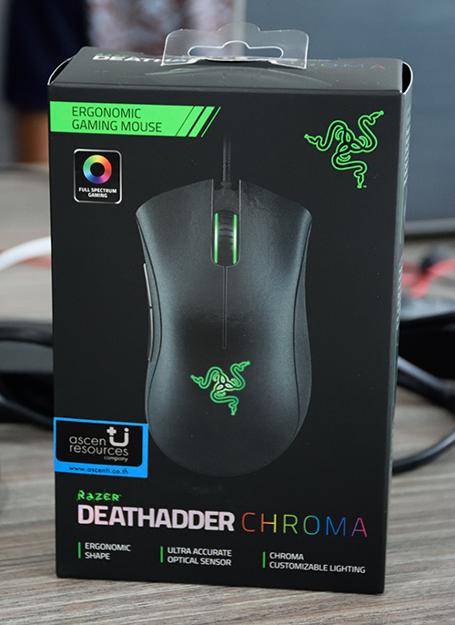
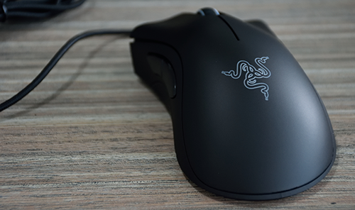

สวัสดีครับ กลับมาอีกแล้ว แต่วันนี้ไม่ได้มาสอน **Programming** หรืออะไรทั้งนั้น วันนี้มากับเมาส์อันใหม่ เย้ๆๆ ปิดเทอมมาเกมก็มาครับ เมาส์เก่าพังเลยถอดอันใหม่เลย! กับ **Razer Deadadder Chroma** ก่อนอื่นก็มาดูรอบๆกล่องกันก่อนเลย

กล่องก็เรียบง่ายตามกล่องเมาส์ทั่วๆไป บอกว่าเป็นทรง Ergonomic แล้วก็บอกว่าไฟเปลี่ยนสีได้ด้วย!!!

หลังกล่องก็ไม่มีอะไรมาก แค่บอกว่า มีปุ่มอะไรอยู่ตรงไหนบ้าง เพราะเมาส์เล่นเกมบางตัว ปุ่มเยอะไปหมด เขาเลยต้องบอกนิดนึงว่ามันมีอะไรบ้าง

มาแกะกันเลย แต่ก่อนที่จะมาดูตัวเมาส์ มาดู Bundle กันก่อน มีแค่คู่มือเล็กน้อย กับสติ๊กเกอร์ Razer ซึ่งก็ไม่รู้จะเอาไปติดอะไร เพราะฉะนั้นลงกล่องไป !

มาถึงพระเองของเรา ตัวเมาส์นั่นเอง **ตัว Body ก็ทำจากพลาสติกสีดำเรียบๆไม่มีลาย** จับแล้วรู้เลยว่าพลาสติกเกรดดีมาก! **ด้านซ้ายและขวาจะมีแผ่นยางกันลื่น** ส่วนปุ่มที่มี ก็เหมือนเมาส์ปกติทั่วไปเลย **แต่จะเพิ่มปุ่มที่ด้านซ้ายจะมีปุ่มอยู่ 2 ปุ่ม ซึ่งเราจะสามารถตั้งได้ว่าให้มันกดเป็นปุ่มอะไร!** นอกจากปุ่มตรงข้างซ้ายที่จะโปรแกรมได้แล้ว ปุ่มที่เหลือยกเว้นเมาส์ซ้ายก็ยังโปรแกรมได้เช่นกัน! ถามว่าเอาไปทำอะไร ? เวลาเล่นเกมบางที ถ้าเราต้องกดปุ่มหลายๆปุ่มพร้อมๆกันหลายๆรอบ มันคงทำให้เรารำคาญน่าดู พวก Marco เลยเข้ามาแก้ปัญหาพวกนี้ล่ะครับ มันจะให้เราบันทึกว่า ปุ่มนี้เราจะให้มันกดอะไรบ้าง แล้วก็เซ็ตใส่เมาส์ไป มันก็จะเป็นแบบนั้นเลย !

**พอร์ทการเชื่อมต่อก็จะเป็น USB 2.0 ธรรมดา** แต่สังเกตุที่หัว หัวมันจะมีสีทอง เขาบอกว่ามันจะทำให้อัตราหน่วงมันน้อยลง ซึ่งผมก็ไม่รู้ว่ามันจริงมั้ย หรือยังไง แต่มันก็น่าจะทำให้คนซื้อมั่นใจได้อะนะ!
ตัวสายก็เป็นสายถัก น่าจะกลายเป็นมาตราฐานของเมาส์เล่นเกมตอนนี้ไปหมดและ ที่ต้องใช้สายถัก ผมว่ามันก็ดีนะครับ มันทำให้สายไม่หักในง่ายนะครับ ทนดี! ไหนๆก็เสียเงินเยอะแล้ว ได้ใช้นานๆ

มาลองเสียบกันเลย! พอเสียบไปปุ๊บ มันก็จะมีไฟขึ้น เปลี่ยนสีเองไปเรื่อยๆ ถ้าเราไม่ได้ลงโปรแกรม Razer Synapse แล้วสีของไฟ มันจะเปลี่ยนเองไปเรื่อยๆ แต่ถ้าเราไปเซ็ตในโปรแกรมมันจะมีอีก 2 แบบ นั่นคือ แสดงสีเดียวเลย กับอีกแบบเรียก Breathing หรือหายใจ ไฟมันจะติดดับเหมือนเราหายใจเลย ส่วนพวก DPI ยิบย่อยก็ต้องไปเซ็ตในโปรแกรมทั้งหมดเลย
จากที่ผมใช้มันมา 2 วันบอกเลยว่า **เมาส์ตัวนี้จับแล้วสบายมากๆ ไม่ปวดไหล่ ปวดแขน เวลาเล่นเกมนานๆ** ส่วน DPI ที่บอกว่า 10,000 DPI นี่คือไม่ใช่แบบ Sensor จีน 10,000 DPI นะ มัน DPI จริงๆเลย ใช้แล้วลื่นสบายมากๆ และ **Sensor เป็น 4G Sensor บอกเลยว่ามันนิ่งมากๆ เมื่อก่อนเคยใช้เมาส์ตัวไม่กี่บาท แค่เสียบวางไว้เฉยๆ Cursor มันก็ขยับเฉยเลย แต่อันนี้ไม่เลย นิ่งเรียบสงบมาก** ประกอบกับ**รูปทรงของมันจับแล้วเป็นธรรมชาติมากๆ** ไม่ทำให้ปวดแขนและไหล่ แต่ไฟเนี่ย มันก็โอเคนะครับ แต่เอาจริงๆเวลาใช้งานจริงๆ **ไฟก็โดนมือบังแล้ว lol** ไม่ได้ช่วยเรื่องฝีมืออะไรเลย แต่ก็นะครับ กินไม่ได้ แต่หล่อนะครับ ข้อเสียอีกข้อคือ **มันไม่มี Memory ในตัวฉะนั้นถ้าเราไม่ได้ลง Driver แล้วมันก็จะเซ็ตอะไรไม่ได้เลย แม้แต่ DPI เพราะมันต้องไปปรับในโปรแกรมเท่านั้น!**
สรุปแล้วจากที่ว่ามันทั้งหมด ผมว่ามันเป็นเมาส์ที่ดีมากๆ และคุ้มค่ากับราคา ตัวนึงเลย ถึงแม้ว่าจะไม่ใช่คนเล่นเกมก็ยังซื้อมาใช้ได้ เพราะใช้แล้วมันสบายมือจริงๆ ส่วนคนเล่นเกม มันก็ดีมากเลยนะ ตัวโปรแกรมที่มันมีให้ มันควบคุมเมาส์เราได้ค่อนข้างละเอียดมากๆ ไม่เหมือนกับเมาส์ที่มีปุ่มปรับ DPI ทั่วๆไปเลย
ให้ 9.5/10 เลยสำหรับเมาส์ตัวนี้ เพราะการออกแบบรูปร่างของมันทำให้เราไม่ต้องปรับตัวเลย จับสบายมากๆ และโปรแกรมที่ใช้ควบคุมก็ ควบคุมได้ละเอียดมาก แต่ข้อเสียอย่างเดียวเลยคือ มันไม่มี Memory ในตัว ถ้าไม่ลงโปรแกรม มันก็เป็นเมาส์ธรรมดาตัวนึงทีมีไฟ **แต่โปรแกรมมันก็ทำมาดีนะ Sync ตัว Settings กับ Cloud ได้ด้วยน้าา!!**
ปล. ไม่ค่อยได้พูดถึงตัว Software เท่าไหร่ ขอโทษด้วยน้าครับ
