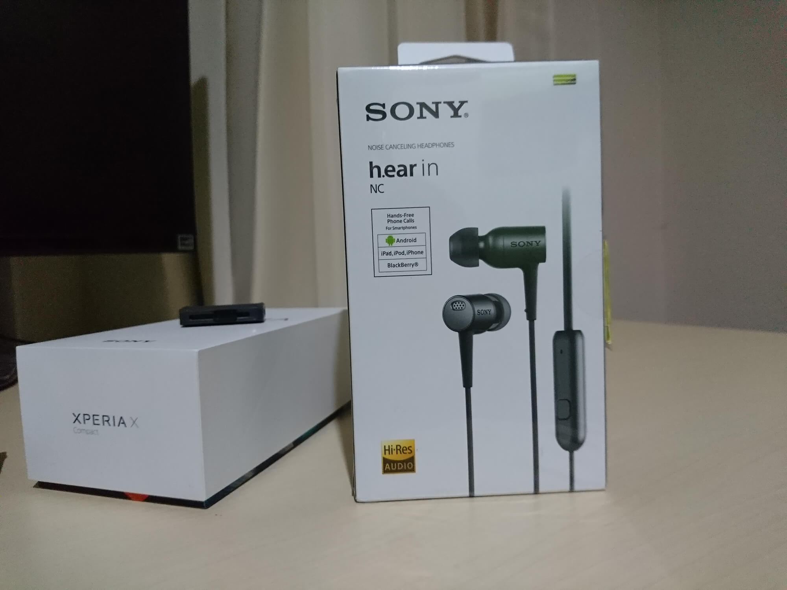
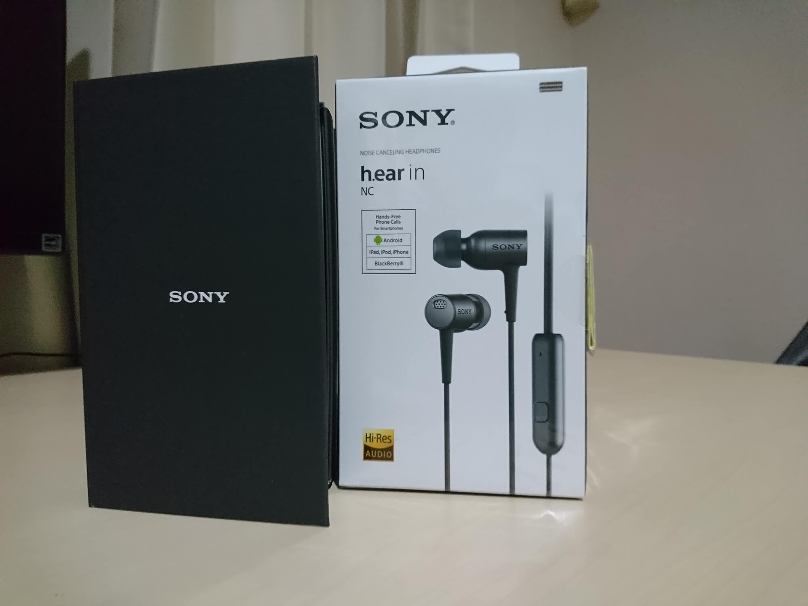
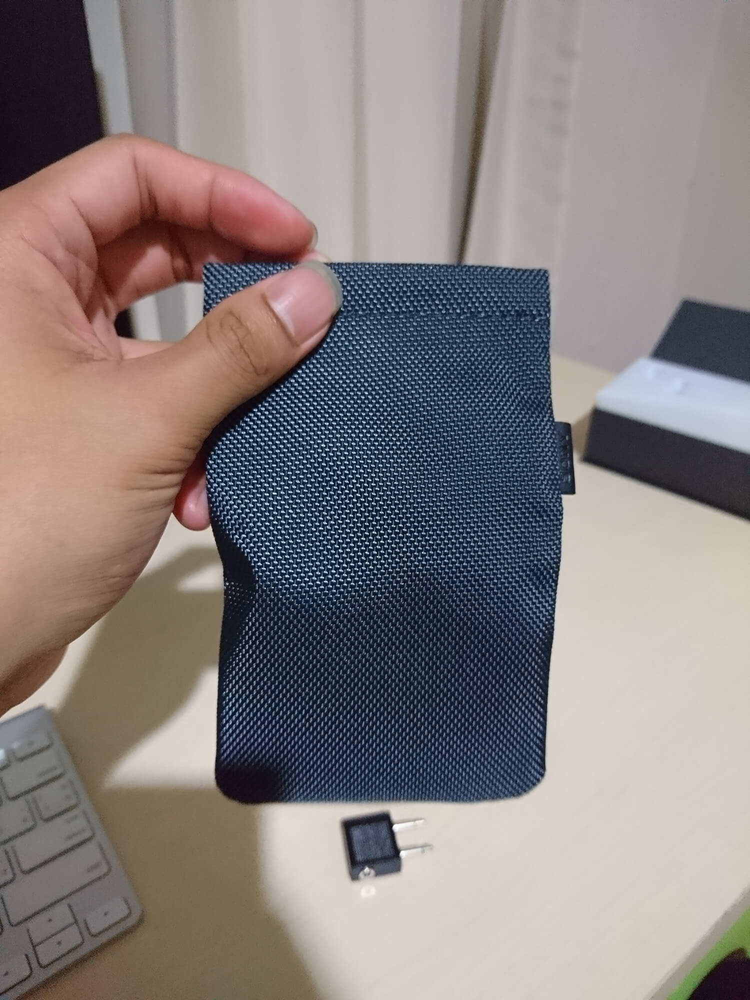

เป็นรีวิวที่หลายคนถามถึงมาก และผมก็ไม่ได้เขียนสักที ตอนนี้แหละก็เป็นเวลาอันสมควรแล้วที่จะได้เริ่มเขียนกันสักที กับหูฟังความละเอียดสูงจาก Sony กับ **Sony h.ear in NC** ที่เป็นหูฟังความละเอียดสูงพร้อมระบบตัวเสียงรบกวนตัวแรกจาก Sony

## Digital NC คืออะไร ?
จริง ๆ เทคโนโลยี**Noise Cancelling** มันมีมานานแล้ว แต่มันจะถูกเอามาใส่กับหูฟังรุ่นปกติ ไม่ได้เอามาใส่กับรุ่นความละเอียดสูง ตัวประมวลผลมันจะเร็วไม่พอที่จะตัดเสียงรอบข้างได้อย่างแม่นยำ

หลักการทำงานของมันก็คือ มันจะรับเสียงมาจากไมค์ที่อยู่บริเวณหูฟังของเรา แล้วพยายามสร้างเสียงที่อยู่ในเฟสตรงข้ามออกมา ผลที่ได้คือ เมื่อเสียงที่อยู่ข้างนอก รวมกับเสียงที่อยู่ในเฟสตรงข้าม มันจะหักล้างกันพอดี นั่นทำให้เราไม่ได้ยินเสียงนั้น ๆ

## Unboxing Sony h.ear in NC

ก่อนที่ะไปเรื่องอื่น เรามาแกะกล่องกันก่อน ตัวกล่องภาพนอกจะเป็นกล่องสีขาว พร้อมกับชื่อรุ่น และมีโลโก้ Hi-Res เป็นการบอกว่าหูฟังตัวนี้เป็นหูฟังความละเอียดสูงอยู่ด้วย ส่วนกล่องข้าง ๆ เป็น **Xperia X Compact** เดี๋ยวจะมารีวิวกันอีกรอบนึงนะแจ๊ะ

แกะกล่องข้างนอกออกมา เราจะได้อีกกล่องเป็นกล่องสีดำมีโลโก้ของ Sony ที่จับแล้วรู้สึกได้ถึงความเรียบหรูและ Premium ของหูฟังอันนี้

เปิดกล่องดำออกมา เราก็จะเห็น**h.ear in NC** วางอยู่อย่างสวยงาม ~

นอกจากตัวหูฟังแล้ว แกะกล่องดำออกมาด้านล่างก็ยังมีอุปกรณ์มากให้เราอีกหลายอย่าง

อย่างแรกนี่หลาย ๆ คนน่าจะไม่รู้จัก แต่มันคือตัวแปลงไว้เสียบหูหังบนเครื่องบิน ตอนแรกก็ไม่คิดว่าจะได้ใช้แหละ สุดท้ายก็ได้ใช้อยู่ดี ฮ่า ๆ เสียงเวลาใช้บนเครื่องบินก็โอเค อยู่ในคุณภาพที่พอรับได้อยู่ เดี๋ยวจะมาอธิบายในช่วงต่อไป

สิ่งที่ขาดไม่ได้คือ จุกหูฟังขนาดต่าง ๆ เพราะขนาดหูคนเราไม่เท่ากันเลยต้องทำจุกเปลี่ยนมาให้ โดยมีขนาดละคู่ ตั้งแต่เล็กไปจนใหญ่ โดยตัวที่ใส่ให้กับตัวหูหังเป็นขนาดกลาง ซึ่งในถุงนี้ก็มีขนาดกลางมาให้อีกชุดเช่นกันเผื่อทำหาย ฮ่า ๆ

นอกจากนี้ยังมีที่หนีบด้วย เผื่อเราจะเอามาใช้หนีบตัวสายกับเสื้อเรา เวลาใช้ไปเดินไป หรือทำกิจกรรมอื่น ๆ ได้มันจะได้ไม่ขยับไปมา

สิ่งที่สำคัญสำหรับหูฟังนี้อีกอย่างคือ สายชาร์จ ที่หัวเป็น Micro USB เหมือนที่เราใช้ชาร์จโทรศัพท์ Android ในปัจจุบัน แต่ในกล่องจะไม่มี Adapter มาให้นะ ให้เสียบคอมชาร์จเอา

และสุดท้าย ท้ายสุด ถ้าหูฟังแพงขนาดนี้มันก็ต้องมาพร้อมกับที่ใส่แน่นอน ซึ่งที่ได้มาก็เป็นสีน้ำเงินกรม มีความเงาเล็กน้อย เวลาจะใช้ก็กดที่ขอบทั้ง 2 ข้างแล้วเอาออกมา เสร็จก็ปล่อยมันจะปิดเอง รับรองไม่หล่นหายจากถุงใส่แน่นอน ถ้าเป็นอีกรุ่นที่เป็นตัว ธรรมดา ไม่มี NC ซองที่ได้จะหน้าตาเหมือนกัน แต่ความยาวจะลดลงครึ่งหนึ่งพอดี

#### Design

ตัวหูฟังจะประกอบไปด้วย 3 ส่วนหลัก ๆ คือ ตัวหูฟัง ชุดประมวลผล NC และแบตเตอรี่ ซึ่งสายจะเป็นสายที่เซาะร่องไว้กันสายพันกัน

ในส่วนแรกจะเป็น ส่วนของแบตเตอรี่ ที่หัวมันสามารถเปิดออกมาได้ โดยข้างในจะเป็นหัว Micro USB สำหรับการชาร์จ และจะมีหลอดไฟสีแดงแสดงการชาร์จอีกด้วย

ส่วนต่อไปจะเป็นส่วนประมวลผล NC หรือ Noise Cancelling เพราะหูฟังตัวนี้เป็น Digital Noise Cancelling เพราะฉะนั้น มันจะต้องมีตัวประมวลผลมาด้วย ซึ่งนี่ก็คือชุดประมวลผล ด้านหน้าจะมีโลโก้ของ Digital NC อยู่ และมี Switch ไว้เปิดปิดตัว Digital NC พร้อมกับไฟแสดงสถานะ

ส่วนด้านหลังจะเป็นปุ่ม Media Control ซึ่งจะเป็น Single Button ที่รองรับทั้งฝั่ง Android และ iOS ได้หมดถ้าสดชื่นเลย และยังมีรูไมค์สำหรับสนทนาด้วย เวลาถ้าเราใช้ไมค์อยู่ หูฟังมันจะเอาเสียงจากไมค์มาเล่นใส่หูฟังของเราด้วย เวลาที่เราเปิดใช้งาน NC

ส่วนสุดท้ายที่หูฟังทุกอันต้องมีคือตัวหูฟังนั่นเอง ซึ่งหูฟังรุ่นนี้ก็จะมาในรูปแบบ In Ear หรือแบบเสียบเข้าไปในหูเลย แต่ตัวหูฟังรุ่น NC จะมีขนาดและน้ำหนักที่มากกว่าตัวรุ่นธรรมดา เพราะในหูฟัง นอกจากจะมีตัวลำโพงแล้ว มันยังมีไมค์อีก 2 ตัวสำหรับตัดเสียงรบกวนข้างละ 2 ตัวอีกด้วย

สำหรับตัวขับเสียงในหูฟังรุ่นนี้จะใช้เป็น Driver ขนาด 9 mm ที่มีความไวต่อสัญญาณมาก ๆ เพราะมันต้องรองรับตัว Hi-Res Audio

ส่วนไมค์ทั้ง 2 ตัวที่ทำหน้าที่รับเสียงจากภาพนอก ตัวนึงจะอยู่ข้างหลังตัวหูฟังเรา เรียกว่า Feedforward ที่จะมีหน้าที่คอยรับเสียงจากข้างนอก และอีกตัวคือ Feedback ที่จะเป็นรูเล็ก ๆ อยู่บริเวณโคนของตัวหูฟัง ไว้รับเสียงที่อยู่ใกล้ ๆ

## ทดลองฟังกันดีกว่า

จากที่ได้ลองใช้มาพอสมควร เป็นเดือน ๆ (กว่าจะได้มาเขียนฮ่า ๆ) ก็ได้ลองเอาไปใช้ในหลาย ๆ โอกาส ทั้งในที่เงียบ ๆ จนไปถึงบนเครื่องบิน พบว่า เรื่องของการตัดเสียงก็ทำได้ดีอยู่พอสมควร มันสามารถจัดเสียงย่านต่ำ ๆ ได้จนไม่เหลือเลย ได้ยินอย่างมากคือ เสียงคนคุยกัน

สำหรับใครที่จะใช้บนเครื่องบินบอกเลยว่า มันดีมาก จากที่ลองใช้บนเครื่องบิน คือเสียงบนเครื่องบินหายไปเลย หลับสบายมากเลยทีเดียว

น้ำเสียงที่ให้เบสจะลงลึกไม่มาก ฟังแล้วไม่ปวดหู เสียงกลางจะเด่นออกมาซะมากกว่า ส่วนเสียงย่านสูงก็ยังให้รายละเอียดเสียงที่ค่อนข้างดีเลยทีเดียว น้ำเสียงรวม ๆ จะ**เหมือนกับรุ่นที่ไม่มี NC เลย**

แต่เมื่อเราเปิดใช้ NC แล้วน้ำเสียงมันฟังดูแล้วแน่น และดังขึ้นเยอะ น้ำเสียงย่านกลางจะฟังแล้วเด่นขึ้นมามากกว่าเดิม แต่ย่านลึกมันจะหายไปนิดหน่อย แต่ก็ไม่ได้รู้สึกอะไรมากขนาดนั้น รวม ๆ แล้วจะรู้สึกว่าเสียงมันจะแน่นขึ้นเยอะพอสมควรเลย

เมื่อเสียงเพลงรวมกับตัวตัดเสียงรบกวนแล้ว เรียกได้ว่า เราถูกตัดขาดจากโลกภายนอกกันเลยทีเดียว ตัวตัดเสียงที่ทำให้เงียบมาก ๆ และเมื่อรวมกับเสียงเพลงแล้วนี่คือ หายตัวไปเลย ใช้แรก ๆ รู้สึกเหมือนหูอื้อเหมือนกัน รู้สึกแปลก ๆ ใช่ช่วงแรก ๆ

ส่วนเรื่องของแบตเตอรี่ จากการใช้งานวันละประมาณ 3-4 ชั่วโมงจะใช้ได้ประมาณ 3-4 วันเช่นกัน ถ้าเกิดแบตหมดระหว่างทาง เราก็สามารถปิด NC และใช้งานต่อได้ทันที ไม่ต้องกลัวแบตหมดระหว่างทาง

วิธีการดูแบตที่เหลือก็ดูที่ไฟตรงชุดประมวลผล NC จำนวนครั้งไฟที่กระพริบจะบอกเปอร์เซ็นต์ของแบต เวลาการชาร์จก็ไม่นานมาก แค่สักชั่วโมงเดียวก็เต็มแล้ว เวลาเต็มไฟแสดงการชาร์จมันจะดับ แสดงบอกให้เราเห็น

## สรุป

หูฟัง Sony h.ear in NC ก็เป็นหูฟังอีกรุ่นที่น่าสนใจเลย สำหรับใครที่กำลังต้องการหูฟังตัดเสียงรบกวนแบบพกพา น้ำเสียงที่ให้มาก็มาในแบบฉบับของ Sony ถ้าเกิดใครที่เคยใช้ Sony มาก่อน น่าจะคุ้นเคยกับมันเหมือนเดิมเลย เมื่อรวมกับ NC แล้วก็ทำให้ได้เสียงที่แน่นขึ้นไปอีก ฟังออกมาแล้วก็ใช้ได้อยู่ แต่เรื่องของมิติ เบส และเสียงย่านแหลมอาจจะยังสู้ตัวรุ่นพี่ของมันไม่ได้ แต่ก็สมราคาเลยทีเดียว ค่าเสียหายอยู่ที่เกือบ 5000 แต่ตอนนั้นซื้อโทรศัพท์ Sony ในงาน Thailand Mobile Expo ด้วยเลยได้ลดตัวหูฟังไป 10% เลยดีไป
