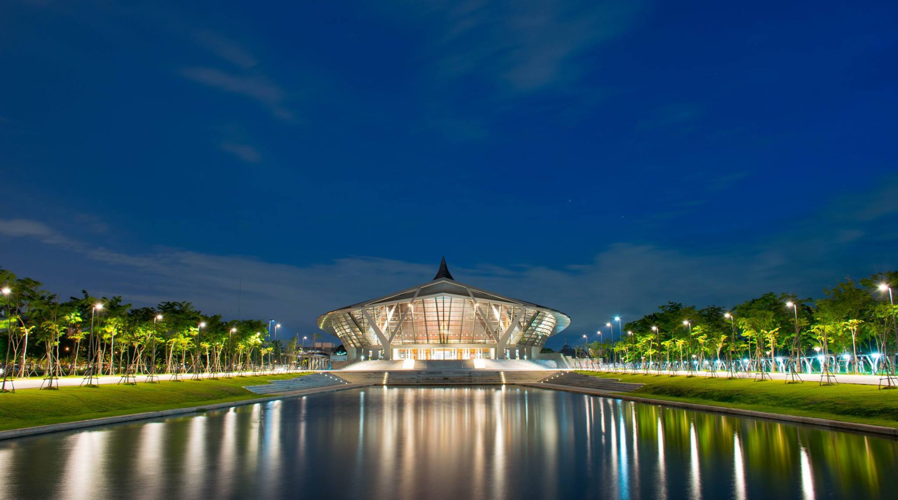

ช่วงนี้เพื่อน ๆ ก็คงจะปิดเทอมกันหมดแล้วแหละ ส่วนใครที่ยังก็สู้ต่อไปนะทาเคชิ ส่วนเราสอบเสร็จ โปรเจ็คหมดแล้ว ปิดเทอมแบบเต็มตัวแล้วเฮ้ ! ตามธรรมเนียม (เหรอ?) ที่ผมจะเขียนว่าในหนึ่งปีที่เรียนมามีอะไรเกิดขึ้นบ้าง ทั้งสนุก ทั้งทุกข์ ปน ๆ กันไป รวม ๆ ปีนี้ก็เป็นอีกปีที่สนุกดี แต่นรกกว่าตอนปี 1 เยอะมาก ทั้ง Project และงานต่าง ๆ ที่มากขึ้นตามความรับผิดชอบที่ต้องมีมากขึ้น (แต่เรามีเท่าเดิมไงประเด็น !)

ตอนปี 1 แรก ๆ จำได้ว่า ตอนนั้นออกจากหอตอน 7 โมงเพื่อไปกินข้าว แต่เดี๋ยวนี้คือตื่นมาก็ 7 โมงครึ่งอาบน้ำ ปั่นจักก้าไปเรียน ถึงคณะตอน 8.45 OMG! บางทีความซวยมาเยือน เรียน 9 โมงตื่นมาก็ 8.45 แล้ว วิ่งสิครับ วิ่งชีวิตตอนนี้ช่างต่างจากตอนแรกอย่างรุนแรงมาก

ก่อนจะพูดถึงเรื่องเรียน พูดถึงงานหลักของปีนี้ก่อนดีกว่า นั่นคือการแข่งขัน ปีที่แล้ว ก็มีลงพวกเขียนโปรแกรมอย่าง ACM-ICPC แต่พบว่า ตัวเองนั้นไม่ได้ชอบด้านนั้นสักเท่าไหร่ แค่พอทำเป็นงานอดิเรก สนุก ๆ ได้ นั่นคือ ไม่อยากจริงจังกับมันนั่นแหละ ปีนี้เลย ลองส่ง Imagine Cup ที่ Microsoft เป็นคนจัด เอาจริง ๆ เลยคือ มันกินเวลาชีวิตไปเยอะมาก ๆ เยอะจนไม่มีเวลาได้สนใจคนรอบตัว หรือทำอะไรเลย ถ้าสังเกตมันจะมีช่วงนึงที่ผมไม่ได้มานั่งเขียน Blog หายไปช่วงใหญ่ ๆ เลย นั่นก็เพราะว่าไปนั่งทำ Imagine Cup อยู่นั่นแหละ แต่ก็ชนะเลิศน้าา (ตอนประกาศผลคือ อ้าวทีมเราเหรอ ? อึ้งไปดิ) แต่ปลายทางก็ไม่สำคัญเท่ากับ ระหว่างทางเลย ระหว่างทางเป็นเดือน ๆ สนุกมาก ๆ เลย แต่สิ่งที่น่ากลัวคือ การถูกสื่อรุมเร้า (ตรง ๆ เลยคือไม่ชอบการถูกทำให้เป็นที่สนใจเท่าไหร่) ปล.ขอบคุณภาพสวย ๆ จากทาง Microsoft ประเทศไทย

ปีนี้ก็ปี 2 รู้สึกเหมือนว่าจำนวน การบ้าน มันน้อยลงยังไงก็ไม่รู้เหมือนกัน หรือแค่รู้สึกไปเองไม่รู้ แต่ที่รู้ ๆ คือ Project มันมาเยือนแล้ว และมันมาอย่างน่ากลัวมาก ๆ ด้วย เพราะจำนวนของมันก็ไม่เยอะนะ แต่ใน 1 Project กว่าจะได้มันมานี่ช่างแสนสาหัสเหลือเกิน แต่สิ่งนึงที่เรียนรู้จากการทำ Project คือ การทำงานร่วมกับคนอื่น บางทีเราอาจจะบอกว่า เราเก่ง เราโน้นเรานี้ เรา Carry กลุ่มให้ได้ แต่การทำงานจริง ๆ แล้ว เราไม่สามารถที่จะ Carry กลุ่มได้ด้วยคน ๆ เดียวหรอก เราต้องอาศัยคนในกลุ่มช่วยกันทำงานให้เสร็จ และแน่นอนว่า ในกลุ่มผมก็กลายเป็นคนดูงานส่วนใหญ่ไปตามระเบียบ ยิ่งตอนนั้นก็ต้องทำ Imagine Cup ไปด้วยเลยไม่ค่อยมีเวลาไปดูงานกลุ่มเท่าไหร่ (เอาจริง ๆ ก็รู้สึกผิดหนัก ๆ เลยล่ะ) ตอนนั้นคือ งาน จะต้องส่งในวันถัดไป แต่ยังคืบหน้าไม่ถึง 40% เลยด้วยซ้ำ ตอนนั้นก็แทบตายเหมือนกัน ไม่นึกว่าจะเสร็จได้ด้วยซ้ำ ตอนนั้นก็รู้สึกผิดเหมือนกัน ที่ใช้อารมณ์ไปบ้าง แต่ก็ผ่านมาได้ด้วยดีล่ะ

สิ่งหนึ่งที่เปลี่ยนไปจากตอนปี 1 อย่างเห็นได้ชัดคือ ช่วงสอบ เหมือนตอนปี 2 จะดูชิวกว่าตอนปี 1 เยอะเลย เมื่อตอนปี 1 ผมอ่านหนังสือล่วงหน้าเป็นเดือน ๆ เพื่อไปสอบ แต่ตอนนี้ปี 2 อย่างที่บอกว่า การบ้านกับ Project ผุดมันมาเป็นดอกเห็ดบานเต็มไปหมด เลยทำให้ไม่มีเวลาไปอ่านหนังสือเหมือนตอนปี 1 เลย ปีนี้สิ่งที่ทำคือ One Night Miracle กันล้วน ๆ อ่านมันเข้าไปคืนนึงก่อนสอบ และถ้าใครหลาย ๆ คนที่มีเฟสผมจะเห็นว่า ช่วงสอบนี้ มีการเล่นเกม และการโพสต์สเตตัสเยอะเป็นพิเศษ ดูเหมือนจะไม่อ่านหนังสือ แต่จริง ๆ เราอ่านน้า แต่แค่ไม่ได้โพสต์ลงเฟสว่าอ่านเท่านั้นเอง จริง ๆ น้าาาา

นอกจากการแข่งขัน และการเรียนบวกโปรเจ็คอันมหาศาลแล้วก็ยังมีกิจกรรมต่าง ๆ อีก ปีน้ีสิ่งที่ดูน่ามันส์ที่สุดเลย คือ การมาเป็นสมาชิกสภานักศึกษาเลย ช่วงแรก ๆ ก็ไม่ได้ทำอะไรเลยจริง ๆ เพราะก็ยังยุ่งอยู่กับ Imagine Cup นี่แหละ แต่ตอนนี้ก็ผ่านมันไประดับนึงแล้ว เลยเข้าไปช่วยสักหน่อย กลับมางานกองเป็นภูเขาเลย ปิดเทอมนี้นี่ไม่ได้พักกันเลยทีเดียว แต่ก็สนุกดีนะ ที่ได้ทำงานกับคณะอื่น ๆ เพราะว่าปกติแล้ว คณะผมไม่ได้ผูกมิตรกับคณะอื่นเท่าไหร่ เพราะเรียนอยู่ในตึกของตัวเอง การมาทำแบบนี้ก็ทำให้เราได้รู้จักการทำงานกับคนอื่น ๆ มากขึ้นมากเลยนะ

อีกงาน งานนนี้ไม่น่าจะลืมได้เลย นั่นคืองาน Open House นั่นเอง ที่จู่ ๆ ถูกลากให้มาทำงานเฉย แบบ งง ๆ เหมือนกัน แต่งานก็ออกมาดีมาก ๆ เลยอยากจะขอบคุณทุกคนที่ช่วยกันลงแรง จัดงานนี้ขึ้นมาจนได้ ปีนี้ก็คงต้องช่วยกันหน่อยแล้วล่ะนะ หวังว่าปีนี้ก็จะสนุกเหมือนปีที่แล้วล่ะน้าา

อย่างที่เล่าไปว่า ปีนี้เป็นปีที่ยุ่งมาก ๆ เลยไม่ค่อยมีเวลาได้จับกล้องเท่าไหร่เลย เสียไต… TT  แต่ก็ได้รูปสวย ๆ มาเยอะเลยปีนี้ ว่าจะทำ Gallary บนหน้าเว็บตัวเองกับขายรูปสักหน่อยก็ไม่เลวเหมือนกัน ปีหน้าก็ว่าจะทำกิจกรรมน้อยลง และตั้งใจเรียนมากขึ้นแล้วล่ะ ไม่งั้นมีหวังได้ตายก่อนแน่ ๆ จากปีที่แล้วที่ไม่ค่อยได้ทำกิจกรรมเลย กลายเป็นว่าปีนี้ทำเยอะไปซะงั้น ปีหน้าเลยว่าจะขอพักไปฝึกฝีมือสักหน่อย เคยมีพี่คนนึงที่รู้จักเคยพูดกับผมว่า “แกจะทำอะไรก็ได้นะ ถ้าหน้าที่หลักแกทำมันได้ดีแล้ว” ซึ่งหน้าที่หลักของเราตอนนี้นั่นคือ การเรียน ไม่ใช่การทำกิจกรรม การทำกิจกรรมเพิ่มเติมมันเป็นเรื่องรอง แต่ปีนี้กลายเป็นว่าผมทำให้มันเป็นงานหลักซะงั้น เลยทำให้อะไร ๆ หลาย ๆ อย่างก็พังแบบไม่เป็นท่าเลย แม้แต่เรื่องเรียนก็ตาม คิดซะว่ามันคือบทเรียนล่ะกัน ที่ปีหน้าจะไม่ทำอีก

และก็จบแล้วกับปี 2 ที่มีแต่งาน เสียงหัวเราะ เคล้าน้ำตาเบา ๆ ในวันก่อนส่ง Project แต่ก็เป็นปีที่สนุกมาก ๆ แล้วเจอกันใหม่ปี 3 (แก่โคตร) หวังว่าปีหน้าจะมีอะไรสนุก ๆ มากขึ้นไปอีก เปลี่ยนสี Strap = เพิ่มอายุเฮ้ สวัสดี !
