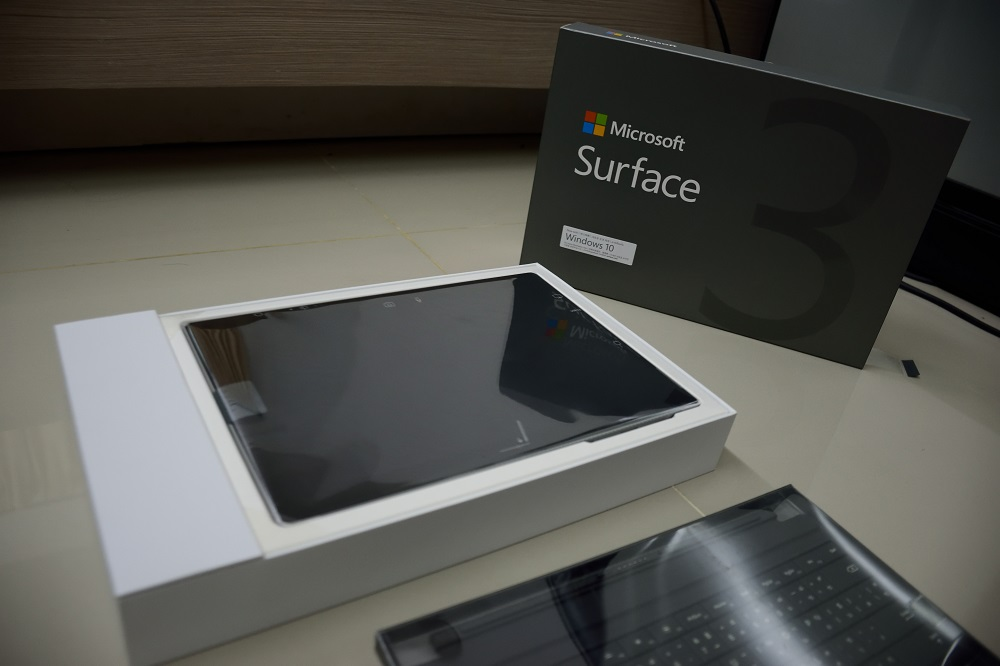
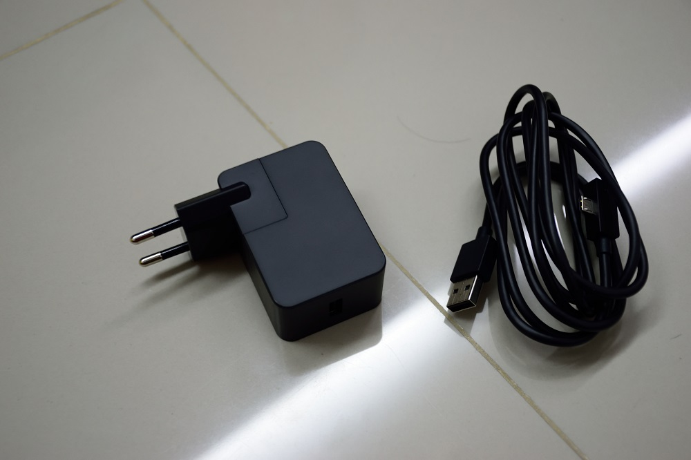
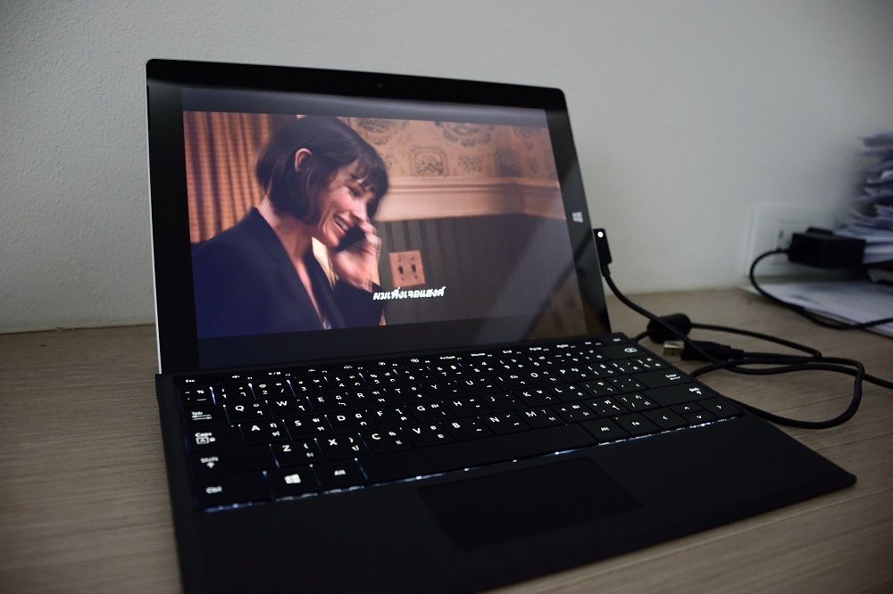
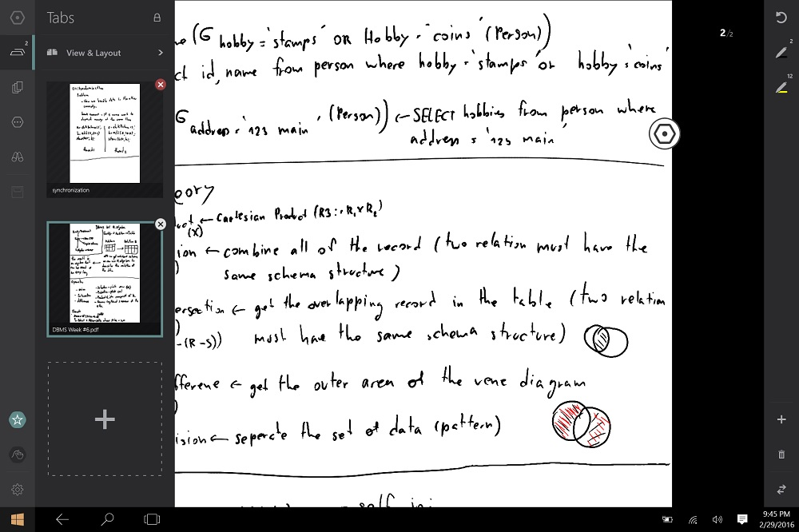
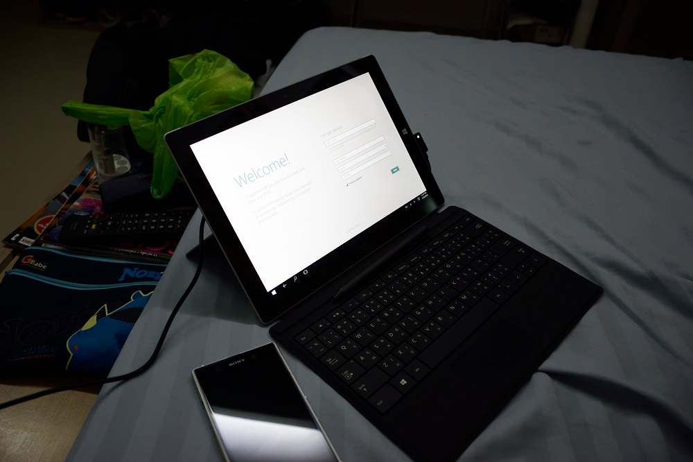

สวัสดี โอ๋เล้ หายไปนานเลย ช่วงนี้งานเยอะจริง ๆ เลยไม่ค่อยได้เขียนเลย แต่ก็ช่างมันก่อน วันนี้เรามีของเล่นใหม่ของเรามารีวิวให้อ่านกัน นั่นคือ Surface 3 เหตุที่ซื้อนี่เพราะว่า อยากได้ Tablet ที่เบา ๆ เบากว่า Macbook Pro ที่ใช้อยู่ ส่วนใหญ่ว่าจะเอามา เขียน Blog หรือดูหนังอะไรแบบนี้ เลยจัดมาซะเลย

## Unboxing

ลองมาเปิดกล่องดูกันดีกว่า ตัวกล่องก็จะเป็นกล่องกระดาษเรียบ ๆ เขียนว่า Surface แล้วก็มีเลข 3 เป็นมัน ๆ ตัวใหญ่ ๆ เพื่อบอกตัวเองอย่างเต็มปากว่านี่คือ Surface 3 นั่นเอง เปิดกล่องเข้ามาก็จะเจอตัวเครื่อง Surface อันใหญ่โตวางอยู่ในกล่องหุ้มด้วยพลาดติดกันรอยอย่างแน่นหนา

ไปดูหลังกล่องกันบ้าง ก็เป็นรายละเอียดของตัวเครื่อง ในหลาย ๆ ภาษามากมาย แต่ก็ช่างมันไป พร้อมกับเขียนรุ่น และความจุ SDD และแรม ไว้อย่างชัดเจน ตัวที่เอามารีวิวนี้เป็นรุ่นล่างสุด เป็น 64 GB SDD และ Ram 2 GB
ส่วน Processor จะใช้เป็น Intel Atom x7 เป็น Quad Core แบบประหยัดพลังงานสุด ๆ ทั้งในรุ่น 64 GB และ 128 GB แต่ในเรื่องของ Performance เองก็ไม่ได้ด้อยเท่าไหร่เลย กับการใช้งานในชีวิตประจำวัน เช่น เล่นเน็ต ดูวีดีโอ 1080p หรือทำงานเอกสาร แต่ถ้าเอามาทำงานหนัง ๆ อย่าง Photoshop ก็อาจจะมีหน่วงบ้าง (ไม่บ้างอะ เยอะเลย)
ด้วย Processor ประหยัดพลังงานอย่าง Intel Atom แล้ว จะเห็นได้ว่า ตัวเครื่อง ไม่จำเป็นต้องใช้พัดลมเลย (ถ้าใช้หนักมาก ๆ ก็แค่อุ่น ๆ)เพราะอัตราการปล่อยความร้อนอยู่ในระดับที่น้อยมาก ๆ

พอเอาเครื่องออกไป ก็จะเจอกับคู่มือพวก Quick Start วางอยู่ อ่าน ๆ ดูแล้วก็ไม่มีอะไร แค่บอกว่า ปุ่มอะไรอยู่ตรงไหนบ้าง และจะ Getting Start ยังไง สำหรับมือใหม่ที่แม้แต่เปิดคอมยังไม่เป็นก็อ่านได้แน่นอน

นอกจากตัวเครื่อง และคู่มือแล้ว ในกล่องก็ยังมีสาย Micro USB พร้อม Adapter แปลงไฟมาด้วย (ถ้าซื้อแล้ว ไม่ได้ที่ชาร์จจะใช้อะไรเล่า โธ่ !!!!) โดย Adapter ที่ให้มาจะเป็น Adapter ขนาด 2.5 A ที่ชาร์จช้ามาก ๆ (อันนี้ความจริงจากใจ)

และที่หัว Micro USB ก็จะมีไฟแสดงสถานะในการชาร์จบอกด้วย ซึ่งก็ยัง งง ว่ามันบอกอะไร เพราะเมื่อเช้าชาร์จไปทั้งคืน เช้ามาไฟมันยังติดอยู่เลย เลยแอบ งง นิด ๆ จริง ๆ การที่ Surface ธรรมดาใช้ที่ชาร์จเป็นหัว Micro USB ก็ดีอย่าง เพราะเคยไปใช้ Surface Pro มาแล้วพบว่า ในระยะยาวหัวชาร์จที่เป็นแม่เหล็กมันจะหลวมและชาร์จเข้าบ้าง ไม่เข้าบ้าง อีกประโยชน์คือ สามารถใช้สายชาร์จโทรศัพท์ชาร์จได้เลย (เฉพาะโทรศัพท์ที่ใช้ Micro USB) เท่านั้นนะ

ไปที่ Port การเชื่อมต่อกันบ้าง Tablet ปกติ จะมีแค่ Port ที่เสียบชาร์จไฟอย่างเดียว แต่ Surface มีมากกว่านั้นเยอะ ไล่จากบนลงล่างก็จะเป็น Display Port ที่สามารถต่อออกจอ 4k ได้สบาย ๆ ถัดไปเป็น USB 3.0 ที่สามารถเอา Flash Drive หรือ Ex.HDD มาเสียบได้ด้วย Micro USB สำหรับการชาร์จ และสุดท้ายก็เป็น Jack หูฟัง 3.5 ไว้เสียบหูฟังรวมทั้งไมค์ใน Port เดียว และด้านหลังก็มีช่องเสียบ Micro SD มาให้ด้วยนะ

ไปที่อีกฝั่งนึง ก็โล่งเตียน ไม่มีอะไรเลย ลืมบอกไปว่า มันมีกล้องด้วยนะ กล้องหน้าจะเป็น 3.5 ล้านพิเซล และกล้องหลังเป็น 8 ล้านพิเซล

ถัดไปจะเป็นอุปกรณ์เสริมต่อกันเลย ในที่นี้ซื้อมาเป็น ปากกา และ Keyboard เรามาเริ่มกันที่ Keyboard กันก่อนดีกว่า

Keyboard ที่ซื้อมา จะเป็นสีดำ จริง ๆ อยากได้สีฟ้า แต่มันหมดแล้ว เลยอดไป โดยตัว Keyboard ก็รองรับภาษาไทยได้ตามปกติ มีปุ่ม Function ต่าง ๆ ในการเพิ่มลดแสง หน้าจอ หรือปิดเสียงอะไรทำนองนั้น นอกจากนั้น มันยังมีไฟด้วยนะเออ เท่ป่ะล่ะ ! สำหรับคนที่ต้องพิมพ์งานในที่ที่ มีแสงสว่างน้อย
วิธีการต่อ ง่าย ๆ มาก ๆ แค่เอาไปใกล้ ๆ กันมันก็จะดูติดกันเอง เพราะมันเป็นแม่เหล็ก ที่โคตรแรง ไปดูรีวิวต่างประเทศมาก บอกว่ามันสามารถที่จะหยิบแค่ Keyboard ขึ้นมาได้เลย โดยที่เครื่องไม่ตกด้วยไง สะพรึ่งไปเลย ไม่กล้าทำจริง ๆ
นอกจากนั้นเวลาเราใช้งาน ถ้าเป็น Surface รุ่นก่อน ๆ เวลาเราต่อ Keyboard มันก็จะราบไปกับพื้นเลย ทำให้เราเมื่อยมาก ๆ เวลาเราพิมพ์ไปนาน ๆ ในรุ่นนี้เขาเลยทำให้มันสามารถยกขึ้นมาได้นิดนึง เพื่อความสบายในการพิมพ์ และสุขภาพของคุณนะครับ
**ข้อสังเกต** ปุ่มมันติดกันไปหน่อย โดยปกติ ผมจะใช้ Macbook Pro ในการพิมพ์ ซึ่งตอนนี้ก็ได้ใช้มาสักพักแล้ว ก็รู้สึกว่า มันทำให้เราพิมพ์ผิดเยอะมาก ๆ แต่ถ้าใช้ไปมันคงชินล่ะ แต่ใน Surface Pro 4 Keyboard มันมีช่องไฟ แล้วนะ ทำให้พิมพ์ง่ายขึ้นเยอะเลย อีกอย่างนั่นคือ ขนาดของ Trackpad คือจะบอกว่า มันเล็กไปหน่อยนะ แนะนำถ้าต้องใช้จริง ๆ ให้เอาเมาส์จริง ๆ มาต่อดีกว่า เพื่อสุขภาพจิตที่ดีในการใช้งาน

ถัดจาก Keyboard ก็เป็น ปากกาและ อย่างที่รู้กันมาจากที่อื่นว่า หน้าจอของ Surface สามารถรับแรงกดได้หลาย ๆ ระดับคล้าย ๆ กับ Galaxy Note ที่สามารถเอาปากกามาวาดรูป หรือเขียนอะไรได้ กดเข้มก็จะเข้ม หรือร่าง ๆ เบา ๆ มันก็จะอ่อน ๆ เหมือนวาดกระดาษจริง ๆ เลย เมื่อก่อนเคยใช้ Galaxy Note มันก็ยังไม่สามารถทำให้เราสะดวกได้เลย พอลองไปเล่น Galaxy Note 10.1 ก็ยังไม่โออยู่ดี Surface เป็นเครื่องแรกเลย ที่ทำให้ลืมกระดาษปกติไปเลย มันลื่นเขียนสบายมาก ๆ

ที่แหล่มมาก ๆ เลยคือที่หัวปากกามันเป็นยางลบด้วยนะ (เฉพาะ App ที่รองรับ) เราสามารถเอาหัวปากกามาขีด ๆ มันเราใช้ยางลบก้นดินสอลบได้เลย นอกจากนั้น มันยังเป็นปุ่มด้วย พอกดปุ๊บ One Note ซึ่งเป็นโปรแกรมจด Note ของ Microsoft ก็จะเด้งขึ้นมา พร้อมให้เราจดทันทีเลย เหมาะมากสำหรับคนที่เร่งรีบ
ที่มันกดได้ เพราะว่า ในตัวปากกามันเชื่อมต่อกับตัวเครื่องผ่านทาง Bluetooth อยู่ และแน่นอนว่า ในปากกา ก็ต้องมีแหล่งพลังงานด้วย นั่นคือถ่าน AAA 1 ก้อนนั่นเอง

น้ำหนักของมันก็กำลังดีมาก ๆ ไม่หนักไป ไม่เบาไป ให้อารมณ์เหมือนเราถือดินสออยู่จริง ๆ เลย
นอกจากนี้ตัวปากกา ก็ยังมีหัวมาให้เปลี่ยนหลาย ๆ ไซส์ด้วยนะ แต่ที่แอบ งง คือ ไซส์ของมันเป็น HB B 2B อะไรแบบนี้ เลยแอบ งง ว่า มันต่างกันยังไง แต่ไส้ที่มันใส่มาให้จะเป็น HB นะ

## Screen & Sound

มาที่เรื่องจอกันบ้าง โดยจะเป็นจอ 10.8 นิ้ว Full HD 1080p ClearType เลยนะ เพราะฉะนั้นแล้วเรื่องความชัดแล้ว ไม่ต้องเป็นห่วงเลย ชัดคมกริบแน่นอน จากที่ได้ใช้มา ก็ได้อยู่นะ คมใกล้ ๆ กับ Macbook Pro เลย ให้ความรู้สึกที่ไม่ต่างกันมากเท่าไหร่ อาจจะเพราะว่า Surface จอมันเล็กด้วย เลยแยกไม่ค่อยออกเท่าไหร่ รวม ๆ เรื่องของจอถือว่า ผ่านเลยจริง ๆ

มาที่เรื่องของเสียงกันบ้าง ฝั่งเสียงก็ถือว่า ทำได้ดีไม่แพ้กัน เป็นลำโพง Stereo อยู่ที่จอทั้ง 2 ข้าง เสียงที่ขับออกมาถือว่าอยู่ในระดับที่ดีมาก ๆ เลย ชอบมาก ๆ เสียงใสมาก ๆ เบสก็ใช้ได้อยู่ แต่ก็ไม่ได้หนักอะไรขนาดนั้น ถ้าเอามาใช้ดูหนังหรือฟังเพลงคนเดียวก็ได้อยู่นะ แต่ถ้าอยู่หลาย ๆ คนอาจจะต้องใช้ลำโพง เพราะว่าเสียงที่มันขับออกมาได้ ไม่ได้ดังมากขนาดนั้น

## Software

ทางฝั่งของ Software เองก็ไม่น้อยหน้ามาพร้อมกับระบบปฏิบัติการล่าสุดอย่าง Windows 10 แน่นอน และนอกจากนั้น ถ้าเราเปิดเข้าเครื่องไป จะเห็นว่า เราจะได้ Office 365 Personal ให้ใช้ฟรี ๆ เป็นเวลา 1 ปีด้วย
และที่ชอบที่สุดคือมันมี App Drawboard ซึ่งเป็น App ที่ทำให้เราสามารถจด Note ได้อย่างง่ายดายจริง ๆ และพร้อมแปลงเป็น PDF ได้ด้วยนะ มาให้ด้วยซึ่งถ้าเราซื้อจาก Store ปกติมันจะตกประมาณ 300-400 บาท ไม่มั่นใจ แต่ถ้าซื้อ Surface มันจะมาพร้อมกับเครื่องเลย (App นี้เดี๋ยวไว้คุยกันลึก ๆ ในตอนหน้าอีกที พร้อมกับ พาร์ท User Experience)

## Battery
เท่าที่ลองใช้มา 1 วันเต็ม ใช้ทั้งวันจริง ๆ ในคายเรียนก็ใช้จดงาน เวลาว่างก็ใช้ดู Youtube แก้งานใน Microsoft Word กลับมาห้องก็เหลือสัก 30 กว่าเปอร์เซ็นเลย ถ้าเทียบกับ Tablet เจ้าอื่น ๆ จะพบว่า มันประหยัดกว่า Surface ซะอีก แต่เราสามารถเปิดยิดอายุการใช้งานได้โดย ปิดพวก Wifi และ Bluetooth และเปิด Power Saving Mode

## สรุป

โดยรวม ๆ แล้ว Surface 3 ก็ถือว่าเป็น Tablet ที่ไม่เลวเลย ด้วย Form Factor ที่พกพาสะดวก และยังมี Keyboard และปากกาเพื่อช่วยเพิ่ม Productivity ในการทำงานที่ Tablet อื่น ๆ ไม่มีได้แล้ว ยังสามารถเชื่อมต่อกับ Ex.HDD หรือ Flashdrive ผ่านทาง USB 3.0 ได้อีก ก็ทำให้การทำงานพื้นฐาน ง่าย ๆ เป็นไปได้สะดวกมากจริง ๆ แต่มันก็มีข้อเสียในเรื่องของราคาอยู่เหมือนกัน ถ้านับแค่ตัวเครื่องอย่างเดียวก็ถือว่า ราคาไม่น่าเกลียดเท่าไหร่ แต่ Keyboard กับปากกานี่น่าจะแพงไปหน่อยนะ และการทำตลาด ก็เหมือนกับเป็นการบังคับกาย ๆ แล้วว่า ต้องซื้อนะ อะไรแบบนั้น สำหรับคนที่จะซื้อ ก็ต้องบอกเลยว่า มันไม่ได้เหมาะกับทุกคนจริง ๆ ต้องลองดู ๆ หน่อย เพราะมันไม่เหมือนกับ Tablet จากทางฝั่ง Android หรือ iPad จาก Apple เลย สำหรับวันนี้เอาไว้แค่นี้ก่อน ส่วนเรื่องของ User Experience ไว้จะมาเล่าในตอนหน้านะครับ เพราะพึ่งซื้อมาใช้เหมือนกัน เลยยังไม่กล้าตอบอะไรเท่าไหร่ สำหรับวันนี้สวัสดีครับ
