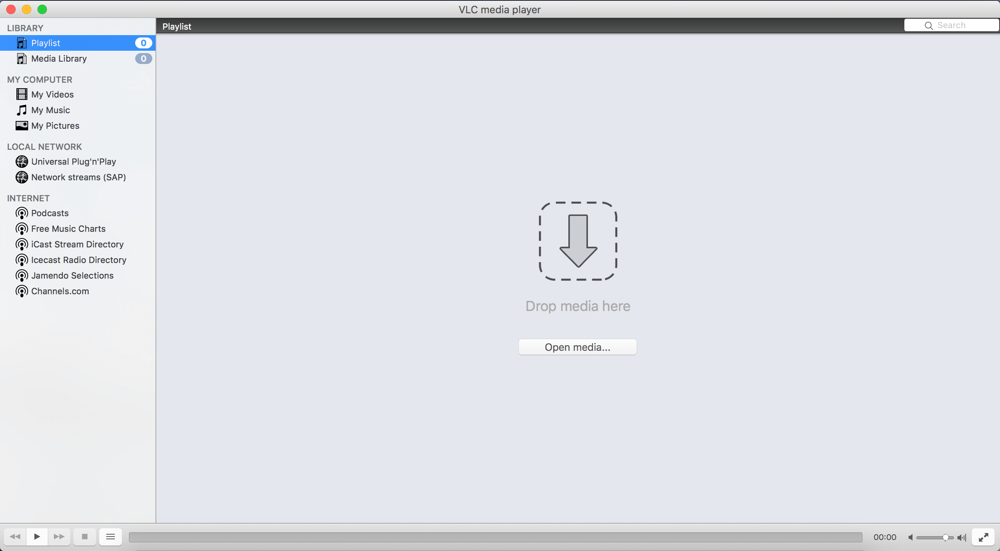
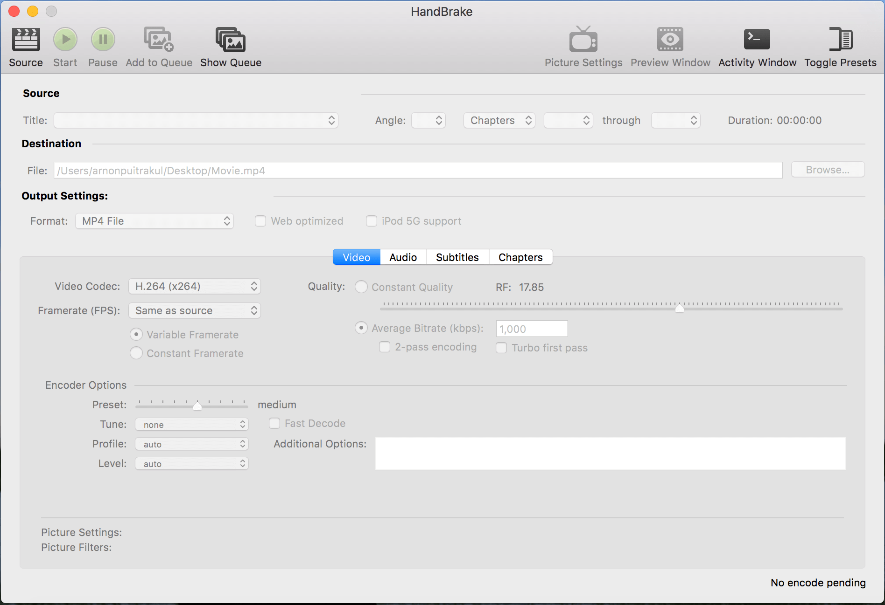
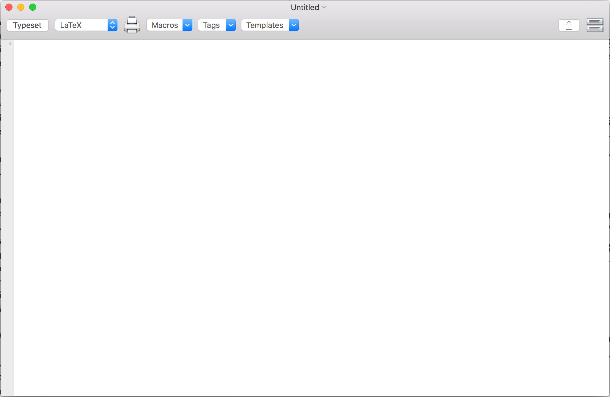
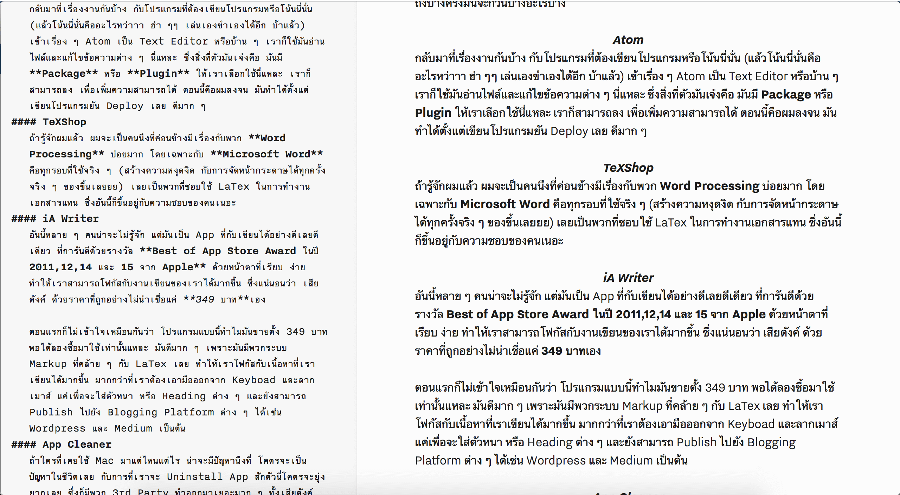
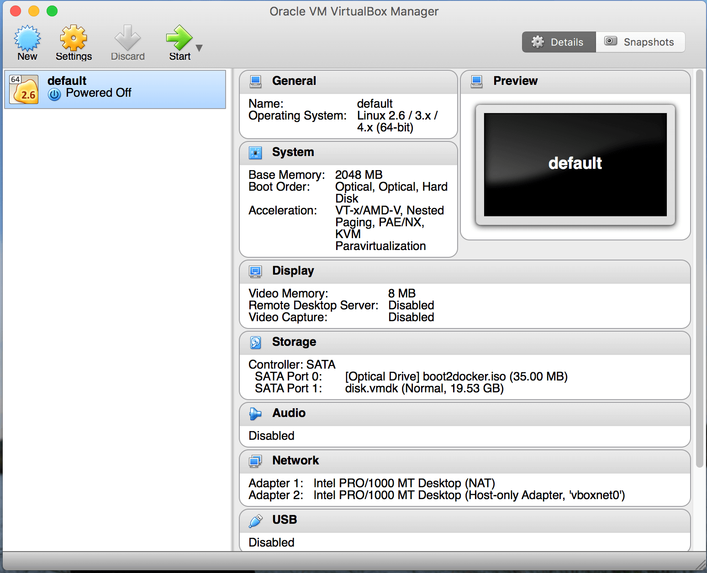

ตั้งแต่ใช้ Mac มาก็มักจะมีคนถามบ่อย ๆ เหมือนกันว่า **"บนเครื่องต้องใช้ App อะไรบ้าง ?"** เป็นเหมือนคำถามยอดฮิตของคนที่ใช้ Mac ใหม่ ๆ ต้องถามกันเลยทีเดียว วันนี้ผมจะเอา List ของ Mac App ที่ผมใช้มาให้ดูกัน

## Safari

เริ่มกันด้วยโปรแกรมสุดพื้นฐานกันก่อนเลยกับ **Safari** ที่ต้องใช้อยู่ทุกครั้งที่เปิดเครื่อง เพราะเอามาเปิด Facebook ฮ่า ๆ นอกจาก Safari แล้วผมยังใช้ Google Chrome และ Firefox สำหรับทำงานพวก Web Development เพราะมันมีหน้าต่าง Inspect ให้เราใช้โดยง่าย

## VLC

เพราะชีวิตเราขาดความบันเทิงไม่ได้ ก็ต้องหาโปรแกรมที่ใช้ดูวีดีโอ ซึ่งโปรแกรมที่ผมใช้คือ VLC เหตุเพราะมัน **ฟรี** นอกจาก ฟรีแล้ว มันยังเปิดไฟล์ได้หลากหลายรูปแบบ ลงทีเดียวเปิดมันได้หมดทุกอย่างจริง ๆ

## Handbreak

นอกจากจะมี VLC ใช้เล่นไฟล์ **Media** ต่าง ๆ แล้ว ยังต้องมีโปรแกรมไว้แปลงไฟล์ด้วย ซึ่ง **Handbreak** ก็เป็นหนึ่งในนั้นเหมือนกัน และยังเป็น **Freeware** ด้วย จากหน้าตาที่อาจจะไม่ค่อยเป็นมิตรกับ User ธรรมดาเท่าไหร่นัก แต่สำหรับผมแล้ว มันก็ใช้ได้นะ ปรับอะไรได้เยอะดี ถึงบางครั้งมันจะกวนบ้างอะไรบ้าง

## Atom

กลับมาที่เรื่องงานกันบ้าง กับโปรแกรมที่ต้องเขียนโปรแกรมหรือโน้นนี่นั่น (แล้วโน้นนี่นั่นคืออะไรหว่าาา ฮ่า ๆๆ เล่นเองขำเองได้อีก บ้าแล้ว) เข้าเรื่อง ๆ Atom เป็น Text Editor หรือบ้าน ๆ เราก็ใช้มันอ่านไฟล์และแก้ไขข้อความต่าง ๆ นี่แหละ ซึ่งสิ่งที่ตัวมันเจ๋งคือ มันมี **Package** หรือ **Plugin** ให้เราเลือกใช้นี่แหละ เราก็สามารถลง เพื่อเพิ่มความสามารถได้ ตอนนี้คือผมลงจน มันทำได้ตั้งแต่เขียนโปรแกรมยัน Deploy เลย ดีมาก ๆ

## TeXShop

ถ้ารู้จักผมแล้ว ผมจะเป็นคนนึงที่ค่อนข้างมีเรื่องกับพวก **Word Processing** บ่อยมาก โดยเฉพาะกับ **Microsoft Word** คือทุกรอบที่ใช้จริง ๆ (สร้างความหงุดงิด กับการจัดหน้ากระดาษได้ทุกครั้งจริง ๆ ของขึ้นเลยยย) เลยเป็นพวกที่ชอบใช้ LaTex ในการทำงานเอกสารแทน ซึ่งอันนี้ก็ขึ้นอยู่กับความชอบของคนเนอะ

## iA Writer

อันนี้หลาย ๆ คนน่าจะไม่รู้จัก แต่มันเป็น App ที่กับเขียนได้อย่างดีเลยดีเดียว ที่การันตีด้วยรางวัล **Best of App Store Award ในปี 2011,12,14 และ 15 จาก Apple** ด้วยหน้าตาที่เรียบ ง่าย ทำให้เราสามารถโฟกัสกับงานเขียนของเราได้มากขึ้น ซึ่งแน่นอนว่า เสียตังค์ ด้วยราคาที่ถูกอย่างไม่น่าเชื่อแค่ **349 บาท** เอง

ตอนแรกก็ไม่เข้าใจเหมือนกันว่า **โปรแกรมแบบนี้ทำไมมันขายตั้ง 349 บาท!!** พอได้ลองซื้อมาใช้เท่านั้นแหละ มันดีมาก ๆ เพราะมันมีพวกระบบ Markup ที่คล้าย ๆ กับ LaTex เลย ทำให้เราโฟกัสกับเนื้อหาที่เราเขียนได้มากขึ้น มากกว่าที่เราต้องเอามือออกจาก Keyboad และลากเมาส์ แค่เพื่อจะใส่ตัวหนา หรือ Heading ต่าง ๆ และยังสามารถ Publish ไปยัง **Blogging Platform** ต่าง ๆ ได้เช่น **Wordpress** และ **Medium** เป็นต้น

## App Cleaner

ถ้าใครที่เคยใช้ Mac มาแต่ไหนแต่ไร น่าจะมีปัญหานึงที่ โคตรจะเป็นปัญหาในชีวิตเลย กับการที่เราจะ Uninstall App สักตัวนี่โคตรจะยุ่งยากเลย ซึ่งก็มีพวก 3rd Party ทำออกมาเยอะมาก ๆ ทั้งเสียตังค์ และฟรี เท่าที่ได้ลองมามี App Cleaner นี่แหละ นี่โอสุดแล้วในโปรแกรมฟรี ใช้ง่าย แค่หา กด ลบ แค่นั้นเอง ง่ายมาก ๆ

## VirtualBox

VirtualBox เป็นอีกทางเลือกนึง**สำหรับผู้ที่อยากจะลง** OS ต่าง ๆ เช่น **Windows** **แต่ไม่อยากลงผ่าน Bootcamp** หรือ OS อื่น เช่น Ubuntu ก็สามารถทำได้ ซึ่งหน้าตาของมันก็อาจจะไม่ได้เป็นมิตรกับ User ทั่ว ๆ ไปเท่าไหร่ แต่ก็เป็น Freeware ที่โอเคตัวนึงเลยสำหรับโปรแกรมที่ใช้สร้าง VM

สำหรับใครที่ค่อนข้างใช้งาน อย่างหนัก แนะนำให้ไปลองใช้ **Parallel Desktop** ดูครับ อันนี้เป็น App **เสียตังค์**นะครับ ค่อนข้างแพงนิดนึง **แต่ Performance กับ User Experience ที่เป็นมิตรกว่า** น่าจะทำให้คุ้มค่ากับเงินที่เสียไปครับ

## และ Mac App อื่น ๆ
และทั้งหมด 8 Mac App ที่ผมแนะนำไปวันนี้เป็นเพียงแค่ App ที่ใช้งานบ่อยในชีวิตประจำวัน จริง ๆ ส่วนใหญ่จะสำหรับ User ทั่ว ๆ ไป ถ้าได้เสียงตอบรับดี จะมาแนะนำพวก Mac App สำหรับ Power User กันบ้าง มีอะไรให้เล่นเยอะมาก ๆ เล่นไม่หมดจริง ๆ
จะสังเกตได้ว่า ส่วนใหญ่เป็น Freeware ทั้งนั้น สิ่งที่อยากจะบอกผู้ใช้คือ จริง ๆ แล้วเราไม่จำเป็นที่จะต้องไปใช้โปรแกรมที่เสียเงินมากขนาดนั้น ถ้าไม่ได้ใช้ทำงานอะไรจริงจังมาก ๆ หรือ ไม่ก็นาน ๆ ใช้ที Freeware ก็เป็นทางเลือกที่ดี ดีกว่าไป Crack โปรแกรมใช้กันเลยครับ **สนับสนุนให้ใช้ Software ถูกสิขสิทธิ์กันนะครับ** สำหรับวันนี้สวัสดีครับ
