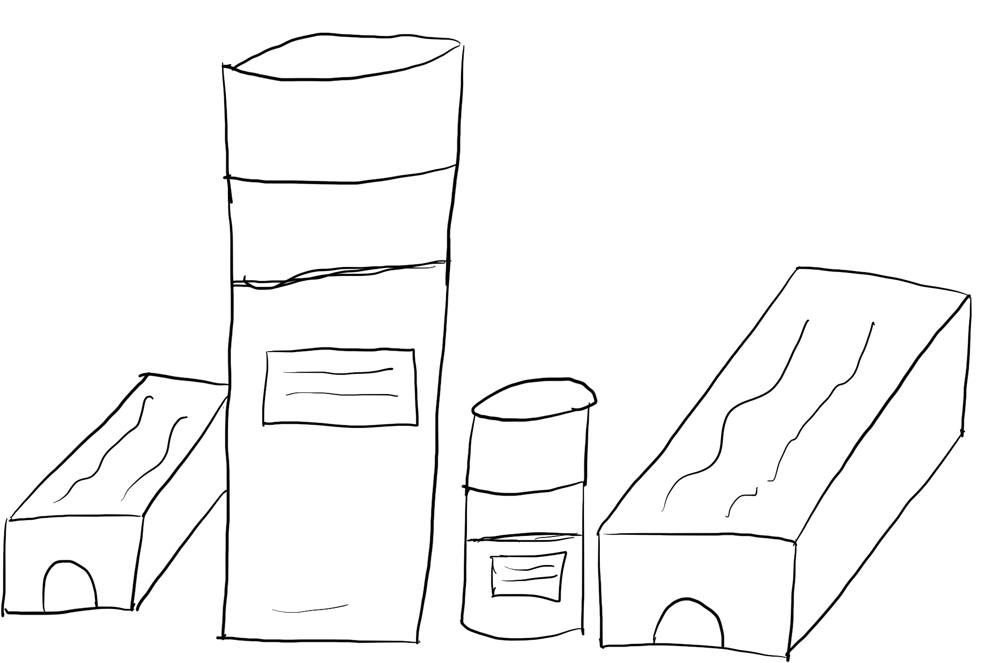

สวัสดีพวกนาย ~~ บทความนี้ก็ถือว่าเป็นการเปิดตัว Column ใหม่ของผมเลยละกันชื่อว่า **"ชีวิตฉัน"** เรื่องแรกที่อยากจะมาเล่าสู่กันอ่านกันในวันนี้คือ **Time Management** เหตุมันเกิดมาจากว่า ช่วงนี้ผมเปิดเทอมเรียบร้อยแล้ว และแน่นอนว่าการเปิดเทอมมันจะมาพร้อมกับสิ่งที่พวกเราทุกคนน่าจะรู้จักกันดีในชื่อว่า **การบ้าน** และ**เวลาเรียน** มันก็**ผลาญ**เวลาชีวิตเรามากพอแล้ว ไหนจะเวลาเราอ่านหนังสืออีก นอกจากนั้น ถ้ารู้จักผมดี ผมนี่เป็นมนุษย์ที่สามารถ หาเรื่องใส่ตัวรับงานไปทั่ว ได้เก่งมาก ๆ !

ฉะนั้นผมจะแทบไม่มีเวลาว่างเลย จากเทอมที่แล้วที่งานเยอะมาก ๆ เยอะจนล้นก็ทำให้ตระหนักถึงเรื่องหนึ่งที่สำคัญมาก แต่ผมไม่ได้นึกถึงมันมาก่อนคือ **การพักผ่อน** เพราะตอนนั้นเห็นงานเข้ามาก็สักแต่ทำให้มันผ่านไปเรื่อย ๆ จนสุดท้ายมันไปจบลงที่ **สภาพนอนตายคาเตียงแล้วหลับวูบไปยันเช้าเลย** ไฟในการทำงานที่ค่อย ๆ ดับหายไปเรื่อย ๆ ตามสภาพร่างและจิตที่ค่อย ๆ หายไปเรื่อย ๆ

ตอนนี้ด้วยปีที่สูงขึ้น ปี 4 แล้วหน้าที่ต่าง ๆ ก็มากขึ้นเรื่อย ๆ ตามปีที่สูงขึ้นเป็นเงาตามตัว และความไม่อยากที่จะ อยู่ในสภาพตายเป็น Zombie เดินไปเหมือนเทอมที่แล้วจึงทำให้กลับมาถามตัวเองว่า **ทำไมเราถึงรู้สึกเหนื่อย ?** ผมไปสะดุดคำตอบของคำถามนี้อย่างจังกับบทสัมภาษณ์ของ Marissa Meyer ในเรื่องของการทำงาน จากสักที่นึงนี่แหละ ลืมไปแล้ว แต่เนื้อหามันอยู่ที่ว่า เหตุที่ทำให้เรารู้สึกเหนื่อย หรือไม่อยากทำงานสักอย่างนั่นเป็นเพราะว่า งานที่เข้ามาใหม่มันทำให้เรา **อด** ทำอะไรบางอย่างที่เราอยากทำ หรือทำได้ไม่สะดวกเท่าเดิม

เช่นมีพนักงานคนหนึ่งเขาต้องประชุมตอนดึก ๆ กับอีกสาขาที่อยู่ในอีกทวีปหนึ่ง แต่เขาคนนั้นมีลูกและต้องไปรับลูก ถามว่า คนคนนั้นอยากที่จะมานั่งประชุมตอนดึก ๆ มั้ยถ้าเรามีลูกอยู่ที่บ้าน คำตอบน่าจะชัดเจนว่า ไม่ ถูกมั้ยครับ สิ่งที่ผมต้องการจะบอกคือ บางทีมันก็ต้องมีการ Balance กันระหว่างงาน และ เรื่องส่วนตัว ถ้าเราไม่สามารถทำให้มันสมดุลได้ เราก็จะรู้สึกไม่อยากทำงาน เพราะงานมันแย่งเวลาที่เราจะได้อยู่กับลูก เวลาที่เราจะได้ออกไปเที่ยวไป หรืออีกนัยคือ

> อย่าให้งานมาทำลายชีวิตเรา และอย่าให้ชีวิตเรามาทำลายลายเรา

เมื่อ 2 สัปดาห์ที่ผ่านมา ผมเลยลองเริ่มจัดตารางเวลาเล่นเกมให้กับตัวเองบ้าง โดยวันคืนวันศุกร์และเสาร์จะเป็นคืนสำหรับ**เล่นเกม** และให้คำมั่นสัญญากับตัวเองว่า **เราจะต้องเล่นเกม และเล่นอย่างเปิดเผย** ด้วยฮ่า ๆ (ปกติจะเล่นทีต้องแอบเล่น เดี๋ยวโดนทวงงาน) นอกจากนั้นยังจัด**เวลานอน**ด้วยว่า ไม่ว่าอะไรจะเกิดขึ้น จะนอนไม่เกินตี 1 จะตอบแชทงานต่าง ๆ ไม่เกิน 4 ทุ่ม และกลับหอมาควรจะอาบน้ำโดยทันที และอีกเวลาที่ผมจะข้ามมันไปไม่ได้เลย สำคัญกว่างานคือ สุขภาพ เนื่องจากช่วงนี้ **โคตรอ้วน** เลย จึงอยากที่จะหาเวลาออกกำลังกายกันบ้าง ฉะนั้นอาทิตย์เย็นก็จะเป็น Exercise Time ของผมละ ~ หวังว่าจะผอมเหมือนเดิมโดยไว (ทุกวันนี้เห็นเรือนร่างตัวเองแล้วเพลีย แต่ก็กินเยอะเหมือนเดิมทุกวัน)

สาเหตุที่ต้องกลับถึงหอแล้วอาบน้ำเลยก็คือ เวลาอาบน้ำเสร็จผมจะมีพิธีกรรมในการทาโน้นทานี่ ซึ่งมันเป็นพิธีกรรมที่ใช้เวลาอยู่พอสมควร และถ้าเราง่วงแล้วไปอาบน้ำพอออกมา เราก็อยากจะนอนเลย ในขณะที่พิธีกรรมก็ยังไม่ได้ทำ และผมก็ยังไม่แห้ง (เมื่อก่อนแอบนอนตอนผมยังเปียก ๆ บ่อยมาก แย่ที่สุด) ผลที่ได้คือ ผมสามารถทำงานได้เร็วขึ้น และเวลาในการทำงานต่อครั้งสูงขึ้นพอสมควรเลย จากเมื่อก่อนผมทำงานครั้งนึงไม่เกิน 2 ชั่วโมงก็หลุดแล้วตอนนี้ไปถึง 4 ชั่วโมงก็ยังได้อยู่นะ ความเหวี่ยงและหัวร้อนน้อยลง Task ต่าง ๆ ก็เสร็จเรียบร้อยมากขึ้น อารมณ์เหมือนมันมีแรงบางอย่างบอกว่า ทำงานสิ !!! จะได้เล่นเกมในวันศุกร์ได้อย่างมีความสุข หลาย ๆ คนอาจจะมองว่า การที่ผมทำแบบนี้มันไม่มีความรับผิดชอบรึเปล่า ถ้างานเราไม่เสร็จแล้วเราจะไปเล่นเกมอะไรแบบนี้ ผมอยากให้มองว่าเวลางานก็คือเวลางาน เวลาพักผ่อน หรือมองในอีกแง่ เป็นประสิทธิภาพในการทำงาน การที่เราไม่โหมงานรัว ๆ และแบ่งเวลาพักผ่อนมันจะทำให้เราทำงานได้อย่างมีประสิทธิภาพมากขึ้น นึกภาพง่าย ๆ เหมือนกับงานจะส่งพรุ่งนี้ แต่เราก็นั่งทำมันจนดึกง่วงจนไม่ไหวแล้ว เราก็ยังจะทำมันต่อไป งานที่ออกมามันก็จะง่วงหน่อย ๆ แต่สู้เราคิดอีกสักนิด ยอมไปนอนหน่อย แล้วตื่นมาทำต่อ สุดท้ายงานมันก็เสร็จเหมือนกัน แต่มันก็ไม่ออกมา ง่วง ๆ มั่ว ๆ มั้ยละ

ฉะนั้นแล้ว คนที่ติดงานหายไปกับงานทั้งหลายจ๋า กลับมา กลับมาได้มั้ย ~ ออกไปหาเวลาให้ตัวเองไปทำอย่างอื่นที่เราอยากทำบ้าง ถ้าไม่อยากเป็น Zombie เหมือนเดิมก็ต้องเริ่มจากการเปลี่ยนตัวเอง เพราะเราคงไปเปลี่ยนงานให้น้อยลงคงไม่ได้แน่ ๆ ละ ฮ่า ๆ เผลอ ๆ มันงอกขึ้นอีก (นี่งานหรือดอกเห็ดครับ งอกเร็วจัง) และคนที่เห็นเพื่อนร่วมงานโพสต์เรื่องเกมแล้วจะมาทวงงานโปรดรู้ไว้ด้วยว่านี่คือ Game Time ของเขา อย่าพึ่งทวง แงงงง ~~
