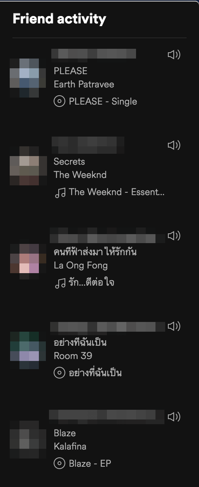
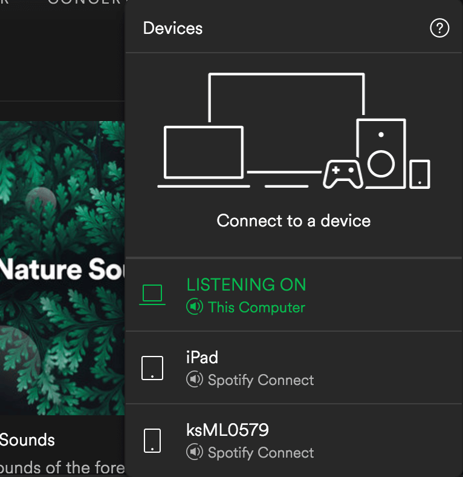
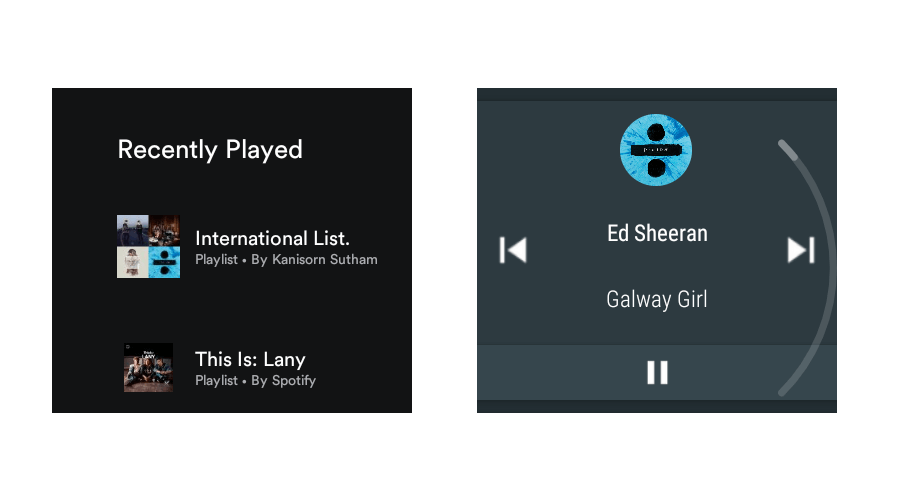

เมื่อไม่กี่วันที่ผ่านมา Spotify บริการ Music Steaming สัญชาติสวีเดน ก็ได้ลงมาจุติมายังประเทศไทยแดนสารขันของเรากันแล้ว หลังจากผ่านปีน่าจะปีกว่า ๆ แล้วหลังจากที่บริษัทตั้งมา และแน่นอนว่า มันแอบมีข่าวหลุดมาหน่อยแล้ว ๆ เลยไม่ต่ออายุ Joox VIP แล้วรอ Spotify ด้วยความแน่วแน่ วันนี้จะพามาดูกันว่า ทำไมเราต้องใช้ Spotify ด้วย

## ยุคทองของ Machine Learning และบริการ Music Steaming

วิธีที่เราจะฟังเพลงของผมคงเริ่มจากการฟังเทป หรือบางคนแก่หน่อยแผ่นเสียงก็มา จากนั้นเริ่มเป็น CD แล้วก็เป็น Download ผ่านเบอร์โน้นนี่นั่น หลัง ๆ Apple ก็เริ่มมีการขายเพลงผ่าน Internet กัน มาในปัจจุบันช่วง 2-3 ปีที่ผ่านมา Music Steaming ก็เข้ามาเป็นวิธีใหม่ที่เราจะเข้าถึงศิลปินคนโปรดของเรามากขึ้น เราคงปฏิเสธไม่ได้เลยว่า สมัยนี้พวกเราไม่ค่อยได้ซื้อ CD หรือเทปเพลงกันแล้ว เดี๋ยวนี้พวกเราหันไปใช้ Internet ในการฟังเพลงแทนกันแล้ว ไม่ว่าจะเป็นจาก Youtube หรือบริการ Music Steaming ต่าง ๆ เช่น Deezer, Joox และ Spotify Music Steaming ในช่วงแรก ๆ ที่ผมได้ใช้ก็น่าจะเป็น Deezer ที่ตอนนั้น DTAC เอามาเปิดเป็นโปรโมชั่น ก็เลยได้ใช้ มันก็จะเป็นลิสต์ของเพลง และ Playlist มาให้เราเลือกกันฟังเรื่อย ๆ ปัญหาคือ คนมักจะรู้จักเพลงเดิม ๆ ที่ฟังอยู่ทุกวัน เพลงก็ไม่ได้ใช้เวลาผลิตกันวันเดียวได้ ฉะนั้นการที่เราฟังเพลงทุกวัน ทั้งวัน ก็ทำให้เพลงที่ออกมาแล้วฟังแล้วก็เบื่อได้ วิธีคือ เราก็ต้องไปหาเพลงใหม่มาฟังเรื่อย ๆ ใช่ม่ะ ! นี่ก็คือข้อดีของบริการ Music Steaming ที่เราสามารถฟังเพลงอะไรก็ได้ในราคาเหมาจ่ายแล้ว จากวิธีเดิม ๆ ที่แสดงลิสต์ของเพลง และ Playlist ก็กลายมาใช้เทคโนโลยีพวก Machine Learning เข้ามาช่วยเพื่อทำสิ่งที่เรียกว่า **Personalisation** หรือพูดง่าย ๆ คือการ ทำให้ระบบสามารถเลือก Content ที่เข้ากับผู้ใช้คนนั้น ๆ ย้ำว่า คนนั้น ๆ คือคนเดียวเลย มากกว่า การสร้าง ​Content รวม ๆ ออกมา เราจะเห็นว่าวงการเพลง ก็มีการหยิบเทคโนโลยี และทฤษฏีต่าง ๆ มาผลิตเป็นระบบที่ตอบสนองความต้องการของตลาดได้อย่างเยี่ยมยอดเลย

## สวัสดี Spotify

หลังจากที่ Spotify ได้เปิดตัวเมื่อปี 2016 จนถึงตอนนี้มันก็ลงมาถึงประเทศไทยกันแล้ว โดยประเทศเราเป็นประเทศที่ 61 ของโลก และมีอีกหลายเหตุผลที่ **ทำไมผมถึงหลงรัก Spotify**  **Customisation** เป็นเรื่องหลักที่ผมชอบเลยก็ว่าได้ มันจะเริ่มจากการแนะนำ Playlist แบบกลาง ๆ ตามอารมณ์ และเวลากันไป เช่นตอนกลางเช้าก็มีจะ Playlist สำหรับฟังเดินทาง ระหว่างทำงาน อะไรแบบนั้น ตกกลางคืนก็จะมี Playlist พวก Relax กับ Sleep ขึ้นมา อันนี้ก็ว่าชอบแล้ว มันยังเรียนรู้อีกว่า เราชอบฟังเพลงแบบไหนเวลาไหน แล้วขึ้นแนะนำในหน้าแรกมาเลย โดยส่วนตัวเป็นคนที่มีปัญหากับการฟังเพลงไปทำงานไปมาก เพราะพอเพลงนึงจบก็ต้องไปเปลี่ยนเพลงใหม่ มันค่อนข้างเสียสมาธิมาก แต่ด้วยฟีเจอร์ที่เรียนรู้ว่าเราชอบฟังเพลงแบบไหนทำให้เราไม่ต้องสลับหน้ากลับไปเปลี่ยนเพลงเลย คือได้เพลงที่โดนตามอารมณ์มายังกะเสกมาเลย มีความสุขกับการฟังเพลงมากขึ้นมากเลย

ฟีเจอร์ต่อมาคือ **Social Integration** โดยปกติเวลาเราฟังเพลง เราก็จะฟังคนเดียว อย่างมากคือ การสร้าง Playlist แล้วเอามาอัพลงมาแชร์กัน หรือแชร์เพลงนั้นลง Social Network อย่าง Facebook แต่อันนี้มาเหนือแจ้ มันโชว์อยู่ข้าง ๆ แบบ Real-Time กันเลยว่าเพื่อนเราฟังเพลงอะไรกันอยู่ ส่วนตัวคิดว่าเป็นอะไรที่โอเคดีนะ

ตัวโปรแกรมก็รันเป็น Native รองรับทั้งใน macOS, iOS, Android และ Windows ครบครันเลย ที่สำคัญทุก Device จะถูก Sync กันแบบ Real-Time และใช้เป็น Remote ซึ่งกันและกันได้ด้วย เช่นทำงานบน macOS แล้วหยิบ iPad ขึ้นมาต่อเน็ตเปิด App ขึ้นมา เพลงที่เราเลือกบน iPad ก็จะไปโผล่ใน macOS ที่เราทำงานอยู่ด้วยเลย จุดนี้เป็นสุดที่ทำให้ผมพูดขึ้นมาเลยว่า "**เออหว๊ะ**" ปกติเวลาเราซื้อพวก Music Steaming มันจะ Login ได้หลาย Device แต่มันไม่ได้กันเราเอา Account ไปให้คนอื่นใช้ แต่ด้วยวิธีนี้ถึงเราจะเอา Account ไปให้คนอื่น เปิดมาก็กลายเป็น Remote อยู่ดี เป็นวิธีกันการแชร์ Account ที่ดีมาก ๆ

อีกจุดหนึ่งที่ผมไม่ได้จาก Joox ที่เคยใช้คือ การใช้งานบน Smart Watch แต่พอเปลี่ยนปุ๊บ บน Android เวลาผมเล่นเพลง ในนาฬิกามผมจะขึ้นเป็น Music Controller มาเลยเหมือนกับเวลาเราดู Youtube แล้วมันจะมี Controller งอกขึ้นมา เจ๋งกว่านั้นคือยังมี App อยู่บน Android Watch ด้วย เราก็สามารถเลือก Playlist จากนาฬิกาได้เลย สะดวกมาก ๆ

## Sound Quality

ซื้อบริการ Music Steaming มา เรื่องคุณภาพเสียงก็เป็นเรื่องที่สำคัญมาก คู่แข่งอย่าง Joox และ Tidal ที่มีบริการใน Steaming ระดับ Lossless CD Quality สำหรับคนฟังในระดับ Hifi เรื่องนี้อาจเป็นจุดด้อยกับ Spotify ไปสักหน่อย เพราะเราสามารถเลือกสูงสุดได้อยู่ที่ 320 kbps ได้เท่านั้น ส่วนตัวเป็นคนที่ใช้เครื่องเล่นและหูฟังที่ให้คุณภาพสูงอยู่แล้ว เวลาฟังเมื่อเทียบกับ Joox ที่เป็น Lossless เทียบกัน จะเห็นว่าฝั่งค่ายเขียวนี่จะด้อยอยู่หน่อย ๆ รายละเอียดหายไปบางส่วน (แหงแหละ เอา 320 kbps ไปเทียบกับ Lossless นี่นะ !!) แต่สำหรับผู้ฟังทั่วไปคุณภาพระดับนี้ก็อยู่ในระดับที่ค่อนข้างสูงมากแล้ว

## ราคา

มาที่เรื่องของราคากันบ้าง ถ้าเราไม่จ่ายเงิน เราก็ยังสามารถฟังเพลงได้อยู่ แต่ก็จะมี Ads มาคั่นกันทำให้รำคาญ กับคุณภาพเสียงที่ได้ไม่สูงมาก แต่ถ้าเราเสียเงินมันจะตกอยู่เดือนละ 129 บาท เราก็จะปลดล๊อคได้หมดเลย

นอกจากนั้นยังมี **Family Pack สำหรับครอบครัว** อีกด้วย โดยจะใช้ได้ 5 คน เสียแค่ 199 บาท ถ้าหารออกมาก็จะตกคนละ 40 บาทเท่านั้นเอง โคตรคุ้ม ไม่ต้องใช้ราคานักศึกษากันเลยทีเดียว โดยรวมผมถือว่า ราคาถูกมาก ๆ เลยนะ ถ้าใช้คนเดียวเดือนละ 129 บาท หรือถ้าแชร์กัน 5 คน กับเพื่อน ก็ตกคนละ 40 บาทเอง กับการที่เราใช้ฟังเพลงบ่อย ๆ

## สรุป

ไม่ต้องพูดอะไรมากเลยจริง ๆ คือมันดีงามมาก ปกติจะหงุดหงิดกับการเลือกเพลงมาก ทำงานไปก็สลับไปสลับมา มาตอนนี้คือได้เพลงที่ต้องการโดยที่มันมาเอง เหมือนโดนเสกมา ดีงามมาก กับเรื่องของการใช้งานที่ต่อเนื่อง พูดได้เลยว่า Seamless เลยฟังเพลงตอนปั่นจักรยานไปมหาลัย เปิดคอมมา อารมณ์มันก็ต่อกันได้เลย บวกกับราคา 129 บาทต่อเดือน แต่ถ้าหาตี้แชร์กับเพื่อนมันตกอยู่คนละ 40 บาทต่อเดือนเท่านั้นเอง ถือว่าโคตรคุ้ม จนไม่รู้จะคุ้มยังไงแล้ว [ซื้อเลย](https://www.spotify.com) **ปล.** เขาไม่ได้จ่ายนะ จ่ายเองนี่แหละ !!!
