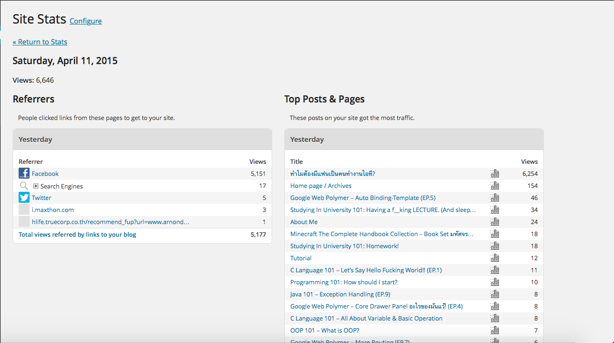

จากตอนท่ีแล้ว [ทำไมต้องมีแฟนเป็นคนทำงานไอที?][0] ได้รับเสียงตอบรับอันล้นหลาม ตกใจมากๆครับ เช้าตื่นมา เปิดดดู Site Stat โดนไป 1000 กว่าๆ Views ตกเย็นๆโดนไป 6000 กว่าๆ Views ผมนี่ทึ้งไปเลย แต่ก็**ขอบคุณที่ติดตามครับ **

แต่วันนี้ครับ เราจะมาต่อเรื่องจากคราวที่แล้วกัน รอบที่แล้วเราบอกว่า พวกเรานั้นมีอะไรดี และพวกเรานั้นเลี้ยงง่ายสุดๆ **วันนี้เราจะมาบอกถึงวิธีการเลี้ยงดูพวกเราแบบง่ายๆที่ใครๆก็ทำได้กัน**

* **ลองเรียนรูปพจนานุกรม "คำแปลก" ของเข้าบ้างก็ดีครับ** บางดีคนเราก็ต้องปรับตัวเข้าหากันและกัน เราก็ปรับตัวเข้าหาเขา แรกอาจจะไม่รู้เรื่องบ้าง เดียวหลังๆเราก็รู้เรื่องเขาและ อย่างที่บอก ว่าพวกเราเป็นสิ่งมีชีวิตที่เลี้ยงดูง่าย แต่บางทีอาจจะงองแงบ้างอะไรบ้าง แต่พวกเราก็พร้อมที่จะเข้าใจ เขาเสมอ ถ้าเราพร้อมที่จะเข้าใจเรา
* **พวกเราเป็นสิ่งมีชีวิตที่ต้องการคนดูแลครับ** ไม่ใช่พวกเรามันดูแลตัวเองไม่ได้เลยนะครับ แต่พวกเรานั้นบางทีเวลาทำอะไร เราก็จะติดหนึบจนไม่เป็นอันทำอย่างอื่น เตือนเขาบ้างก็ได้ครับว่า
  * อาบน้ำรึยัง? **(นี่แกสกปรกใช่มั้ย!!!)**
  * กินข้าวยัง?
  * นอนยังเนี่ย?
* จากเมื่อกี้ กินข้าวยัง? มันย้อนกลับไปหาผมเลยครับ ผมสังเกตเพื่อนผมหรือตัวเองที่เป็น Geek ทั้งหลาย เวลากินข้าว มักจะกินอะไรก็ได้ง่ายๆ (ไม่ใช่อาร์ทตัวแม่นะ ที่ง่ายเนี่ยหมายถึงมันง่ายจริงๆ) ไม่ก็ซ้ำๆกัน ทุกๆวัน **ดังนั้นบางทีเราก็ต้องการคนช่วยคิดบ้างว่า "กินอะไรดี?" ไม่งั้น จะได้กินของเดิมๆเหมือนเมื่อวาน ไม่ก็ข้าวไข่เจียวแน่นอน!**
* **พวกเราเป็นพวกขี้หลงขี้ลืมสุดๆ** ในเรื่องที่ไม่ใช่เรื่องของสิ่งที่เราสนใจน่ะ! สนใจจนติดหนึบ ไม่ค่อบจะแคร์โลกภายนอกกันเท่าไหร่เลย บางที แม้แต่เรื่องที่คุยกันบนโทรศัพท์ พอวางหูปุ๊บ! ลืมเลย! ก็มี (เป็นเองนี่แหละ อันนี้ไม่น่าเกี่ยวกับ Geek เนอะ) **เพราะฉะนั้น เตือนเขาบ้างในบางเรื่อง แต่บางเรื่องก็ไม่ไหวจริงๆนะ**
* อย่างที่บอกไปใน [ทำไมต้องมีแฟนเป็นคนทำงานไอที?][0] เมื่อตอนก่อนไปแล้ว **ว่าพวกเราเป็นคนที่เหตุผลโคตรๆ บางทีก็ทำอะไรก็มีเหตุผลสักหน่อยจะดีมาก** ไม่ก็หลอกมันเลย อ้างเหตุผล 108 (เดี๋ยวนะ ไม่น่าใช่และ)
* **เรื่องของแฟชั่น**ครับ เอาง่ายๆเวลาผมเห็นเพื่อนๆในกลุ่ม Dev หรือแม้แต่ตัวเองแต่งตัวเมื่อเทียบกับคนปกติแล้ว พวกเรานั้นไม่สนใจเรื่องของแฟชั่นอะไรเลย ใส่อะไรก็ได้ที่เราสบายไม่ค่อยแคร์คนอื่นเท่าไหร่ **ฉะนั้นถ้าคุณอาจจะต้องดูแลเรื่องของการแต่งตัวของเขาบ้าง** บางทีอาจจะ**ลองแต่งตัวให้เขาดั่งตุ๊กตา** (เอ๊ะเดี๋ยวนะ!!) **พาเขาออกไปเดินเล่น** (เหมือนหมาเลยอ่าาา) ตามห้างอะไรแบบนี้ ให้เขาได้เปิดโลกภายนอก นอกจากงานกับงานอดิเรกของเขา
เห็นม่ะครับ **การใช้ชีวิตกับ Geek นั้นไม่ได้ยากเลย แค่เราอาจจะต้องเอาใจใส่เขาหน่อย ดูแลเขานึด แล้วเขาก็จะดูแลคุณเหมือนกันถึงแม้ว่าบางทีอาจจะไม่เท่าเราดูแลเขา แต่มันก็เต็มที่สำหรับพวกเราแล้วนะครับ**

> ถึงแม้ว่าพวกเราจะไม่โรแมนติก เพราะอาย แต่ก็รักหมดใจ และ Limited Editon หายากระดับ SS นะครับ!
**ปล. โพสอวยตัวเองแฮร่~ , ถ้าผลตอบรับดี เดียวจะเขียนอีก**

[0]: http://www.arnondora.in.th/%e0%b8%97%e0%b8%b3%e0%b9%84%e0%b8%a1%e0%b8%95%e0%b9%89%e0%b8%ad%e0%b8%87%e0%b8%a1%e0%b8%b5%e0%b9%81%e0%b8%9f%e0%b8%99%e0%b9%80%e0%b8%9b%e0%b9%87%e0%b8%99%e0%b8%84%e0%b8%99%e0%b8%97%e0%b8%b3%e0%b8%87/ "ทำไมต้องมีแฟนเป็นคนทำงานไอที?"
