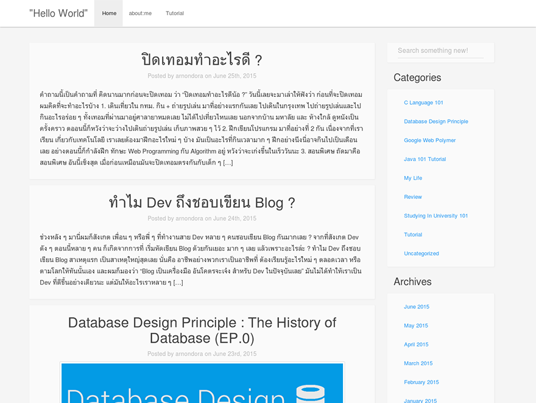

ในปัจจุบันเรามีอุปกรณ์ที่สามารถเข้าถึงอินเตอร์เน็ตมากขึ้นเรื่อยๆ จากเมื่อก่อนเรามีแค่คอมพิวเตอร์อย่างเดียว ขนาดหน้าจอก็เดิมๆ ไม่ได้เปลี่ยนแปลงอะไรมา แต่พอมาในถึงยุคปัจจุบันนี้ที่มี Smart Devices เข้ามาในโลกของอินเตอร์เน็ตเยอะมากขึ้น ขนาดหน้าจอตอนนี้ก็มีตั้งแต่โทรศัพท์เครื่องโง่ๆ หน้าจอเล็กๆ ยันโทรทัศน์จอ 4k เพราะฉะนั้นเราก็ต้องออกแบบเว็บเราให้เข้ากับขนาดของหน้าจอหลายๆ แบบเพื่อให้อุปกรณ์หลายๆ แบบสามารถใช้เว็บของเราได้
ตอนนี้เขามีแนวทางการออกแบบที่เรียกว่า [Mobile First][0] ซึ่งผมเคยเขียนไปแล้ว แต่วันนี้เอามาสรุปคร่าวๆ ล่ะกัน Mobile First เป็นแนวทางในการออกแบบ โดยให้เราสนใจออกแบบตามหน้าจอที่มีขนาดเล็กก่อน แล้วค่อยขยายไปยังหน้าจอที่ใหญ่กว่า ถ้าถามว่าทำไม? ให้เราลองคิดดูเล่นๆ ว่าถ้าเราออกแบบตามหน้าจอที่ขนาดใหญ่ก่อน เวลาเราเอามาย่อ มันก็จะลำบาก เพราะว่า พื้นที่มันเล็กลง แต่ Content เราเยอะเต็มหน้าจอใหญ่เลย ย่อทีก็ต้องตัด Content ไปอีกซึ่งเป็นเรื่องที่ไม่ดีเอาซะเลย เพราะฉะนั้นการออกแบบโดยยึดหลัก Mobile First ทำให้เราออกแบบเว็บของเราได้ง่ายมากขึ้น และโค๊ตเราก็จะสะอาดยิ่งขึ้น ง่ายต่อการพัฒนาต่อ และการดูแลรักษา
หลังจากเกริ่นมานาน เข้าเรื่องของวันนี้สักที เครื่องมือที่เราจะเอามาใช้ในวันนี้คือ Grid เมื่อก่อนถ้าเราจะทำเว็บที่เป็น Responsive เราก็ต้องใช้ Table หรือทำ Break Point หรืออะไรก็ตาม แต่ใน Bootstrap มันจะมีระบบ Grid ให้เราใช้ง่ายได้อย่างง่ายดาย

## Getting Started with Grid System
**Bootstrap จะแบ่ง Grid ออกเป็น 12 ช่องใน 1 บรรทัด** ซึ่งเราสามารถกำหนดได้ว่าจะให้มีกี่ Col และแต่ล่ะ Col มีกี่ช่อง เราสามารถกำหนดได้หมด แต่รวมกันแล้วห้ามเกิน 12 ช่อง
แต่ก่อนที่เราจะสร้าง Grid ขึ้นมา เราจะต้องมาสร้างกล่องเพื่อเก็บมันก่อน ใน Bootstrap เรามี Class ที่ชื่อว่า Container หน้าที่ของมันคือเป็นกล่องบรรจุของทั้งหมด เจ้า Container นี้มันจะถูก Fix ความกว้างตามขนาดของหน้าจอ แต่ถ้าเราต้องการให้มันคำนวณความกว้างเป็นเปอร์เซ็น เราจะต้องเรียก Class container-fluid แทน

    

       Your Content Here!!!
    

หลังจากที่เราได้กล่องใส่ Content ของเราแล้ว ถัดไปเราจะมาตีเส้นให้หน้าเว็บของเรากัน โดยการเรียก Class Row ขึ้นมา เหมือนกับเราสร้างตารางแล้ว Row คือการตีเส้นแนวนอนในตารางของเรา

    

       

          Your Content Here!!!
       

    

ตอนนี้ถ้าเทียบเป็นตาราง ตอนนี้เหมือนกับว่า เราขีดเส้นนอนไปแล้วเส้นนึง ถัดไปเราจะมาวาง Col กัน Class ที่ใช้คือ col-screen-size เป็น col- ขนาดหน้าจอ - จำนวนช่อง
ขนาดจองหน้าจอคือ ถ้ามันเล็กกว่าที่เรากำหนดไว้ มันจะเลื่อนลงมาอยู่บรรทัดถัดไปแทน และ จำนวนช่องก็คือ จำนวนช่องนั่นแหละ อย่าลืมว่า ทั้งหมดใน 1 บรรทัดจะมี 12 ช่อง
Size ของหน้าจอที่ทาง Bootstrap เตรียมให้เรามาคือ xs, sm, md, lg เรียงตามขนาดเลย จากเล็กไปใหญ่ เราสามาถเข้าไปดูขนาดความกว้างของแต่ล่ะแบบได้ใน [Document ของ Bootstrap][1] ได้เลย แต่ตัวอย่างในวันนี้เราจะมาลองใส่ Grid ง่ายๆ สนุกๆ ดูกัน

    

       

           
Content 01

           
Content 02

           
Content 03

           
Content 04

           
Content 05

           
Content 06

           
Content 07

           
Content 08

           
Content 09

           
Content 10

           
Content 11

           
Content 12

       

    

ถ้าเราลองรันบน Web Browser ดูเราก็จะเห็นว่า มันออกเป็นช่องๆ แคบๆ แล้วถ้าเราลองย่อหน้าต่างดู มันก็จะเล็กลงเรื่อนๆ จนถึงจุดๆ นึงที่มันจะกระโดดลงข้างล่าง แทนที่จะอยู่ข้างๆ เหมือนเดิม
นอกจากนั้น เรายังสามารถกำหนดได้ว่า ในหน้าจอแต่ล่ะขนาด อยากให้มันกินพื้นที่ไปกี่ช่อง เช่นเราบอกว่า ถ้ามันถูกรันอยูในหน้าจอใหญ่ๆ ให้มันกินไปเลย 8 ช่อง กับอีกอัน 4 ช่อง แต่กลับกัน ถ้าอยู่บนโทรศัพท์ หรือหน้าจอขนาดเล็กให้ Col แรกมีขนาด 4 ช่อง และอีก Col นึงให้มันมี 8 ช่องสลับกับ

    

       

          
 Col 1 

          
 Col 2 

       

    

นอกจากที่เราจะสามารถกำหนดจำนวนช่อง อะไรที่กล่าวมาได้แล้ว เรายังสามารถเลื่อนได้ด้วย หรือถ้าไปอ่านมันจะบอกว่า การกำหนด Offset โดยการเรียกใช้งาน Class col-md-offset-\* ได้เลย ถ้าเราต้องการจะเลื่อนไปด้านซ้าย 3 ช่องก็สามารถเรียก col-md-offset-3 ได้เลย เช่น

    

       

          
 Col 1 

       

    

จากโค๊ตด้านบน ถ้าเราลองรันมันดู เราจะเห็นว่า ช่องที่เราสร้างขึ้นมา มันจะอยู่ชิดริมขวาเลย เพราะว่า ตัวเราก็มีไปแล้ว 8 ช่อง เลื่อนไปอีก 4 ก็จะครบ 12 ช่องพอดี ช่องนี้เลยโดนย้ายไปอยู่ทางขวาสุดของหน้าจอเลย
มาที่เรื่อง Option อื่นๆ ของมันบ้าง อันแรก เราสามารถซ่อนหรือแสดง Column ที่เราต้องการตามขนาดหน้าจอเราได้ด้วย
เริ่มที่การซ่อนกันก่อน โดยเราจะเรียก Class hidden-lg , hidden-md, hidden-sm หรือ hidden-xs ตามขนาดที่เราของหน้าจอที่เราต้องการให้มันหาย เช่น หน้าแรกของเว็บนี้ตรงแถบด้านขวา ผมก็ใช้ hidden-xs และ hidden-sm เอาไว้ เพราะว่าเวลาเปิดใน Tablet หรือบนโทรศัพท์หน้าจอมันเล็กกว่า คอมพิวเตอร์ปกติเลย ให้มันไม่แสดงผลกับ Device พวกนี้
และตรงกันข้าม ให้มันแสดงผล เราจะใช้ Class ที่ชื่อว่า .visible-xs-_, .visible-sm-_, .visible-md-\* และ .visible-lg-\* ตามขนาดของหน้าจอที่เราต้องการให้แสดง เช่นถ้าเราบอกว่า .visible-lg มันก็จะแสดงผลในหน้าจอขนาดใหญ่อย่างเดียว ส่วนหน้าจอที่เล็กกว่านั้นมันก็จะไม่แสดงผล อะไรแบบนี้
เรื่องของ Grid มันก็มีเท่านี้เลย ส่วนที่เหลือ มันก็อยู่ที่ความคิดสร้างสรรค์ของเราที่จะ Design โครงสร้างหน้าเว็บของเราโดยใช้ Grid กันแล้ว ว่าเราจะวางกี่ช่อง ตรงไหน ดันตรงไหน อะไรยังไง อยู่ที่เราล้วนๆ

## กรณีตัวอย่าง

กรณีตัวอย่างก็ไม่ใช่ที่ไหนเลย ก็เว็บตัวเองนี่แหละ หารู้ไม่ว่าธีมนี้มันถูก Implement ด้วย Bootstrap ล้วนๆ เลย อย่างหน้าแรกนี้ ผมใช้ Container หุ้มในส่วนของ Content ไว้ และแบ่งเป็น  9 ช่อง (โดยการเรียก col-md-9)  และ 3 ช่อง (โดยการเรียก col-md-3) เป็น 12 ช่องพอดี และของ 3 ช่องผมต้องการไม่ให้มันแสดงผลในหน้าจอมือถือ และหน้าจอเล็กๆ ทั้งหลายผมเลยเติม .hidden-xs และ .hidden-sm ลงไปเพิ่ม

อันนี้เอามาจากบนโทรศัพท์ เราจะเห็นเลยว่า แถบข้างๆ หายไปเพราะว่า .hidden-xs และ hidden-sm แต่มีแถบ Search เข้ามาแทน โดยการสร้าง Row ขึ้นมาอีกอันเพื่อเก็บแถบ Search และเรียก Class hidden-lg hidden-md เข้ามาเพื่อให้มันไม่แสดงผลในหน้าจอขนาดใหญ่ เพราะมันมีแถบ Search อยู่ข้างขวาไปแล้วเลยเอาออกไป
ถ้าใครอยากดู Source Code ของ Theme นี้สามารถ เข้าไปดูได้ที่ [Github][4] เลย
ปล. Theme นี้โหลดไปใช้ได้ฟรี เลยนะครับ
และก็จบแล้วสำหรับโพสต์นี้ ตอนนี้เปิดเทอมแล้ว เวลาเขียนอาจจะไม่ค่อยมีเหมือนปิดเทอมเท่าไหร่ แต่ก็ติดตามอ่านกันนะครับ  ถ้ามีคำแนะนำติชมอะไร หรือจะให้เขียนเรื่องอะไรก็คอมเม้นต์ด้านล่างได้เลยนะครับ สวัสดีครับ

[0]: http://www.arnondora.in.th/whysmalltolargeresponsive/
[1]: http://getbootstrap.com/css/#grid
[4]: https://github.com/arnondora/wordpress-paper-theme
