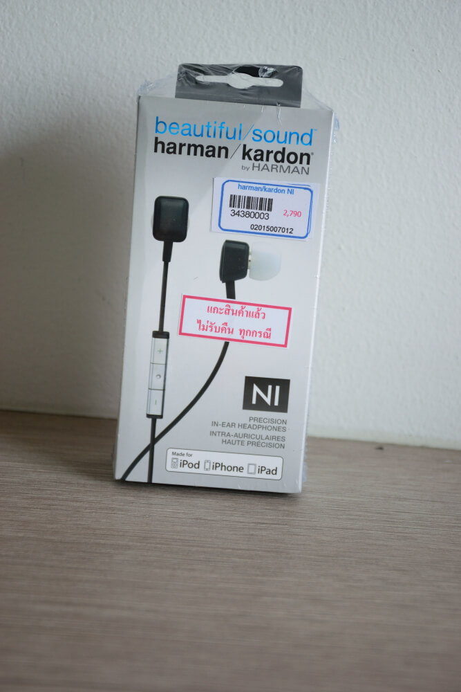
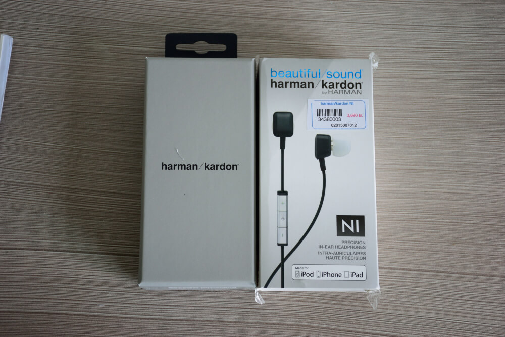
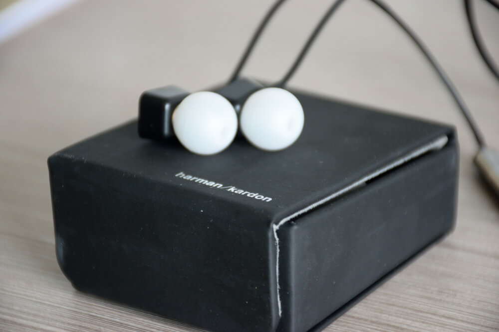

อันเนื่องมาจาก หูฟังอันเก่า Sony MDR-NC31EM ที่เป็นหูฟัง Noise Cancelling มันสายหักในไป เสียดายสุด ๆ แต่ก็ต้องหาอะไรมาแทนมัน บังเอิญมีเพื่อนแนะนำ Harman Kardon มาเลยได้ไปลองฟัง ก็เออเฮ้ย ! ก็ไม่เลวเลยนะ ! แถมไปเจอมันลดราคากันแหลกลาญ เลยจัดมาซะเลย มาลองแกะ (เฮ้ยนั่นมันรายการของคนอื่นเขา ไม่เอาเดี๋ยวโดนหิ้ว) เอาใหม่ Take 2 เรามาลองแกะกล่องกันดีกว่า

## Unboxing

เริ่มจากตัวกล่องภายนอกกันก่อน ก็เป็นกล่องกระดาษเรียบ ๆ ธรรมดา บอกรุ่นและหน้าตาของหูฟัง และเขียนคำว่า Beautiful Sound หรือแปลเป็นเสียงสวยนั่นเอง จะสวยจริงไม่จริง เดี๋ยวลองมาดูกัน !

ดึงกล่องออกมา ฟาบบบ ก็มีกล่องข้างในอีกกล่องนึง (หลายชั้นจริง ๆ) ก็เป็นกล่องสีเทาเขียนว่า Harman Kardon อันนี้ก็ไม่มีอะไร ข้ามไป

พอเปิดเจ้ากล้องสีเทามาเท่านั้นแหละ เราก็พบกับของที่เราตามหาสักที ในกล่องก็มี ตัวหูฟัง, Earbud 2 คู่ ขนาดเล็กและขนาดใหญ่ , คู่มือการรับประกัน และวิธีใช้พื้นฐานก็ว่ากันไป

เรามาดูที่พระเอกของเรากันดีกว่า ด้านตัวสายก็เป็นสายสีดำเงาเหมือนสายหูฟังทั่ว ๆ ไป ก็ต้องระวังมันหักในหน่อย ทางด้าน Earbud ก็เหมือนหูฟังธรรดาเช่นกัน ก็สามารถถอดเปลี่ยนตามไซส์ของหูเราได้ (สำคัญมาก เพราะถ้าใส่ไม่พอดีจะทำให้ตัวหูฟังมันลดเสียงรบกวนได้น้อยลง และทำให้ใส่ไม่สบาย)

ตัว Housing ก็จะทำจากพลาสติก (ถ้าอยากได้ตัวที่เป็น Aluminium ก็ต้องไปซื้อรุ่น AE ที่สูงกว่า และราคาก็สูงกว่าเหมือนกัน) สีดำด้านนิดนึง ดูในรูปมันใหญ่นะ แต่จับจริง ๆ มันค่อนข้างเล็ก เวลาใส่แล้วไม่ค่อยรู้สึกว่าใส่อยู่เท่าไหร่ ใส่สบายมาก

และแน่นอนว่าหูฟังอันนี้ก็มาพร้อมกับ Remote ที่ใช้ควบคุมเพลง สีเทาสัมผัสเหมือน Aluminium (แหงแหละ ก็มันคือ Aluminium ไง) แต่มันใช้ได้กับ IOS และ OSX เท่านั้นนะ ส่วนพวก Android บางรุ่นก็อาจจะใช้ได้ แต่ก็ต้องไปลองดูกับรุ่นตัวเอง

ด้านหลังของ Remote ก็เป็นพลาสติกสีดำเรียบ ๆ และเขียนชื่อยี่ห้อ Harman Kardon และบอกรุ่นที่เป็นรุ่น NI ไว้

หัวหูฟังก็จะมาพร้อมกับกล่องสีดำ หน้าตาดีเลยล่ะ ด้านนอกก็ให้สัมผัสเหมือนยางเลย แต่ไม่น่าจะใช่ยาง แล้วก็หน้ากล่องเขียนว่า Harman Kardon ไว้เรียบร้อย ส่วนด้านในกล่อง ไม่ได้ถ่ายมา เสียใจด้วย แต่ในกล้องก็จะเป็นกำมะหยี่สีดำธรรมดา ไว้ใส่ตัวหูฟัง

## Review
หลังจากที่ได้ลองใช้ฟังเพลงอะไรไปเรื่อยอยู่ 2 อาทิตย์ ก็บอกได้เลยว่า มันหูฟังที่เก็บรายละเอียดของเสียงได้ดีมาก ๆ ตัวนึงเลย
เริ่มจากย่านแหลมก็ชัด ออกไปทางโปร่ง ๆ โล่ง ๆ ไม่ถึงกับปวดหู สบายมาก ๆ ส่วนย่านที่ต่ำลงมาก็เก็บรายละเอียดได้ดีมาก ๆ ถึงมากที่สุดเลย ส่วนตัวเบส หัวโน๊ตมันชัดมาก ๆ ชัดกว่าอันก่อน ๆ ที่เคยใช้มาอีก ยิ่งไปกว่านั้น Impact ที่ให้ก็ค่อนข้างชัดเจนมาก แต่ก็ไม่ได้มากขนาดแบบฟัง Rock หนัก ๆ ส่วนทางด้านของเสียงร้อง พอฟังจริง ๆ ดนตรีมันดูเด่นกว่าเสียงร้อง ฟังแล้วดูมี Contrast ดี ก็แปลก ๆ เหมือนนักร้อง ร้องอยู่หลังวงดนตรีอะไรแบบนั้น ดีชอบมาก
อีกอย่างคือ มันให้เสียงที่ค่อนข้างจะแม่นย่ำมาก แม้ว่าเราจะเปิดเสียงเบา ๆ แต่รายละเอียดของเสียงก็ฟังแล้วเหมือนกับ เราเปิดเสียงตามปกติเลย ถ้าเราลองฟังเพลงที่ เครื่องดนตรีไม่ได้เยอะมาก เราสามารถแยกเสียงออกได้เลย เพราะมันชัดมาก
และข้อสังเกตอีกข้อคือ หูฟังตัวนี้สามารถเก็บเสียงได้ โหด อย่างไม่น่าเชื่อ อันเก่าใช้ของ Sony ที่เป็น Noise Cancelling ก็บอกว่า มันเงียบแล้วนะ แต่อันนี้เงียบกว่า เงียบในแบบที่ว่า หลุดไปอีกโลกนึงได้เลย

## สรุป
โดยรวมแล้วเป็นงานออกแบบที่ดีมาก ๆ ทั้งด้าน Design และเสียง ทางด้าน Design ก็สามารถออกแบบตัวหูฟังให้มีความสวยงาม และเบามาก ๆ ใส่แล้ว ไม่รู้สึกเหมือนว่าใส่อยู่เลย เพราะว่ามันเบามาก ๆ ส่วนทางด้านเสียง ก็ให้เสียงที่สวยมาก คือ ค่อนข้างชัดเจนและโปร่งมาก ทั้งในย่านสูง ที่ไม่แหลมเกินไป และในย่านต่ำที่เก็บรายละเอียดได้ดี ส่วนเบสที่ได้ Impact ก็กำลังดี ไม่เยอะมากจนปวดหู รวมถึงการเก็บเสียงที่ทำการบ้านมาดีมาก ใส่ทีเหมือนหลุดไปอีกโลกนึงเลย ทาง Harman Kardon ก็บอกไว้ว่ามันเป็น Acoustic Headphone แต่พอเอาเข้าจริง เอาไปฟังเพลงแนวอื่น ๆ ก็สนุกได้เหมือนกัน (ยกเว้น Rock หนัก ๆ หูฟังตัวนี้อาจจะไม่เหมาะสักเท่าไหร่กับแนวนี้) ด้วยค่าตัวที่ไม่ได้สูงมาก ก็ทำให้มันเป็นหูฟังที่ดีตัวนึงเลย ลองหามาเล่นกันดูนะครับ สำหรับคนที่ชอบฟังเพลงพวก Acoustic เสียงสวยจริง ฟังแล้วกลมกล่อมมาก !
