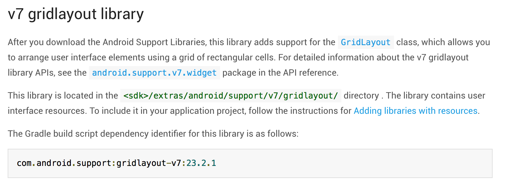

ถ้าใครที่ใช้ Android จะรู้ว่า เมื่อ Google ประกาศ Android เวอร์ชั่นใหม่ ๆ มาถามว่าจะมีสักกี่คนเองที่ได้ใช้ เนื่องมาจาก กว่าผู้ผลิตโทรศัพท์จะปล่อย ROM ที่มีเวอร์ชั่นใหม่ ๆ มาก็กินเวลาไปครึ่งปีถึงปีแล้ว นี่ยังไม่นับเครื่องที่มีสเปกเก่าเกินจนอัพเกรดไม่ได้อีกมามาย (เครื่องผมก็โดนแพแล้วเช่นกัน) ถ้าเราลองดูตาม Chart ของ Google จะเห็นว่ายังมีคนใช้ OS ที่ออกเมื่อ 4-5 ปีก่อนอยู่เลย (เป็นเรื่องที่น่าปวดจิตจิม ๆ)

ความซวยก็ตกมาถึงพวกเราชาว Developer ที่ไม่สามารถดึง API ของเวอร์ชั่นใหม่ ๆ ออกมาใช้ได้ ทำให้เราต้องมานั่งเขียน Code เพื่อเช็คทุก ๆ ครั้งว่า เป็นเวอร์ชั่นอะไรแล้วใช้ได้มั้ย แล้วถ้าเป็นเวรอ์ชั่นเก่าจะทำยังไง เป็นเวอร์ชั่นไปต้องเรียกอะไร ทำให้ยุ่งยากไปอีก ซึ่ง Google เองก็มองเห็นถึงปัญหานี้เหมือนกันเลยออกตัว Android Support Library มาเพื่อแก้ปัญหานี้นั่นเอง

## Android Support Library คืออะไร ?
อย่างที่ได้เล่าปัญหาไปว่า เมื่อ Android อัพเดทเวอร์ชั่นใหม่ ๆ มา แต่สุดท้ายเราก็ใช้ไม่ได้ แล้วถามว่าเจ้าพวก API ใหม่ ๆ ที่ออกมาเป็นอยู่ในรูปแบบไหน มันก็คือ Code Java หรือ C ปกติเลย ซึ่งวิธีง่าย ๆ คือการเอาส่วนของ Code Java หรือ C แยกออกมาแล้วทำเป็น Library นั่นเอง สรุปแล้วเจ้า Android Support Library มันก็คือ Library ที่รวมเอา API ของเวอร์ชั่นใหม่ ๆ มาให้เราสามารถเรียกใช้กับ Android รุ่นเก่า ๆ ได้นั่นเอง ซึ่งมันเป็นการแก้ปัญหาเรื่องของ Software Fragmentation  ได้อย่างหมดจดเลยทีเดียว
โดย Android Support Library จะมีการอัพเดทอยู่ตลอดเวลาเพื่อเพิ่มความสามารถของมัน โดนมันจะแบ่งออกเป็น 6 เวอร์ชั่นนั่นคือ v4, v7, v8, v13, v14, v17 เลขเวอร์ชั่นนี้ก็มาจาก API Level นั่นเอง เช่นเลข 4 ก็คือ API Level 4 ที่อยู่ใน Android 1.6 แต่มีสิ่งหนึ่งที่ต้องจำไว้เสมอว่า สิ่งที่มีอยู่ใน v4 ก็ไม่มีใน v7 และสิ่งที่มีอยู่ใน v7 ก็ไม่มีใน v8 ด้วยเช่นกัน ง่าย ๆ คือแต่ล่ะเวอร์ชั่นก็มีอะไรที่ไม่เหมือนกันเลย ซึ่งเวลาใช้งานจริง ถ้าเรา Import มาทุกตัวเลย App เราคงบวมเต่งใกล้ระเบิดเต็มทีแล้วล่ะ เพราะฉะนั้นเวลาเราใช้งานเราก็ต้องเลือกใช้และ Import แค่ที่เราใช้
คนที่พึ่งเคยใช้อาจจะคิดว่า เลขเวอร์ชั่นคือ API Level ที่ตัว Library ดึงมาให้ แต่จริง ๆ แล้วมันไม่ใช่เลย มันคือ API Level เวอร์ชั่นต่ำสุดที่เราจะสามารถเรียก Library ตัวนี้ได้ เช่นเราบอกว่า เราใช้ Library ที่เป็น v4 ฉะนั้น Minimum API Level ก็ควรจะมากกว่าหรือเท่ากับ 4 นั่นเอง ลองอีกตัวอย่าง ถ้าเรามี Minimum API Level ที่ 15 ถามว่า เราจะเรียก Library v ไหนได้บ้าง คำตอบคือ v4,v7,v8,v13,v14 นั่นเอง ถึงตอนนี้ก็น่าจะรู้จัก Support Library กันไปส่วนหนึ่ง และรู้วิธีในการเลือกใช้กันไปแล้ว ตอนนี้เรามาลองใช้กันดีกว่า

## ลองใช้ Android Support Library กัน
ในตัวอย่างนี้ผมจะลองใช้ Grid Layout ก่อนอื่นเราต้องเข้าไปหาก่อนว่า มันอยู่ใน Library ตัวไหน ซึ่งวิธีการหานั้นก็ไม่ยากเลย ให้เข้าไปที่ [http://developer.android.com/tools/support-library/features][1] จากนั้นหาคำว่า Grid Layout ก็จะเจอหน้านี้ออกมา

โดยใน Document จะบอกรายละเอียดบลา ๆ มากมาย แต่สิ่งที่เราต้องสนใจจริง ๆ อยู่ข้างล่างสุดเลย นั่นคือตัว Dependency ที่เราต้องเติมลงไปใน Gradle (ถ้าลองสังเกตว่า ใน Library v4 เราสามารถเติม Dependency ตัวเดียวแล้วใช้ได้ทั้ง v4 เลย แต่ v7 นั้นต่างออกไป เพราะมันใหญ่มาก เลยต้องแยกออกมาเป็น Components) ก่อนอื่นเลย ถ้าใครยังไม่ได้สร้าง Project ใน Android Studio ก็สร้างเลยครับ เราจะได้มาลองใช้กัน หลังจากที่เราสร้าง Project เสร็จแล้ว เราก็จะได้ หน้าตาแบบนี้ออกมา

จากนั้นให้เราเปิดไฟล์ build.gradle ขึ้นมา และเพิ่ม Dependency ของ Grid Layout ที่เราเปิดไว้เมื่อกี้ลงไป และกด Sync Gradle ได้เลย หลังจาก Sync Gradle เสร็จแล้ว เพียงเท่านี้เราก็สามารถเรียกตัว Grid Layout ที่เราเพิ่งเพิ่มเข้าไปได้แล้ว ง่ายมาก ๆ เลย ถัดไปเราจะมาลองเรียกใช้กันดีกว่า ให้เราเปิดไฟล์ activity\_main.xml ขึ้นมา และลองสร้าง Grid Layout ดูจะเห็นได้ว่า สามารถใช้ได้ ทั้ง ๆ ที่ Minimum API Level มันต่ำกว่า นั่นก็เพราะว่า Library เรา Import ไปนั่นเอง
คำถามใหม่ ถ้าเกิดใน สิ่งที่เราต้องการใช้อยู่ใน Android ที่เราพัฒนาอยู่แล้ว เราจำเป็นที่ต้องใช้ของใน Library มั้ย ?
คำตอบคือควรนะครับ เพราะว่า Android มันถูกพัฒนาทุกวัน ซึ่งตัว Library เองก็ดึง Code มาจาก Android ตัวใหม่ ๆ นั่นแหละ บางที สิ่งที่เราต้องการอาจจะมีอยู่ทั้งใน Library และมีในตัว Android อยู่แล้ว จะถูกแก้ไขปรับปรุงอะไรหลายๆ อย่าง ทำให้การทำงานนั้นราบลื่น ฉะนั้นเราควรเรียกจาก Library จะดีกว่า

## สรุป
โดยสรุปแล้ว Android Support Library เป็น Library ตัวนึงที่ Google ปล่อยออกมาเพื่อให้นักพัฒนาสามารถใช้ API ที่อยู่ใน Android เวอร์ชั่นใหม่ ๆ ได้บนเครื่องที่เป็นเวอร์ชั่นเก่า ซึ่งก็จะแบ่งออกเป็น 6 เวอร์ชั่นด้วยกัน ซึ่งแต่เวอร์ชั่นก็จะมีอะไรที่ไม่เหมือนกันอีก แต่ก็ไม่ใช่ทุก API ที่จะถูกดึงมาอยู่ใน Support Library ส่วนใหญ่จะเป็นอะไรที่ Google เห็นว่าสำคัญ ก็จะเอามาเติมให้ใน Library ทั้งหมดนี้ก็เป็นการอธิบายคร่าว ๆ เกี่ยวกับ Android Support Library สำหรับใครที่อยากจะเป็น Android Developer แล้วล่ะก็ ควรที่จะใช้ของพวกนี้ให้คล่อง ไม่งั้นอยู่ยากแน่นอน ! ถ้าใครอยากดูเพิ่มเติมลองเข้าไปดูของ [Google Developer][4] ได้เลย

[1]: http://developer.android.com/tools/support-library/features
[4]: https://www.youtube.com/watch?v=3PIc-DuEU2s&annotation_id=annotation_2695892575&feature=iv&src_vid=32i7ot0y78U
