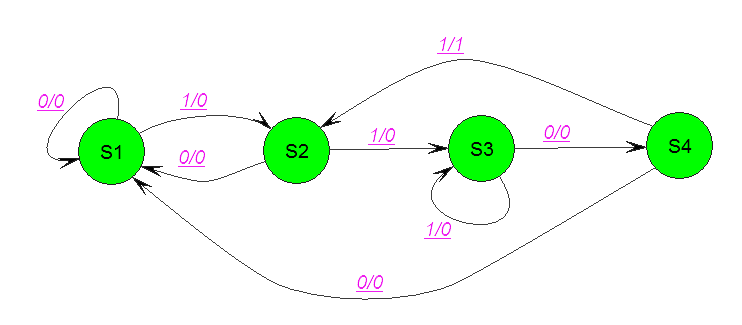

มาถึงตอนนี้แล้ว หลาย ๆ คนน่าเคยได้ยินเรื่องของ Node.js กันมาบ้างแล้ว วันนี้เราจะมาดูกันว่า มันคืออะไร แล้วมันเอาไปใช้งานกับอะไรบ้าง

## Node.js คืออะไร ?
นิยามของมันจริง ๆ ผมก็ไม่รู้เหมือนกันแฮะ เอาเป็นว่า มันคือการเอาภาษาที่เป็น Client Side Script ยอดนิยมอย่าง Javascript เอามาเขียนเพื่อรันเป็นภาษาฝั่ง Server แต่ในความเป็นจริงแล้ว เมื่อเราโหลดตัว Node.js มาลง มันจะ Install ตัว Environment สำหรับการทำงานมาให้หมดเลย และสามารถติดตั้งอะไรได้เพิ่มเติมได้เยอะมาก ๆ เลยจนเราเรียกมันว่า มันเป็นอีกหนึ่ง Platform ไปซะแล้ว และตัว Node.js ก็ขึ้นชื่อมากในเรื่องของความเร็วในการประมวลผล เพราะว่า Node.js ใช้ V8 ซึ่งเป็น Javascript Compiler จาก Google ที่มันเร็วมาก ๆ
โดยสรุปคือ การเขียนโปรแกรมด้วย Javascript ที่ฝั่ง Server แทนที่มันควรจะเป็นฝั่ง Client โดยมันทำได้ทุกอย่างจริง ๆ ไม่ว่าจะเป็นการประมวลผลต่าง ๆ มากมายกายกองเยอะมากจริง ๆ

## จริง ๆ แล้วที่ดูเร็ว ๆ มันก็มีเบื้องหลังเหมือนกันนะ
ถ้าใครหลาย ๆ คนที่เคยใช้ Node.js แล้วบอกว่ามันเร็วมากเลย เหมือนกับมันรันเหมือนกับมันทำหลาย ๆ คำสั่งไปพร้อม ๆ กันเลย แต่จริง ๆ แล้ว ไม่เลย มันก็เป็น Single Thread ตามปกติเลย มันหลอกตาเรา ด้วยการประมวลผลแบบเรียงคิวกัยซึ่งแน่นอนว่า มันเร็วมาก ๆ ทำให้มันหลอกตาเราว่า มันเร็วมากนั่นเอง (เอาจริง ๆ มันก็เร็วจริง ๆ นะไม่ได้ล้อเล่น)

## แล้วเราเอามันมาทำอะไร ?
เยอะมาก ๆ เลย แต่ส่วนใหญ่ เราจะเอามันไปใช้กับงานที่เป็นเบื้องหลังซะเป็นส่วนใหญ่เช่น ทำหน้าที่เป็น HTTP Server เพื่อเอาหน้าเว็บส่งไปให้ User หรือจะเป็นการทำเว็บแบบ Live เช่นพวก Chat อะไรแบบนี้ก็ได้เหมือนกัน

## ข้อดีของ Node.js

* V8 Engine = อภิมหาโคตรจะเร็ว !!!! อย่างที่บอกไปว่า Node.js เลือกใช้ Compiler อย่าง V8 ทำให้ Performance ของมันเร็วแรงทะลุนรก !!
* มีคนพร้อมช่วยเหลือเสมอ เพราะว่ามันเป็นที่นิยมมาก ทำให้มีคนสามารถตอบปัญหาเราได้เยอะมาก
* ทำงาน Cross Platform ด้วย อันนี้ผมชอบมากเลย เพราะว่าเขียนทีเดียว รันได้ทุกที่แบบ จริง ๆ จัง ๆ มากต่างจาก Java ที่ถึงจะรันได้ทุกที่จริง ๆ แต่มันก็แอบมีปัญหาบ้างแต่ Node.js นี่ไม่มีเลยนะ เพราะมันก็เป็นเว็บ
* มีอะไรให้เล่นเยอะมาก ก็จากข้อ 2 อีกนั่นแหละ เพราะมีคนใช้เยอะ ก็จะมีคนเอา Module มาแจกกันมหาศาล ทำให้เราสามารถเล่นอะไรกับมันได้เยอะมาก ๆ เลย อันนี้ก็เป็นอีกเหตุผลที่มาเลือกใช้ Node.js เหมือนกัน
* ลงทีเดียวเป็นได้ทุกอย่างจริง ๆ อย่างที่บอกว่าจริง ๆ แล้วถ้าเราเอา Node.js มา Install มันก็จะเตรียม Environment มาให้ ซึ่งนั่นก็รวมไปถึง Web Server แถมยังเอามาทำ Load Balance ได้อีก ลงทีเดียว แต่ได้หลายอย่างมากคุ้ม
* เรียนรู้ง่ายมาก เพราะมันเป็นภาษาที่เราค่อนข้างที่จะคุ้นเคยกันอย่างดีอย่าง Javascript

## Node.js เปลี่ยนวิธีในการออกแบบโปรแกรมของเราไปเลย !!
อันด้วยเพราะว่า Node.js นั้นทำงานเป็นแบบ Event-Driven จากเมื่อก่อนตอนที่เราเขียนพวก Java, PHP, หรือ C เวลาโค๊ตมันทำงาน มันก็จะทำงานไปทีล่ะบรรทัด แล้วเอาผลของมันไปทำงานในบรรทัดต่อไป แต่กลับตัว Node.js นั่นไม่ใช่เลย เพราะว่ามันถูกให้ทำงานตาม Event ที่เกิดขึ้น ดังนั้นเราก็ต้องพยายามมองว่าโปรแกรมของเรามันอยู่ตรง State ไหน แล้วดังจับผลลัพธ์เพื่อให้ได้ผลลัพธ์ที่ดีเพื่อนำไปทำงานต่อไป

## Node.js ก็เหมือน State Diagram

การออกแบบโปรแกรมใน Node.js ก็เหมือนเราออกแบบ Digital Circuit เลย เราจะต้องคำนึงว่า โปรแกรมของเราตอนนี้จะอยู่ใน State ไหน ตราบใดที่ไม่มีอะไรไปกระตุ้นมันก็จะไม่มีอะไรเกิดขึ้น จนกระทั่งเราป้อนข้อมูลเข้าไปโปรแกรมก็จะทำงาน เป็น State ไปเรื่อย ในที่นี้คือ Event เช่น เรามี 4 Event อยู่ในโปรแกรมเรา แล้วเราไปกระตุ้น Event ที่ 2 ทำให้มันทำงานและส่งผลลัพธ์ไปที่ Event ที่ 2 ก็ได้ อย่างที่บอกไปว่า โค๊ตบรรทัดแรก ไม่ใช่โค๊ตที่จะรันก่อนเสมอ เวลาเราออกแบบให้เรานึกถึง State Diagram ให้ดี จะทำให้การออกแบบโปรแกรมโดยใช้ Node.js เป็นไปได้ง่ายขึ้นเยอะเลย

## สรุป
โดยสรุปแล้ว การมาเริ่มหัดใช้ Node.js ในตอนนี้ก็เป็นเรื่องดีมาก เพราะว่า หลายเว็บหรือหลาย ๆ งานส่วนใหญ่ตอนนี้เริ่ม ไม่สิ ได้เอาตัว Node.js มาใช้กันหมด แล้วเพราะว่ามัน เร็ว และง่ายมาก ตัวมันถือว่าเป็น Platform ตัวนึงเลยก็ว่าได้ เพราะว่ามี Package อะไรให้เราเล่นเยอะไปหมดเลย และมันก็ฟรีด้วย ทำให้เราไม่จำเป็นต้องมานั่งโค๊ตอะไรเยอะแยะอีกแล้ว โดย Package เราก็สามารถติดตั้งได้ง่าย ๆ ผ่านทาง NPM ที่ในโอกาสหน้า เราจะมาพูดถึงกัน เพราะว่าวันนี้เขียนเยอะแล้ว กลัวยาวไปไม่อ่าน สำหรับวันนี้ก็สวัสดีครับ !
**พรุ่งนี้จะแข่ง IEEEXtreme แล้วตื่นเต้นจุง เดี๋ยวจะกลับมาเขียนเล่าให้อ่านว่ามันเป็นยังไง !**
