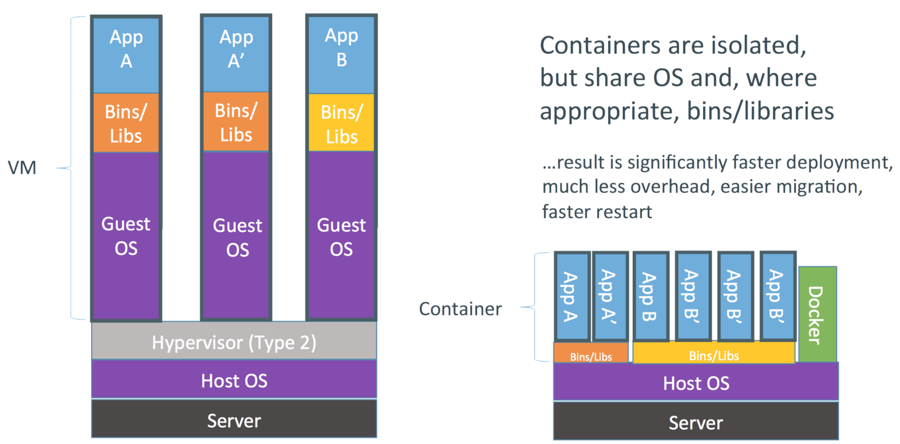
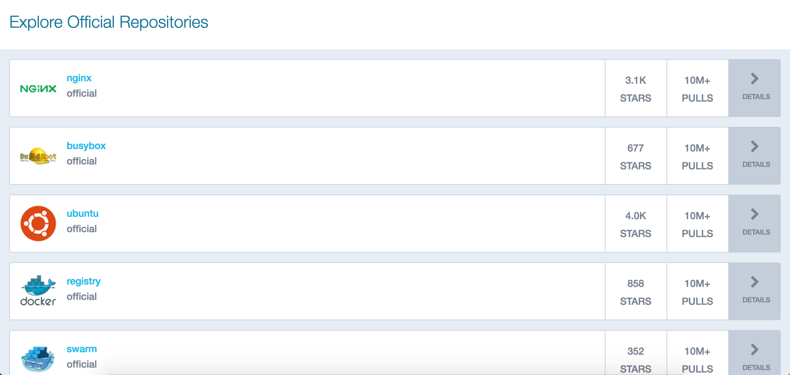
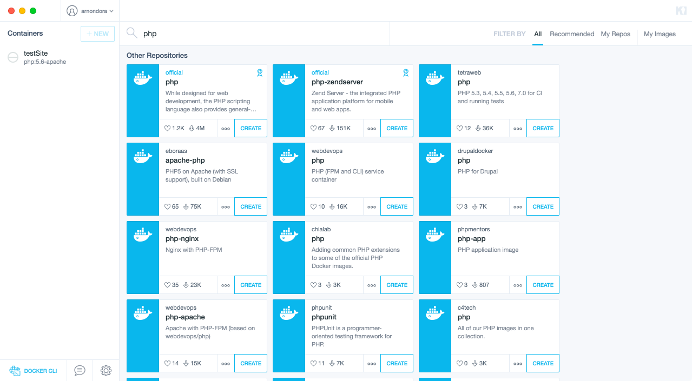

## Docker คืออะไร ?

มันเป็น Tool ตัวหนึ่งที่ทำให้เราสามารถห่อระบบของเราแล้วเอาไปรันที่ไหนก็ได้ ที่มี Docker ติดตั้งไว้ อ่านแล้วน่าจะ งง กัน ง่าย ๆ มันก็คือ Virtual Machine แบบนึงเหมือนกับที่เราใช้ VMware, VirtualBox หรืออะไรพวกนี้ แต่ Docker ต่างจาก VM ตัวอื่น ๆ ตรงที่มันจะทำงานอยู่บน LXC ซึ่งเป็น VM ที่ทำงานอยู่บนระดับ OS อ่านแล้ว งง แน่ ๆ
เอาเป็นว่า จุดที่ต่างคือปกติแล้ว VM จะจำลองมันทั้ง OS เลย แต่ Docker มันจะแยก Guest OS ออกเป็นแต่ล่ะ Container โดยที่แต่ล่ะ Container จะไม่เกี่ยวข้องกันเลย (แต่จะให้มันเกี่ยวกันก็ได้) สรุปเราสร้าง Container เพื่อจำลอง Environment สำหรับ 1 Service เท่านั้น ต่างจาก VM ปกติที่จำลองมันทั้ง OS เลย

## Containers VS VMs

สิ่งที่ Containers ต่างจาก VMs ก็เป็นอยากที่ได้กล่าวไปนั่นคือ VMs จะเป็นการจำลองมาทั้ง OS เลย เพราะฉะนั้นมันก็จะมี Process ที่เราไม่จำเป็นต้องใช้ติดมาด้วย ในขณะที่ Containers นั้นจะไม่มี Process ที่ไม่จำเป็นเพราะสิ่งที่มันจำลองคือ แค่ Process ที่เราต้องใช้ ทำให้ Container ที่เรารันนั้นมีความเร็วที่เร็วมาก เร็วจนเหมือน Native เลย และยังกิน Resource น้อยกว่าด้วย แถมการ Manage Container ก็ทำได้เร็วมาก ๆ ด้วย
แต่ข้อจำกัดคือ OS ที่รัน Docker ได้จะต้องเป็น Linux เท่านั้น เพราะอย่างที่ได้กล่าวไปว่า มันทำงานอยู่บน LXC ที่อยู่บน Linux ฉะนั้นถ้าเราต้องการรันบน OS อื่น เราก็ต้องทำการจำลอง Linux สักตัวขึ้นมาซะก่อน ซึ่งจะเป็น Linux อะไรก็ได้ ถ้าเอาง่ายคือ Boot2Docker เป็นอันที่ง่ายที่สุด เพราะมันมาพร้อมกับตัว Installer เลย

## เข้าใจการทำงาน
ถ้าในการทำงานมันจะมีแต่ตัว Container มันก็ยังไงอยู่ จริง ๆ การทำงานนั้นจะแบ่งออกเป็น 4 ตัวนั่นคือ

* Host OS - ถ้าเอาที่เราใช้กันมันก็คือ OS ที่เอาไว้รันนี่แหละ ซึ่งต้องเป็น Linux ดั่งเหตุผลที่ได้เกริ่นไว้แล้ว
* Host - คือตัวที่รับคำสั่งที่เราสั่งผ่าน Command Line และส่งให้ Daemon อีกรอบนึง
* Daemon - เป็นเหมือนคนคุม Container ทั้งหมด

## การใช้งาน

จากที่ได้บอกไปเมื่อครู่ว่า Docker นั้นจะแบ่งตัวเองออกเป็น Container ไปเรื่อย ๆ ตั้งอยู่บน Host OS มองภาพง่าย ๆ ของ Container ว่ามันคือกล่องเปล่า ๆ ใบนึง หน้าที่ของเราจะต้องหาอะไรมาใส่ให้มัน ซึ่งสิ่งที่เราจะเอามาใส่ให้มันนั่นคือ โปรแกรม ที่เราต้องการรันนั่นเอง โดยมันจะถูกเก็บอยู่ในรูป Image ที่เราสามารถไป Pull มาจาก Community ของ Docker หรือที่เราเรียกว่า DockerHub มาใช้งานได้ และ เรายังสามารถ Push Image ขึ้นไปเพื่อแชร์ให้กับคนอื่นก็ได้เช่นกัน

## ข้อดีของ Docker
จริง ๆ ก็มีข้อดีอยู่หลายข้อมาก ๆ ที่ทำให้นักพัฒนาหลายคนติดใจ และย้ายมาใช้กัน เอาที่ผมว่าเด่น ๆ ล่ะกัน

1. **เร็ว** - ถ้าใครที่ใช้ VM มาก่อน จะพบว่ามันเป็นอะไรที่ ช้าและเสียเวลามาก ๆ กว่าจะโหลดขึ้น แต่ Docker นั่นเร็วมาก ๆ เพราะว่า มันใช้ OS, CPU และ Memory ร่วมกันกับ Host OS ทำให้มันเบาหวิวเลย ต่างกับ VM ที่ใช้ทุกอย่างแยกกันหมด และการจำลองทั้ง OS ก็ทำให้มีบางอย่างที่เราไม่ได้ใช้ แต่ก็ต้องรัน ทำให้เราเสียทรัพยากรไปฟรี ๆ
2. **มีระบบ Registry** - ระบบนี้จะช่วยให้เราสามารถติดตั้งโปรแกรมหรือ Environment ที่เราต้องการได้เร็วขึ้น เพราะว่ามันมีคนทำไว้ให้เราแล้ว โดยเราแค่เพียงโหลด Image ตัวนั้นมา และติดตั้ง ก็สามารถใช้ Environment นั้นได้เลย ซึ่งทาง Docker ก็จะมีสิ่งที่เรียกว่า Docker Hub อยู่ โดยเราสามารถ Push ตัว Image ที่เราสร้างไว้ขึ้นไป หรือเราจะไป Pull Image ที่คนอื่นสร้างไว้มาใช้ก็ได้ และตอนนี้ใน Docker Hub ก็มี Image มากมายทั้ง Official และที่ทำเองให้เราเลือกใช้ได้มากมาย
3. **สะดวก -** บางคนอาจจะจำเป็นต้องใช้ Environment ที่มีโปรแกรมเยอะมาก ๆ หรือติดตั้งโปรแกรมที่ทำยาก ๆ เช่น อยากได้ Elasticsearch เป็นคน เมื่อก่อน เราก็ต้องสร้าง VM ขึ้นมาและค่อยติดตั้ง Elasticsearch ซึ่งกินเวลามาก แต่ด้วย Image สำเร็จรูปทำให้เราสามารถติดตั้ง โปรแกรม หรือตั้งค่า Environment ที่เราต้องการได้ภายในเวลาไม่กี่วินาที และเพียงแค่ไม่กี่คำสั่งเท่านั้น

## ส่วนใหญ่เราเอามาใช้ทำอะไร
จริง ๆ คำถามนี้ตอบยากมาก ๆ เพราะมันเป็นเหมือน Tool อเนกประสงค์จริง ๆ Image ก็มีให้เราเลือกใช้มากมาย ผมมองว่า มันเกิดมาเพื่อแก้ปัญหา 2 อย่างใหญ่ ๆ นั่นคือ การติดตั้ง Application ที่บางตัวต้องใช้เวลามากในการติดตั้ง แต่ถ้าเราใช้ Image มาทำมันก็จะลดเวลาได้เกินครึ่งเลยทีเดียว เพราะทั้งหมดมันทำให้เราแบบอัตโนมัติ
อีกเรื่องนั่นคือเรื่องของ Environment ที่แตกต่างกัน บางทีเราทำงานด้วยกัน อาจจะเคยเจอปัญหาที่ว่า "เครื่องเรารันได้ แต่ทำไมนายไม่ได้ ?"ปัญหานี้เกิดขึ้น เพราะ Environment ที่ใช้มันต่างกัน ไม่ว่าจะเป็นเวอร์ชั่น หรือ OS ก็ตามก็อาจทำให้เกิดข้อผิดพลาดขึ้นได้ ถ้าเราใช้ Environment ซึ่งหมายถึง Dependencies ที่เหมือนกัน และเวอร์ชั่นเดียวกันก็สามารถทำงานร่วมกันได้อย่างราบรื่นมากขึ้น และอีกปัญหาที่เกิดคือ เครื่องที่เราใช้ Dev กับเครื่อง Production มันต่างกัน เราก็แค่ จำลอง Environment ลงไปเป็น Image แล้วส่งให้คนในทีม ก็หมดปัญหาแล้ว

## การติดตั้ง
ในการติดตั้ง จะใช้ OSX ในการติดตั้งนะครับ เดี๋ยวนี้วิธีการติดตั้งนั้นง่ายแสนง่าย ให้เราเข้าไปในเว็บ เพื่อโหลด Docker Toolbox เข้ามาในเครื่องเรา และติดตั้งตามที่หน้าจอบอกไว้เลย ง่ายมาก ๆ หลังจากที่เราติดตั้งได้แล้ว ให้เราเปิด Terminal ขึ้นมา พิมพ์คำสั่งด้านล่าง เพื่อเช็คว่า เรา Install ได้อย่างถูกต้อง

    docker -v

ถ้าถูกต้องก็จะมีเลขเวอร์ชั่นขึ้นมา แปลว่า เราติดตั้งเรียบร้อยแล้ว ถัดไปเราจะมาลองสร้าง Container เพื่อรัน Web Server กันดีกว่า ซึ่ง ณ ตอนนี้จะมีอยู่ 2 วิธีคือ วิธียาก กับวิธีง่าย ในตัวอย่างที่จะทำให้ดูทั้ง แบบง่าย และ แบบยากคือจะเป็นการสร้าง Apache Web Server ที่เราใช้รัน Web กันทั่ว ๆ ไปพร้อมกับ PHP ด้วย

## สร้าง Container ด้วยวิธี ท่ายาก
วิธีนี้เราจะทำแบบดั่งเดิมเลย นั่นคือการใช้ Command Line ในการทำ ข้อดีของมันคือ ง่าย (แล้วแต่คนจะคิดนะ ผมว่ามันง่ายมาก ๆ) และรวดเร็ว เพียงแค่เราพิมพ์เราก็ได้อย่างที่เราต้องการแล้ว และสุดท้ายคือ ฟังก์ชั่นการทำงานครบ เพราะว่า ตัว Docker ดั่งเดิมแล้ว ทำงานบน Command Line มาก่อน GUI มาทีหลัง มาเริ่มกันเลย
แต่เหนือสิ่งอื่นใด เราจำเป็นที่จะต้องรู้ IP ของ Host OS กันก่อน โดยสามารถพิมพ์คำสั่งตามด้านล่างได้เลย

    docker-machine ip

เราก็จะได้ IP ของเครื่องที่เรารัน Boot2Docker เอาไว้ เช่นของผมเป็น 192.168.99.100 ให้เราเก็บไว้ก่อน ขั้นตอนถัดไปเราจะมาทำการการสร้าง Container กัน โดยสามารถใช้คำสั่ง ตามด้านล่างเพื่อสร้างได้เลย

    docker run --name testSite -v /Users/arnonpuitrakul/Desktop/testSite:/var/www/html/ php:7.0-apache

มาอธิบายสิ่งที่พึ่งพิมพ์ไปก่อนดีกว่า

* docker run เป็นคำสั่งในการสร้าง Container ใหม่
* --name testSite เป็นการตั้งชื่อ Container ตัวที่เราต้องการสร้าง
* -v /Users/arnonpuitrakul/Desktop/testSite:/var/www/html/ เป็นเหมือนกับการสร้างวาร์ป ระหว่างเครื่องเรากับ Container โดยเราบอกว่าให้ Content ใน /var/www/html/ ที่อยู่ฝั่ง Container มี Content ของ /Users/arnonpuitrakul/Desktop/testSite ที่อยู่ฝั่งเครื่องของเราวางอยู่ **(Path ตรงฝั่งเครื่องเราต้องเปลี่ยนให้ตรงกับที่ ๆ เราต้องการด้วยนะ)**
* php:7.0-apache คือ Image ที่เราต้องการติดตั้งลงใน Container โดยขั้นด้วย Colon (:) ระหว่างชื่อ Image และเวอร์ชั่น เช่น Image ที่เราใช้คือ php เวอร์ชั่น 7.0 และมี apache ติดมาให้ด้วย
จากคำสั่งมันจะวิ่งเข้าไปหา Image ในเครื่องเรา ถ้าเราไม่มี มันจะเข้าไปโหลดมาให้เราโดยอัตโนมัติ และครับติดตั้งให้เอาเองเช่นกัน หลังจากที่ติดตั้งเรียบร้อยแล้ว เราสามารถตรวจสอบสถานะของ Container ที่เราสร้างได้โดยใช้คำสั่ง

    docker ps -a

มันก็จะ List Container ที่มีอยู่ขึ้นมา และบอกสถานะ แต่ถ้าอยากดูเฉพาะตัวที่ทำงานอยู่ เราก็แค่เอา -a ออกไปเท่านั้นเอง เมื่อเราเห็นแล้วว่า Container ของเรารันเรียบร้อยแล้ว ถ้าเราลองเข้าตาม IP Address ที่เราจดไว้เมื่อกี้ เราจะเข้าหน้าเว็บนั้นไม่ได้ เพราะว่าใน Web Server มันไม่มีหน้าเว็บอะไรให้แสดงเลย ถ้างั้น เราลองมาสร้างหน้าเว็บง่าย ๆ ให้มันรันกันดีกว่า ให้ไฟล์ชื่อว่า Index.php เซพลงในตำแหน่งที่เราเปิดวาร์ปไว้ และใช้ Code Hello World ปกติตามข้างล่างได้เลย

    <?php echo "Hello World"; ?>

ทีนี้ เมื่อเราลอง Refresh อีกรอบ มันก็จะขึ้น Hello World ตามที่เราพิมพ์ไว้ได้แล้ว ง่ายมาก ๆ เล่นเสร็จแล้วก็ต้องเก็บกวาด ถ้าเราต้องที่ปิด Container ตัวนั้นไว้ เราก็แค่พิมพ์คำสั่งตามด้านล่าง เพื่อที่จะหยุดการทำงานของ Container ที่เราต้องการได้เลย

    docker stop testSite

เมื่อเราลอง Refresh อีกรอบจะเห็นได้ว่า อ้าว เข้าไม่ได้ซะแล้ว นั่นก็แปลว่า Container ของเราหยุดการทำงานเรียบร้อยแล้ว และครั้งต่อไปถ้าเราต้องการใช้ Container นี้ต่อ เราก็รัน

    docker start testSite

และถ้าเราต้องการที่จะลบ Container เราก็แค่รันคำสั่ง

    docker rm testSite

เท่านี้ Container ของเราก็จะถูกลบเรียบร้อย อีกนิดนึง ถ้าต้องการลบ Image เราสามารถเรียกคำสั่ง rmi และตามด้วยชื่อ Image ได้เลย เช่นผมจะลบ Image php ที่พึ่งโหลดมาเมื่อกี้ ก็ต้องเป็น

    docker rmi php:5.6-apache

จริง ๆ แล้วเราไม่จำเป็นที่จะต้องพิมพ์เต็มก็ได้ เราสามารถพิมพ์แค่ php อย่างเดียว มันก็จะไปลบทุก Image ที่เป็น php ทั้งหมด ซึ่งก็ต้องระวังนิดนึงว่า ถ้าเรามี Image ของ php หลาย ๆ ตัว การทำแบบนี้อาจจะพลาดทำให้เราไปลบ Image ของ php ทั้งหมดเลยก็ได้

## สร้าง Container ด้วยวิธีท่ามาตรฐาน
จริง ๆ มันก็ก็ไม่ได้มาตรฐานเลย เพราะจริง ๆ มาตรฐานเขาใช้ Command Line กัน ถ้าเอาวิธีง่ายคือ เราจะใช้ GUI ในการสร้างกัน โดยเราจะใช้โปรแกรมที่มีชื่อว่า Kitematic ที่เราจะได้มาตอนที่เราติดตั้งเลย ซึ่ง ณ ตอนนี้ก็ยังเป็น Beta อยู่นะ ถ้าเข้าครั้งแรก อาจจะต้องรอแปบนึงให้ VM มันเปิดเสร็จก่อน ลองมาดูหน้าตาโปรแกรมกัน

หน้าตาโปรแกรมไม่มีอะไรเลย เรียบง่ายมาก ๆ ด้านซ้ายมันจะแสดง List ของ Container ที่เรามีอยู่ จากภาพก็จะมี testSite สร้างผ่านวิธีท่ายากเมื่อครู่ เราจะมาลองสร้าง Container เหมือนอันที่เราสร้างเมื่อครู่กัน เริ่มจากให้เราค้นหา Image ที่เราต้องการผ่านช่อง Search ก่อน นั่นคือ php มันก็จะได้ผลลัพธ์เหมือนรูปข้างล่าง

ตัว Image ที่เราต้องการคืออันแรกนั่นเอง นี่นี้ถ้าเรากด Create ไปเลย มันก็จะเอา เวอร์ชั่นล่าสุดมาให้เรา แต่เราต้องการที่จะเลือกเวอร์ชั่นที่เราต้องการเองนั่นคือ php:7.0-apache เราสามารถทำได้โดยกด ปุ่มจุดที่อยู่ข้าง ๆ Create แล้วกดเข้าไปใน Tag มันก็จะมีเวอร์ชั่นมาให้เราเลือก แน่นอนว่า เราก็ต้องเลือก 7.0-apache และกด Create แค่นี้เราก็จะได้ Container มาเรียบร้อยแล้ว

## สรุป
Docker เป็น Tool ที่ทำให้เราทำงานได้ง่ายขึ้นมาก ๆ มันช่วยเราตัดปัญหาหลาย ๆ อย่างออกไปเยอะมาก ๆ เช่น Environment ของเครื่อง Dev กับเครื่อง Production ที่ไม่ตรงกัน หรือแม้กระทั่ง เครื่องที่ใช้ Dev ด้วยกันเองที่ไม่ตรงกัน และมันยังช่วยให้เราจัดการ Environment ที่เราใช้ทำงานได้ง่ายขึ้นด้วยนะ เช่น ผมทำเว็บอยู่ 2 ตัว ตัวนึงต้องใช้ php 5 รัน ส่วนอีกงานต้องใช้ php 7 ผมก็แค่สร้าง Container ขึ้นมา 2 ตัว แล้วพอจะใช้เวอร์ชั่นไหนผมก็รันเวอร์ชั่นนั้นขึ้นมาใช้ได้ หรือจะเป็นในเรื่องของการ Test ก็ได้ เราถ้าสามารถเอาเว็บที่รัน php 7 มาเช็คกับ php5 ก็ได้ว่า ถ้าเราเอามารันแล้วจะมีปัญหาอะไรมั้ยอะไรแบบนี้ก็ได้เช่นกัน นอกจากนี้มันยังช่วยให้เราติดตั้งโปรแกรมบางอย่างได้ง่ายขึ้นมาก เพราะมันทำติดตั้งอะไรให้เราครบ สำเร็จเลย และตอนนี้ Docker คงเป็น Tool ที่ควรจะต้องรู้จักทุกคนแล้ว เพราะว่ามันเป็นอะไรที่มาแรงมาก ๆ หวังว่า จะทำให้ใครที่เข้ามาอ่านรู้จักมันมากขึ้นนะครับ สวัสดีครับ
