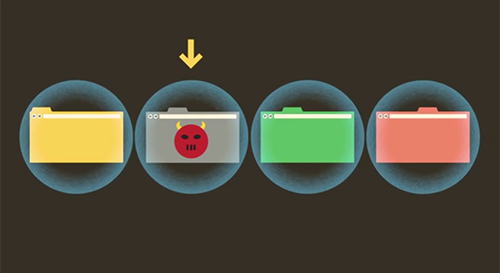

ปัจจุบันนี้ Web Browser ยอดนิยมก็คงหนีไม่พ้น Internet Explorer ไม่สิ Google Chrome ต่างหาก ซึ่งถ้าใครหลายๆคนได้ใช้ Google Chrome แล้วก็ใช้คอมพิวเตอร์ที่แรมน้อย ๆ นะมันจะกระตุกสุด ๆ พอไปเปิด Task Manager เท่านั้นแหละ แรมหายเกลี้ยง แล้วคนก็บ่นกันเยอะมากเลยว่า กินแรมเยอะไปนะบางที แต่หารู้กันมั้ยครับ จริงๆแล้วที่มันกินแรมเยอะเนี่ย ไม่ได้เป็นเพราะว่า โปรแกรมเมอร์ที่เขียน Chrome กากหรอกนะครับ แต่ ก่อนหน้านั้น เราจะต้องมาเรียนรู้วิธีการทำงานของ Chrome กันก่อน ว่ามันแตกต่างจาก Web Browser ตัวอื่น ๆ ยังไง
Web Browser สมัยนี้ต้องออกแบบให้รองรับมาตราฐานอะไรเยอะไปหมดที่คนสร้างขึ้นมา เพราะฉะนั้นมันก็จะซับซ้อนกว่า เมื่อก่อนเยอะมาก มากถึงมากที่สุดจริง ๆ ถ้ายังไม่เห็นภาพ เว็บเมื่อก่อน เราก็เปิดเว็บมา อย่างมากก็มีแค่ตัวหนังสือโง่ ๆ แต่ตอนนี้ มีทั้งวิดีโอ เสียง ไหนจะ CSS Styling อีก บานเลยล่ะครับ เท่านี้ก็ทำให้กินแรมบานแล้วล่ะครับ

## อ้าวของเจ้าอื่นเข้าไม่เห็นกินแรมกันหมดเครื่องได้ขนาดนี้เลยนิ ?
จริง ๆ แล้วที่มันกินแรมมหาศาลได้ขนาดนี้ เพราะว่าตัว Chrome ถูกออกแบบมาให้มันปลอดภัยมากๆ สังเกตมั้ยครับ เวลาตัว Chrome มันเกิด Crash (ไม่ใช่รถชนนะเว้ยเฮ้ย !!) ตัวโปรแกรมมันจะไม่หลุดหายไปเลยนะครับ เวลามัน Crash มันก็ Crash เป็น Tab ไป แต่ล่ะ Tab ไม่เกี่ยวข้องอะไรกันเลย แยกออกไปเป็น Process ใหม่ของมันเองทั้งหมด (หรือที่ Google เรียกมันว่า Sandbox) ทำให้มันค่อนข้างที่จะเถียรเลยล่ะครับ
นอกจากจะแยก Tab แล้ว ใน Tab ก็จะต้องรัน Extention อีก เช่นเราเปิดหน้าเว็บที่มี Flash Chrome ก็ต้องเปิด Flash แยกกันไปอีก ยิ่งเปิด Tab เยอะมันก็จะยิ่งกินแรมมากขึ้นไปอีก ซึ่ง Web Browser เจ้าอื่น ๆ เขาจะไม่แยก Process แบบ Chrome ทำให้เวลามันเด้งมันก็ไปหมดเลยทุก Tab ทุกหน้าต่างเลยไปทั้งโปรแกรมกันเลยทีเดียว

## นอกจากป้องกันการ Crash ทั้งโปรแกรมแล้ว มันยังมีอีกประโยชน์นะ...

ปัญหาของหลาย ๆ คนเลยนั่นคือ เรื่องความปลอดภัยครับ ใน Google Chrome Tab แต่ล่ะ Tab จะถูกแยกออกไม่ แบบไม่มีความเกี่ยวข้องกันเลย ไม่สามารถที่จะเชื่อมต่อกัน หรือคุยอะไรกันได้เลย คิดซะว่ามันโดนกำแพงเสริมเหล็กกล้าฉาบตะกั่วบังอยู่ล่ะกันครับ แล้วถ้าเกิดเราไปเปิดเว็บที่มี Malware อยู่ ตัว Malware มันก็จะไปไหนไม่ได้ เพราะว่าตัว Sandbox ไม่สามารถที่จะส่งข้อมูลข้าม Tab หรือแม้กระทั่งออกไปนอก Chrome เข้าไปในเครื่องได้เลย ซึ่งถ้าเกิด Malware ตัวนี้มันแรงขนาดทำให้ Browser Crash ได้ มันก็ทำได้แค่ Tab ที่มันทำงาน Crash ไปเท่านั้นเอง หรือถ้าเรารู้ว่ามี Malware เข้ามา เราก็แค่ปิด Process นั่นทิ้งไป Malware ก็หายไปด้วยเลย ทำให้ผู้ใช้มั่นใจได้ว่า เราจะไม่ติด Malware จากการเข้าเว็บผ่าน Chrome แน่นอน (เว้นแต่ เราจะโหลดเข้ามาในเครื่องแล้วกดรันเอง)
นอกจากนี้ ยังมีข้อดีอีก เราก็รู้กันดีว่า Ram เนี่ยเป็น Memory ที่เร็วกว่า HDD หรือแม้แต่ SSD อยู่หลายขุมอยู่ ฉะนั้นถ้าเรา Cache ข้อมูลไว้ที่แรมเยอะ ๆ เนี่ยก็ทำให้เราเรียกอะไรได้เร็วขึ้นมาก เพราะแรมมันเร็วมาก ๆ

## แต่มันก็กลายมาเป็นข้อเสียเมื่อ....
ที่ผมพูดมามันก็ดูดีเลยนะ ที่มันกินแรมเยอะ แต่มันก็มีข้อเสียอยู่ก็คือมันไม่ Optimal ไงล่ะ มันกิน Memory เยอะมาก ๆ มากจนทำให้ OS ต้องไปทำ Paging แทน (ย้ายข้อมูลที่จะเก็บไว้ใน Ram ไปเก็บใน HDD แทน) ทำให้ OS ที่ใช้รัน Chrome มันแลค เลยทำให้ Chrome มันแลคไปด้วยอีก ซ้อนกันเลยทีเดียว

## เรามีวิธีแก้มานำเสนอกัน 3 วิธี
**วิธีแรกเลยคือ การเอาคอมไปเพิ่มแรม** อาจจะเป็นวิธีที่สิ้นคิดไม่น้อย แต่ก็ควรจะเพิ่ม ถ้ามันไม่พอจริง ๆ ตอนนี้ 8 GB ก็กำลังดีเลยล่ะ ราคากำลังลงด้วย เพราะ DDR4 กำลังมา lol
**วิธีถัดไปคือ ใช้เสร็จก็ปิด **เพราะผมสังเกตคนที่บ่นๆกันเนี่ย มักจะเป็นคนที่ชอบเปิด Tab ไว้เยอะ ๆ เยอะมากเลยล่ะ แล้วก็มาบ่นว่ามันไม่พอเนี่ย ใช้เสร็จแล้วก็ปิดไป ไม่ก็ถ้ากลัวลืมก็เก็บไว้เป็น Favourite เลยสิครับแหม่ ๆ
**วิธีสุดท้าย มีน้อยใช้สอยอย่างประหยัด** ตอนนี้ก็มี Extention ที่ทำให้ Tab ใน Chrome มันหยุดทำงานด้วยนะ เราสามารถที่จะ Suspend Tab เก็บไว้ได้ แล้วก็พอจะใช้อีกรอบก็ Resume มัน เราก็จะใช้ได้เหมือนเดิมและ ชื่อว่า [The Great Suspender][1] และอีกวิธีที่จะช่วยเราประหยัดได้นะครับ นั่นคือให้เราเปิด Click to play ไว้ด้วยครับ เราจะได้เลือกเปิดเฉพาะ Extention ที่เราไม่ได้ใช้ จะได้เป็นการประหยัดแรมได้อีกทางครับ

เป็นยังไงบ้างครับ เราก็ได้รู้เหตุผลกันแล้วนะครับว่า ทำไม Chrome มันกินแรมได้เยอะขนาดนี้ เพราะมันแยกทุกๆอย่างไว้เป็น Process ของตัวเองไม่เกี่ยวข้องกันทำให้ กินแรมเยอะขึ้นเมื่อเราเปิดหลาย Tab และรันหลายๆ Extention พร้อม ๆ กัน และก็มีวิธีการจัดการกับปัญหานี้ง่าย ๆ กัน 3 วิธีไปเลย สำหรับวันนี้ก็ลาไปก่อนครับ สวัสดีครับ**

[1]: https://chrome.google.com/webstore/detail/the-great-suspender/klbibkeccnjlkjkiokjodocebajanakg
