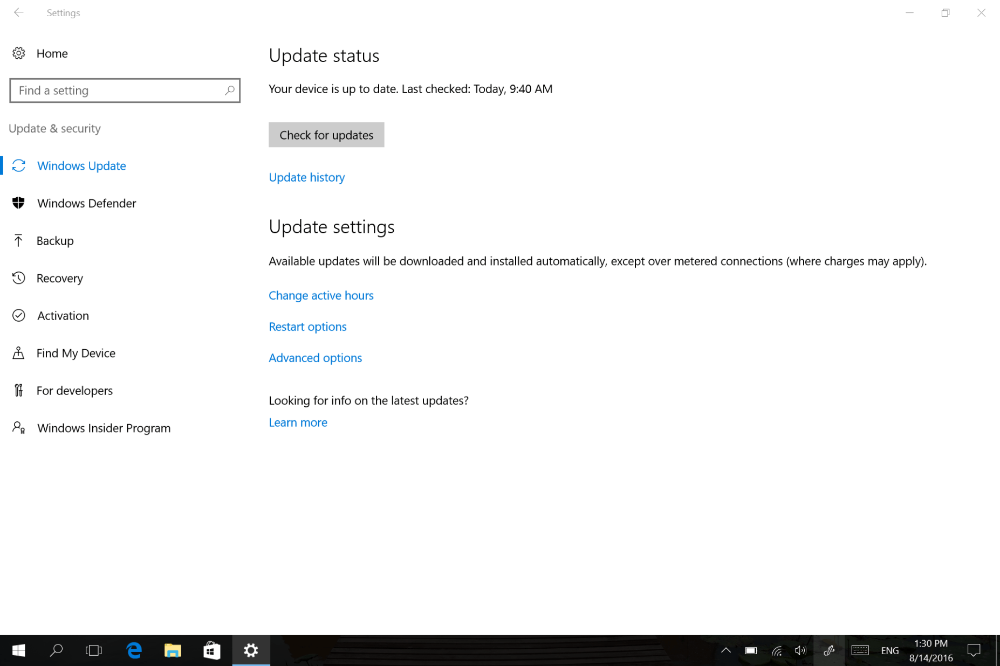
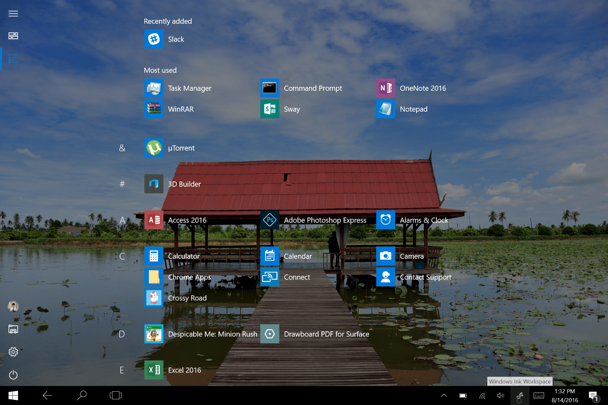
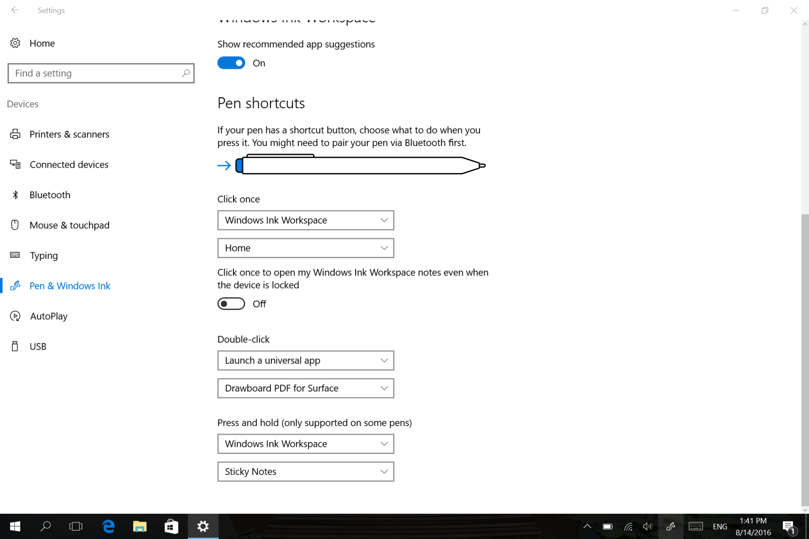
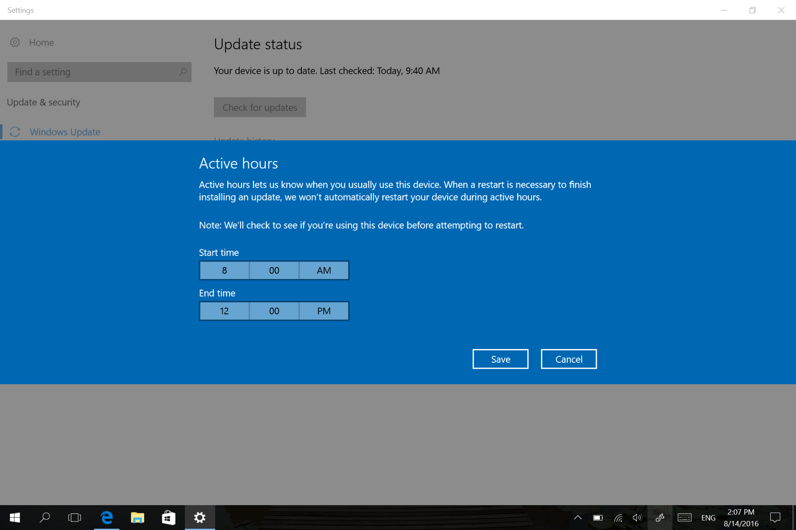

นับว่าเป็นอัพเดทใหญ่ตัวแรกที่ Microsoft ออกให้กับ Windows 10 เพือเป็นการฉลองที่ Windows 10 มีอายุครบ 1 ขวบพอดี เลยตั้งชื่อมันซะเลยว่า **Windows 10 Anniversary Update** เอางั้นเลย ฮ่าๆๆ
ฉะนั้นวันที่เพือเป็นการฉลองไปด้วยกัน เราจะไปดูกันว่า อัพเดทครบรอบ 1 ขวบนี้จะมีอะไรที่น่าสนใจโผล่มาบ้าง และมีอะไรที่ไม่ดีบ้าง ซึ่งผมก็ได้ใช้ไปแล้วประมาณอาทิตย์หน่อย ๆ บน Surface 3 และบน Macbook Pro ของผม ลองไปดูกันเลย

## สวัสดี Windows 10 Anniversary Update

เราสามารถทำการอัพเดทเป็น Anniversary Update ได้ผ่าน Windows Update ได้โดยตรงเลย ซึ่งจะใช้เวลาไม่นาน ขึ้นอยู่กับอินเตอร์เน็ตของเรา สำหรับใครที่ทำไม่เป็น ก็ให้เข้าไปที่ **Settings \> Update & security** และกด **Check for updates** ได้เลย เท่านี้เราก็สามารถอัพเดท Windows ของเราให้เป็นเวอร์ชั่นล่าสุดนี้ได้แล้ว

## Lock Screen
จุดนี้น่าจะเป็นจุดแรกที่เลย เราน่าจะเอ๊ะใจกัน นั่นก็คือ **Lock Screen** ที่เมื่อเรากด Enter เพื่อที่จะใส่ Password Wallpaper ไม่ได้เป็นรูปของ Microsoft ที่เปลี่ยนไม่ได้แล้ว กลายเป็นไปใช้ Wallpaper ของ Lock Screen ไปเลย และ Effect ที่ใช้ตอนเราจะกดรหัสก็เปลี่ยน ดูเป็นธรรมชาติมากขึ้น ก็ดูดีไปอีกแบบ
และถ้าเราใช้บาง App เช่น Groove Music เมื่อเราเปิดเพลง มันก็จะถูกแสดงอยู่ในหน้า Lock Screen อันนี้ชอบมาก ๆ
แต่ช้าแต่ ไม่ได้แคปหน้าจอมาให้ดู เพราะแคปไม่เป็นฮ่า ๆ

## Start Menu ที่เปลี่ยนไป

จุดแรกหลังจากอัพเกรด ก็น่าจะเป็น Start Menu ที่เปลี๊ยนไป โดยจะมีปุ่มพวก Settings, Power และที่ชอบที่สุดคือมี **ปุ่ม File Explorer** ด้วย นอกจากนี้ที่งอกเข้ามาอีกคือ All Apps ที่เมื่อก่อน เราจะต้องกดปุ่มอีกชั้นนึง เพือที่จะเข้า ซึ่งมันยากเกินไป คนเลยไม่ค่อยใช้กัน ตอนนี้เลยถูกเอามาไว้ข้างหน้าเลย สะดวกขึ้นมาก

สำหรับใครที่ใช้ Surface หรือ Windows Tablet ต่าง ๆ จะสามารถเปิดหน้า App Apps ได้ผ่านปุ่มทางด้านซ้ายบน รายชื่อ App ก็จะขึ้นมาตามอักษรเลย
สำหรับการเปลี่ยนแปลงครั้งนี้อาจจะไม่ใช่อะไรที่น่าตื่นใจสำหรับใครหลาย ๆ คน แต่สิ่งนี้เราถ้าใช้ไปสักพักน่าจะสะกิดใจได้เลยว่า มันทำให้ชีวิตเราง่ายขึ้นจริง ๆ เพราะมันช่วยลดขั้นตอนในการเปิดโปรแกรมสักตัวที่เราไม่ได้ Pin ไว้บน Start Menu

## Action Centre

จริง ๆ มันโผล่มาตั้งแต่ใน Windows 10 ก่อนหน้านี้แล้ว มันทำให้ชีวิตผมดีมาก เพราะชินกับการใช้ Notification ใน OSX ด้วยเลยชอบไปเลย ใน Anniversary Update นี้ Action Centre ได้รับการปรับปรุงในหลาย ๆ จุดเลย
อย่างแรกคือ ตำแหน่งกลายเป็นมาอยู่ทางด้านมุมขวาสุด อันใหญ่ ๆ จะได้สะดุดตา และเมื่อมี การแจ้งเตือน มันก็จะเปลี่ยนเป็น Icon ของ App นั้น ๆ ไปด้วย
ถัดมาคือ หน้าตา ที่ทำออกมาได้ดูดีขึ้น รองรับการแจ้งเตือนแบบเติมพวกรูปภาพลงไปได้แล้ว (แต่ App ที่มีอาจจะน้อย เพราะพึ่งอัพเดทไป) และที่ชอบมาก ๆ คือ เราสามารถตอบแซทในบาง App ผ่าน Action Centre ได้เลย โดยที่ไม่ต้องเปิด App เลย เหมือนกับใน iOS เลยมั้ย

## Windows Ink Workspace

อันนี้แหละ ของเล่นใหม่ที่พึ่งเพิ่มเข้ามา ออกแบบมาเพื่อ Windows Tablet ที่มีปากกาอย่าง Surface มันจะอยู่ตรง Task Bar ทางด้านขวา เมื่อเรากดขึ้นมาก็จะมีเมนูโผล่ขึ้นมา หรือสำหรับใครที่ใช้ Surface สามารถกด 1 ครั้งที่หัวปากกา มันก็จะเด้งขึ้นมาเหมือนกัน
เมื่อขึ้นมา ก็จะมีเมนูที่เป็น App มาให้เราเลือกใช้ เหมือนกับเป็น Starting Point สำหรับการใช้ปากกาอะไรทำนองนั้น ในนั้นก็จะมี

* **Sticky Note** ที่เป็นการจดโน๊ต ที่เจ๋งคือ มันสามารถเอาข้อความที่เราเขียนออกมาตีความแล้วบอกข้อมูลเราเพิ่มเติม หรือลงตารางเวลาในปฏิทินก็ได้ เท่าที่ใช้มาก็ยังไม่ได้เที่ยงขนาดนั้น เหมือนกับมีให้รู้ว่ามีมากกว่านะ เท่าที่รู้สึกจากการลองใช้
* **Sketchpad** ที่เป็น App สำหรับ วาดรูป ก็วาดรูปเลยไม่รู้จะพูดอะไร
* **Screen Sketch** ที่เป็นการ Capture หน้าจอออกมาแล้วให้วาดเขียนอะไรลงไปได้
ส่วนที่ชอบจาก Sketchpad และ Screen Sketch คือ มันมี**ไม้บรรทัด**แล้วเฟ้ย !!! คือที่อยากอัพเดทก็เพราะนี่เลย !!
ถัดไปก็จะเป็น App ที่เราใช้ล่าสุด และสุดท้าย อันนี้ขายของนิดนึงนั่นคือ Suggested App มันจะแนะนำ App สำหรับปากกาใน Store ขึ้นมาให้เรา เกิดอารมณ์อยากเสียเงินอะไรทำนองนั้น
แต่กับผมแล้ว **Windows Ink Workspace** อาจจะไม่ใช่คำตอบเท่าไหร่ เพราะว่า ผมไม่เคยต้องใช้ App 3 ตัวที่เป็น Shortcut ที่ขึ้นมาเลย มันยังเซ็ตเปลี่ยน App ที่ขึ้นมาก็ไม่ได้ เลยเซ็ง ๆ ไม่ใช่ซะเลย

## เซ็ตปุ่มหัวปากกาได้แล้วเหวย !!!

สำหรับใครที่ใช้ Surface ที่ไม่ใช่ Surface Pro 4 อย่างผม สิ่งที่เซ็งมากคือ เมื่อเรากดที่หัวปากกา มันจะเปิด OneNote มาให้เรา และเปลี่ยนไม่ได้ ในขณะที่ Surface Pro 4 เปลี่ยนได้
ความไม่เท่าเทียมกันนี้ถูกแก้ไขแล้ว ในอัพเดทนี้ โดยเราสามารถเข้าไปที่ **Settings \> Devices \> Pen & Windows Ink** เพื่อเข้าไปเลือกใช้ได้ตามสบายใจท่านเลย

## Microsoft Edge
หลาย ๆ คนอาจจะไม่รู้จัก หรือไม่กล้าใช้กัน กับ Microsoft Edge ที่เป็น Web Browser ในอัพเดทนี้ ก็ได้เพิ่มฟีเจอร์ที่หลาย ๆ คนเรียกร้องนั่นคือ **Extension** เหมือนกับที่เราได้ใช้กันใน **Web Browser เจ้าอื่น ๆ มาชาติเศษ**

ซึ่งตอนนี้ใน Store ก็มี Extension ดัง ๆ หลาย ๆ ตัวเข้ามาให้เราโหลดเป็นที่เรียบร้อยแล้วเช่น **AdBlock,** **Evernote** และ **Bing Translate** เป็นต้น

นอกจากนี้ยังมีฟีเจอร์อย่าง **Swipe Navigation** ที่คนใช้ Mac น่าจะเคยใช้ Safari ที่เราปาดขวาจะเป็นเหมือนการกด Back ที่จะช่วยให้เราเล่นเว็บได้ง่ายขึ้นมากจริง ๆ จากประสบการณ์กับ Surface การที่เราจะกด Back หรือ Forward ไปข้างนี้นี่เราต้องไปกดปุ่มเล็ก ๆ ข้างบน แต่พอมี Swipe Navigation ทำให้เราให้แค่นิ้วเลื่อนซ้าย ขวาไปมาก็ได้แล้ว สะดวกมาก

และตอนนี้ที่ดีใจมาก ในที่สุด Microsoft Edge ก็**รองรับ Web Notification** อย่างที่เจ้าอื่นเขาทำมาเป็นชาติแล้ว ส่วนตัวเป็นคนที่ใช้ Web Notification ในการรับข่าวสารเป็นส่วนใหญ่ เลยจะค่อนข้างตื่นเต้นมาก ฮ่า ๆ

## New Skype App

ส่วนตัวเป็นมนุษย์ที่ไม่ค่อยใช้ **Skype** สักเท่าไหร่ เพราะมันเป็น Win32 App ธรรมดาที่ไม่ค่อยจะเหมาะกับ หน้าจอสัมผัส สักเท่าไหร่เลยทำให้ไม่ใช่ แต่มาในอัพเดทนี้มีการพ่วง Skype ที่เป็น Modern App มาให้ด้วย **(เป็นตัว Preview)** ตอนนี้ก็สามารถทำได้เกือบหมดทุกอย่าง เหมือนที่ Win32 App ตัวเก่าทำได้แล้ว

## Windows Update ที่เลิกกวนประสาท

หลาย ๆ คนน่าจะประสบปัญหาที่จู่ ๆ Windows เกิดทนไม่ไหวอยากอัพเดท เลย Restart ตัวเองเพื่อ Update ซะเลย (เอางั้นเลยทีเดียว) ทำให้หลาย ๆ คนบ่นเลยว่า "**อะไรของมัน !!**" ในรอบนี้ Microsoft ก็ฟังเสียงจาก User มา
ทำให้ใน Update นี้เราสามารถเลือกเวลาที่เราใช้งานได้ ซึ่ง Windows Update จะไม่ Restart ตัวเองในช่วงเวลาดังกล่าว จงเฉลิมฉลองต่อฟีเจอร์นี้ซะ ฮ่า ๆ

## บทสรุป
สำหรับ Windows 10 Anniversary Update เป็นการอัพเดทที่ไม่ได้มีอะไรออกมาให้ ตื่นเต้นจนต้องลุกขึ้นหรืออะไร แต่เป็นการอัพเดทเพื่อ**สร้างประสบการณ์การใช้งานให้ดีขึ้น**มากกว่า จากที่ได้ลองใช้ทั้งบน Surface และ Macbook แล้วก็พบว่า มันดีขึ้นจริง ๆ ที่ชอบที่สุดคือ ตรงส่วนของ Windows Update ที่จะไม่ Restart เครื่องเรามั่วซั่วนี่ดีมาก ๆ เพราะโดนเป็นประจำ
แต่ด้วยฟีเจอร์ที่เพิ่มเข้ามาแล้ว บัคก็เช่นกัน หลังจากอัพเดทไปวันเดียว ผมคนเดียวเจอบัคถึง 7 จุดเลยทีเดียว ไม่ต้องถามเลยว่า วันที่ 2 จะเจออีกเท่าไหร่ มหาศาลเลย นี่แค่ใช้งานทั่วไปเอง เลยค่อนข้างผิดหวังมากอยู่ เช่น หลังอัพเดท Pin ที่เราใช้เข้าเครื่องก็ใช้ไม่ได้ ต้องไป Remove ออกแล้วสร้างใหม่ หรือจะเป็น Lock Screen Wallpaper ที่หายไป ต้องหมุนหน้าจอมันถึงจะกลับมาอะไรเทือกนี้ หรือที่น่ากลัวสุดคือทำ Visual Studio ผม Crash ไปเลย เปิดมาอีกที โปรแกรมเปิดได้ แต่ Project เปิดไม่ได้คือระ !!
ฉะนั้นขอสรุปเลยละกันครับ **อัพเดทนี้ถือว่าเป็นการวางแนวทางไปได้ไม่เลวเลย ค่อนข้างพอใจมาก** แต่อยากให้แก้บัคที่เกิดขึ้นหน่อยละ เพราะเยอะเหลือเกิน นี่ Report จะไม่ทันอยู่แล้ว หลาย ๆ ฟีเจอร์ที่เพิ่มเข้ามาถึงจะไม่น่าตื่นเต้น แต่ก็ช่วยให้เราทำงานได้ไวขึ้นมากเลย นอกจากฟีเจอร์แล้ว รู้สึกเหมือนว่า มันจะลื่นไหลมากกว่าเดิมนิดหน่อยด้วย
จริง ๆ ยังมีอีกหลาย ๆ ฟีเจอร์ที่ไม่ได้เอามาเขียน ผมเลือกเอามาเฉพาะที่เด่น ๆ ที่คนทั่ว ๆ ไปน่าจะได้ใช้กัน และทั้งหมดนี้คือรีวิว Windows 10 Anniversary Update **สามารถอัพเดทได้แล้ว ผ่าน Windows Update ตั้งแต่วันนี้เลย** ใช้แล้วเป็นยังไง ก็ลองมาบอกเล่ากันผ่าน Comment ด้านล่างได้เลยนะครับ สำหรับวันนี้สวัสดีครับ
