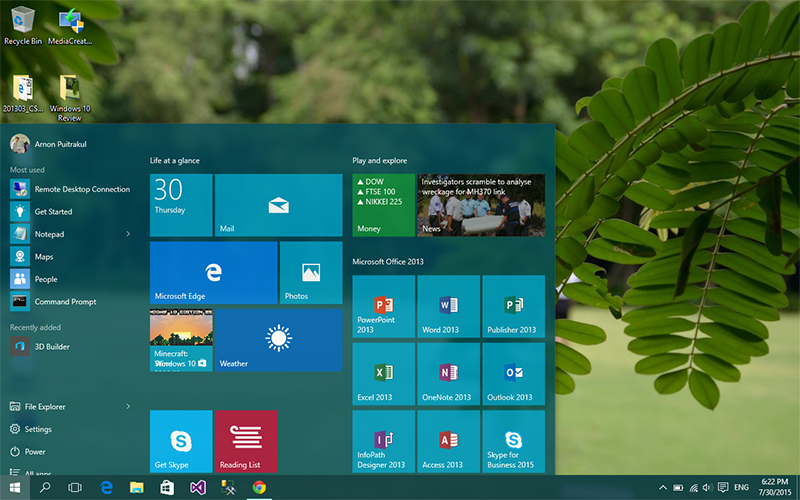
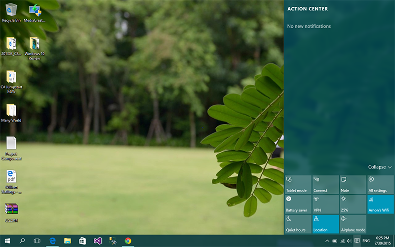
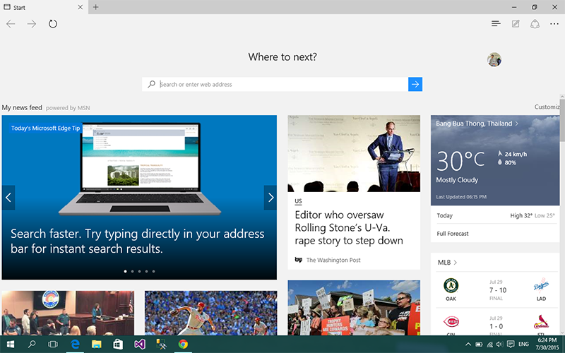

ตอนนี้ Microsoft ก็ได้ปล่อย Windows 10 ตัวเต็มอย่างเป็นทางการกันไปแล้ว จากตอนแรกที่เป็น Public Beta ที่ให้ใครก็ได้เข้าไปลองใช้แล้วส่ง Feedback กลับมา วันนี้เราเลยจะมาลอง Review กันดูคร่าวๆ กันดีกว่า

## New Feature
**1\. Start Menu**

หลังจากที่ Microsoft ได้เปลี่ยน Start Menu ใน Windows 8 กันไปก็ทำให้เกิดเสียงเรียกร้องว่า อยากได้ Start Menu แบบเดิมกลับมา ซึ่งแน่นอนว่าใน Windows 10 Microsoft ก็ได้ตอบรับถึง User ในเรื่องนี้เลย ปรับเปลี่ยน Start Menu ใหม่ให้มันไม่เต็มจอเหมือนกับ Windows 8 และยังรองรับ Metro App เหมือน Windows 8 อีกด้วย เราสามารถปรับขนาดและสีของ Start Menu ได้ด้วยนะ
**2\. Action Centre**

อันนี้ถ้าใครเคยใช้ OSX มาแล้ว มันก็จะเทียบได้กับ Notification Centre นั่นเอง แต่อันนี้เราสามารถปรับการตั้งค่าพื้นฐานได้เลยจากตรงนี้ เช่น ปรับแสงสว่างหน้าจอ หรือโหมดเครื่องบินเป็นต้น
**3\. Search**

ถัดมาเป็นเรื่องของการ Search ใน Windows 8 เวลาเราจะหาอะไรสักอย่างนึง เราก็ต้องไปกด Start แล้วก็พิมพ์ลงไปได้เลย แต่ใน Windows 10 ได้เพิ่มอีกช่องทางนึงนั่นคือ ปุ่มรูปแว่นขยายด้านล่าง ถ้าเรากดปุ๊บ มันจะเรียกตัวค้นหาขึ้นมาให้เรา และในบางประเทศสามารถใช้ Cortana ได้ด้วยล่ะ (แน่นอนว่าประเทศไทยเราใช้ไม่ได้ มั้ง? เลยจะขอข้ามไป)
**3\. Task Switcher**

ันนี้ก็เหมือนใน OSX อีกเช่นกัน เราสามารถกดปุ่มที่เป็นสีเหลี่ยมข้างล่างที่กำลังกดอยู่ในรูป มันก็จะแสดงหน้าต่างที่เรากำลังเปิดอยู่ นั่นเอง ถ้าอยากให้เห็นภาพอีก จำตอน Windows 7 ได้มั้ยครับ ที่เรากด Windows+Tab มันก็จะสลับหน้าต่างแบบไฮโซได้ ผมว่าไอ้นี่ก็อารมณ์เดียวกัน แต่ทำให้มันดูมีระเบียบมาขึ้น จากที่ได้ใช้มา ผมก็ไม่ได้ใช้มันเลยนะ เอาจริงๆ เลย
**4\. Snap Assist**

จริงๆ Snap Assist นี่มีมานานแล้ว ตั้งแต่ Windows Vista เลยมั่งจำไม่ได้เหมือนกัน แต่ใน Windows 10 มีการปรับปรุง Snap Assist ให้เก่งมากขึ้น โดยเมื่อเรา Snap หน้าต่างเหมือนกับตอน Windows รุ่นก่อนๆ อีกด้านนึงที่ไม่มีอะไรมันจะขึ้นหน้าต่างมาให้เราเลือก เพื่อให้หน้าต่างที่เราเลือกไปแสดงอีกข้างที่ว่างอยู่ (เหมือนกับการแบ่งครึ่งหน้าต่างนั่นล่ะ)
**5\. Project Spartan Edge Browser**

อันนี้เป็น Feature ที่หลายๆ คนถามผมมาเยอะมาก เพราะมันเป็นการ Re brand ของ Web Browser อย่าง Internet Explorer ที่มีชื่อเสียงอันไม่ค่อยดี ทั้งเรื่องประสิทธิภาพและการเรนเดอร์ (หรือเรียกว่า แทบไม่จะไม่มีอะไรดีเลยดีกว่า) มาเป็น Microsoft Edge ล่าสุดใน Windows 10  ซึ่งแน่นอนว่า เวอร์ชั่นใหม่ก็ต้องมีการเปลี่ยนแปลงแน่นอน หน้าตาของโปรแกรมก็เปลี่ยนไปหมดเลย มันดูเรียบมาก ซึ่งดี เพราะว่า มันทำให้เราสนใจกับเนื้อหาในหน้าเว็บได้มากขึ้น และเรื่องประสิทธิภาพ ก็ได้รับการปรับปรุงให้ดีขึ้นเช่นกัน ในเว็บต่างประเทศหลายๆ เว็บได้ทำการทดสอบมาแล้ว เขาบอกว่า มันดีขึ้นเยอะมากเลย ซึ่งก็เป็นเรื่องดีของหลายๆ คน แต่แน่นอนว่า Web Browser ของ Microsoft ก็ยังไม่ได้ใช้ Web Kit อยู่ดี ทำให้มันเป็นจุดอ่อนจุดนึงของ Web Browser ตัวนี้ได้เลย เพราะ Web Browser ตัวอื่นเขาเป็น Web Kit หมด มีนี่แปลกอยู่คนเดียว ทำให้นักพัฒนาเว็บส่วนใหญ่ไม่ค่อยชอบซะเท่าไหร่
จบไปแล้วกับ 5 Features ใหม่ของ Windows 10 จริงๆ แล้วยังมีอีกหลาย Feature ที่ผมไม่ได้เอามาเขียน ถ้าอยากรู้เพิ่มเติมก็ต้องลองเข้าไปหาใน Google กันดูล่ะกัน

## Real User Experience
เกริ่นก่อนเลยว่า ผมไม่ได้ใช้ Windows เป็น OS หลัก เพราะฉะนั้น Windows ผมจะใช้แค่เขียนโปรแกรมพวก .NET กับเล่นเกมนิดๆ หน่อยๆ อย่างเดียว และจากการใช้งานไป 1 วันเต็มกับงานและเกมเบาๆ ทำให้รู้ว่ามันดีขึ้นจริงๆ ดีขึ้นในหลายๆ เรื่องเช่น เรื่องของ Start Menu เพราะผมเป็นคนนึงที่ยังคงชอบ Start Menu แบบเก่ามากว่า เพราะมันดู Compact และง่าย แต่พอมาใน Windows 8 กับ 8.1 มันแปลงร่างไปเป็นเต็มจอ ทำให้อารมณ์มันเหมือนกับเราใช้ Tablet ที่หน้าจอสัมผัสพังอยู่มากกว่า แต่พอมาใน Windows 10 Microsoft ฟังเสียงจาก User จริงๆ ก็ทำให้ได้ Start Menu ที่ค่อนข้างโอเคขึ้นมาเลยดีเดียว
จากการใช้งานจริงๆ ก็ไม่ได้พบปัญหามากนัก ส่วนใหญ่จะพบกับเรื่อง Hardware และ Software Compatibility ของเครื่องตัวเองที่เป็น Mac เลยไม่ได้ว่าอะไร เพราะมันไม่ค่อยส่งผลกับตัวเรามากนัก ประสบการณ์ใช้งานส่วนใหญ่ก็ยังคงเหมือนเดิมเป็นส่วนใหญ่ ที่เปลี่ยนไปคือหน้าตาของมันเท่านั้นเอง ถึงแม้ว่ามันจะมี Feature ใหม่ๆ เยอะก็เถอะ แต่เอาจริงๆ แล้วผมก็ไม่ค่อยได้ใช้มันในชีวิตประจำวันเท่าไหร่ก็เถอะ

## สรุป
สรุป Windows 10 ตัวใหม่นี้ก็ให้ประสบการณ์การใช้งานที่ดีขึ้นไปอีกขั้นถ้าเทียบกับ Windows รุ่นก่อนๆ อีกทั้งการ Upgrade ขึ้นไปเป็น Windows 10 ก็ยังฟรีอีกด้วยถ้าเรามี License ของ Windows 8 หรือ 8.1 ทำให้ยิ่งน่าสนใจมากขึ้นไปอีก Feature ที่มาใหม่ๆ บางตัวก็ได้ใช้ และใช้บ่อยมาก ในขณะเดียวกันบาง Feature ก็ไม่ได้ใช้เลย แต่รวมๆ แล้วมันก็ทำให้ชีวิตเราง่ายขึ้นเยอะอยู่พอสมควร ถ้าถามว่า จำเป็นต้อง Upgrade มั้ยก็ถ้ากำลังใช้ Windows 8 หรือ 8.1 อยู่ก็ยังไม่จำเป็นเท่าไหร่ เพราะ Feature หลายๆ อย่างที่อยู่ใน Windows 10 เราก็ไม่จำเป็นต้องใช้ก็ได้ แต่ถ้า อยากลอง ก็สามารถ Upgrade ได้เลย ที่สำคัญมันฟรีด้วย สำหรับผู้ใช้ในบ้าน ผมแนะนำให้ Upgrade จะดีกว่า จะได้ใช้ระบบปฏิบัติการที่เวอร์ชั่นใหม่ รองรับอะไรเยอะกว่า ที่สำคัญมัน Upgrade ฟรีด้วย ทำไมเราจะไม่ชอบของฟรีล่ะ!

**เพิ่มเติม**
มีคนถามว่า ใช้มาจนถึงตอนนี้เจอปัญหาอะไรบ้างรึยัง? ก็ตอนนี้ใช้มาสักพักแล้ว ก็ยังไม่เจอปัญหาอะไรนะ มีแค่เรื่อง Driver อย่างที่บอกไป ถ้าเจอแล้วเดี๋ยวจะมาอัพเดทให้อ่านกัน
