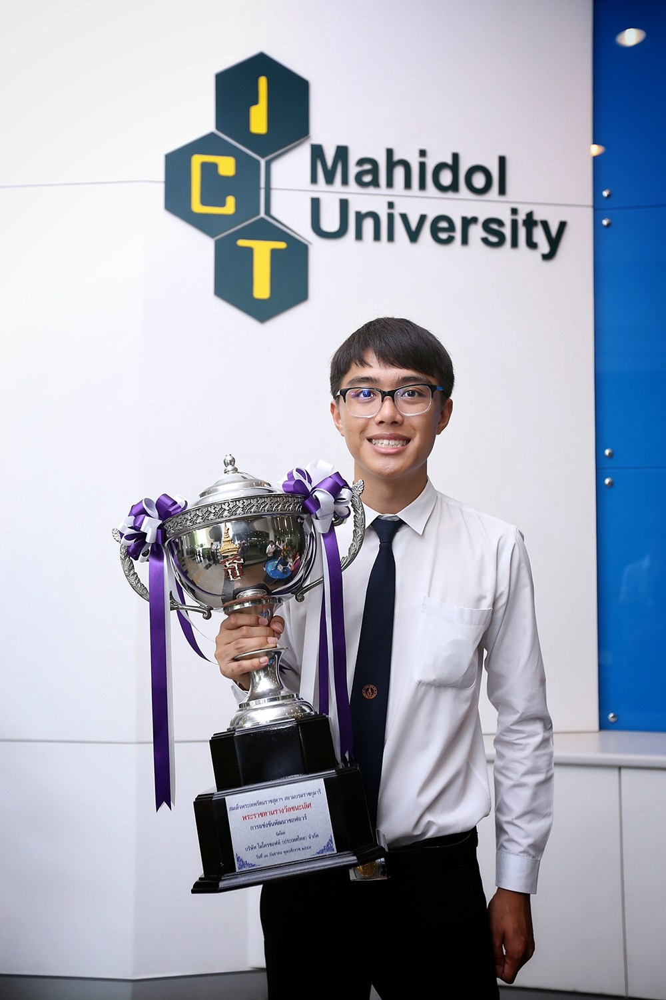

แปบเดียวก็จะขึ้นปีใหม่อีกแล้ว มันเร็วมาก ๆ เลยจริงมั้ยครับ ปีนี้เป็นอีกปีที่ผม ได้ลองทำในสิ่งที่ไม่เคยทำมาก่อน ทั้งสำเร็จ และล้มเหลว ได้ลองก้าวสู่สิ่งใหม่ ๆ ทำให้โลกของมันนั้นใหญ่ขึ้นตามไปด้วย บางสิ่งก็เกินคาด แต่ก็อย่างว่าละครับ ใครมันจะคาดเดาอนาคตได้

## ปีแห่งการเป็นผู้รับ

ชีวิตของผมมันไม่เคยหยุดนิ่ง ! ในปีนี้เป็นปีที่ผมรู้สึกว่า ตัวเองนั้นเป็นผู้รับมากกว่าผู้ให้ซะอีก ได้รับทั้งโอกาส ความรู้ และรางวัลต่าง ๆ จนบางทีก็ถามตัวเองเหมือนกันว่า “อืม.. เยอะไปมั้ย !” ฮ่า ๆ

ทั้งได้รางวัลต่าง ๆ ทั้งชนะเลิศ **Imagine Cup Thailand 2016**  จนได้เข้าเฝ้าและรับถ้วยพระราชทานจากสมเด็จพระเทพรัตนราชสุดาฯ สยามบรมราชกุมารี ซึ่งถือว่าเป็นเกียรติมาก ๆ และยังได้รางวัลอื่น ๆ อีกมากมาย

สกิลอีกด้านนึงที่หลาย ๆ คนไม่รู้ผมมีคือ **สกิลการถ่ายภาพ** ซึ่งปีนี้ผมก็คว้าที่ 2 ในรายการศาลายาวิถีมาได้ ซึ่งถือว่าเป็นรายการแรกของการแข่งขันถ่ายภาพของผมเลย จากเมื่อ 2 ปีก่อนผมบอกว่า ผมเริ่มที่จะหัดถ่ายภาพอย่างจริงจัง ปีนี้มันก็ทำให้เห็นแล้วว่า **จริง ๆ แล้วเราก็ทำได้**

ที่รู้สึกว่า พีคมาก คือ จู่ ๆ การถูกจับไปแต่งหน้า ถือกระเป๋าและถ่ายรูป ไม่เคยนึกว่าชีวิตนี้จะต้องมาทำอะไรแบบนี้ และไม่คิดว่าจะออกมาดีขนาดนี้ เสียงตอบรับส่วนใหญ่คือ งง ฮ่า ๆ

มีโอกาสได้เข้ามาเป็นหนึ่งในครอบครัว **YWC** ที่สมัครตั้งแต่ปี 1 ยันปี 3 กันเลยทีเดียว ตอนแรกก็ไม่นึกอยู่เหมือนกันว่าจะติด แต่ก็ติด ก็เป็นอีกเป้าหมายหนึ่งที่อยากจะทำให้ได้ก่อนจะเรียนจบ **Mission Complete !** เย้ ! ก็ทำให้ได้ความรู้ใหม่ ๆ รู้จักคนใหม่ ๆ และได้เพื่อนใหม่ ๆ เรื่องกิจกรรมในมหาลัยก็ยังทำอยู่เหมือนเดิม แต่เหมือนจะเริ่มเข้าไปหลบในเบื้องหลังมากขึ้น อย่างเช่นงานของสภานักศึกษาที่ปีนี้เข้ามาดำรงตำแหน่งอย่างเต็มตัว ก็กำลังพัฒนาเว็บไซต์ใหม่อยู่ ซึ่งก็ยังไม่เสร็จสักที (ก็หวังว่าจะเขียนให้เสร็จในเร็ววัน นะจ๊ะ !) จากงานต่าง ๆ ทั้งการแข่งขันต่าง ๆ งาน และกิจกรรมที่รับผิดชอบอยู่มันก็เยอะอยู่ ก็ทำให้เวลาเรียน พักผ่อน และเวลาไปเที่ยวเล่นกับเพื่อน ๆ และครอบครัว ก็หายไปจนแทบจะเหลือ **0** คนใกล้ตัวผมจะเป็นอันรู้กันว่า **“ปีนี้ หนึ่งมันนัดยากขึ้นอีกแล้ว !”** ความสัมพันธ์กับหลาย ๆ คนก็ห่างกันไกลเหลือเกิน ซึ่งเป็นเรื่องที่ผมไม่ค่อยโอเคในปีนี้เท่าไหร่ ก็ต้องเป็นเรื่องวาระแห่งปีที่ผมจะต้องนำไปแก้ปัญหาต่อไป

หลาย ๆ คนถามถึงเรื่องความรักของผมในปีนี้ ก็ขอบอกก่อนเลยว่า **ชอบผู้หญิงครับ มาตลอดครับ** ไม่เคยชอบผู้ชาย ครับ แมน ๆ ไม่เตะบอลครับ (คนชอบมาถามว่า **เป็นรึเปล่า ??** อยู่ตลอด) และก็ขอตอบว่า **ตอนนี้ก็ขอพักเรื่องนี้ยาว ๆ** ไปเลยครับ ปีนี้ก็ทำให้ได้มุมมองเรื่องความรักใหม่ ๆ มาเหมือนกัน อาจจะเพราะว่า วัยที่ใกล้เป็นผู้ใหญ่แล้วก็ได้นะ ที่ทำให้มุมมองเราเปลี่ยนไปขนาดนี้

## ได้ค้นพบนิยามคำว่า ประสบความสำเร็จ และความสุข ของตัวเอง

อย่างที่ผมได้เล่าไปว่า ปีนี้เป็นปีที่ได้ ทั้งรางวัล และโอกาสมากมาย หลาย ๆ คนอาจจะมองว่า มันคือ **ความสำเร็จ รางวัล มันคือสิ่งที่อยู่ปลายทาง** มันมีช่วงนึง ผมลองหันกลับมามองทางที่ผมเดินมา และทางที่อยู่รอบ ๆ ตัวผม ว่ามันเกิดอะไรขึ้นบ้าง ผมลองตั้งคำถามเกี่ยวกับ ความหมายของคำว่า ความสำเร็จ และลองพยายามค้นหาคำตอบอยู่บ่อยครั้ง จริง ๆ ค่าย **YWC** ที่ผมพึ่งไปเข้ามานี่แหละ ทำให้ผมฉุกคิด อาจจะโดยบังเอิญหรืออะไรก็เถอะ ถึงคำตอบของคำถามนี้ **ว่าความสำเร็จคืออะไร ?** คำตอบของมันช่างเรียบง่าย และอยู่รอบ ๆ ตัวเราตลอดเวลา แต่เราไม่เคยมองถึงมันเลย คำ ๆ นั้นคือคำว่า **ความสุข และ ความพึงพอใจในตัวเอง** เมื่อเรามีความพึ่งพอใจในตัวเอง เราก็จะมีความสุข เหมือนกับที่ **เมื่อเรารู้จักพอเพียง เราก็จะมีความสุขในทุกชั่วขณะ** Note: ว่าไม่ได้ขายตรงนะ เวลาพูดเรื่องนี้ทีไร นึกว่ามาขายตรงตลอด เราเปล่านะ !!!

## ปีนี้จะทำอะไรดี
หลังจากที่ระลึกเรื่องราวที่ผ่านมาในปีนี้ไปแล้ว ก็ถึงเวลาเรื่องของอนาคตในปีนี้กันบ้าง สำหรับปีหน้า ผมอยากที่จะลดในเรื่องของการแข่งขันและกิจกรรมหน่อย เพราะปีนี้รู้สึกว่า เล่นเอาซะอ่วมอยู่เหมือนกัน ทั้งเรื่องการเรียนที่จะย่ำแย่ (วัดจากความรู้สึก) ไม่เคยรู้สึกแย่ขนาดนี้ และสุขภาพ ทั้งกายและจิตที่เป็นซอมบี้หน้าแมวเหมียวตลอดเวลา แต่จะมาเน้นหนักให้การเรื่องของการเรียน และการศึกษาสิ่งใหม่ ๆ มากขึ้น อยากที่จะศึกษาในเรื่องของ **NLP (Natural Language Processing)** ที่ตอนนี้ก็มี Project อยู่ กับเรื่องของ **Web Technology** มากขึ้น จะพัฒนาฝีมือถ่ายภาพกับ Programming ต่อไป และจะพยายามเขียน Blog ให้ถี่สม่ำเสมอด้วย ฮ่า ๆ

## สรุป : เป็นปีที่ดีมาก

ปีนี้เป็นอีกปีที่รู้สึกว่า โลกรอบ ๆ ตัวผมมันกว้าง และวิ่งเร็วขึ้นมาก มันนำเรื่องดี ๆ เข้ามาในชีวิตเรา บางอย่างที่คิดว่ามันจะไม่มาในปีนี้ มันก็มา ถือว่าเป็นอีกปีที่สร้างจุดเปลี่ยนให้กับชีวิตน้อยของผมให้เติบโตขึ้นอีกขั้น สุดท้ายแนะนำ เหมือนที่พูดจะทุกปีว่า แนะนำเลยครับ **ให้ลองเขียน Year in Review เก็บไว้ดูครับ แล้วพอปีนึงผ่านไป เราจะได้มาเห็นว่าตอนนั้นเราทำอะไร ทำให้เรานึกถึงเรื่องราวที่ทั้งสุขและเศร้าที่ผ่านมา เพื่อเป็นกำลังใจให้เราสู้ และสร้างสรรค์สิ่งใหม่ ๆ ไปสู่อนาคต** และสุดท้ายจริง ๆ ก่อนจะไป ก็ **สวัสดีปีใหม่ครับ** ขอให้ปี 2017 เป็นปีที่ดีสำหรับใครหลาย ๆ คนที่จะเริ่มต้น หรือ จะทำอะไรนะครับ สวัสดีปีใหม่ครับ !!! 🙂
