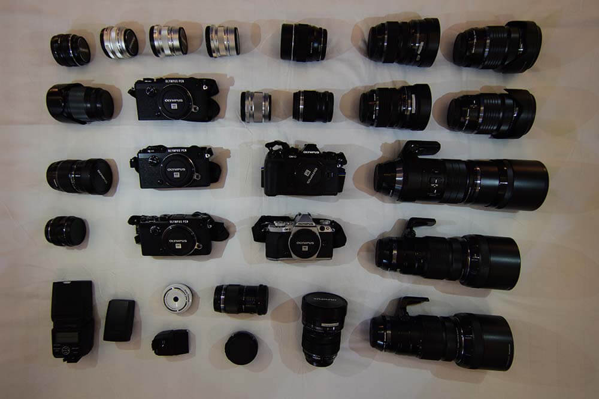
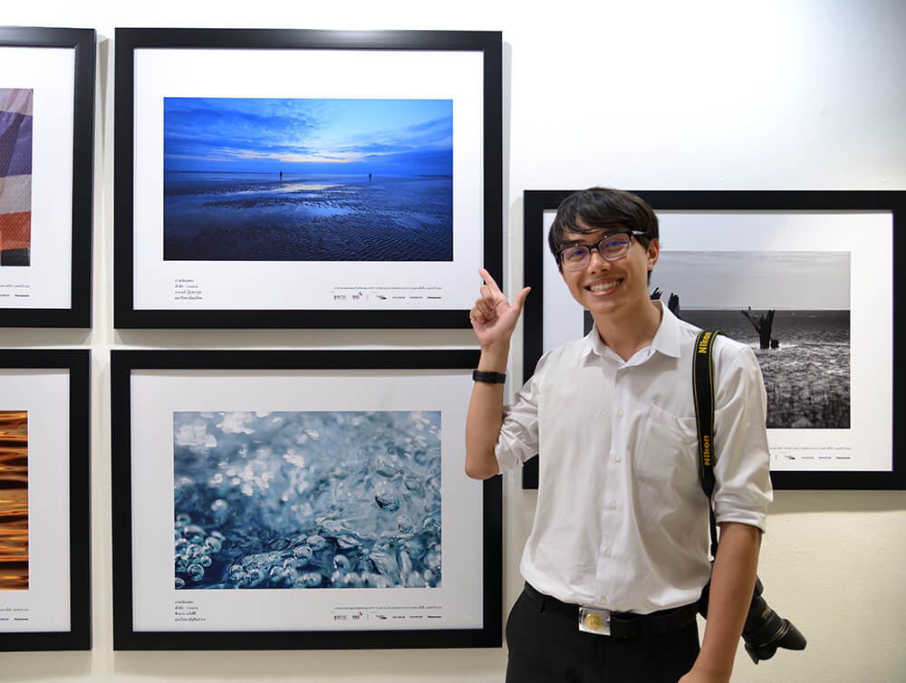
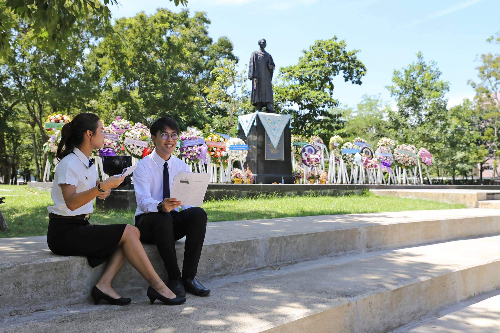

จะผ่านไปแล้วอีกปีนึง ไวจังเลย เมื่อตอนสัก 3 เดือนก่อนก็ไปอ่าน Year in review ของปีที่แล้วมา ก็เออเราทำอะไรหลาย ๆ อย่างตามที่บอกไว้ในปีที่แล้วได้เยอะมาก ๆ แอบชื่นชมตัวเองเบา ๆ บางอย่างก็สำเร็จบางอย่างก็พังคามือก็มี

## ปีแห่งการเรียนรู้
อย่างที่บอกไปในปีที่แล้วว่า ชีวิตผมมันไม่เคยหยุดนิ่ง ปีนี้ไม่ต่างเลย แต่ได้รู้เพิ่มว่า ถึงแม้เราจะอยากให้มันหยุดชิว ๆ แต่เราก็หยุดไม่ได้แน่นอน เพราะเราชินไปแล้วไง แต่เพราะความไม่หยุดนี่เองที่ทำให้เราได้เจอคนใหม่ ๆ ได้สกิลใหม่ ๆ ติดตัวมาเยอะอย่างไม่น่าเชื่อ

### เข้าค่าย RPST Yours

เริ่มต้นที่ต้นปีกันเลยกับค่าย RPST Yours ที่เป็นค่ายเกี่ยวกับการถ่ายภาพในแต่ละมหาลัยก็จะคัดคนเพื่อไปค่ายนี้ (ที่ได้ Salaya Life มาเมื่อปีก่อน) ซึ่งแน่นอนว่าผมเรียนคอมพิวเตอร์ไปเจอสายตรงก็อ่วมสิครับ แต่เอาจริง ๆ ก็ไม่ได้หวังรางวัลอะไร แค่อยากได้ประสบการณ์ดี ๆ **ของกินอร่อย ๆ** และเพื่อนใหม่ ๆ จากค่ายนี้

แต่ก็นะในค่ายมีค่ายกล้องหลายอันมาเป็น Sponsor ตอนนั้นได้ Olympus เลยได้เลนส์ทุกตัวมาลองเล่นอันนี้นี่โคตรรักเลย รูปหลาย ๆ รูปที่ได้มาก็ยอมรับเลยว่าสวยด้วยมือเราจริง ๆ มันก็ทำให้เราได้ลองจับ ได้รับประสบการณ์ในการถ่ายภาพใหม่ ๆ รวมถึงการโดนป้ายยาทำให้อยากให้ซื้อกล้องใหม่เบา ๆ

ใครจะคิดครับว่า คนที่เรียนคอม และพึ่งหัดถ่ายภาพมาไม่นาน จะได้มีรูปแสดงอยู่ที่หอศิลป์ กทม ที่มีผลงานของหลายศิลปินวางอยู่ในที่เดียวกัน นับว่าเป็นอะไรที่ผมรู้สึกว่า เออมันดีหว่ะ ! ฮ่า ๆ

### เปิด Course สอน Laravel ออนไลน์

จุดเริ่มต้นของเรื่องนี้คือพี่โอ๊คมาชวนให้มาสอน Course ออนไลน์ ด้วยความที่อยากลองก็เลยตอบรับแต่ตอนนั้นก็ยังไม่รู้นะว่าจะสอนอะไร แล้วก็นึกอยู่สักพักเหมือนกัน ก็เลยตอบไปว่า

> อืม... เดี๋ยวหนึ่งมาสอน Laravel ละกันครับ

จากนั้นแหละความสนุกก็มาเลย เพราะต้องมาเตรียมสอนหลาย ๆ อย่างตั้งแต่ว่าวันนี้จะสอนอะไร Code ที่เราเตรียมมันดีรึยังนะ พูดแบบนี้คนจะเข้าใจรึเปล่านะ ตอนแรกก็ไม่คิดนะว่าการสอนอะไรพวกนี้มันจะไม่ยากมาก เอาเข้าจริงทั้งวันก่อนที่จะสอนคำถามที่บอกไปมันวนอยู่ในหัวทั้งวัน คือกลัวตัวเองพูดไม่รู้เรื่องซะมากกว่า แต่พอช่วงหลัง ๆ เหมือนเริ่มจับทางได้ มันก็ดีขึ้นนะ เท่าที่ลองเอาคลิปที่ตัวเองสอนมานั่งดู เห็นพัฒนาการเลยว่า เกร็งน้อยลง พูดใช้คำที่ทางการน้อยลง และเป็นกันเองมากขึ้น ดูแล้วมัน Soft และน่าฟังมากขึ้น

หลาย ๆ คนเคยบอกว่า ก็เคยเป็น MC มาหลายงานแล้วทำไมพูดอันนี้ถึงเครียดขนาดนี้ ก็บอกเลยว่างาน MC มันเป็นงานพวกมี Script ที่ค่อนข้างแน่นอน กับถ้ามีอะไรเกิดขึ้นเราก็เาชอาอะไรก็ได้ที่เกี่ยวข้องยัดเข้าไปได้ แต่กับการสอนมันไม่เหมือนกันเลย ก็เลยให้เครียดหน่อย ๆ แต่มันก็สนุกนะ

### ประธานค่าย JWC#9

จำไม่ได้ว่าตกลงกันท่าไหนยังไง แล้วทำไมเราถึงมาเป็นประธานค่าย แต่ก็มาเป็นแบบ งง ๆ ยอมรับว่าตอนนั้นก็ทำอะไรไม่ถูกเหมือนกัน ประกอบกับวิธีการทำงานที่ไม่เหมือนกันเท่าไหร่ ก็ทำให้ทำงานยากอยู่พอสมควร นอกจากนั้นช่วงนั้นงานอื่นก็รุมเอา ๆ จนไม่ได้อ่านหนังสือหรือทำอะไรเลย ก็จะ No Life หน่อย ๆ แต่ก็ต้องขอบคุณเพื่อน ๆ หลายคนที่ช่วยกันจนทำให้พวกเราผ่านค่ายนี้มาได้ สิ่งนึงที่เรียนรู้มาจากการทำค่ายครั้งนี้คือ **ใจ** เพราะผมไม่ใช่คนที่ใช้ ใจ ในการตัดสินใจเท่าไหร่ ใช้แค่ Logic ทำให้ทำงานกับงานศิลป ๆ ยากหน่อย และแน่นอนว่าก็มีน้องที่ตอนนั้นกำลังจะเข้ามาเรียนที่คณะก็มา ก็เลยทำให้รู้จักกันไปโดยปริยาย

### ฝ่าย IT งาน TEDxMahidolU

งานนี้จริง ๆ ก็ อ.ป๋วย ก็มาชวนตั้งแต่มีอยู่แค่ไม่กี่คนแล้ว แต่ด้วยงานหลาย ๆ อย่างทำให้ต้อง Fade หายไปนานอยู่จนช่วงฝึกงานนี่แหละที่ได้เข้ามาช่วยทำหลาย ๆ อย่างแบบ One Night Miracle มาก ก็ได้เข้ามาทำอะไรไม่มากเท่าไหร่ ได้เข้ามาทำระบบสำหรับโพสต์ความเห็นสำหรับบูทกิจกรรมหนึ่งในงาน ตอนนั้นคือพึ่งหัดใช้ React ใหม่ ๆ เลย และนึกคึกอะไรไม่รู้ก็หยิบ React มาเขียน ก็สนุกดีนะ ตัวงานเองก็ทำให้เราได้เจอคนใหม่ ๆ มากมาย เปิดโลกสุด ๆ เลย งานนนี้ก็ต้องขอบคุณ อ.ป๋วย ที่ชวนมาทำตั้งแต่แรกกับขอโทษที่หายไป ~

### ฝึกงานที่ Like Me ~

ด้วยความที่ปีที่แล้วบอกว่าอยากจะฝึก Front-End ปี 3 กับอยากจะไปฝึกงานสักหน่อย ก็เลยหาบริษัทที่รับ Front-End ไป ๆ มา ๆ อาจารย์ก็มาชวนว่าจะไปฝึกงานที่นั่นมั้ย เพราะเป็นบริษัทของรุ่นพี่ ก็เลยตอบรับเลยเดี๋ยวลองไปคุยดูก่อน อาทิตย์ก่อนที่จะไปคุยคือคอมพังพอดีส่งซ่อม แล้วก่อนไปคุยก็ต้องไปเอาคอมกลับมาก่อน ซึ่งก็ผ่านไปด้วยดี หลังจากนั้นเลยไปชวนอิเต้ยที่เป็นเพื่อนจากค่าย YWC เมื่อปีก่อนไปด้วย มันก็เลยลากเพื่อนมันไปอีกคน (ค่อย ๆ ลากกันไป) เลยได้มารู้จักกัน กับเพื่อนจากอีกทีมที่อยู่คนเดียวมันจะเหงา ๆ หน่อยก็แต่โอเค นั่งข้างกัน ฮ่า ๆ รวม ๆ แต่ละวันก็จะมีการจับโจรกัน ว่าใครเป็นคนปล่อยบัคก็จัดว่าตลกดี

ฝึกงานก็ทำให้เราได้ลองอะไรใหม่ ๆ เช่น React ที่ไม่เคยจับมาก่อน หรือ Javascript ที่เคยลองเขียนล่าสุดเมื่อสัก 8-9 ปีก่อน กับเพื่อน ๆ และพี่ ๆ ก็ดี ช่วยสอนอะไรหลายอย่างมาก จัดว่าเป็นการฝึกงานที่โหดมันส์ฮ่าดี ฝากเว็บต่อด้วยนะพี่ ~

### MU Guide Presentation Video

งานนี้ตอนแรกก็ได้ยินมาละแหละว่าจะทำ แค่ตอนแรกคิดว่าเราน่าจะเป็นคนถ่าย แต่ด้วยเหตุผลและเวลาหลาย ๆ อย่างทำให้เรากลายเป็นคนเล่นซะงั้น แม่มเอ้ย! คือยอมรับไงว่าหนังหน้าเรามันก็ไม่ขนาดนั้น กับทักษะเรื่องของการแสดงที่แทบจะเป็น **0** อย่างจริงจัง ก็เข้ามาเล่นมันก็จะแข็งหน่อย ๆ ถึงมันจะไม่ได้เป็นวีดีโอที่ใหญ่อะไรขนาดนั้นแต่มันก็ทำให้เราได้ลองทำอะไรสนุก ๆ อยู่เหมือนกันฮ่า ๆ

### MUICT Open House 2017

เป็นงานที่ได้ทำมาปีนี้ปีที่ 3 แล้วตำแหน่งก็ใหญ่ขึ้นเรื่อย ๆ ตามปีอะแหละ ปีนี้เป็นปีสุดท้ายแล้วที่จะได้ทำมันก็จะเหงา ๆ หน่อย ฮ่า ๆ ตำแหน่งปีนี้ก็ไม่ต่างจากปีที่แล้วเลย เพิ่มเติมคือความรับผิดชอบที่มากขึ้น แน่นอนว่าฝ่ายที่ผมทำมันก็ต้องคุยตั้งแต่เพื่อน พี่ ๆ ยันอาจารย์ ก็เหมือนกับที่ทุกปีพูดก็คือ

> บริการทุกระดับ ประทับใจ

เหมือนกับธนาคารเจ้าหนึ่ง (เขาไม่ได้จ่าย) แรก ๆ มันก็จะหาย ๆ งง ๆ หน่อยเพราะก็โดน Senior Project ไปด้วยกับวิชาเรียนที่พีคจริงอะไรจริงเช่น Algorithm ที่ทำให้ No Life ไปอย่างน้อย 1 คืนก่อน Quiz หรือสอบ

ณ งานจริงก็ทำตั้งแต่เป็น Head ฝ่าย Project คนถ่ายรูป Presenter และคน **กิน** อันนี้สำคัญมาก งานกินต้องมาดูจากรูปก็รู้เลยว่ามีความสุขกับการกินขนาดไหน

งานนี้สอนอะไรเราหลายเรื่องมาก ๆ เพราะทำมาตั้งแต่ปี 2 ทำจนมันเหมือนเป็นอัตโนมัติว่าเทอม 1 ของทุกปีมันจะยุ่ง ๆ หน่อยเพราะต้องเตรียมงาน เท่าที่ทำมาในปีนี้จัดว่าเป็นปีที่ราบลื่นที่สุด และสนุกที่สุดละ ถึงมันจะผ่านหลาย ๆ เรื่องที่ทั้งสนุกและพีค ก็ต้องขอบคุณอาจารย์ เพื่อน ๆ และน้อง ๆ ที่ทำให้งานนี้มันออกมาได้ โดยจะเฉพาะอาจารย์ และน้อง ๆ อีก 4 คนที่เข้ามาช่วยกันทำงานนี้ออกมา บางทีเราก็ลืมโน้นลืมนี่ไปบ้างก็ช่วย ๆ กันจำฮ่า ๆ

## เพราะชีวิตไม่ได้มีแต่เรื่องดี ๆ ทุกวัน
จากเรื่องที่เล่ามาเป็นแค่เหตุการณ์ใหญ่ ๆ อย่างเดียว จริง ๆ มันยังมีอีกหลายอย่างที่เข้ามา บางเรื่องก็ดีมาก ๆ บางเรื่องก็เห้อ....  เบื้องหน้าอาจจะเห็นว่ามันดูสวยงาม Seamless และไร้ปัญหา แต่ความจริงแล้ว **บาน !!** แต่ก็แน่ละเนอะ ถ้าชีวิตเรามีแต่เรื่องดี ๆ ชีวิตเราก็คงขาดสีสันแล้วละสิ (หรือชินกับการแก้ปัญหาไปแล้ว ?)

เรื่องนึงที่ผมยังมองว่าตัวเองยังมีปัญหาอยู่ก็คือเรื่องของการจัดเวลา ด้วยงานหลาย ๆ อย่างที่เข้ามา มากไปหน่อยทำให้จัดเวลาไม่ค่อยถูก เท่าที่สังเกตคือเวลาผมจัดเวลาผมจะค่อนข้างฟิคไปหมดเลยว่าวันนี้ต้องทำอะไรบ้าง A B C ตามนั้นนะ อะไรแบบนี้ พอไปเจองานที่มันฟิคเวลาไม่ได้ หรือ Unexpected Event ขึ้นมาก็คืองานเข้าเลย พอเป็นแบบนี้มาก ๆ เข้ามันก็จะสะสมเข้าไปเรื่อย ๆ เหมือนดินผอกหางหมู และนั่นก็เป็นอีกเหตุผลหนึ่งที่ทำให้ Blog ลงไม่สม่ำเสมอเท่าไหร่

อีกเรื่องที่ทำยังไงก็ไม่หายสักทีคือเรื่อง **อ้วน** เดี๋ยวนี้คือเป็นโรคอะไรไม่รู้คือเวลากินของคาวแล้วมันจะต้องตามด้วยของหวาน แลัวคือของหวานแต่ละอย่างที่กินนี่อ้วนทุกอย่าง ประกอบกับช่วงหลัง ๆ ไม่ค่อยได้ออกไปปั่นจักรยานออกกำลังกายเท่าไหร่ด้วย จนไปเจอเพื่อนที่ไม่ได้เจอกันนานก็ทักอยู่ว่าทำไมหน้าอ้วนขึ้น ? ก็เอาซะหมดความมั่นใจไปเลย

## ปีหน้าทำอะไรดี
ในทุก ๆ ปีผมจะตั้ง Goal ให้กับตัวเอง ในปีที่แล้วบอกว่าอยากเรียนรู้เกี่ยวกับ NLP (ก็ได้ทำสมใจอยากเพราะ Senior Project ก็ทำ NLP ในภาษาไทย) กับอยากเรียนรู้เรื่อง Web Technologies (ก็เลยได้ไปฝึกงานทำ Front-End แล้วทำให้เราได้เข้าไปจับ Web Technologies หลาย ๆ ตัวมาก ๆ) ไปแข่งขันโน้นนี่นั่นก็ลดลง ทำให้โฟกัสที่เรื่องเรียนได้มากขึ้น

แต่ก็นะตอนนี้อยู่ ปี 4 แล้วก็จะจบใน Academic Year นี้แล้วก็จะเขิล ๆ หน่อย ก็ตัดสินใจว่าอยากจะเรียนต่อ เพราะส่วนตัวเป็นคนที่ชอบวิทยาศาสตร์ทางด้านพันธุศาสตร์มากกว่าคอมซะอีก แต่ที่เรียนคอมเป็นเพราะว่า มันเป็นสิ่งที่เราถนัด ตอนนี้โตแล้วก็อยากจะเดินออกไปในทางของตัวเอง **ลองจับในสิ่งที่ชอบ กับสิ่งที่ถนัดมารวมกัน** อยากรู้เหมือนกันว่าตัวผมเองจะทำมันออกมาได้ดีขนาดไหน เหมือนที่ Christopher Morcom ในหนังเรื่อง The Imitation Game บอกไว้ว่า

> Sometimes it's the very people who no one imagines anything of who do the things no one can imagine.

ฉะนั้นปีนี้จะตั้งเป้าไปที่ Senior Project ที่ก็ต้องทำให้ออกมาเสร็จและดีในด้านที่ไม่เคยทำมาก่อน และ **การเรียนต่อ** ล้วน ๆ เลย ก่อนอื่นต้องหาที่เรียนให้ได้ก่อนนะฮ่า ๆ ถ้าใครมีมหาลัยที่สอน **Bioinformatics** ในต่างประเทศก็แนะนำมาหน่อยนะ หาที่เรียนอยู่ ~~~ และอย่างเคยก็จะเขียน Blog ให้บ่อยขึ้นด้วยนะ 😁

## สรุป: เป็นปีที่เหนื่อย แต่คุ้ม

เป็นอีกปีที่รู้สึกว่า รอบ ๆ ตัวเราหมุนไปเร็วมาก ๆ ได้ลองทำในสิ่งที่ทั้งเคยและไม่เคยทำมาก่อน สิ่งที่เคยทำแล้วมันก็จะทำให้เราเก่งขึ้นไปอีก และสิ่งที่เราไม่เคยทำมันก็ทำให้เราได้ลองทำ ก่อนจะไปทุก ๆ ปีก็ยังคงแนะนำให้ทุกคนลองเขียน Yead In Review ของตัวเองเก็บไว้อ่านกันนะครับ มันจะทำให้เราเห็นว่าในปี ๆ นั้นมันมีอะไรเกิดขึ้นบ้าง ที่สำคัญมันเป็นเหมือน Log ที่ทำให้เรานึกออกว่าสิ่งใดที่ผิดพลาดเราก็จะแก้ไขในปีต่อ ๆ ไป สิ่งใดดีอยู่แล้วก็ทำให้มันดียิ่ง ๆ ขึ้นไปในปีต่อ ๆ ไป สุดท้ายจริง ๆ ก็สวัสดีปีใหม่ 2018 นะครับขอให้เป็นปีที่มีความสุขสำหรับทุกคนนะครับ ✨

PS. ไม่ต้อง งง นะว่าเว็บมันเปลี่ยนไป ผมเปลี่ยนเว็บใหม่ต้อนรับปี 2018 เร็วขึ้นในระดับปีศาจเทพซ่า 007 เลยทีเดียว ⚡️
