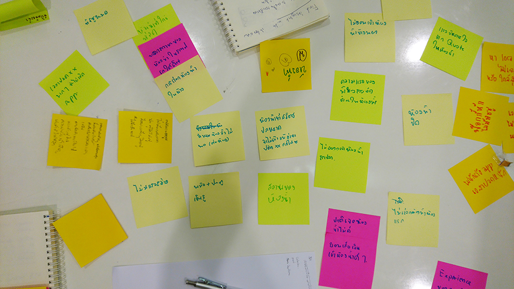
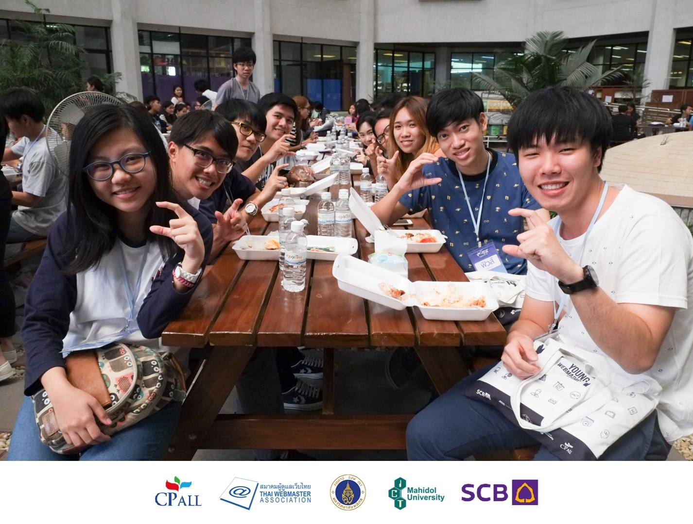
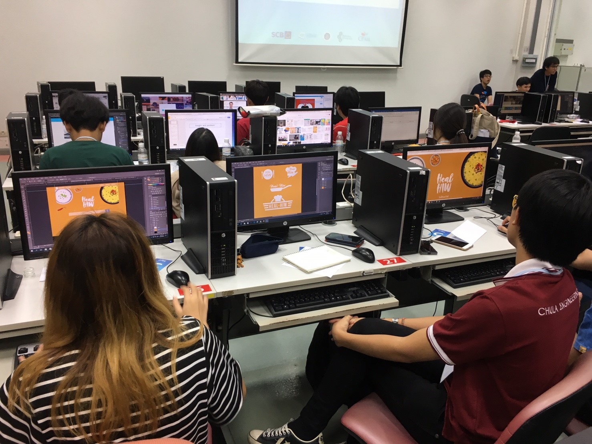
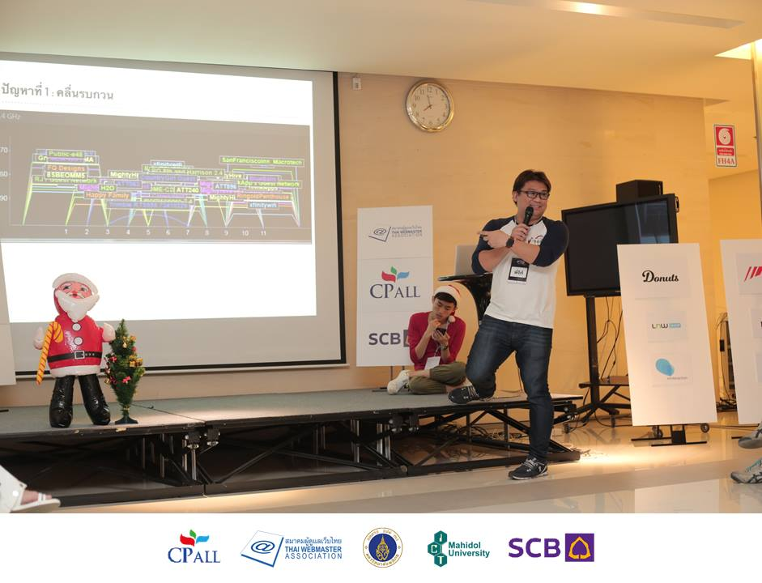
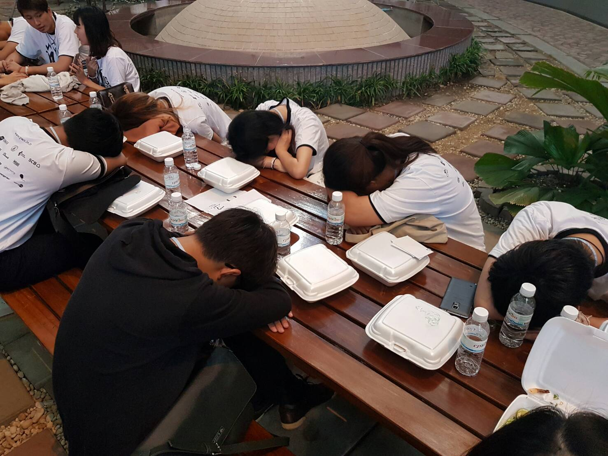
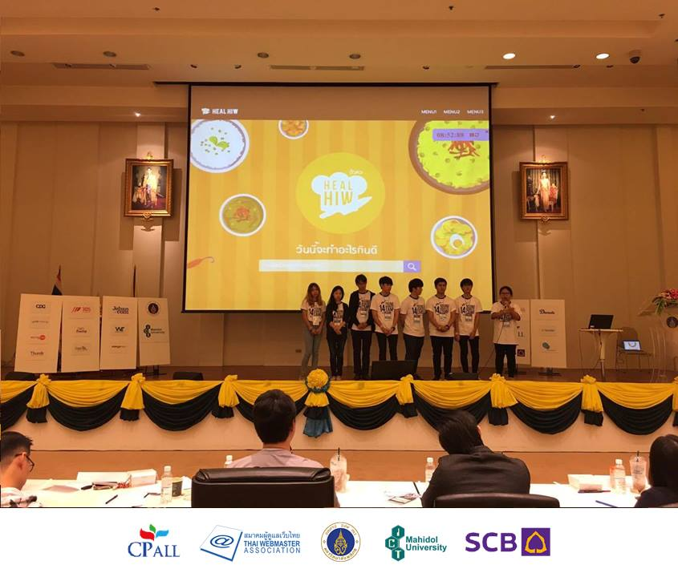
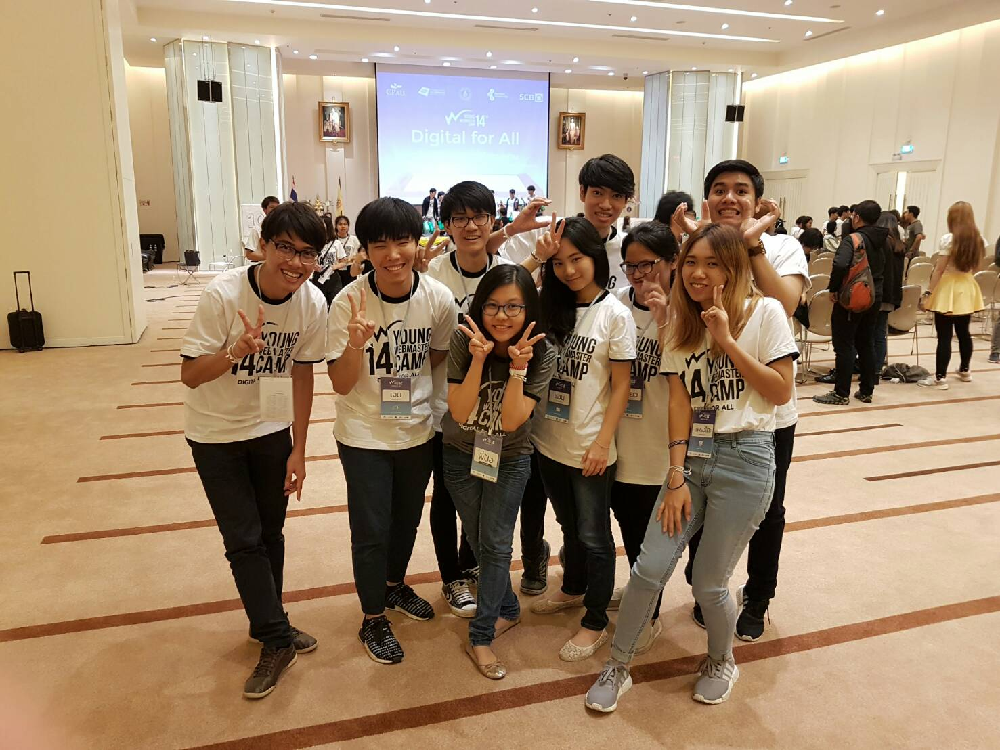

ช่วง 4 ผ่านที่ผ่านมาก็ค่อนข้างหายไปจาก **Social Network** ไปเลย ก็ผมไปค่าย YWC หรือ **Young Webmaster Camp** มาครับ วันนี้ผมเลยจะมาแชร์ประสบการณ์ และสิ่งที่ได้ให้ทุกคนอ่านกันครับ

## Young Webmaster Camp คืออะไร ?
เผื่อใครไม่รู้จัก **Young Webmaster Camp** เป็นค่ายทำเว็บที่จัดให้เด็กมหาลัยเข้ามาประลองฝีมือกัน (เหรอ) โดยจะมีอยู่ทั้งหมด 4 สาขาคือ

* **Web Programming** ที่เบื้องหลังคอยแปลงไอเดียจากทุกฝ่ายให้ออกมาเป็นเว็บไซต์จริง ๆ ได้
* **Web Design** ที่เป็นผู้สร้างสรรค์หน้าตาของเว็บไซต์ให้ถูกใจผู้ใช้
* **Web Content** ที่เป็นอีกผู้สร้างสรรค์ Content หรือเนื้อหาของเว็บต่าง ๆ ออกมาให้ผู้ใช้อ่าน และสนุกไปกับมัน
* **Web Marketing** เป็นอีกคนที่ขาดไม่ได้เลย เพราะเราทำเว็บไซต์ เราก็อยากให้คนมาเข้าเยอะ ๆ และก็ไม่อยากกินแกลบด้วย ซะนั้น เราก็ต้องมีคนที่สามารถโปรโมทและวางแผนธุรกิจมาช่วยด้วยเหมือนกัน

หลาย ๆ **คนอาจจะคิดว่า ค่ายนี้เป็นค่ายสำหรับคนที่เรียนมาทางสายคอมพิวเตอร์อย่างเดียว** แต่จริง ๆ แล้วหาเป็นแบบนั้นไม่ เพราะค่ายนี้ ไม่ได้มีแค่สายคอมพิวเตอร์อย่างเดียว มีทั้งสายบริหารธุรกิจ การตลาด และอื่น ๆ อีกมากมากมาย

## สมัครค่ายครั้งที่ 3
จริง ๆ ปีนี้ที่ติดนั้นไม่ใช่ครั้งแรกที่สมัคร แต่มันเป็นครั้งที่ 3 สมัครตั้งแต่ปีแรกที่เข้ามหาลัยจนตอนนี้ปี 3 แล้ว ขั้นตอนการสมัครก็ไม่ยากครับ ก็เข้าเว็บไปกรอกใบสมัคร และตอบคำถามส่วนกลาง และคำถามประจำสาขา ซึ่งสาขาที่ผมสมัครคือสาขา Programming

คำถามก็ประมาณว่า ถ้าให้ทำ Note Taking App จะใช้อะไรบ้างโน้นนี่นั่น เหมือนเมื่อ 2 ปีก่อนที่สมัคร Programming คำถามเหมือนมันจะยากกว่านี้นะ เจอคำถามของปีนี้เข้าไป อืม... ก็สามารถตอบได้ทันที ก็ไม่ได้ยากอะไร แต่กว่าจะยอมกดส่งใบสมัครได้ ก็อ่านอยู่นานว่า พิมพ์ถูกรึเปล่า ? ที่ตอบไปนี่สมเหตุสมผลรึเปล่า สุดท้ายก็กดส่งไป และก็มารอดูกันว่าจะติดรอบสัมภาษณ์รึเปล่า

## เตรียมไปสัมภาษณ์ !
และผลรอบสัมภาษณ์ก็ออกมาจนได้ ปรากฏว่าติด ! เย้ ๆๆ แต่ก่อนจะไปสัมภาษณ์นั้น มันก็จะมีการบ้านมาให้เราทำด้วย ซึ่งการบ้านก็ไม่ขอบอกละกัน แต่วิธีที่เลือกใช้คือ ต้องวาด Vector โดยใช้ **Adobe Illustrator** ที่เป็นโปรแกรมที่ใช้ไม่เป็นเลย กับ **CSS Animation** ที่ใช้ไม่เป็นเหมือนกัน แต่ก็เอา มา!

วันนั้นคือ นั่งดู Youtube กันเลยว่า แต่ละอันมันใช้ยังไง Illustrator นี่นานสุดเลย ต้องมานั่งดูว่า การจะขึ้นรูปสักอันมันต้องทำยังไงบ้าง ลงสียังไง โน้นนี่นั่นไปหมด กว่าจะเสร็จออกมาเป็นงานได้ก็เล่นไปทั้งวันเหมือนกัน ซึ่งหน้าที่ได้ออกมาก็ทำดีที่สุดในตอนนั้นแล้วจริง ๆ สามารถเข้าไปดูได้ที่ [https://www.arnondora.in.th/YWC

นอกจากการทำการบ้านแล้ว ก็ต้องเตรียมผลงานไปให้กรรมการดูด้วยเหมือนกัน ว่าเราเคยทำอะไรมาบ้างมีผลงานอะไรบ้างทำนองนี้ ซึ่งผมก็มี Sway ที่เป็น Portfolio ของตัวเองอยู่ ลองดูตัวอย่างได้จาก[ลิงค์นี้

## วันสัมภาษณ์
ล้ววันสัมภาษณ์ก็มาถึง ซึ่งสถานที่สัมภาษณ์ก็คือ ตึก CP All อยู่ตรงแถว BTS ศาลาแดง ก็เดินทางไม่ยาก ดีที่ได้สัมภาษณ์รอบบ่าย เลยได้ตื่นสายจะได้สดชื่นหน่อย ก็ไป บรรยากาศก็อุ่นหนาฝาคั่ง ไปด้วยทั้งคนที่มาสมัคร และสัมภาษณ์ เดินกันเต็มไปหมด

ก็รอคิวไปเรื่อย ๆ เพราะคนสัมภาษณ์รอบเช้า ยังสัมภาษณ์ไม่หมดเลย แล้วเรารอบบ่ายจะเหลืออะไร ก็นั่งรอไปสิครับ จนกระทั่งถึงคิวตัวเอง พี่ ๆ ก็จะพาเราไปรอที่หน้าห้องสัมภาษณ์อีกรอบนึง ตอนนั้นในหัวคือ ตื่นเต้นมาก ๆ นั่งคิดอยู่ว่า เข้าไปเราจะพูดอะไร สวัสดียังไง จะเอาอะไรให้ดูบ้าง เขาจะถามอะไรบ้างน้าา คิดจนเครียดและรนไม่หมด

และแล้วก็ถึงเวลาแห่งความจริง เป็นเวลาที่เราต้องเดินเข้าไปในห้องสัมภาษณ์ กะว่าจะไม่เดินเตะเก้าอี้แล้วนะ สุดท้ายก็ไม่รอด ฮ่า ๆ เดินเข้าไปผมก็สวัสดี แล้วก็นั่ง และแล้วกรรมการก็พูดออกมาว่า **"พูดอะไรก็ได้ที่ทำให้มึงติด !"** ตอนนั้นคือ เอาไงดีฟร๊ะ แต่ก็เอาวะ มาถึงจุดนี้แล้ว มา !!!

ก็พูดไปว่า เป็น Winner จาก **Imagine Cup** นะ ได้เป็น **Finalist** ก็ไล่ Port ตัวเองลงมาเรื่อย ๆ และก็โชว์ Blog โชว์งานตัวเองให้ดูไป และก็โดนซัดไปอีกหลายคำถามด้วยกัน ออกมาก็ไม่ค่อยเครียดเท่าไหร่ และก็คิดว่า ไม่ติดก็ไม่ติดวะ ตั้งใจว่าจะสมัครเป็นปีสุดท้ายแล้ว

สุดท้าย ผลก็ประกาศออกมา อ้าวเฮ้ย ติดว่ะ !! ดีใจ ดีใจในความพยายามตลอด 3 ปีที่ผ่านมา สมัครตั้งแต่ปี 1 จนนี่ปี 3 แล้วกว่าจะติดได้ ดีใจมาก ๆ ทุกคนก็มาแสดงความยินดีด้วย ขอบคุณมาก ๆ ครับ

## ในค่าย Day 1 : วันแห่งการเริ่มรู้จักกัน
เปิดมาวันแรก ผมก็ต้องเก็บเสื้อผ้าไปค่าย ที่ไกลมาก ๆ นั่นคือคณะตัวเอง.... (ติดทั้งที ดันเป็นปีที่จัดที่คณะตัวเองซะงั้น แม่ม !! แต่ก็ไม่เป็นไร) ก็เริ่มต้นด้วยการลงทะเบียน ที่จะได้ถุงยังชีพมาด้วยถุงนึง และก็เป็นพิธีเปิดมี Speaker หลาย ๆ ท่านมาพูด

จากนั้นก็แบ่งกันไปเป็นกลุ่ม ก็เป็นครั้งแรกที่ได้รู้จักกับคนในกลุ่มตัวเอง ก็กลุ่มนึงจะมีกัน 8 คน แบ่งเป็นสาขาละ 2 คน เพราะสาขาเดียวก็คงสร้างเว็บที่ดีไม่ได้ ก็ได้ทำความรู้จักกันไป

พอช่วงบ่ายก็เป็น Session แยกกันไปตามสาขา ซึ่งฝั่งของ **Programming** ก็จะเป็น Session จาก **Wongnai** ว่า Wongnai มี Architecture ยังไง ตั้งแต่เริ่มเป็น **Startup** จนถึงปัจจุบัน ก็เป็น Session ที่สนุกดีครับ

และจากนั้นเราก็ยังอยู่ที่ห้องเดิม ก็เป็น Session ต่อไปกับเรื่องของ **Maintaining Open Source Software** จากพี่อัครวุฒิ ที่มาพูดถึงเรื่องของ Open Source Software ในปัจจุบันว่าตอนนี้เป็นอย่างไรบ้าง และเรื่องที่สำคัญอีกเรื่องขอ Open Source Software คือ **License** ของมัน

และสุดท้ายของวันก็เป็นอีก Session ที่สนุกอีกอันคือ การ **Brainstorming** เพราะกลุ่มเราต้องทำเว็บไซต์ เพื่อไป Present ในวันสุดท้าย ฉะนั้นวันแรก เราต้องมารวมไอเดียกันก่อน ซึ่งมีพี่ตั้งมาสอนวิธีการ Brainstorming ในแบบฉบับของ Google กัน ซึ่งสามารถอ่านได้จาก [Blog ของพี่ตั้ง สุดท้ายกลุ่มผมก็ได้ไอเดียเรื่องของ **ห้องน้ำ** มา ซึ่งเป็นเรื่องที่น่าสนใจมาก

## ในค่าย Day 2 : วันแห่งการเปลี่ยนหัวเรื่องแห่งชาติ

วันที่ 2 ของการมาค่ายก็เริ่มขึ้นด้วยความง่วงนอนมาก ๆ เพราะนอนค่อนข้างดึก (จริง ๆ แอบหลับก่อนเพื่อน ๆ ในกลุ่มซะอีก) ก็เริ่มด้วยการกินข้าว และก็แบ่งไปฟัง Session แยกสาขาอีก ก็เป็นเรื่องของ **Agile & Mindsset** จากพี่ตั้ง และการเล่าเรื่องราว และเส้นทางในสายอาชีพจากพี่ฮันจาก Jitta ก็เป็นไปด้วยความหรรษา

ตอนบ่ายวันนั้นก็จะเป็น ก็เป็นเวลาที่เราจะได้ออกไปเล่นกิจกรรมข้างนอกกัน ก็จะแบ่งเป็นฐานเรื่อย ๆ ก็สนุกกันไป หลังจากนั้นก็จะเป็น Session เรื่องของ **การนำเสนองาน** ก็พูดถึงเรื่องของการนำเสนองานยังไงให้ดูดี พูดยังไง ทำสไลด์ยังไง และก็มีกิจกรรมให้ออกมา Present Project คร่าว ๆ กันนิดหน่อย ก็เป็นไปด้วยความสนุกและตลกมาก ๆ

และตบท้ายในวันนั้นด้วย Brainstorming รอบ 2 เหมือนเมื่อวานเลย เพราะยังมีบางกลุ่มที่ยังไม่ได้ไอเดียเลย และวันนั้นก็มีพี่ ๆ ทั้งที่เป็น กรรมการในวันสุดท้าย หรืออาจจะไม่ใช่ มาเปิดเป็นโต๊ะให้เราเอาไอเดียของเราเข้าไปปรึกษาได้ ซึ่งกลุ่มผมก็เข้าไปมันเกือบหมดทุกโต๊ะ ฮ่า ๆ

จากนั้นก็กลับโรงแรม มานอน เฮ้ย มาคุยกันต่อว่า จะเอายังไงดี คุยกันไปคุยกันมาก็ล่อไปเที่ยงคืน ตี 1 ได้ ก็เหนื่อยมาก ๆ ก็นอน

## ในค่าย Day 3 : วันที่ Dev วิ่ง โค๊ตไฟลุก

หลังจากที่เมื่อวาน เราก็ได้ไอเดียมาแล้ว มันก็ถึงเวลาที่เราต้องเอาไอเดียมา Implement มาเป็นเว็บของจริงแล้ว รวมทั้งต้องทำ Slide ในการนำเสนอด้วย ซึ่งเราก็แบ่งหน้าที่ไปตามสาขากันไป ซึ่งผมก็เป็น Programmer ที่ต้องคอยมา Code เว็บขึ้นมา ซึ่งก็มีเวลาทั้งหมด 8 ชั่วโมง แน่นอนว่า เวลาเท่านี้ จะให้สร้างเว็บเต็ม ๆ เลยก็ไม่ไหว ก็ต้องมี Mockup กันบ้าง (หราา)

ปัญหาของผมมันอยู่ที่ตอน Deploy ขึ้น Server นี่แหละ ใครที่ใช้ **Laravel** ก็น่าจะรู้ดีว่า Laravel มัน **Deploy** ยากแค่ไหน ก็กว่าจะ Deploy ขึ้นไปได้ ก็ลุ้นเอาเรื่องอยู่เหมือนกัน

หลังจากที่ Code ไฟลุกกันไปแล้ว ก็ยังไม่วาย สมองยังไม่ทันซ่อมแซมตัวเองก็ไปถึงกิจกรรมต่อไปกับ **YWC Ignite** ที่จะเอาพี่ ๆ YWC รุ่นก่อน ๆ และพี่ ๆ ที่มีชื่อเสียงในวงการ ต่างที่ไปประสบความสำเร็จมาเล่าเรื่องต่าง ๆ ให้ฟังกัน ก็ฟังไปก็ขำไปสนุกทุกเรื่องเลย

และแล้วก็ถึงเวลาที่รอคอยนั่นคือ **Christmas Party** ที่สนุกมาก ๆ เพราะพี่ ๆ จะมาขายตัวกัน (ขายตัวจริง ๆ) เพราะในแต่ละกลุ่มก็จะมี Point ของตัวเอง ซึ่งพี่ ๆ แต่ละคนก็จะมีราคาแปะไว้ที่ตัว จุดประสงค์ก็คือ ให้เราได้รู้จัก และพูดคุยกับพี่ ๆ รุ่นก่อน ๆ

คืนนั้นกลับไปซ้อม Present ก็ดึก จนเกือบเช้า บางกลุ่มก็ไม่ได้นอนกันเลยก็มี

## ในค่าย Day 4 : Project Presentation

และแล้วก็ถึงวันสุดท้ายของค่ายแล้ว นั่นก็คือ **Project Presentation** ที่ต้องให้แต่ละกลุ่มมา Present Project ที่นั่งคิดกันมาตั้งแต่วันแรก แต่ละกลุ่มก็ต้องงัดวิธีการต่าง ๆ ออกมาในวันนี้เพื่อโชว์ **Product **ของตัวเองออกมา

แต่ก่อนจะ Present ก็ต้องกินข้าวเช้ากันก่อน แต่ละคนคืออยู่ในสภาพที่ ไม่น่าจะกินลงเท่าไหร่ ตายเรียบ จากนั้นพอขึ้นไป ก็จะเริ่ม Present กันเลย โดยจะ Random ออกมาทีละกลุ่มเรื่อย ๆ และก็จะมีกรรมการมา **Comment** ซึ่ง Comment นี่แหละที่เด็ด กรรมการแต่ละคนคือ **ดุเดือด** มาก นอกจากกรรมการในห้องจะดุเดือดแล้ว

ผู้ชมทางบ้านที่ดูผ่าน Live เล่นใน **Twitter** ก็ไม่แพ้กันทวิตกันจน **\#YWC14** เป็น Tranding อันดับ 1 ในช่วงเวลานั้นเลย ใหญ่ป่ะล่ะ !!

ซึ่งกลุ่มผมก็โดนไปอ่วมอยู่เหมือนกัน แต่กรรมการก็มีแอบชมในบางเรื่องอยู่เหมือนกันก็ดีไป พอลงไปจากเวที กลับมานั่งก็เปิด Twitter มาดูว่าคนข้างนอกบอกว่าอะไรบ้าง ก็อื้ม เดือดกันดีนะครับ

เอาจริง ๆ ตอน Present ก็ไม่รู้ว่าตัวเองทำอะไรลงไปเหมือนกัน จนกระทั่งกลับมาดูนี่แหละ โอ้ม่ายยย นี่ฉันทำอะไรลงไปปปปป ~

จนทุกกลุ่ม Present เสร็จระหว่างที่กรรมการเข้าไปคุยกัน พวกเราก็ออกมาเขียน Comment ค่าย และ Dropbox ให้กับเพื่อน ๆ ในค่ายกัน

สุดท้ายกลุ่มเราก็ไม่ได้รางวัลอะไรเลย ฮ่า ๆ

## สรุป

ถึงแม้ว่ากลุ่มผมจะไม่ได้รางวัลอะไรเลย แต่สิ่งที่เราได้จากค่ายนี้ก็มากมายเกินที่เราจะนึกออกแล้ว ค่ายนี้ให้ทั้งความรู้จากพี่ ๆ ที่มีประสบการณ์และความเก่งอันดับต้น ๆ ของประเทศ ให้ ความสัมพันธ์ ได้รู้จักคนใหม่ ๆ ทั้งเพื่อน ๆ และ พี่ ๆ ที่มีความสนใจเหมือนกับเรา และอยากที่จะก้าวเดินเพื่อพัฒนาเว็บไซต์ไทยไปด้วยกัน อีกทั้งยังสอนให้เรารู้จักการเป็นผู้ให้ โดยการเป็นผู้รับ ปีหน้าอย่าเทกันนะ เรามาช่วยค่ายหน้าแน่นอน ฮ่า ๆ

การมาค่าย 4 วัน 3 คืนที่ผ่านมา มันเป็นเพียงแค่จุดเริ่มต้นเท่านั้น ตั้งแต่สมัครจนถึงตอนนี้มันก็เป็นแค่ตั้งแต่ 0 ถึง 1 เท่านั้น แต่จากนี้สิครับ จะเป็นการนับตั้งแต่ 1 ไปถึง Infinity ไปด้วยกัน กับพี่ ๆ และเพื่อนใน YWC ส่วนตัวผมก็เป็นน้องใหญ่ก็ขอฝากเนื้อฝากตัว มาเป็นหนึ่งในครอบครัว YWC ด้วยนะครับ

**ปล.รูปส่วนใหญ่ไม่ได้ถ่ายเอง แต่จิ๊กมาจากเพจ [Young Webmaster Camp][18] เพราะตัวผมเองก็กำลังเล่นกิจกรรมอยู่**

[1]: https://www.arnondora.in.th/YWC
[6]: https://medium.com/@thangman22/เบื้องหลัง-thinking-process-ที่ใช้ใน-ywc14-268fbc87b407#.orc6g6r3w
[18]: https://www.facebook.com/ywcth/
