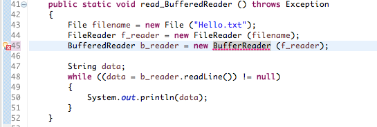
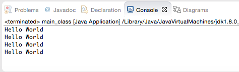

ช่วงๆหลังๆนี่หลังจากผมสอนเขียนโปรแกรมหลายๆคน มักจะมาถามว่า

## \"มันเป็นอะไรอะแก้ให้หน่อย!!!"
ซึ่งวันนี้ผมอยากจะมานำเสนอ ทริก ในการจัดการกับ Error ที่ผมทำเวลาเจอบัค

## \1\. เขียนใหม่หัดใช้ IDE ดีๆบ้างก็ดีนะ!!

เมื่อก่อนตอนผมเขียนโปรแกรมใหม่ๆ ไปดูคนที่เขาเขียนเก่งๆเขียน โหใช้โปรแกรมอะไรเขียนอะครับ โคตรเท่เลย!! เลยเอามาลองบ้าง ซึ่ง IDE ที่เขาใช้นั้นมันเหมาะกับผู้ที่มีประสบการณ์แล้วถึงมาใช้ แล้วเราตอนนั้น กาก มาก ใช้ทีเงิบเลย Error อะไรอยู่ตรงไหน เพราะฉะนั้นแนะนำครับ มือใหม่นะ ให้ไปลองใช้ IDE ที่ง่ายๆ อ่าน Error ง่าย ชีวิตเราจะได้ง่ายขึ้น

## \2\. เส้นหยักแดงๆน่ะ อ่านมันบ้างดิเฮ้ย!!!

เคยกันสินะครับ! เวลาเขียนไป เฮ้ยทำไมมันรันไม่ได้ว้าา Error ตลอดเลย สรุปพอมาดู โห่ เส้นแดงโชว์หลาอยู่หน้าจอเลย ไม่แก้ก่อน จากข้อ 1 นะครับ สำหรับมือใหม่ IDE ดีๆสักตัวก็ทำให้เราเรียนรู้ได้เร็วขึ้นจริงๆนะครับ แต่บางที IDE มันก็ช่วยเราไม่ได้เหมือนกัน ถึงจะขึ้นตัวแดงแต่มันก็ Suggest วิธีแก้ไม่ได้ วิธีคือพยายามเช็คตัวโค๊ตมัน อ่านจาก Lib ก็ได้ในเน็ตเยอะแยะ หรืออาจจะพิมพ์ผิดแบบ l กับ | อะไรแบบนี้ เช็คดีๆ ใจเย็นๆ

## \3\. จำ Error ให้ได้ จะช่วยให้แก้ปัญหาได้เร็วขึ้นนะเออ!!

จากข้อ 1 อีกเช่นกัน เวลาเราเขียนไป IDE มันจะคอยเช็คให้เราเสมอ แต่ IDE มันก็ไม่ได้ฉลาดขนาดนั้น ถ้า Syntax Error มันก็เช็คได้ แต่ถ้าเป็นพวก Runtime Error ล่ะ มันก็เช็คให้ไม่ได้ใช้ม่ะ แต่เวลามันเกิด มันมักจะมีอะไรขึ้นมาบอกเรา เยอะๆ ไอ้นั่นแหละครับ เป็นวิธีในการแก้ปัญหา อ่านมัน แล้วลองสังเกตดู มันก็วนซ้ำๆไปมานั่นแหละ เพราะฉะนั้น ถ้าเราจำได้ มันจะทำให้เราเร็วขึ้นเยอะเลย ไม่ต้องมานั่งงมโค๊ตในกองมหาโค๊ตนานมาก ปวดตาหมด!

## \4\. เพราะชีวิตติดลูป จึงหยุดไม่ได้!

ผมเชื่อว่า ไม่ว่าใครก็ต้องเป็นครับ เขียนไปเขียนมา **ชิบหาย!! ทำไมมันไม่หลุดลูปว้าา**
จากแรกๆ ลูปเดียวก็มึนแล้วนะ สักพักเรียนๆไป เฮ้ย! มันงอกออกมาเรื่อยๆเลย จาก 1 เป็น 2 เป็น 3 งานนี้ล่ะครับ ชีวิตติดลูปแล้ว **วิธีแก้คือ หัดทำบ่อยๆครับ** เรื่องนี้มันเหมือนโจทย์คณิตศาตร์อะครับ จากแรกๆโจทย์ก็ง่ายๆ หลังๆแม่มโคตรเถื่อนเลย!!!
ลองเอา 4 อย่างนี้ ลองไปเช็คนะครับว่าเรา ผิดอะไร ข้อสำคัญที่สุดเลยคือ "อย่าแตกตื่น ใจเย็นๆ" แล้วค่อยๆแก้ไปเรื่อยๆ แรกๆมันก็แบบนี้แหละครับ เส้นแดงบ้าง ลูปบึ้มบ้าง ผิดๆถูกๆไป เดี๋ยวสุดท้ายเราก็จะเก่งเองล่ะครับ สวัสดีครับ
