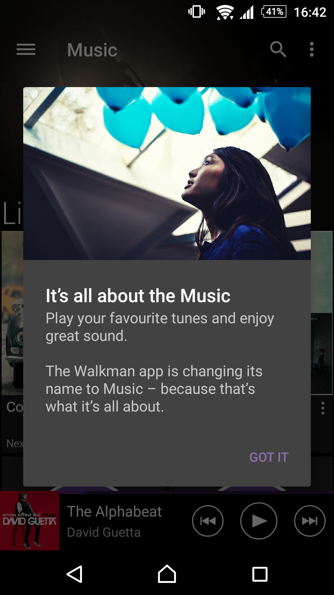
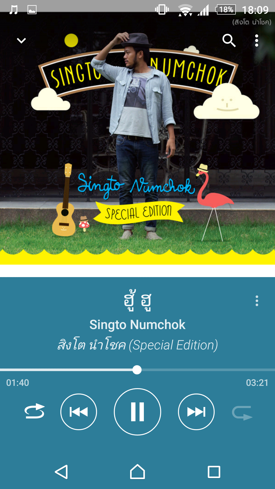
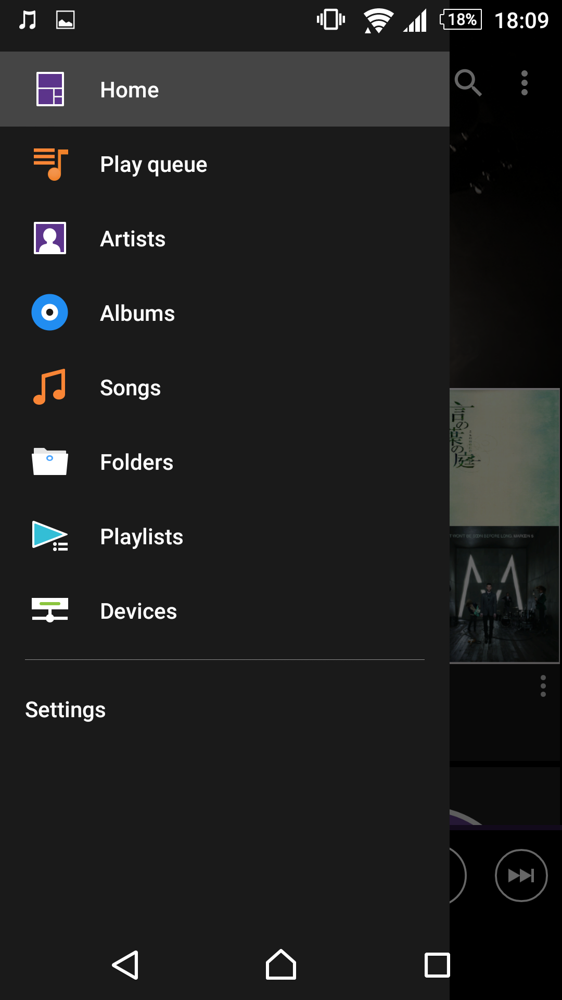

ตอนนี้ผมก็ปิดเทอมและ มีเวลาเขียนอะไรเยอะแยะไปหมด จะพยายามเขียนให้หมดก่อนเปิดเทอมล่ะกันนะครับ เข้าเรื่องกันดีกว่า เมื่อช่วงสอบที่ผ่านมา ตื่นขึ้นมากำลังจะไปสอบ เปิดโทรศัพท์จะฟังเพลง อ้าวเฮ้ย!! Walkman หาย!! เปิดๆไป อ่อ มันเปลี่ยนเป็นชื่อ Music แทน ประเด็นคือ Icon ก็เปลี่ยนอีก เปลี่ยนหมดเลยดีกว่า lol ถ้าดูจากข้างนอกนะ มาดูกันเลยดีกว่า ว่าเปลี่ยนแล้วเป็นยังไงบ้าง

เปิดมา App ขึ้นก่อนเลย The Walkman app is changing its name to Music - because that's what it's about แปลง่ายๆก็ App Walkman เปลี่ยนชื่อเป็น Music เพราะมันก็คือสิ่งที่มันเป็น! งงม่ะ ไม่ต้อง งง นะ อาจจะแปลผิด ง่ายๆคือที่ใช้ชื่อนี้ เพราะว่า มันเป็น App เล่นเพลงไง lol

เข้ามาก็ยังไม่เปลี่ยนอะไร แฮร่~~ แต่พอเล่นเพลงเท่านั้นแหละครับ ท่านผู้อ่าน lol ไอคอนข้างบนแถบ Notification มันแปลงร่าง!!! แค่นั้นแหละ

พอเข้ามาในหน้าเล่นเพลง เจอแล้วครับ สิ่งที่ต่างกันกับเวอร์ชั่นเก่าโดยสิ้นเชิงคือหน้านี้แหละ ดูเรียบขึ้นเยอะเลยล่ะ รวมๆผมชอบนะ เปลี่ยนมาเป็นแบบนี้ เว้นอย่างเดียว ตอน Walkman มันจะมีปุ่มกดดูคิวว่าเพลงอะไรจะเล่นเป็นเพลงต่อไป ตอนนี้มันหายไป !!!

ปุ่ม เมนู จุด 3 จุดก็ย้ายลงมาอยู่ข้างล่างแทน (เมื่อก่อนมันอยู่มุมขวาบนจอ) ก็กดยากขึ้นดี พอกดขึ้นมา ก็เหมือนเดิม เมนูเดิมเลย

ปัดมาทางขวาก็จะเป็นเมนูเหมือนเดิม แต่เดี๋ยวก่อน นั่นมันปุ่มที่ตามหานิ !!! Play queue ที่ย้ายมาจากมุมขวาบนข้างเมนูกลายมาอยู่ในแถบเมนูด้านขวา ทำให้ใช้ยากขึ้นเยอะเลย เพราะปกติชอบเข้าไปกดเลื่อนๆคิวอยู่บ่อยๆ (อาจจะยังไม่ชินก็ได้นะ) ส่วนเมนูที่เหลือก็คงเดิมด้วยไอคอนเดิมๆเหมือน Walkman ปกติ
สรุปแล้วเจ้าตัว App Music อันนี้ ผมก็ลองเล่นมาเกือบ 3 อาทิตย์และ ก็เริ่มปรับตัวได้และ ที่หลายๆคนในบอร์ดบอกว่า มันมีบัค เท่าที่ใช้มาผมไม่เจอเลยนะครับ เจอแค่เมื่อก่อนผมปิด ClearAudio+ ไปพออัพมา เสียที่ออกเหมือนมันเปิดเลย เลยต้องกลับไปเปิดมันอีกรอบ ซึ่ง งง มากว่าเกิดจากอะไร และตอนนี้ก็ยังหาคำตอบไม่ได้ด้วย lol ก็ขอให้สนุกกับเสียงเพลงด้วย Music App กันนะครับ สวัสดีครับ!
